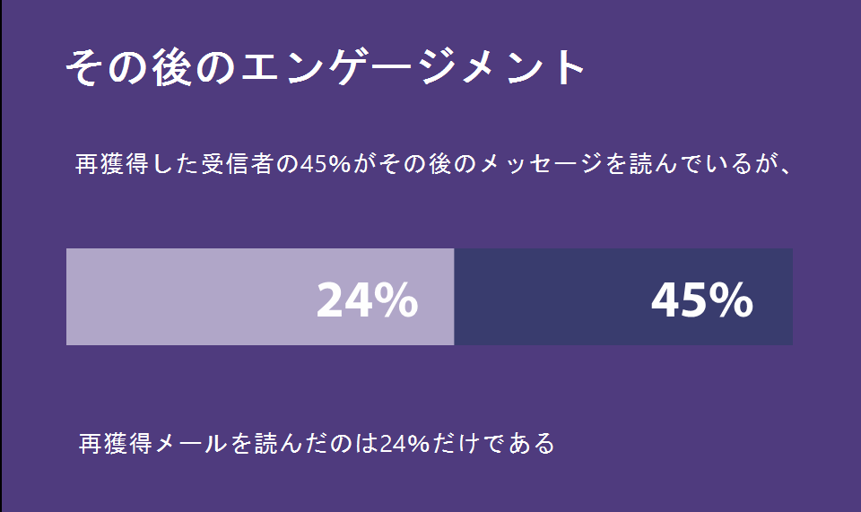
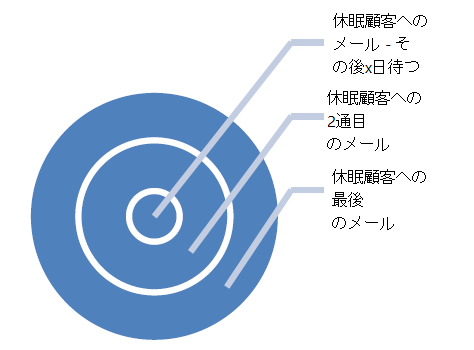
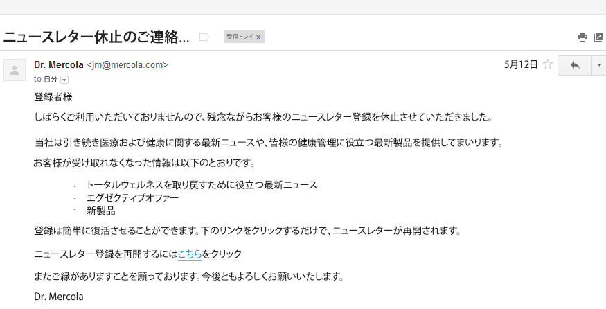
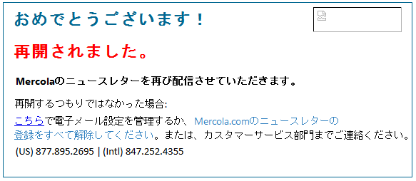

# 再関与による配信品質の向上{#re-engagement}

配信品質を実装する際、ベストプラクティスの一部は、正常な加入者基盤を維持し、再関与戦略を通じて配信品質を向上させることにあります。

* 健全な購読者ベースを維持することは、高品質で一貫性のある配信を確実におこなうための重要な要素の 1 つです。多くの配信品質の問題は、データの処理やメンテナンスの方法が不適切であることが原因で発生します。
* 現在、マーケティング担当者が直面することが特に多い問題の 1 つは、アクティブでない購読者のアクティビティです（これは、低エンゲージメントまたはエンゲージメントなしとも呼ばれます）。これにより、E メールの配信に悪影響が及び、ROI が低下する場合があります。

>[!NOTE]
>
>再エンゲージメントキャンペーン戦略とアドビの配信品質サービスの詳細については、配信品質コンサルタントにお問い合わせいただくか、アドビの販売代理店にお問い合わせください。

## How do ISPs view non-engagement activity? {#how-do-isps-view-non-engagement-activity-}

長年の間、ISP は、ユーザーからのエンゲージメントフィードバック指標を使用して、メッセージを配置する場所やメッセージを配信するかどうかを決定してきました。ユーザーエンゲージメントは、肯定的なフィードバックと否定的なフィードバックから構成されており、ISP は、この両方のフィードバックを常時監視しています。エンゲージメントがないことは、おそらく、否定的なエンゲージメントの主な一因となります。配信品質の観点では、エンゲージメントを見せないユーザーに変わることなくキャンペーンを送信し続けると、IP アドレスとドメインのレピュテーションが全体的に低下するおそれもあります。

AOL、Gmail、Microsoft、Yahoo! などの ISP は、エンゲージメントがない場合は、E メールが望まれていないものと考え、メッセージをスパムフォルダーにリダイレクトし始めます。また、こうした E メールアカウントは、購読者によってもはや所有されていない可能性があり、スパムトラップとしてリサイクル使用される場合があります。これは、アドレスがしばらくの間無効であると、すべてのメッセージが拒否されることを意味します。購読者管理システムによって「ハードバウンス」アドレスが削除されない場合は、メールスパムトラップが原因で重大な配信の問題が発生する可能性が非常に高くなります。

## How should you approach inactivity? {#how-should-you-approach-inactivity-}

幸いにも、Adobe Campaign プラットフォームを使用している顧客は、セグメントに応じて開封およびクリックのデータを調べることにより、インスタンス内のアクティブでない購読者を確認できます。エンゲージメントなしは配信の妨げとなる場合があるので、まずはデータベースから購読者を削除することを考えます。ただし、場合によっては、これが誤った選択になる可能性があります。したがって、最も推奨されるのは、再エンゲージメント（ウィンバックとも呼ばれる）戦略です。この戦略では、メールの受信に関心がある購読者は維持し、アクティビティを示さなくなった購読者は徐々に削除するようにします。

## Do re-engagement campaigns really work? {#do-re-engagement-campaigns-really-work-}

Return Path の調査によれば、再エンゲージメントキャンペーンでは、開封率が 12％という結果が出ました。これに対して、通常のキャンペーンでは、開封率が平均 14％という結果が出ました。再エンゲージメントキャンペーンを読んだのは購読者の 24％に過ぎませんでしたが、そのうちの約 45％は、後続のメッセージを読みました。

## How do you create a re-engagement campaign? {#how-do-you-create-a-re-engagement-campaign-}

### フェーズ 1 {#phase-1}

* 最初の手順では、開封やクリックのアクティビティが皆無かそれに近い購読者を特定し、設定された時間枠に基づいてこのグループをセグメント化します。経験則により、過去 90 日以内に E メールを開封もクリックもしなかった購読者を確認します。ただし、これは、ビジネスの性質によって異なります（季節による送信数の変動など）。
* 時間枠を定義する際に注意すべきもう 1 つの点は、ISP およびブラックリスト企業ではエンゲージメントが継続するのは 1.5～1.8 年の間であると考えていることです。また、購入などの行動アクティビティや Web サイトでのアクティビティ、または登録や最初のコンタクトで好まれる方法などのタッチポイントにも注意する必要があります。

### Phase 2 {#phase-2}

* セグメントを定義したら、次の手順では、識別された指標に従って、購読者のニーズを満たす再エンゲージメントキャンペーンを作成します。件名を作成すると、購読者の関心を高めるのに役立ちます。Return Path の調査によると、件名およびコンテンツで「戻ってきてほしい」よりも「寂しく思っていた」ということを伝えると、応答率が向上します。
* 再エンゲージメントのために E メールでインセンティブを提供することもできます。ディスカウント付きのオファーを検討している場合、パーセントではなく金額を提示することをお勧めします。応答率が向上するので、Return Path はこれをおこなうことも推奨しています。最後に、A/B 分割テストを実施して応答率と成功率を確認することも有効な選択肢です。

### Phase 3 {#phase-3}

次の手順では、再エンゲージメントキャンペーンの頻度を決定します。再確認メッセージとは異なり、再エンゲージメントキャンペーンは、ゆっくり時間をかけて一連の E メールを送信することにより、購読者に戻ってきてもらうことを目的としています。次の例は、頻度の例を示しています。

開封アクティビティやクリックアクティビティを実行してキャンペーンにエンゲージした購読者は、購読者のエンゲージメントリストに再び追加されます。

### Phase 4 {#phase-4}

* 次のフェーズでは、アクティビティを継続的に示していない購読者を特定し、一定期間をかけて徐々にその購読者への E メール送信を減らしていきます。過去 1 年以内にアクティビティがない場合、その購読者の E メール購読は、保留にすることをお勧めします。購読者が E メールコンテンツに関心を示していなくても、1 回限りの再確認キャンペーンを送信することにより、購読者に購読を再び有効にしてもらう最後のチャンスは常にあります。
* 再確認キャンペーンは、長期間非アクティブになっている購読者に、購読リストに残しておくことを希望するかどうかを尋ねる良い方法です。キャンペーンを作成するときは、「こちらをクリック」というリンクを追加して、購読者がアクションを確認し、自分のアドレスを検証できるようにすることをお勧めします。このようにして、アクションをデータベースに記録することが可能です。再確認 E メールの例を次に示します。

   

   購読者がアクションを実行したときに、再講読の確認を含むランディングページを表示できます。ランディングページの例を次に示します。

   
