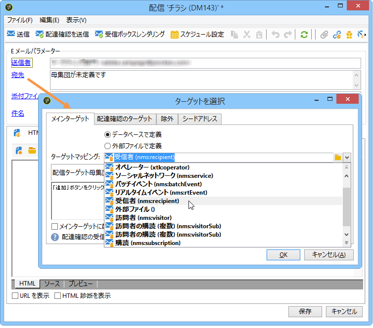

# ターゲットマッピングの選択{#selecting-a-target-mapping}

By default, delivery templates target **[!UICONTROL Recipients]**. したがって、ターゲットマッピングには **nms:recipient** テーブルのフィールドが使用されます。Adobe Campaign では、必要に応じて、これ以外のターゲットマッピングを配信に使用することもできます。

マッピングの選択肢は次のとおりです。

| 名前 | 用途 | 標準スキーマ |
|---|---|---|
| 受信者 | Adobe Campaign データベースの受信者に対する配信 | nms:recipient |
| 訪問者 | 訪問者、つまり紹介（バイラルマーケティング）やソーシャルネットワーク（Facebook、Twitter）などの方法で収集したプロファイルに対する配信 | mns:visitor |
| 購読 | ニュースレターなどの情報サービスを購読している受信者に対する配信 | nms:subscription |
| 訪問者の購読 | 情報サービスを購読している訪問者に対する配信 | nms:visitorSub |
| サービス | Twitter アカウントや Facebook ページでの公開 | nms:service |
| オペレーター | Adobe Campaign オペレーターに対する配信 | nms:operator |
| 外部ファイル | 配信に必要な情報をすべて含んだファイルを経由しての配信 | リンクされるスキーマなし、入力されるターゲットなし |

>[!NOTE]
>
>新しいターゲットマッピングを作成することもできます。ただし、この操作はエキスパートユーザー向け機能として用意されています。詳しくは、[設定ガイド](../../configuration/using/target-mapping.md)を参照してください。
