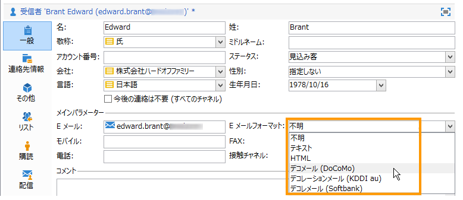
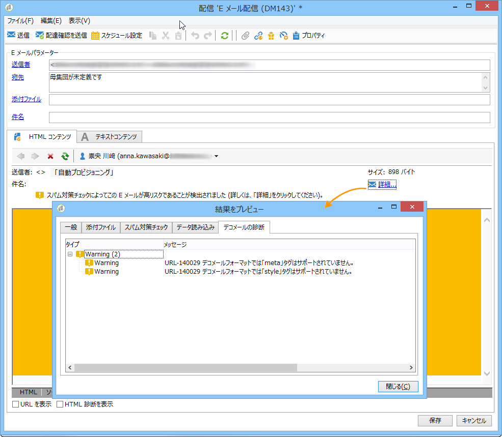

# 日本の携帯電話向けのメールの送信 {#sending-emails-on-japanese-mobiles}

## 日本の携帯電話向けのメールフォーマット {#email-formats-for-japanese-mobiles}

Adobe Campaign は、日本の携帯電話向けに特化した E メールフォーマットとして、**デコメール**（DoCoMo 携帯）、**デコレメール**（Softbank 携帯）および&#x200B;**デコレーションメール**（KDDI au 携帯）の 3 種を用意しています。これらのフォーマットには、コーディング、構造、サイズに関する特定の制約事項があります。制限事項と推奨事項について詳しくは、[この節](#limitations-and-recommendations)を参照してください。

これらのフォーマットのいずれかでメッセージが正しく受信されるようにするには、対応するプロファイルで「**[!UICONTROL デコメール（DoCoMo）]**」、「**[!UICONTROL デコレメール（Softbank）]**」または「**[!UICONTROL デコレーションメール（KDDI au）]**」を選択することをお勧めします。

ただし、「**[!UICONTROL E メールフォーマット]**」オプションを「**[!UICONTROL 不明]**」、「**[!UICONTROL HTML]**」または「**[!UICONTROL テキスト]**」のままにした場合は、E メール送信時に、メッセージが正しく表示されるように日本独自のフォーマットが自動検出されます。

この自動検出システムは、**[!UICONTROL E メールフォーマットの管理]**&#x200B;メールルールセットに定義されているドメインのリストに基づいています。E メールフォーマットの管理について詳しくは、[このページ](../../installation/using/email-deliverability.md#managing-email-formats)を参照してください。

## 制限事項と推奨事項 {#limitations-and-recommendations}

日本のプロバイダー（Softbank、DoCoMo、KDDI au）が取り扱う携帯電話で読まれる E メールの送信に関しては、いくつかの制約事項があります。

これらの事項を必ず満たすようにしてください。

* 画像は JPEG 形式または GIF 形式の画像のみにしてください。
* 厳密に 10,000 バイト未満のテキストセクションと HTML セクションから成る配信を作成します（KDDI au および DoCoMo 向け）。
* 画像の合計サイズ（エンコード前）が 100 KB 未満になるようにします。
* 1 件のメッセージにつき 20 件を超える画像を使用しないようにしてください。
* 縮小サイズの HTML フォーマットを使用します（各オペレーターで使用できるタグの数は制限されています）。

>[!NOTE]
>
>メッセージを作成する際には、各オペレーター固有の制限事項を考慮する必要があります。製品ドキュメントを参照してください。

## メールコンテンツのテスト {#testing-the-email-content}

### メッセージのプレビュー {#previewing-the-message}

Adobe Campaign では、メッセージのフォーマットが日本の携帯電話への送信に適合しているかどうかを確認できます。

コンテンツを定義して E メールの件名を入力したら、メッセージを作成する際に表示と書式設定を確認できます。

コンテンツ編集ウィンドウの「**[!UICONTROL プレビュー]**」タブで&#x200B;**[!UICONTROL 詳細...／デコメールの診断]**&#x200B;をクリックすると、次のことができます。

* HTML コンテンツのタグが日本独自のフォーマットの制約を満たしていることのチェック
* メッセージに含まれる画像の数がフォーマットの制限を超えていないことのチェック（20 以下）
* メッセージの合計サイズのチェック（100 KB 未満）

  

### タイポロジルールを実行 {#running-typology-rule}

プレビュー診断に加えて、配達確認または配信を送信する際に 2 番目のチェックが実行されます。特殊なタイポロジルール「**[!UICONTROL デコメールの検証]**」が分析中に開始されます。

>[!IMPORTANT]
>
>このタイポロジルールは、1 人以上の受信者が&#x200B;**[!UICONTROL デコメール（DoCoMo）]**、**[!UICONTROL デコレメール（Softbank）]**&#x200B;または&#x200B;**[!UICONTROL デコレーションメール（KDDI au）]**&#x200B;フォーマットで E メールを受信するように設定されている場合にのみ実行されます。

このタイポロジルールでは、特に E メールの合計サイズ、HTML セクションとテキストセクションのサイズ、メッセージ内の画像の数、HTML コンテンツのタグなどに関して、配信が日本のオペレーターによって定義された[フォーマットの制約](#limitations-and-recommendations)を守っていることを確認します。

### 配達確認の送信 {#sending-proofs}

配達確認を送信して配信をテストできます。配達確認を送信する際、代用アドレスを使用している場合は、使用しているプロファイルの E メールフォーマットに対応しているアドレスを入力してください。

例えば、プロファイルの E メールフォーマットが&#x200B;**[!UICONTROL デコレメール（Softbank）]**&#x200B;で事前に定義されている場合は、プロファイルのアドレスを test@softbank.ne.jp に置換してください。

## メッセージの送信 {#sending-messages}

Campaign を使用して日本語 E メール形式で E メールを受信者に送信するには、2 つのオプションがあります。

* 2 つの配信を作成します。1 つは日本人の受信者専用で、もう 1 つは他の受信者用です。[この節](#designing-a-specific-delivery-for-japanese-formats)を参照してください。
* または、1 つの配信を作成し、使用するフォーマットを Adobe Campaign で自動検出します。[この節](#designing-a-delivery-for-all-formats)を参照してください。

### 日本独自のフォーマットに対応する配信のデザイン {#designing-a-specific-delivery-for-japanese-formats}

日本の携帯電話向けと、標準の E メールフォーマットを使用する受信者向けの 2 つの配信を含むワークフローを作成できます。

これを実行するには、ワークフローで&#x200B;**[!UICONTROL 分割]**&#x200B;アクティビティを使用し、フィルター条件として日本独自の E メールフォーマット（デコメール、デコレーションメール、デコレメール）を定義します。

### すべてのフォーマットに対応する配信のデザイン {#designing-a-delivery-for-all-formats}

Adobe Campaign がドメインに応じてフォーマットを動的に管理する場合（プロファイルの E メールフォーマットを「**[!UICONTROL 不明]**」、「**[!UICONTROL HTML]**」または「**[!UICONTROL テキスト]**」とした場合）は、すべての受信者に同じ配信を送信できます。

メッセージの連絡先は、日本の携帯電話のユーザーに対しても標準の受信者と同じように正しく表示されます。

>[!IMPORTANT]
>
>日本独自の E メールフォーマット（デコメール、デコレーションメール、デコレメール）に関連する特別な機能については注意が必要です。制限事項について詳しくは、[この節](#limitations-and-recommendations)を参照してください。
