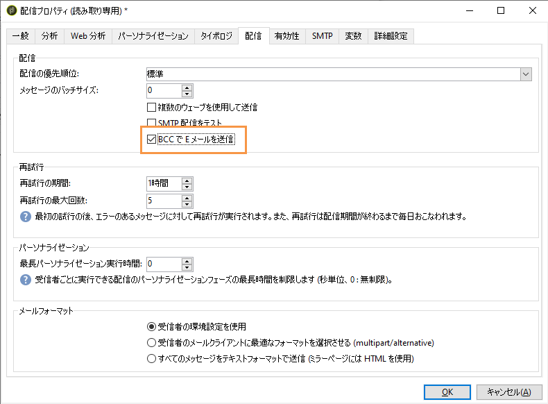
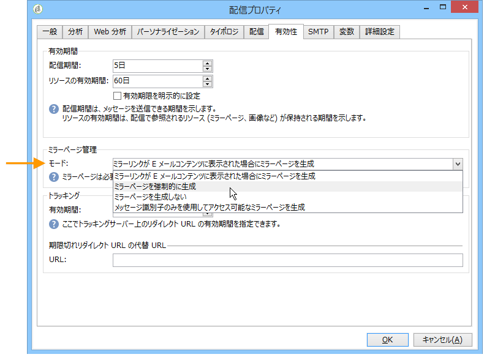
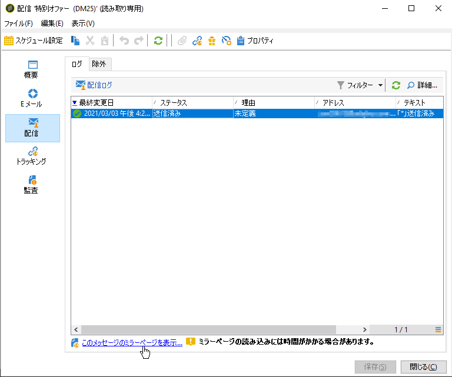
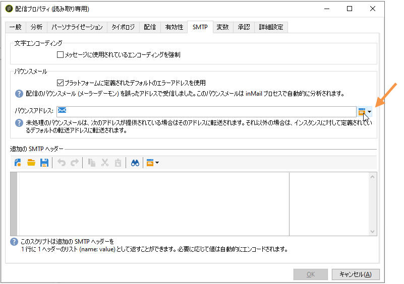
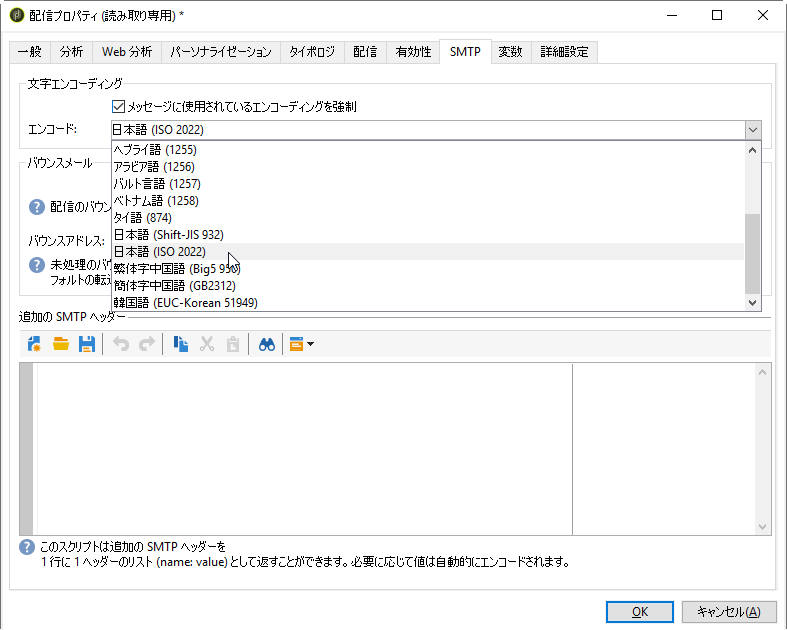

# Sending an email{#sending-an-email}

To approve your email and send it to the recipients of the delivery being created, click **[!UICONTROL Send]**.

配信を検証および送信する際の詳細なプロセスについては、以下の節を参照してください。

* [配信の検証](../../delivery/using/steps-validating-the-delivery.md)
* [配信の送信](../../delivery/using/steps-sending-the-delivery.md)

以下の節では、電子メールの配信に固有のパラメーターについて詳しく説明します。

## E メールのアーカイブ {#archiving-emails}

Adobe Campaign では、BCC アドレスをメッセージのターゲットに追加するだけで、BCC 経由で E メールを外部システムに保存することができます。このオプションを有効にしたら、送信したすべてのメッセージの正確なコピーがこの配信用に保持されます。

E メールの BCC について詳しくは、[この節](../../installation/using/email-archiving.md)を参照してください。

>[!NOTE]
>
>この機能はオプションです。この機能を有効にするには、ライセンス契約を確認したうえで、アカウント担当者にお問い合わせください。

このオプションを購入していたとしても、E メールの BCC は、新しい配信または配信テンプレートの作成時にデフォルトで有効になりません。BCC を使用する配信またはテンプレートごとに手動で有効にする必要があります。

これをおこなうには、以下の手順に従います。

1. >または> **[!UICONTROL Campaign Management]** に移動 **[!UICONTROL Deliveries]** し **[!UICONTROL Resources]** ます **[!UICONTROL Templates]** 。> **[!UICONTROL Delivery templates]**.
1. 目的の配信を選択します。または、標準の **E メール配信**&#x200B;テンプレートを複製して、複製されたテンプレートを選択します。
1. 「**プロパティ**」ボタンをクリックします。
1. タブを選択 **[!UICONTROL Delivery]** します。
1. 「**E メールをアーカイブ**」ボックスをオンにして、この配信またはこのテンプレートに基づいた各配信で送信されるすべてのメッセージのコピーを保持します。

   

   >[!NOTE]
   >
   >If the emails sent to the BCC address are opened and clicked through, this will be taken into account in the **[!UICONTROL Total opens]** and **[!UICONTROL Clicks]** from the send analysis, which could cause some miscalculations.

## ミラーページの生成 {#generating-the-mirror-page}

ミラーページは、Web ブラウザーからオンラインアクセス可能な HTML ページです。コンテンツは E メールと変わりません。

デフォルトでは、メールコンテンツ内にリンクが挿入されているとミラーページが生成されます。For more on personalization blocks insertion, refer to [Personalization blocks](../../delivery/using/personalization-blocks.md).

In the delivery properties, the **[!UICONTROL Mode]** field of the **[!UICONTROL Validity]** tab lets you modify the generation mode for this page.

>[!CAUTION]
>
>ミラーページを作成するには、その配信の HTML コンテンツが定義されている必要があります。

デフォルトモードのほかに、次のオプションも選択できます。

* **[!UICONTROL Force the generation of the mirror page]** :配信にミラーページへのリンクが挿入されていない場合でも、ミラーページが作成されます。
* **[!UICONTROL Do not generate the mirror page]** :配信にリンクが存在する場合でも、ミラーページは生成されません。
* **[!UICONTROL Generates a mirror page accessible using only the message identifier]** :このオプションを使用すると、パーソナライゼーション情報を含むミラーページのコンテンツに配信ログウィンドウでアクセスできます。 To do this, after the end of the delivery, click the **[!UICONTROL Delivery]** tab and select the line of the recipient whose mirror page you wish to view. リンクをクリック **[!UICONTROL Display the mirror page for this message...]** します。

   

## バウンスメールの管理 {#managing-bounce-emails}

配信パラメーターの「**[!UICONTROL SMTP]**」タブでは、バウンスメール管理を設定できます。

デフォルトでは、バウンスメールはプラットフォームのデフォルトエラーボックスに受信されますが、配信用の専用エラーアドレスを定義することもできます。

また、バウンスメールの発生理由をアプリケーションで自動判定できない場合の調査用に、この画面から特定のアドレスを定義できます。パーソナライゼーションフィールドの追加アイコンを使用すると、各フィールドにパーソナライゼーションパラメーターを追加できます。

## 文字エンコーディング {#character-encoding}

配信パラメ **[!UICONTROL SMTP]** ーターのタブで、このセクションを使 **[!UICONTROL Character encoding]** 用して特定のエンコーディングを設定できます。

デフォルトのエンコーディングはUTF-8です。 一部の受信者の電子メールプロバイダーがUTF-8標準エンコーディングをサポートしていない場合は、電子メールの受信者に対して特殊文字を適切に表示するように特定のエンコーディングを設定する必要があります。

例えば、日本語の文字を含む電子メールを送信するとします。 すべての文字が日本の受信者に正しく表示されるようにするには、標準のUTF-8ではなく、日本語をサポートするエンコーディングを使用します。

これを行うには、セクションのオ **[!UICONTROL Force the encoding used for messages]** プションを選択 **[!UICONTROL Character encoding]** し、表示されるドロップダウンリストからエンコーディングを選択します。

## SMTP ヘッダーの追加 {#adding-smtp-headers}

配信には SMTP ヘッダーを追加できます。そのためには、配信の「**[!UICONTROL SMTP]**」タブの関連するセクションを使用します。

The script entered in this window must reference one header per line in the following form: **name:value**.

値は必要に応じて自動的にエンコードされます。

>[!CAUTION]
>
>スクリプトを追加すると、挿入する SMTP ヘッダーを追加できます。これは高度な知識を持つユーザー向けに用意されています。
>
>スクリプトの構文は、このコンテンツタイプの要件を満たしている必要があります（不要なスペースや空行を含まないなど）。
