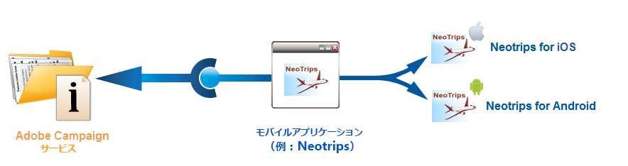

# モバイルアプリチャネルの設定{#setting-up-mobile-app-channel}

## はじめに {#introduction}

>[!CAUTION]
>
>モバイルアプリチャネルの実装は、エキスパートユーザーがおこなう必要があります。支援が必要な場合は、アドビアカウントエグゼクティブまたはプロフェッショナルサービスパートナーにお問い合わせください。

モバイルアプリケーション（iOS、Android）のいくつかのバージョンを作成できます。モバイルアプリチャネルを使用すると、アプリケーションがインストールされているターミナルへ通知を送信することができます。

Adobe Campaign モバイルアプリチャネルの機能を使用するためには、Adobe Campaign プラットフォームに統合するようにモバイルアプリケーションを変更したり適合させたりする必要があります。

2 つの Campaign Classic SDK（Android 用と iOS 用）を使用して、モバイルアプリケーションを Adobe Campaign に簡単に統合することができます。Java および Objective-C の深い専門知識が必要です。キャンペーンSDKの詳しい説明は、「Campaign SDKのモバイルア [プリケーションへの統合」を参照してください](#integrating-campaign-sdk-into-the-mobile-application)。

>[!NOTE]
>
>Adobe Campaign で提供されるライブラリは、Xcode（iOS）と Android Studio（Android）で使用できるように設計されています。

## コネクタ {#connectors}

### iOS コネクタ {#ios-connectors}

iOS の場合、2 種類のコネクタを使用できます。

* iOS バイナリコネクタ：旧式のバイナリ APNS サーバーで通知を送信します。
* iOS HTTP2 コネクタ：HTTP/2 APNS に通知を送信します。

使用するコネクタを選択するには、次の手順に従います。

1. 移動 **[!UICONTROL Administration > Platform > External accounts]**.
1. iOS ルーティング外部アカウントを選択します。
1. タブで、 **[!UICONTROL Connector]** 次のフィールドに入力し **[!UICONTROL Access URL of the connector]** ます。

   iOS バイナリの場合：https://localhost:8080/nms/jsp/ios.jsp

   iOS HTTP2 の場合：http://localhost:8080/nms/jsp/iosHTTP2.jsp

   

### Android コネクタ {#android-connectors}

Android の場合、2 種類のコネクタを使用できます。

* V1 コネクタでは、MTA の子 1 つにつき 1 つのコネクタを使用できます。
* V2 コネクタでは、スループット向上のために FCM サーバーへの同時接続が可能です。

使用するコネクタを選択するには、次の手順に従います。

1. 移動 **[!UICONTROL Administration > Platform > External accounts]**.
1. 外部アカウント **[!UICONTROL Android routing]** を選択します。
1. タブで、 **[!UICONTROL Connector]** 次のフィールドに入力し **[!UICONTROL JavaScript used in the connector]** ます。

   Android V1 の場合：https://localhost:8080/nms/jsp/androidPushConnector.js

   Android V2 の場合：https://localhost:8080/nms/jsp/androidPushConnectorV2.js

   

1. Android V2 では、アドビサーバー設定ファイル（serverConf.xml）で次の追加パラメーターを使用できます。

   * **maxGCMConnectPerChild**:各子サーバーが開始するFCMに対する並列HTTP要求の最大数（デフォルトで8）。

## 設定の手順 {#configuration-steps}

### アプリケーションの作成 {#creating-the-application}

モバイルアプリケーション（アプリ）がない場合は、アプリケーションデベロッパーがアプリケーションを作成して、SDK を統合する必要があります。モバイルアプリケーションが存在する場合、デベロッパーは Adobe Campaign SDK を統合し、そのサービスに固有の設定を追加することによってモバイルアプリケーションを適合させる必要があります。SDKについて詳しくは、モバイルアプリケーションへ [のCampaign SDKの統合を参照してください](#integrating-campaign-sdk-into-the-mobile-application)。

>[!CAUTION]
>
>Adobe Campaign SDK に統合する前に、アプリケーションにプッシュアクションを設定する必要があります。
>
>If this is not the case, please refer to [this page](https://developer.apple.com/library/archive/documentation/NetworkingInternet/Conceptual/RemoteNotificationsPG/).

### 情報の収集 {#collecting-information-}

アプリケーションを設定するには、Adobe Campaign とモバイルアプリケーションの通信を有効にする一連のパラメーターを定義する技術情報を収集する必要があります。これらのパラメーターは次のとおりです。

* **統合キー**：各アプリケーションは一意のキーを持っています。このキーは、Adobe Campaign サービスとモバイルアプリケーションをリンクさせます。一般情報を [参照](#general-information)。
* **変数**：通知を有効化した場合のアプリケーションの動作を定義します。一般情報を [参照](#general-information)。
* **購読設定**：Adobe Campaign は、デフォルトで **@userKey** フィールドを復元し、モバイルデバイスをデータベースにある受信者と紐付けできるようにします。追加データ（複雑な紐付けキーなど）を収集する場合は、購読設定を定義できます。「購読の設定 [」を参照](#subscription-settings)。
* **サウンド**（iOS のみ）：選択されたサウンドがシステムサウンドではない場合、サウンドファイルをモバイルアプリケーションに埋め込む必要があります。アプリケーション [サウンドを参照](#application-sounds)。
* **マーケティングサーバーとトラッキングサーバーの URL**：Adobe Campaign の管理者は、アプリケーションデベロッパーにマーケティングサーバーの URL とトラッキングサーバーの URL を提供する必要があります。詳しくは、次を参照してください。モバイ [ルアプリケーションへのCampaign SDKの統合](#integrating-campaign-sdk-into-the-mobile-application)。

### サービスの作成 {#creating-the-service}

Adobe Campaign の管理者は、モバイルアプリケーションにリンクされるサービスを作成して設定する必要があります。詳しくは、「Adobe Campaignでのモバイルア [プリケーションの設定」を参照してください](#configuring-the-mobile-application-in-adobe-campaign)。

### アプリケーションのテスト {#testing-the-application}

iOS では、テストと承認用のサンドボックスモードを使用するアプリケーションを作成する必要があります。その後、同じ Adobe Campaign サービス内で、本番用の新しいアプリケーションを作成して、関連する証明書を入力します。詳しくは、Apple の通知サービスに関するドキュメントを参照してください。

Android で作成する必要があるのは、1 つのアプリケーションのみです。公開する前に、アプリケーションでの購読コレクションと配信コレクションのプロセス全体をテストします。

## データパス {#data-path}

後述のスキーマでは、モバイルアプリケーションが Adobe Campaign とデータをやり取りできるようにするステップを説明しています。このプロセスには 3 つのエンティティが含まれます。

* モバイルアプリケーション
* 通知サービス：Apple向けAPNS(Apple Push Notification Service)およびAndroid向けFCM(Firebase Cloud Messaging)
* Adobe Campaign

通知プロセスの 3 つの主要なステップは、Adobe Campaign でのアプリケーションの登録（購読コレクション）、配信およびトラッキングです。

### 手順1:購読コレクション {#step-1--subscription-collection}

モバイルアプリケーションが、App Store または Google Play からユーザーによってダウンロードされます。このアプリケーションには、接続設定（iOS 証明書および Android のプロジェクトキー）と統合キーが含まれます。アプリケーションを最初に開いた際に、（設定に応じて）ユーザーは登録情報（@userKey：例えば E メールやアカウント番号）を入力するように求められる場合があります。同時に、アプリケーションは通知サービスに対し、通知 ID（プッシュ ID）収集の問い合わせをおこないます。これらすべての情報（接続設定、統合キー、通知識別子、userKey）は、Adobe Campaign に送信されます。


### 手順2:配信 {#step-2--delivery}

マーケティング担当者は、アプリケーションの利用者をターゲットにします。配信プロセスは、通知サービス（iOS 証明書および Android のプロジェクトキー）に対する接続設定、通知 ID（プッシュ ID）および通知の内容を送信します。通知サービスは、ターゲットとなる端末に通知を送信します。

次の情報が Adobe Campaign で使用可能です。

* Android のみ：通知を表示したデバイスの数（インプレッション数）
* Android および iOS：通知のクリック数


Adobe Campaign サーバーが、次のポートで APNS サーバーと通信できる必要があります。

* iOS バイナリコネクタの場合：2195（送信）および 2186（フィードバックサービス）
* iOS HTTP/2 コネクタの場合：443

正しく動作することを確認するには、次のコマンドを使用します。

* テスト用：

   ```
   telnet gateway.sandbox.push.apple.com
   ```

* 本番：

   ```
   telnet gateway.push.apple.com
   ```

iOS バイナリコネクタを使用した場合、MTA および Web サーバーはポート 2195（送信）で、ワークフローサーバーはポート 2196（フィードバックサービス）でそれぞれ APNS と通信できる必要があります。

iOS HTTP/2 コネクタを使用した場合、MTA、Web サーバーおよびワークフローサーバーは、ポート 443 で APNS と通信できる必要があります。

## Campaign SDK をモバイルアプリケーションに統合する {#integrating-campaign-sdk-into-the-mobile-application}

iOS および Android 用の Campaign SDK は、モバイルアプリチャネルモジュールのコンポーネントの 1 つです。

>[!NOTE]
>
>Campaign SDK（旧 Neolane SDK）を入手するには、アドビカスタマーサポートにお問い合わせください。

SDK の目的は、モバイルアプリケーションを Adobe Campaign プラットフォームに容易に統合できるようにすることです。

サポートされている別の Android および iOS バージョンについて詳しくは、[互換性マトリックス](https://helpx.adobe.com/campaign/kb/compatibility-matrix.html#MobileSDK)を参照してください。

### Campaign SDK の読み込み {#loading-campaign-sdk}

* **Android の場合**：**neolane_sdk-release.aar** ファイルがプロジェクトにリンクされている必要があります。

   以下の権限により、Adobe Campaign サーバーへのアクセス権が付与されます。

   ```
   Neolane.getInstance().setIntegrationKey("your Adobe mobile app integration key");
   Neolane.getInstance().setMarketingHost("https://yourMarketingHost:yourMarketingPort/");
   Neolane.getInstance().setTrackingHost("https://yourTrackingHost:yourTrackingPort/");
   ```

   以下の権限により、電話の一意の ID 復元が可能になります。

   ```
   <uses-permission android:name="android.permission.READ_PHONE_STATE" /> 
   ```

   SDK バージョン 1.0.24 以降、この権限は Android 6.0 よりも古いバージョンでのみ使用されます。

   SDK バージョン 1.0.26 以降では、この権限は使用されません。

* **iOS の場合**：**libNeolaneSDK.a** ファイルと **Neolane_SDK.h** ファイルがプロジェクトにリンクされている必要があります。SDK バージョン 1.0.24 以降は、**ENABLE_BITCODE** オプションが有効になります。

   >[!NOTE]
   >
   >バージョン 1.0.25 の SDK の場合は、**Neolane_SDK.h** ファイルに 4 つのアーキテクチャがあります。

### 統合設定の宣言 {#declaring-integration-settings}

Campaign SDK をモバイルアプリケーションに統合するには、担当の管理者がデベロッパーに次の情報を提供する必要があります。

* **統合キー**：Adobe Campaign プラットフォームでモバイルアプリケーションを特定できるようにします。

   >[!NOTE]
   >
   >This integration key is entered in the Adobe Campaign console, in the **[!UICONTROL Information]** tab of service dedicated to the mobile application. 一般情報を [参照](#general-information)。

* **トラッキング URL**：Adobe Campaign トラッキングサーバーのアドレスと一致します。
* **マーケティング URL**：購読のコレクションを有効にします。

* **Android**：

   ```
   Neolane.getInstance().setIntegrationKey("your Adobe mobile app integration key");
   Neolane.getInstance().setMarketingHost("https://yourMarketingHost:yourMarketingPort/");
   Neolane.getInstance().setTrackingHost("https://yourTrackingHost:yourTrackingPort/"); 
   ```

* **iOS**：

   ```
   Neolane_SDK *nl = [Neolane_SDK getInstance];
   [nl setMarketingHost:strMktHost];
   [nl setTrackingHost:strTckHost];
   [nl setIntegrationKey:strIntegrationKey];
   ```

### 登録関数 {#registration-function}

登録関数によってできることは次のとおりです。

* 通知 ID またはプッシュ ID（iOS の deviceToken および Android の registrationID）を Adobe Campaign に送信します。
* 紐付けキーまたは userKey（例えば E メールやアカウント番号）を復元します。

* **Android**：

   ```
   void registerInNeolane(String registrationId, String userKey, Context context)
   {
    try{
     Neolane.getInstance().registerDevice(registrationToken, userKey, null, context);
    } catch (NeolaneException e){
     //...
    } catch (IOException e){
     //...
    }
   }
   ```

   FCM（Firebase Cloud Messaging）を使用する場合は、**onTokenRefresh** 関数を呼び出して Adobe Campaign にユーザーのモバイルデバイストークンの変更を通知するときに、**registerDevice** 関数を使用することをお勧めします。

   ```
   public class NeoTripFirebaseInstanceIDService extends FirebaseInstanceIdService {
     @Override
     public void onTokenRefresh() {
       String registrationToken = FirebaseInstanceId.getInstance().getToken();
       NeolaneAsyncRunner neolaneAs = new NeolaneAsyncRunner(Neolane.getInstance());
       ...
       ...
       // Neolane Registration
       neolaneAs.registerDevice(registrationToken, userKey, additionnalParam, this, new NeolaneAsyncRunner.RequestListener() {
       public void onComplete(String e, Object state) { ... }
       public void onNeolaneException(NeolaneException e, Object state) { ... }
       public void onIOException(IOException e, Object state) { ... }
       });
       ...
       ...
     }
   }
   ```

* **iOS**：

   ```
   // Callback called on successful registration to the APNS
   - (void)application:(UIApplication*)application didRegisterForRemoteNotificationsWithDeviceToken:(NSData*)deviceToken
   {
       // Pass the token to Adobe Campaign
       Neolane_SDK *nl = [Neolane_SDK getInstance];
       [nl registerDevice:tokenString:self.userKey:dic];
   }
   ```

### トラッキング関数 {#tracking-function}

* **Android**：

   トラッキング関数を使用すると、通知の有効化（オープン）および通知の表示（スクリーンショット）を追跡できます。

   （SDK の **notifyReceive** 関数を呼び出して）通知表示をトラッキングするには、次の実装に従います。Note that if you use FCM (Firebase Cloud Messaging), we advise you to use the **notifyReceive** function when the **onMessageReceived** function is called by the Android system.

   ```
   package com.android.YourApplication;
   
   import android.content.Context;
   import android.content.SharedPreferences;
   import android.os.Bundle;
   import android.util.Log;
   
   import com.google.firebase.messaging.FirebaseMessagingService;
   import com.google.firebase.messaging.RemoteMessage;
   
   import java.util.Iterator;
   import java.util.Map;
   import java.util.Map.Entry;
   
   public class YourApplicationFirebaseMessagingService extends FirebaseMessagingService {
     private static final String TAG = "MyFirebaseMsgService";
   
     @Override
     public void onMessageReceived(RemoteMessage message) {
       Log.d(TAG, "Receive message from: " + message.getFrom());
       Map<String,String> payloadData = message.getData();
       final Bundle extras = new Bundle();
       final Iterator<Entry<String, String>> iter = payloadData.entrySet().iterator();
       while(iter.hasNext())
       {
         final Entry<String, String>  entry =iter.next();
         extras.putString(entry.getKey(), entry.getValue());
       }
   
       SharedPreferences settings = this.getSharedPreferences(YourApplicationActivity.APPLICATION_PREF_NAME, Context.MODE_PRIVATE);
       String mesg = payloadData.get("_msg");
       String title = payloadData.get("title");
       String url = payloadData.get("url");
       String messageId = payloadData.get("_mId");
       String deliveryId = payloadData.get("_dId");
       YourApplicationActivity.handleNotification(this, mesg, title, url, messageId, deliveryId, extras);
     }
   }
   ```

   ```
   public static void handleNotification(Context context, String message, String title, String url, String messageId, String deliveryId, Bundle extras){
       if( message == null ) message = "No Content";
       if( title == null )   title = "No title";
       if( url == null )     url = "https://www.tripadvisor.fr";
       int iconId = R.drawable.notif_neotrip;
   
       // notify Neolane that a notification just arrived
       NeolaneAsyncRunner nas = new NeolaneAsyncRunner(Neolane.getInstance());
       nas.notifyReceive(Integer.valueOf(messageId), deliveryId, new NeolaneAsyncRunner.RequestListener() {
         public void onNeolaneException(NeolaneException arg0, Object arg1) {}
         public void onIOException(IOException arg0, Object arg1) {}
         public void onComplete(String arg0, Object arg1){}
       });
       if (yourApplication.isActivityVisible())
       {
         Log.i("INFO", "The application has the focus" );
         ...
       }
       else
       {
         // notification creation :
         NotificationManager notificationManager = (NotificationManager) context.getSystemService(Context.NOTIFICATION_SERVICE);
         Notification notification;
   
         // Activity to start :
         Intent notifIntent = new Intent(context.getApplicationContext(), NotificationActivity.class);
         notifIntent.putExtra("notificationText", message);
         notifIntent.putExtra(NotificationActivity.NOTIFICATION_URL_KEYNAME, url);
         notifIntent.putExtra("_dId", deliveryId);
         notifIntent.putExtra("_mId", messageId);
         notifIntent.addFlags(Intent.FLAG_ACTIVITY_NEW_TASK);
         PendingIntent contentIntent = PendingIntent.getActivity(context, 1, notifIntent, PendingIntent.FLAG_UPDATE_CURRENT);
   
         notification = new Notification.Builder(context)
                 .setContentTitle(title)
                 .setContentText(message)
                 .setSmallIcon(iconId)
                 .setContentIntent(contentIntent)
                 .build();
   
         // launch the notification :
         notification.flags |= Notification.FLAG_AUTO_CANCEL;
         notificationManager.notify(Integer.valueOf(messageId), notification);
       }
   }
   ```

   次に、通知の開封をトラッキングする実装例を示します（SDK の **notifyOpening** 関数を呼び出して実行します）。**NotificationActivity** クラスには、前の例で **notifIntent** オブジェクトを作成する際に使用したクラスが該当します。

   ```
   public class NotificationActivity extends Activity {
    public static final String NOTIFICATION_URL_KEYNAME = "NotificationUrl";
    .....
    public void onCreate(Bundle savedBundle) {
     super.onCreate(savedBundle);
     setContentView(R.layout.notification_viewer);  
     .....  
     Bundle extra = getIntent().getExtras();  
     .....  
     //get the messageId and the deliveryId to do the tracking  
     String deliveryId = extra.getString("_dId");
     String messageId = extra.getString("_mId");
     if (deliveryId != null && messageId != null) {
      NeolaneAsyncRunner neolaneAs = new NeolaneAsyncRunner(Neolane.getInstance());
      neolaneAs.notifyOpening(Integer.valueOf(messageId), deliveryId, new NeolaneAsyncRunner.RequestListener() {
       public void onNeolaneException(NeolaneException arg0, Object arg1) {}
       public void onIOException(IOException arg0, Object arg1) {}
       public void onComplete(String arg0, Object arg1) {}
       });
     }
    }
   }
   ```

* **iOS**：

   トラッキング関数を使用すると、通知の有効化（オープン）を追跡できます。

   ```
   (void)application:(UIApplication *)application didReceiveRemoteNotification:(NSDictionary *)launchOptions
   fetchCompletionHandler:(void (^)(UIBackgroundFetchResult))completionHandler
   {
   if( launchOptions ) { // Retrieve notification parameters here ... // Track application opening Neolane_SDK
   *nl = [Neolane_SDK getInstance]; [nl track:launchOptions:NL_TRACK_CLICK]; } 
   ...  
   completionHandler(UIBackgroundFetchResultNoData);
   }
   ```

   >[!NOTE]
   >
   >バージョン 7.0 以降は、**application:didReceiveRemoteNotification:fetchCompletionHandler** 関数を実装すると、オペレーティングシステムはこの関数のみを呼び出します。したがって、**application:didReceiveRemoteNotification** 関数は呼び出されません。

### 無音の通知のトラッキング {#silent-notification-tracking}

iOS では、無音の通知（表示されることなくモバイルアプリケーションに直接送信される通知またはデータ）を送信できます。Adobe Campaign では、このような通知をトラッキングすることができます。

無音の通知をトラッキングするには、以下の例に従います。

```
// AppDelegate.m
...
...
#import "AppDelegate.h"
#import "Neolane_SDK.h"
...
...
// Callback called when the application is already launched (whether the application is running foreground or background)
- (void)application:(UIApplication *)application didReceiveRemoteNotification:(NSDictionary *)launchOptions fetchCompletionHandler:(void (^)(UIBackgroundFetchResult))completionHandler
{
 NSLog(@"IN didReceiveRemoteNotification:fetchCompletionHandler");
 if (launchOptions) NSLog(@"IN launchOptions: %@", [launchOptions description]);
 NSLog(@"Application state: %ld", (long)application.applicationState);

 // Silent Notification (specific case, can use NL_TRACK_RECEIVE as the user doesn't have click/open the notification)
 if ([launchOptions[@"aps"][@"content-available"] intValue] == 1 )
       {
  NSLog(@"Silent Push Notification");
  ...  
  ...
  //Call receive tracking
        Neolane_SDK *nl = [Neolane_SDK getInstance];
  [nl track:launchOptions:NL_TRACK_RECEIVE];

  completionHandler(UIBackgroundFetchResultNoData); //Do not show notification
  return;
 }  
 ...
 ...
        completionHandler(UIBackgroundFetchResultNoData);
}
```

### registerDeviceStatus デリゲート {#registerdevicestatus-delegate}

>[!NOTE]
>
>これは iOS 専用であることに注意してください。

iOS では、このデリゲートプロトコルを使用すると、**registerDevice** 呼び出しの結果を取得し、これを使用して登録時にエラーが発生したかどうかを知ることができます。

**registerDeviceStatus** プロトタイプ：

```
- (void) registerDeviceStatus: (ACCRegisterDeviceStatus) status:(NSString *) errorReason;
```

**Status**：登録が成功したか、エラーが発生したかを知ることができます。

**ErrorReason**：発生したエラーに関する詳細情報を提供します。使用可能なエラーとその説明について詳しくは、以下の表を参照してください。

<table> 
 <thead>
  <tr>
   <th> ステータス<br /> </th>
   <th> 説明<br /> </th>
   <th> ErrorReason<br /> </th>
  </tr>
 </thead>
 <tbody>
  <tr>
   <td> ACCRegisterDeviceStatusSuccess <br /> </td>
   <td> 登録が成功しました<br /> </td>
   <td> 空<br /> </td>
  </tr>
  <tr> 
   <td> ACCRegisterDeviceStatusFailureMarketingServerHostnameEmpty <br /> </td>
   <td> ACC マーケティングサーバーのホスト名が空であるか、設定されていません。<br /> </td>
   <td> 空<br /> </td>
  </tr>
  <tr> 
   <td> ACCRegisterDeviceStatusFailureIntegrationKeyEmpty <br /> </td>
   <td> 統合キーが空であるか、設定されていません。<br /> </td>
   <td> 空<br /> </td>
  </tr>
  <tr> 
   <td> ACCRegisterDeviceStatusFailureConnectionIssue<br /> </td>
   <td> ACC との接続の問題<br /> </td>
   <td> （OS の現在の言語での）詳細情報<br /> </td>
  </tr>
  <tr> 
   <td> ACCRegisterDeviceStatusFailureUnknownUUID<br /> </td>
   <td> 指定された UUID（統合キー）が不明です。<br /> </td>
   <td> 空<br /> </td>
  </tr>
  <tr> 
   <td> ACCRegisterDeviceStatusFailureUnexpectedError<br /> </td>
   <td> 予期しないエラーが ACC サーバーに返されました。<br /> </td>
   <td> エラーメッセージが ACC に返されました。<br /> </td>
  </tr>
 </tbody>
</table>

**Neolane_SDKDelegate** プロトコルと **registerDeviceStatus** デリゲートの定義は次のとおりです。

```
//  Neolane_SDK.h
//  Neolane SDK
..
.. 
// Register Device Status Enum
typedef NS_ENUM(NSUInteger, ACCRegisterDeviceStatus) {
 ACCRegisterDeviceStatusSuccess,                               // Resistration Succeed
 ACCRegisterDeviceStatusFailureMarketingServerHostnameEmpty,   // The ACC marketing server hostname is Empty or not set
 ACCRegisterDeviceStatusFailureIntegrationKeyEmpty,            // The integration key is empty or not set
 ACCRegisterDeviceStatusFailureConnectionIssue,                // Connection issue with ACC, more information in errorReason
 ACCRegisterDeviceStatusFailureUnknownUUID,                    // The provided UUID (integration key) is unknown
 ACCRegisterDeviceStatusFailureUnexpectedError                 // Unexpected error returned by ACC server, more information in errorReason
};
// define the protocol for the registerDeviceStatus delegate
@protocol Neolane_SDKDelegate <NSObject>
@optional
- (void) registerDeviceStatus: (ACCRegisterDeviceStatus) status :(NSString *) errorReason;
@end
@interface Neolane_SDK: NSObject {
} 
...
...
// registerDeviceStatus delegate
@property (nonatomic, weak) id <Neolane_SDKDelegate> delegate;
...
...
@end
```

**registerDeviceStatus** デリゲートを実装するには、以下の手順を実行します。

1. SDK の初期化中に **setDelegate** を実装します。

   ```
   // AppDelegate.m
   ...
   ... 
   - (BOOL)application:(UIApplication *)application didFinishLaunchingWithOptions:(NSDictionary *)launchOptions
   {
   ...
   ...
    // Get the stored settings
   
    NSUserDefaults *defaults = [NSUserDefaults standardUserDefaults];
    NSString *strMktHost = [defaults objectForKey:@"mktHost"];
    NSString *strTckHost = [defaults objectForKey:@"tckHost"];
    NSString *strIntegrationKey = [defaults objectForKey:@"integrationKey"];
    userKey = [defaults objectForKey:@"userKey"];
   
    // Configure Neolane SDK on first launch
    Neolane_SDK *nl = [Neolane_SDK getInstance];
    [nl setMarketingHost:strMktHost];
    [nl setTrackingHost:strTckHost];
    [nl setIntegrationKey:strIntegrationKey];
    [nl setDelegate:self];    // HERE
   ...
   ...
   }
   ```

1. クラスの **@interface** にプロトコルを追加します。

   ```
   //  AppDelegate.h
   
   #import <UIKit/UIKit.h>
   #import <CoreLocation/CoreLocation.h>
   #import "Neolane_SDK.h"
   
   @class LandingPageViewController;
   
   @interface AppDelegate : UIResponder <UIApplicationDelegate, CLLocationManagerDelegate, Neolane_SDKDelegate> {
       CLLocationManager *locationManager;
       NSString *userKey;
       NSString *mktServerUrl;
       NSString *tckServerUrl;
       NSString *homeURL;
       NSString *strLandingPageUrl;
       NSTimer *timer;
   }
   ```

1. **AppDelegate** にデリゲートを実装します。

   ```
   //  AppDelegate.m
   
   #import "AppDelegate.h"
   #import "Neolane_SDK.h"
   #import "LandingPageViewController.h"
   #import "RootViewController.h"
   ...
   ...
   - (void) registerDeviceStatus: (ACCRegisterDeviceStatus) status :(NSString *) errorReason
   {
       NSLog(@"registerStatus: %lu",status);
   
       if ( errorReason != nil )
           NSLog(@"errorReason: %@",errorReason);
   
       if( status == ACCRegisterDeviceStatusSuccess )
       {
           // Registration successful
           ...
           ...
       }
       else { // An error occurred
           NSString *message;
           switch ( status ){
               case ACCRegisterDeviceStatusFailureUnknownUUID:
                   message = @"Unkown IntegrationKey (UUID)";
                   break;
               case ACCRegisterDeviceStatusFailureMarketingServerHostnameEmpty:
                   message = @"Marketing URL not set or Empty";
                   break;
               case ACCRegisterDeviceStatusFailureIntegrationKeyEmpty:
                   message = @"Integration Key not set or empty";
                   break;
               case ACCRegisterDeviceStatusFailureConnectionIssue:
                   message = [NSString stringWithFormat:@"%@ %@",@"Connection issue:",errorReason];
                   break;
               case ACCRegisterDeviceStatusFailureUnexpectedError:
               default:
                   message = [NSString stringWithFormat:@"%@ %@",@"Unexpected Error",errorReason];
                   break;
           }
    ...
    ...
       }
   }
   @end
   ```

### 変数 {#variables}

変数によって、通知を受信した後のモバイルアプリケーションの動作を定義できます。These variables must be defined in the mobile application code and in the Adobe Campaign console, in the **[!UICONTROL Variables]** tab in the dedicated mobile application service (see [General information](#general-information)). 次に、モバイルアプリケーションが通知で追加された変数を収集できるようにするコードの例を示します。この例では、「VAR」変数を使用しています。

* **Android**：

   ```
   public void onReceive(Context context, Intent intent) {
        ...
       String event = intent.getStringExtra("VAR");
        ...
   }
   ```

* **iOS**：

   ```
   - (BOOL)application:(UIApplication *)application didFinishLaunchingWithOptions:(NSDictionary *)launchOptions
   {
       ....
       if( launchOptions )
       {
           // When application is not already launched, the notification data if any are stored in the key 'UIApplicationLaunchOptionsRemoteNotificationKey'
           NSDictionary *localLaunchOptions = [launchOptions objectForKey:@"UIApplicationLaunchOptionsRemoteNotificationKey"];
           if( localLaunchOptions )
           {
            ...
            [localLaunchOptions objectForKey:@"VAR"];
           ...
           }
      }
   }
   
   // Callback called when the application is already launched (whether the application is running foreground or background)
   - (void)application:(UIApplication *)application didReceiveRemoteNotification:(NSDictionary *)launchOptions
   {
       if( launchOptions )
       {
        ...
           [launchOptions objectForKey:@"VAR"];
       }
   }
   ```

>[!CAUTION]
>
>iOS と Android では通知のサイズが 4 KB に制限されているので、短い変数名を選択することをお勧めします。

## Adobe Campaign でモバイルアプリケーションを設定する {#configuring-the-mobile-application-in-adobe-campaign}

以下は、オンラインホリデーパッケージを販売する会社を想定した設定例です。Hisのモバイルアプリケーション(Neotrips)は、次の2つのバージョンでお客様が利用できます。Android向けのNeotripsとiOS向けのNeotrips。 モバイルアプリケーションを Adobe Campaign で設定するには、次の手順に従います。

1. Create a **[!UICONTROL Mobile application]** type [information service](#creating-the-service-and-collecting-subscriptions) for the Neotrips mobile application.
1. このサービスに、iOS バージョンと Android バージョンのアプリケーションを追加します。



>[!NOTE]
>
>Go to the **[!UICONTROL Subscriptions]** tab of the service to view the list of subscribers to the service, i.e. all people who have installed the application on their mobile and agreed to receive notifications.

### サービスの作成と購読情報の収集 {#creating-the-service-and-collecting-subscriptions}

1. ノードに移動し、 **[!UICONTROL Profiles and Targets > Services and subscriptions]** をクリックしま **[!UICONTROL New]**&#x200B;す。

   

1. とを定義 **[!UICONTROL Label]** します **[!UICONTROL Internal name]**。
1. フィールドに移動 **[!UICONTROL Type]** し、を選択しま **[!UICONTROL Mobile application]**&#x200B;す。

   >[!NOTE]
   >
   >デフォルトのター **[!UICONTROL Subscriber applications (nms:appSubscriptionRcp)]** ゲットマッピングは、受信者テーブルにリンクされます。 If you want to use a different target mapping, you need to create a new target mapping and enter it in the **[!UICONTROL Target mapping]** field of the service. ターゲットマッピングの作成について詳しくは、[設定ガイド](../../configuration/using/about-custom-recipient-table.md)を参照してください。

1. Then click the **[!UICONTROL Add]** button to define the various versions of your mobile application (iOS, Android).

   

各バージョンの設定手順の詳細については、次を参照してください。

>[!NOTE]
>
>iOS アプリケーションを作成する場合は、このウィザードでアプリケーションの開発バージョン（サンドボックス）と本番バージョンを設定できます。作成が終了すると、アプリケーションにこれら 2 つのバージョンが追加されます。

### 一般情報 {#general-information}


1. Start by entering the **[!UICONTROL Label]**.
1. Make sure the same **[!UICONTROL Integration key]** is defined in Adobe Campaign and in the application code (via the SDK). 詳しくは、次を参照してください。モバイ [ルアプリケーションへのCampaign SDKの統合](#integrating-campaign-sdk-into-the-mobile-application)。 この統合キーは、各アプリケーションに対して固有で、モバイルアプリケーションを Adobe Campaign プラットフォームにリンクできます。
1. アプリケーションがアプリケーションアイコン（通知の左上の隅）に対応している場合、ここに追加すると、プレビューは配信の実際のスタイルにより忠実なものになります。To add an image in the content (rich notification), refer to the [Rich notifications](#rich-notifications) section.

   >[!CAUTION]
   >
   >好ましい画像の解像度は、iOS では 48 x 48 pixel、Android では 24 x 24 pixel です。

1. Android では、アプリケーションの接続設定を入力し、モバイルアプリケーションのデベロッパーによって提供されたプロジェクトキーを入力します。
1. その後、アプリケーション変数を入力します。

   

   変数によって、通知を受信した後のアプリケーションの動作を定義できます。例えば、ユーザーが通知を有効化したときにアプリケーション専用の画面が表示されるように設定できます。これらの変数は、モバイルアプリケーションのコードで定義される必要があります。Click the **[!UICONTROL Add]** button to add them to Adobe Campaign.

   配信ウィザードでこれらの変数の値を定義できます。「通知の作 [成」を参照](../../delivery/using/creating-notifications.md)。

### 購読設定 {#subscription-settings}

>[!NOTE]
>
>このタブは、追加データを収集する場合にのみ設定が必要です。


デフォルトでは、Adobe Campaignはテーブルの(@userKey) **[!UICONTROL User identifier]** フィールドにキーを保存し **[!UICONTROL Subscriber applications (nms:appSubscriptionRcp)]** ます。 このキーによって購読情報を受信者にリンクできます。追加データ（複雑な紐付けキーなど）を収集するには、次の設定を適用する必要があります。

1. スキーマの拡張子を作成し **[!UICONTROL Subscriber applications (nms:appsubscriptionRcp)]** 、新しいフィールドを定義します。
1. タブでマッピングを定義し **[!UICONTROL Subscription parameters]** ます。

   >[!CAUTION]
   >
   >Make sure the configuration names in the **[!UICONTROL Subscription parameters]** tab are the same as those in the mobile application code. 「モバイルアプリケ [ーションへのCampaign SDKの統合」の節を参照してください](#integrating-campaign-sdk-into-the-mobile-application) 。

### アプリケーションのサウンド {#application-sounds}

>[!NOTE]
>
>このタブは、iOS バージョンのアプリケーションでのみ使用可能です。


iOS アプリケーションに埋め込まれたサウンドがある場合、このタブを使用してそれらを追加します。これで、配信ウィザードを使用して、通知を受信したときに再生されるサウンドの 1 つを選択します。詳しくは、iOSでの通知の送信を [参照してください](../../delivery/using/creating-notifications.md#sending-notifications-on-ios)。

>[!NOTE]
>
>システムサウンドもこの画面で定義できます。

In the **[!UICONTROL Application setting]** screen, the **[!UICONTROL Internal name]** field must contain the name of the file embedded in the application or the name of the system sound. The value entered in the **[!UICONTROL Label]** field will appear in the **[!UICONTROL Play a sound]** drop-down list of the delivery wizard.

### 証明書 {#certificate}

>[!NOTE]
>
>このタブは、iOS バージョンのアプリケーションでのみ使用可能です。

この画面では、アプリケーションの接続設定を入力します。


Click the **[!UICONTROL Enter the certificate...]** link then select the authentication certificate and enter the password that was provided by the mobile application developer.

>[!NOTE]
>
>アプリケーションの開発バージョン（サンドボックス）と本番バージョンに同じ証明書を使用しないでください。

## リッチ通知 {#rich-notifications}

リッチ通知を使用すると、その他のタイプのメディア（画像やビデオなど）を通知に含めることができます。

### Android {#android}

Adobe Campaign allows you to define application variables in addition to content (see [Sending notifications on Android](../../delivery/using/creating-notifications.md#sending-notifications-on-android)). これらの変数を使用すると、画像 URL などの情報をモバイルアプリケーションに渡すことができます。これで、モバイルアプリケーションがカスタム通知を生成できるようになります。

最初に、Adobe Campaign でモバイルアプリケーションを作成し、そのアプリケーションのアプリケーション変数を定義する必要があります。

1. 移動 **[!UICONTROL Profiles and Targets]** > **[!UICONTROL Services and Subscriptions]**.
1. Click **[!UICONTROL New]** to create a service.
1. タブで、 **[!UICONTROL Edit]** をととし **[!UICONTROL Mobile application]** て選択し、 **[!UICONTROL Type]** として **[!UICONTROL Subscriber application]** (nms:appSubscriptionRcp)を選択します **[!UICONTROL Target mapping]**。
1. で、新しいア **[!UICONTROL List of mobile applications that use the service]**&#x200B;プリケーションを追加し、を選択しま **[!UICONTROL Create an Android application]**&#x200B;す。
1. クリック **[!UICONTROL Next]**.
1. In the **[!UICONTROL Information]** tab of the creation wizard, enter a label.
1. In the **[!UICONTROL Application variables]** field, add the parameters that you want to use for sending a rich push:

   * タイトル
   * sub
   * validity
   * imageURL
   * webpageURL

1. Click **[!UICONTROL Finish]** and save the service.

   

次に、新しい配信テンプレートを作成し、作成したモバイルアプリケーションにリンクします。

1. 移動 **[!UICONTROL Resources]** > **[!UICONTROL Templates]** > **[!UICONTROL Delivery templates]**.
1. テンプレートを複 **[!UICONTROL Deliver on Android]** 製します。
1. Change the label and click **[!UICONTROL Continue]**.
1. Click the **[!UICONTROL To]** link to target the application&#39;s subscribers.
1. をに変更 **[!UICONTROL Target mapping]** します **[!UICONTROL Subscriber applications (nms:appSubscriptionRcp)]**。

   

1. をクリック **[!UICONTROL Add]**&#x200B;し、を選択してを **[!UICONTROL Subscribers of an Android mobile application]** クリックしま **[!UICONTROL Next]**&#x200B;す。
1. ラベルを入力し、作成したサービスとこのサービス内に作成したモバイルアプリケーションを選択します。

   

1. クリック **[!UICONTROL Finish]**.

モバイルアプリケーション内で作成したパラメーターが「**アプリケーション変数**」フィールドに表示されます。


最後に、新しい Android 配信を作成し、モバイルアプリケーションで定義したパラメーターの値を追加します。

1. 移動 **[!UICONTROL Campaign management]** > **[!UICONTROL Deliveries]**.
1. クリック **[!UICONTROL New]**.
1. Select the delivery template that you just created and click **[!UICONTROL Continue]**.
1. In the **[!UICONTROL Application variables]** field, add the values of your choice for the different parameters.

   

1. Click **[!UICONTROL Save]** and send your delivery.

プッシュ通知が購読者のモバイル Android デバイスで受信されると、画像と Web ページが表示されます。

### iOS {#ios}

iOS 10 以降では、リッチ通知を生成することができます。Adobe Campaign では、変数を使用して通知を送信し、デバイスでリッチ通知を表示できます。

>[!NOTE]
>
>リッチ通知を使用する場合は、iOS HTTP/2 コネクタが必要です。Refer to the [Connectors](#connectors) section.

Adobe Campaign では、次のパラメーターをモバイルアプリケーションに送信する必要があります。

* Check the **[!UICONTROL Mutable content]** box in the edit notification window. これで、モバイルアプリケーションがメディアコンテンツをダウンロードできるようになります。
* The **[!UICONTROL Category]** field must be set. 値は、モバイルアプリケーションのコンテンツ拡張のいずれか（**UNNotificationExtensionCategory** パラメーター）と一致している必要があります。
* モバイルアプリケーションがダウンロードして表示するメディアファイルの URL をアプリケーション変数に追加します。

   

モバイルアプリケーションにリッチ通知を実装するには、プロジェクトに次の拡張機能を追加する必要があります。

* 通知サービス拡張
* 通知コンテンツ拡張（実装に応じて 1 つまたは複数）

**通知サービス拡張**

メディアは通知サービス拡張レベルでダウンロードする必要があります。

```
#import "NotificationService.h"

@interface NotificationService ()

@property (nonatomic, strong) void (^contentHandler)(UNNotificationContent *contentToDeliver);
@property (nonatomic, strong) UNMutableNotificationContent *bestAttemptContent;

@end

@implementation NotificationService

- (void)didReceiveNotificationRequest:(UNNotificationRequest *)request withContentHandler:(void (^)(UNNotificationContent * _Nonnull))contentHandler {
    NSDictionary *userInfo = nil;
    NSString *url = nil;

    self.contentHandler = contentHandler;
    self.bestAttemptContent = [request.content mutableCopy];

    userInfo = request.content.userInfo;
    if ( userInfo != nil )
    {
        url = userInfo[@"mediaUrl"];  // Get the url of the media to download (Adobe Campaign additional variable)
    }
    ...
    // Perform the download to local storage
```

**通知コンテンツ拡張**

このレベルでは次の作業が必要です。

* Adobe Campaign が送信したカテゴリにコンテンツ拡張を関連付けます。

   モバイルアプリケーションで画像を表示できるようにするには、Adobe Campaign とモバイルアプリケーションでカテゴリの値を「画像」に設定し、通知拡張を作成して **UNNotificationExtensionCategory** パラメーターを「画像」に設定します。デバイスがプッシュ通知を受信した場合、定義されたカテゴリの値に従って拡張機能が呼び出されます。

* 通知レイアウトの定義

   関連するウィジェットでレイアウトを定義する必要があります。画像の場合、ウィジェットの名前は **UIImageView** です。

* メディアの表示

   メディアデータをウィジェットに送るためのコードを追加する必要があります。画像用のコードの例を次に示します。

   ```
   #import "NotificationViewController.h"
   #import <UserNotifications/UserNotifications.h>
   #import <UserNotificationsUI/UserNotificationsUI.h>
   
   @interface NotificationViewController () <UNNotificationContentExtension>
   
   @property (strong, nonatomic) IBOutlet UIImageView *imageView;
   @property (strong, nonatomic) IBOutlet UILabel *notifContent;
   @property (strong, nonatomic) IBOutlet UILabel *label;
   
   @end
   
   @implementation NotificationViewController
   
   - (void)viewDidLoad {
       [super viewDidLoad];
       // Do any required interface initialization here.
   }
   
   - (void)didReceiveNotification:(UNNotification *)notification {
       self.label.text = notification.request.content.title;
       self.notifContent.text = notification.request.content.body;
       UNNotificationAttachment *attachment = [notification.request.content.attachments objectAtIndex:0];
       if ([attachment.URL startAccessingSecurityScopedResource])
       {
         NSData * imageData = [[NSData alloc] initWithContentsOfURL:attachment.URL];
         self.imageView.image =[UIImage imageWithData: imageData];
         [attachment.URL stopAccessingSecurityScopedResource];
       }
   }
   @end
   ```
