# SMS チャネル{#sms-channel}

Adobe Campaign には、パーソナライズした SMS メッセージを大量配信する機能があります。受信者のプロファイルには、携帯電話番号が少なくとも 1 つ登録されている必要があります。

>[!NOTE]
>
>また、Adobe Campaign では、**Adobe Campaign モバイルアプリチャネル（NMAC）**&#x200B;オプションを使用してモバイル端末に通知を送信することもできます。
> 
>詳しくは、[モバイルアプリチャネルについて](../../delivery/using/about-mobile-app-channel.md)の節を参照してください。

以下の節では、SMS チャネルに固有の情報を提供します。 配信の作成方法に関する全般的な情報については、[この節](../../delivery/using/steps-about-delivery-creation-steps.md)を参照してください。

## SMS チャネルの設定 {#setting-up-sms-channel}

携帯電話に送信するには、次が必要です。

1. コネクタとメッセージのタイプを指定する外部アカウント。

   利用可能なコネクタは、NetSize、一般的な SMPP（SMPP バージョン 3.4、バイナリモード対応）、Sybase365（SAP SMS 365）、CLX 通信、Tele2、O2、拡張された汎用 SMPP です。

1. 使用する外部アカウントへの参照を含んだ配信テンプレート。

### 外部アカウントの有効化 {#activating-an-external-account}

外部アカウントの一覧は、Adobe Campaign エクスプローラーツリーの&#x200B;**[!UICONTROL プラットフォーム]**／**[!UICONTROL 外部アカウント]**&#x200B;ノードにあります。

* 例えば、「**[!UICONTROL NetSize モバイル配信]**」というアカウントを使用するとします。
* 「**[!UICONTROL 一般]**」タブで、「**[!UICONTROL 有効]**」ボックスをオンにします。

   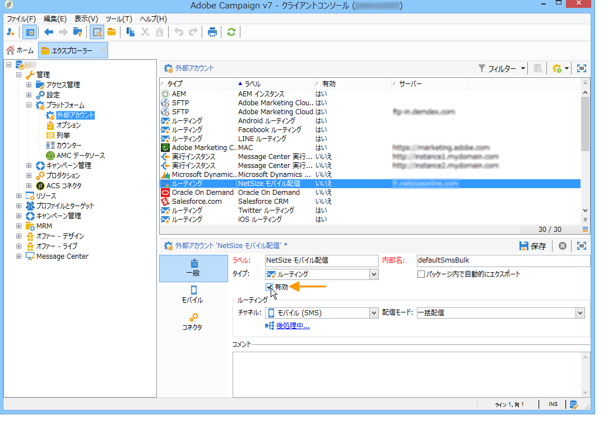

* 「**[!UICONTROL チャネル]**」フィールドで「**[!UICONTROL モバイル]**」オプションが選択されていることを確認します。
* 「**[!UICONTROL モバイル]**」タブで、ドロップダウンリストからコネクタを選択します。選択できるのは NetSize、一般的な SMPP、Sybase365（SAP SMS 365）、CLX 通信、Tele2、O2、または拡張された汎用 SMPP のいずれかです。拡張された汎用 SMPP コネクタについて詳しくは、[SMPP 外部アカウントの作成](#creating-an-smpp-external-account)の節を参照してください。

   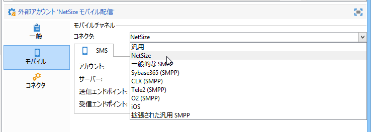

* コネクタを、サプライヤーから入手した情報に従って設定します。下の例では、通信事業者は NetSize です。

   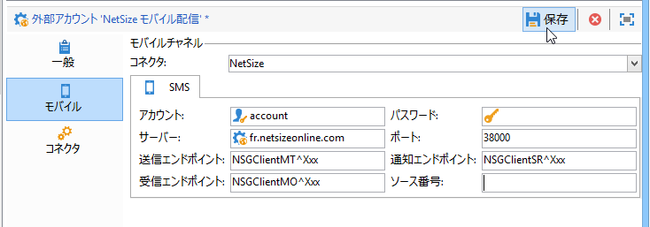

* 「**[!UICONTROL コネクタ]**」タブでは、デフォルトで選択されている「**[!UICONTROL Web サービスを呼び出す]**」有効化モードをそのままにしておきます。

   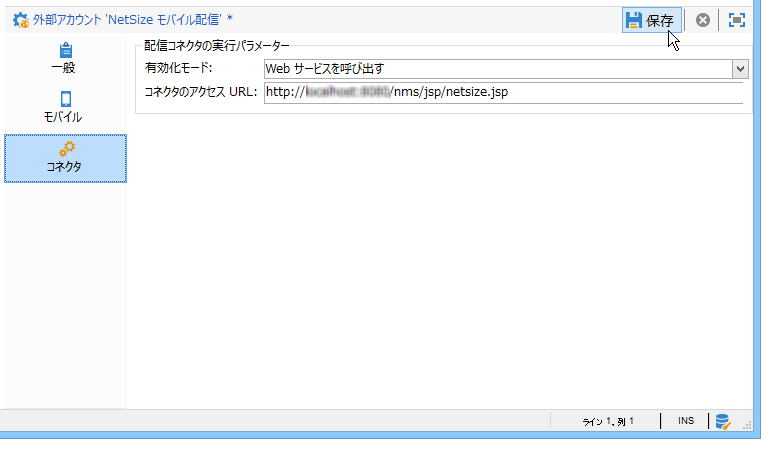

* 「**[!UICONTROL コネクタ]**」タブが表示されている場合は、コネクタのアクセス URL を指定します。プロバイダーが NetSize の場合、アドレスの末尾は **netsize.jsp** になります。それ以外のコネクタの場合、URL アドレスの末尾は **smpp34.jsp** です。

### SMPP 外部アカウントの作成 {#creating-an-smpp-external-account}

SMPP プロトコルを使用する場合、新しい外部アカウントを作成することもできます。

SMS のプロトコルと設定について詳しくは、この[技術メモ](https://helpx.adobe.com/jp/campaign/kb/sms-connector-protocol-and-settings.html)を参照してください。

これをおこなうには、以下の手順に従います。

1. ツリーの&#x200B;**[!UICONTROL プラットフォーム]**／**[!UICONTROL 外部アカウント]**&#x200B;ノードで、**[!UICONTROL 新規]**&#x200B;アイコンをクリックします。
1. アカウントタイプを「**ルーティング**」、チャネルを「**モバイル (SMS)**」、配信モードを「**一括配信**」にそれぞれ設定します。

   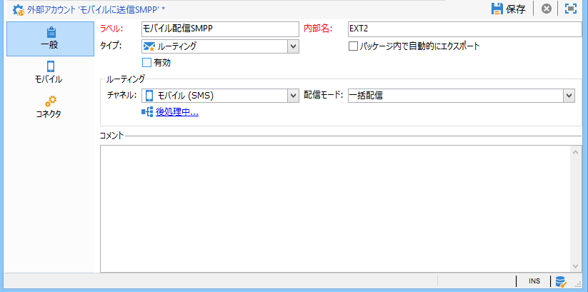

1. 「**[!UICONTROL 有効]**」ボックスをオンにします。
1. 「**[!UICONTROL モバイル]**」タブで、**[!UICONTROL コネクタ]**&#x200B;ドロップダウンリストから「**[!UICONTROL 拡張された汎用 SMPP]**」を選択します。

   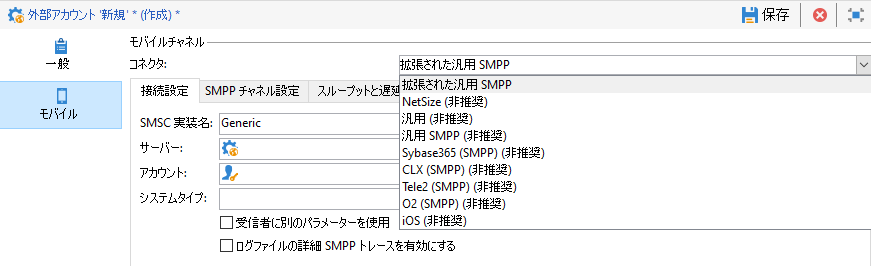

   「**[!UICONTROL ログファイルの詳細 SMPP トレースを有効にする]**」オプションを使用すると、ログファイル内のすべての SMPP トラフィックをダンプできます。コネクタのトラブルシューティングやプロバイダー側が確認できるトラフィックとの比較をおこなうには、このオプションを有効にする必要があります。

1. 「**[!UICONTROL 接続設定]**」タブで各種の外部アカウントフィールドを入力する方法については、SMS サービスプロバイダーにお問い合わせください。

   また、「**[!UICONTROL SMSC 実装名]**」フィールドに入力する値については、選択したプロバイダーにお問い合わせください。

   MTA の子ごとのプロバイダーへの接続数を指定できます。デフォルトでは 1 に設定されています。

1. デフォルトでは、SMS の文字数は GSM 標準に準じています。

   GSM エンコードを使用する SMS メッセージは 160 文字以内に制限されています。複数の部分に分けて送信されるメッセージの場合は、SMS 1 件につき 153 文字以内です。

   >[!NOTE]
   >
   >2 文字としてカウントされる文字もあります（中括弧、角括弧、ユーロ記号など）。
   >
   >使用可能な GSM 文字の一覧については、下記を参照してください。

   必要に応じて、文字の表記変換をチェックボックスで指定できます。

   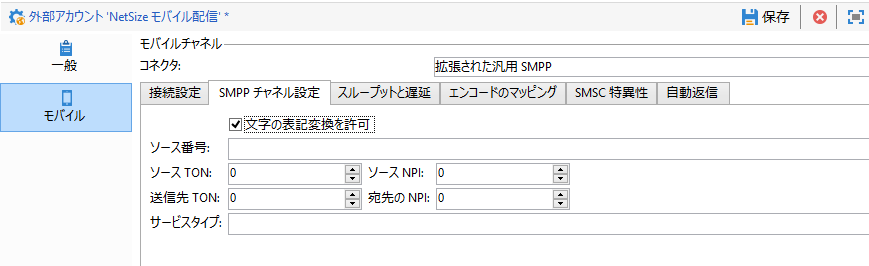

   詳しくは、[この節](#about-character-transliteration)を参照してください。

1. 「**[!UICONTROL スループットと遅延]**」タブでは、送信メッセージの最大スループット（「MT」：モバイル終了）を 1 秒あたりの MT として指定できます。該当するフィールドに「0」と入力した場合、スループットは無制限となります。

   期間を示すどのフィールドでも、値は秒単位で入力する必要があります。

1. 「**[!UICONTROL エンコードのマッピング]**」タブでは、エンコードを定義できます。

   詳しくは、[この節](#about-text-encodings)を参照してください。

1. デフォルトでは、「**[!UICONTROL SMSC 特異性]**」タブの「**[!UICONTROL 完全な電話番号を送信]**」オプションは無効になっています。SMPP プロトコルに準拠し、数字のみを SMS プロバイダー（SMSC）のサーバーに送信する場合は、このオプションを有効にしないでください。

   ただし、特定のプロバイダーで「+」がプレフィックスとして必要な場合は、プロバイダーにお問い合わせください。必要に応じて、このオプションを有効にするようプロバイダーから指示があります。

   「**[!UICONTROL SMPP 経由での TLS を有効化]**」チェックボックスを使用すると、SMPP トラフィックを暗号化することができます。詳しくは、この[技術メモ](https://helpx.adobe.com/jp/campaign/kb/sms-connector-protocol-and-settings.html)を参照してください。

1. **[!UICONTROL 拡張された汎用 SMPP]** コネクタを設定している場合は、自動応答を設定できます。

   詳しくは、[この節](#automatic-reply)を参照してください。

### 文字の表記変換について {#about-character-transliteration}

文字の表記変換は、「**[!UICONTROL モバイル]**」タブの SMPP モバイル配信外部アカウントで設定できます。

表記変換では、SMS の特定の文字が GSM 標準に準じていない場合に、別の文字に置き換えられます。

* 表記変換が&#x200B;**[!UICONTROL 許可されている]**&#x200B;場合、標準に準じていない文字はメッセージの送信時に GSM 文字に置き換えられます。例えば、「ë」は「e」に置き換えられます。そのため、メッセージは若干改変されますが、文字制限は同じです。
* 表記変換が&#x200B;**[!UICONTROL 許可されていない]**&#x200B;場合、標準に準じていない文字があるメッセージはバイナリフォーマット（Unicode）で送信されます。そのため、すべての文字がそのまま送信されます。ただし、Unicode を使用する SMS メッセージは 70 文字以内に制限されています。複数の部分に分けて送信されるメッセージの場合は、SMS 1 件につき 67 文字以内です。文字数が上限を超えると、メッセージは複数に分かれて送信されますが、追加料金が発生する場合があります。

>[!CAUTION]
>
>パーソナライゼーションフィールドを SMS メッセージのコンテンツに入れると、GSM エンコードに対応していない文字が含まれる場合があります。

デフォルトでは、文字の表記変換は無効です。SMS メッセージのすべての文字をそのまま送信する場合（例えば、固有名詞が改変されないようにする場合）、このオプションは無効にしておくことをお勧めします。

ただし、SMS メッセージに Unicode メッセージ用の文字が多数含まれる場合、このオプションを有効にしてメッセージ送信のコストを抑えることもできます。

下記の表では、GSM 標準に準じた文字を紹介します。メッセージ本文に、ここで紹介されていない文字が含まれている場合、メッセージ全体がバイナリフォーマット（Unicode）に変換され、文字数が 70 文字以内に制限されます。

**基本的な文字**

<table> 
 <tbody> 
  <tr> 
   <td> @ </td> 
   <td>  </td> 
   <td> SP </td> 
   <td> 0 </td> 
   <td> ¡ </td> 
   <td> P </td> 
   <td> ¿ </td> 
   <td> p </td> 
  </tr> 
  <tr> 
   <td> £ </td> 
   <td> _ </td> 
   <td> ! </td> 
   <td> 1 </td> 
   <td> A </td> 
   <td> Q </td> 
   <td> a </td> 
   <td> q </td> 
  </tr> 
  <tr> 
   <td> $ </td> 
   <td> 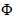 </td> 
   <td> " </td> 
   <td> 2 </td> 
   <td> B </td> 
   <td> R </td> 
   <td> b </td> 
   <td> r </td> 
  </tr> 
  <tr> 
   <td> ¥ </td> 
   <td>  </td> 
   <td> # </td> 
   <td> 3 </td> 
   <td> C </td> 
   <td> S </td> 
   <td> c </td> 
   <td> s </td> 
  </tr> 
  <tr> 
   <td> è </td> 
   <td>  </td> 
   <td> ¤ </td> 
   <td> 4 </td> 
   <td> D </td> 
   <td> T </td> 
   <td> d </td> 
   <td> t </td> 
  </tr> 
  <tr> 
   <td> é </td> 
   <td> 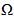 </td> 
   <td> % </td> 
   <td> 5 </td> 
   <td> E </td> 
   <td> U </td> 
   <td> e </td> 
   <td> u </td> 
  </tr> 
  <tr> 
   <td> ù </td> 
   <td> 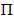 </td> 
   <td> &amp; </td> 
   <td> 6 </td> 
   <td> F </td> 
   <td> V </td> 
   <td> f </td> 
   <td> v </td> 
  </tr> 
  <tr> 
   <td> ì </td> 
   <td> 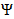 </td> 
   <td> ' </td> 
   <td> 7 </td> 
   <td> G </td> 
   <td> W </td> 
   <td> g </td> 
   <td> w </td> 
  </tr> 
  <tr> 
   <td> ò </td> 
   <td> 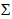 </td> 
   <td> ( </td> 
   <td> 8 </td> 
   <td> H </td> 
   <td> X </td> 
   <td> h </td> 
   <td> x </td> 
  </tr> 
  <tr> 
   <td> Ç </td> 
   <td>  </td> 
   <td> ) </td> 
   <td> 9 </td> 
   <td> I </td> 
   <td> Y </td> 
   <td> i </td> 
   <td> y </td> 
  </tr> 
  <tr> 
   <td> LF </td> 
   <td>  </td> 
   <td> * </td> 
   <td> : </td> 
   <td> J </td> 
   <td> Z </td> 
   <td> j </td> 
   <td> z </td> 
  </tr> 
  <tr> 
   <td> Ø </td> 
   <td> ESC </td> 
   <td> + </td> 
   <td> ; </td> 
   <td> K </td> 
   <td> Ä </td> 
   <td> k </td> 
   <td> ä </td> 
  </tr> 
  <tr> 
   <td> ø </td> 
   <td> Æ </td> 
   <td> , </td> 
   <td> &lt; </td> 
   <td> L </td> 
   <td> Ö </td> 
   <td> l </td> 
   <td> ö </td> 
  </tr> 
  <tr> 
   <td> CR </td> 
   <td> æ </td> 
   <td> - </td> 
   <td> = </td> 
   <td> M </td> 
   <td> Ñ </td> 
   <td> m </td> 
   <td> ñ </td> 
  </tr> 
  <tr> 
   <td> Å </td> 
   <td> ß </td> 
   <td> . </td> 
   <td> &gt; </td> 
   <td> N </td> 
   <td> Ü </td> 
   <td> n </td> 
   <td> ü </td> 
  </tr> 
  <tr> 
   <td> å </td> 
   <td> É </td> 
   <td> / </td> 
   <td> ? </td> 
   <td> O </td> 
   <td> § </td> 
   <td> o </td> 
   <td> à </td> 
  </tr> 
 </tbody> 
</table>

SP：スペース

ESC：エスケープ

LF：ラインフィード

CR：キャリッジリターン

**高度な文字（2 回カウント）**

^ { } `[ ~ ]` | €

### テキストのエンコードについて {#about-text-encodings}

Adobe Campaign では、SMS メッセージの送信時に 1 つまたは複数のテキストエンコードを使用できます。エンコードごとに独自の文字セットがあり、SMS メッセージに入力できる文字数もそれぞれ異なります。

新しい SMPP モバイル配信外部アカウントを設定する場合は、「**[!UICONTROL Mobile]**」タブで&#x200B;**[!UICONTROL エンコードのマッピング]**&#x200B;を定義できます。「**[!UICONTROL data_coding]**」フィールドには、Adobe Campaign が SMSC に使用するエンコードが示されます。

>[!NOTE]
>
>**data_coding** の値と実際に使用されているエンコードの間のマッピングは標準化されています。しかし、一部の SMSC には独自のマッピングがあり、その場合、**Adobe Campaign** 管理者がこのマッピングを宣言する必要があります。詳しくは、プロバイダーにお問い合わせください。

必要に応じて、**data_codings** を宣言してエンコードを強制適用できます。この場合、表のエンコードの 1 つを指定します。

* エンコードのマッピングが定義されていない場合、コネクタは一般的な動作をおこないます。

   * **data_coding = 0** を設定して、GSM エンコードの使用を試行します。
   * GSM エンコードが失敗した場合は、**data_coding = 8** を設定して、**UCS2** エンコードの使用を試行します。

* 使用するエンコードと、リンクされた **[!UICONTROL data_coding]** フィールド値を指定した場合、Adobe Campaign はリストの最初のエンコードを使用します。最初のエンコードが使用できない場合、その次のエンコードを使用します。

>[!CAUTION]
>
>宣言の順序は重要です。**コスト**&#x200B;が少ない順にリストを設定し、SMS メッセージになるべく多くの文字を使用できるようにすることをお勧めします。
>
>使用するエンコードのみを宣言してください。SMSC から提供されているエンコードの中に、使用目的に該当しないものがあれば、それはリストで宣言しないでください。

### 自動返信 {#automatic-reply}

拡張された汎用 SMPP コネクタを設定している場合は、自動返信を設定できます。

購読者が、Adobe Campaign により自分に送信された SMS メッセージに返信し、その返信メッセージに「STOP」などのキーワードが含まれている場合、「**[!UICONTROL MO に自動返信が送信されました]**」セクションで自動送信メッセージを設定できます。

>[!NOTE]
>
>キーワードは大文字と小文字が区別されません。

キーワードごとにショートコードを指定します。これは、通常は配信の送信に使用する数字で、送信者名を表します。その後、購読者に送信するメッセージを入力します。

自動応答には、「**[!UICONTROL 強制隔離に送信]**」または「**[!UICONTROL 強制隔離から削除]**」のいずれかのアクションをリンクすることもできます。例えば、受信者が「STOP」というキーワードを送信した場合、その受信者には自動的に購読解除の確認が送信され、さらにその受信者が強制隔離に送信されます。


**[!UICONTROL 強制隔離から削除]**&#x200B;アクションを自動返信にリンクした場合、対応するキーワードを送信した受信者は自動的に強制隔離から削除されます。

受信者は、**[!UICONTROL 管理]**／**[!UICONTROL キャンペーン管理]**／**[!UICONTROL 配信不能件数の管理]**&#x200B;メニューから利用できる&#x200B;**[!UICONTROL 配信不能件数およびアドレス]**&#x200B;テーブルにリストされます。

* ショートコードに関わらず同じ返信を送信する場合は、「**[!UICONTROL ショートコード]**」列を空白のままにします。
* キーワードに関わらず同じ返信を送信する場合は、「**[!UICONTROL キーワード]**」列を空白のままにします。
* 返信せずにアクションを実行する場合は、「**[!UICONTROL 回答]**」列を空白のままにします。これにより、例えば、「STOP」以外のメッセージを送信したユーザーを強制隔離から削除できます。

複数の外部アカウントが同じプロバイダーアカウントで拡張された汎用 SMPP コネクタを使用している場合、ショートコードへの返信がどの外部アカウント接続で受信されるかわからない、といった問題が発生する可能性があります。これにより、送信された自動返信が予期されるメッセージではない可能性があります。こうした問題を回避するには、使用しているプロバイダーに応じて次のいずれかのソリューションを適用します。
* 各外部アカウントに対して 1 つのプロバイダーアカウントを作成
* **[!UICONTROL モバイル]**／「**[!UICONTROL 接続設定]**」タブの「**[!UICONTROL システムタイプ]**」フィールドを使用して、各ショートコードを区別各アカウントに異なる値を提供するようプロバイダーに依頼

   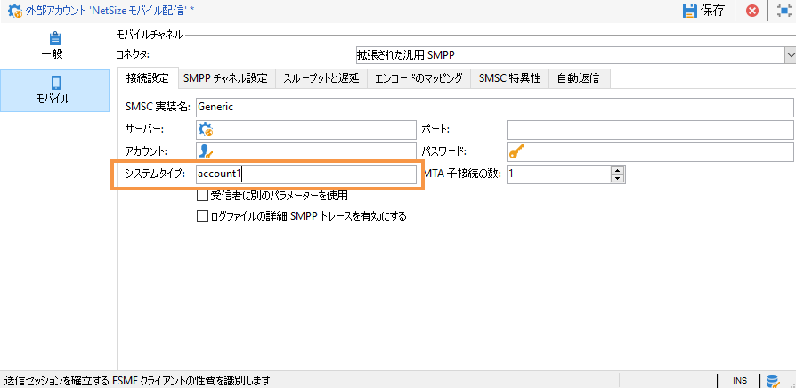

拡張された汎用 SMPP コネクタを使用して外部アカウントを設定する手順について詳しくは、[SMPP 外部アカウントの作成](../../delivery/using/sms-channel.md#creating-an-smpp-external-account)の節を参照してください。

### 配信テンプレートの変更 {#changing-the-delivery-template}

Adobe Campaign には、モバイルへの配信用テンプレートが用意されています。このテンプレートは&#x200B;**[!UICONTROL リソース／テンプレート／配信テンプレート]**&#x200B;ノードにあります。詳しくは、[テンプレートについて](../../delivery/using/about-templates.md)の節を参照してください。

SMS チャネルでの配信の場合は、使用するチャネルコネクタへの参照を含んだテンプレートを作成する必要があります。

ネイティブ配信テンプレートを保持しておくために、テンプレートのコピーを作成してから設定することをお勧めします。

次の例では、既に有効化した NetSize アカウントを使用してメッセージを配信するテンプレートを作成します。手順は次のとおりです。

1. 「**[!UICONTROL 配信テンプレート]**」ノードを表示します。
1. 「**[!UICONTROL モバイルに送信]**」テンプレートを右クリックし、「**[!UICONTROL 複製]**」を選択します。

   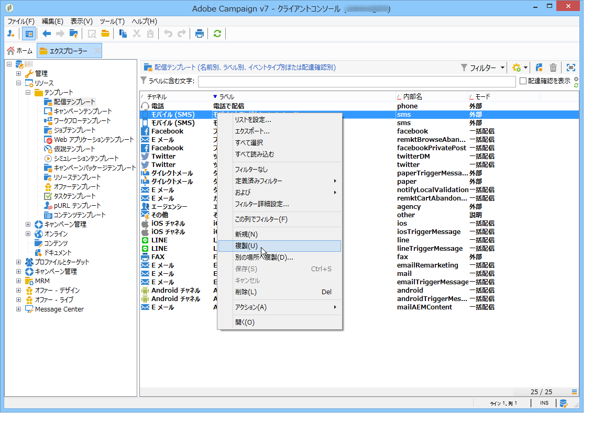

1. テンプレートのラベルを変更します。

   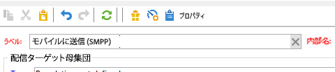

1. 「**[!UICONTROL プロパティ]**」をクリックします。
1. 「**[!UICONTROL 一般]**」タブで、設定した外部アカウントに該当するルーティングモード（「**[!UICONTROL NetSize モバイル配信]**」など）を選択します。

   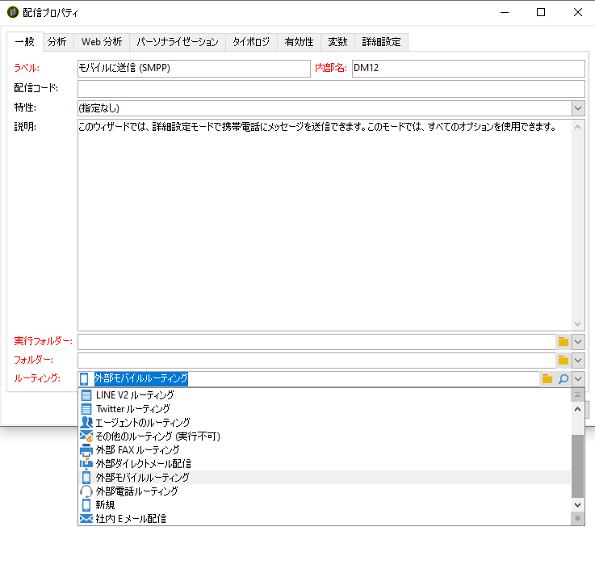

1. 「**[!UICONTROL 保存]**」をクリックし、テンプレートを作成します。

   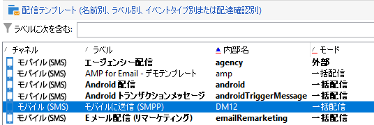

これで、SMS 経由で配信できる外部アカウントと配信テンプレートを用意できました。

## SMS 配信の作成 {#creating-a-sms-delivery}

### 配信チャネルの選択 {#selecting-the-delivery-channel}

新しい SMS 配信を作成するには、次の手順に従います。

>[!NOTE]
>
>配信の作成に関するグローバルな概念については、[この節](../../delivery/using/steps-about-delivery-creation-steps.md)で説明しています。

1. 新しい配信を作成します（例えば、配信ダッシュボードから）。
1. 先ほど作成した配信テンプレート「**[!UICONTROL モバイルに送信（NetSize）]**」を選択します。詳しくは、[配信テンプレートの変更](#changing-the-delivery-template)の節を参照してください。

   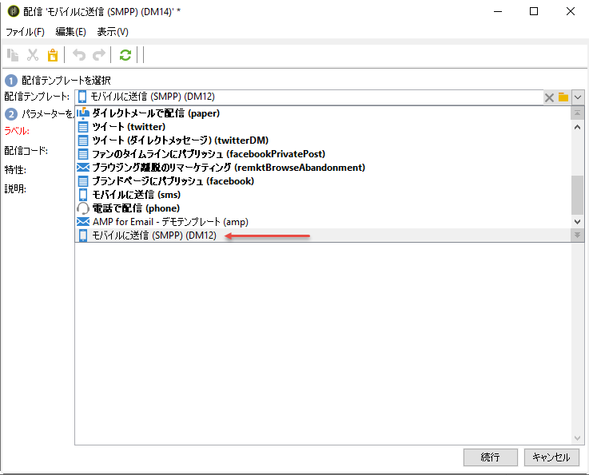

1. ラベル、コードおよび説明を設定して配信を識別します。詳しくは、[この節](../../delivery/using/steps-create-and-identify-the-delivery.md#identifying-the-delivery)を参照してください。
1. 「**[!UICONTROL 続行]**」をクリックすると、入力した情報が確定され、メッセージ設定ウィンドウが表示されます。

## SMS コンテンツの定義 {#defining-the-sms-content}

SMS のコンテンツを作成するには、次の手順に従います。

1. ウィザードの「**[!UICONTROL テキストコンテンツ]**」セクションにメッセージのコンテンツを入力します。ツールバーのボタンで、コンテンツのインポート、保存、検索ができます。最後のボタンは、パーソナライゼーションフィールドを挿入するために使用します。

   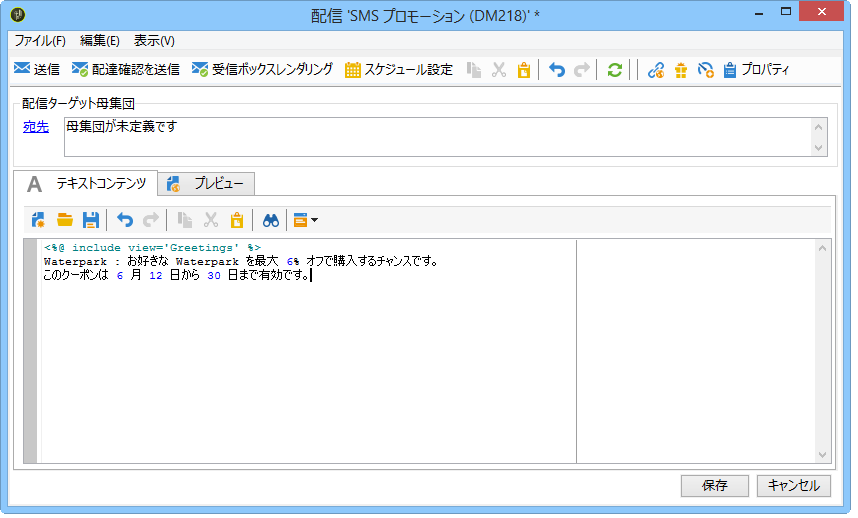

   パーソナライゼーションフィールドの使用方法について詳しくは、[パーソナライゼーションについて](../../delivery/using/about-personalization.md)の節で説明しています。

1. ページ下部の「**[!UICONTROL プレビュー]**」をクリックすると、メッセージにパーソナライゼーションを含めたレンダリング結果を表示して確認できます。プレビューを起動するには、ツールバーの&#x200B;**[!UICONTROL パーソナライゼーションをテスト]**&#x200B;ボタンで受信者を選択します。定義済みターゲットの中から受信者を選択することも、別の受信者を指定することもできます。

   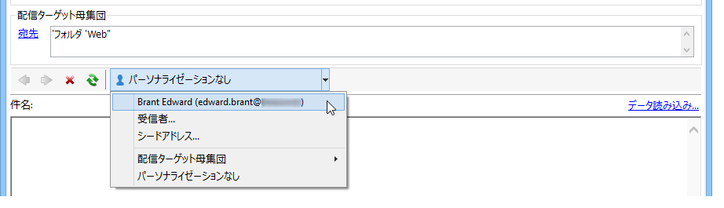

   SMS メッセージを承認したり、コンテンツエディターの右側に表示される携帯電話画面で SMS のコンテンツを表示したりできます。画面のクリックや、マウスによるコンテンツのスクロールが可能です。

   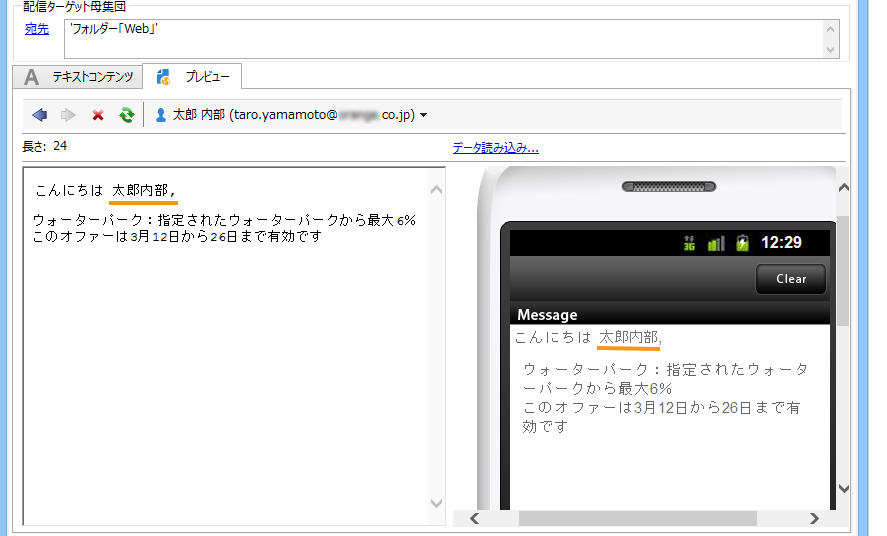

1. 「**[!UICONTROL データ読み込み...]**」リンクをクリックすると、受信者に関する情報が表示されます。

   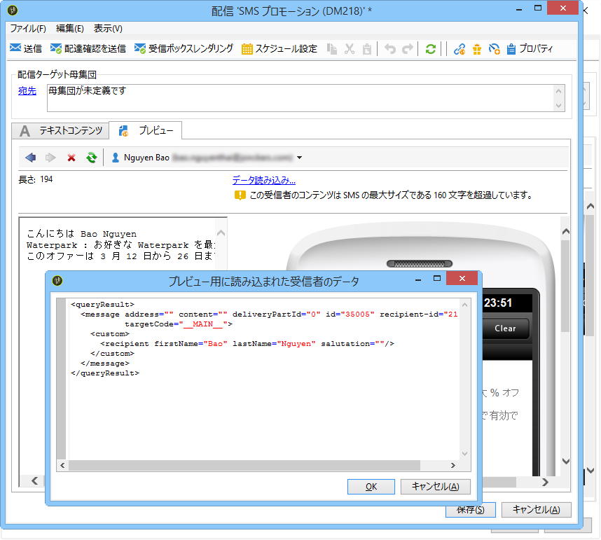

   >[!NOTE]
   >
   >SMS メッセージの文字数には制限があり、Latin-1（ISO-8859-1）コードページを使用する場合は 160 字以内です。メッセージが Unicode で作成されている場合、上限は 70 文字です。また、使用する文字によってメッセージの長さ制限が変化することがあります。メッセージの長さについて詳しくは、[文字の表記変更について](#about-character-transliteration)の節を参照してください。
   >
   >パーソナライゼーションフィールドまたは条件付きコンテンツが含まれる場合、メッセージのサイズは受信者によって異なります。メッセージの長さはパーソナライゼーションを適用した後の状態で評価する必要があります。
   >
   >分析を開始すると、メッセージの長さがチェックされ、制限を超える場合は警告が表示されます。

1. NetSize コネクタ、またはいずれかの SMPP コネクタを使用する場合は、配信の送信者名をパーソナライズできます。詳しくは、[詳細設定パラメーター](#advanced-parameters)の節を参照してください。

## ターゲット母集団の選択 {#selecting-the-target-population}

配信のターゲット母集団を選択する際の詳細なプロセスについては、[この節](../../delivery/using/steps-defining-the-target-population.md)を参照してください。

パーソナライゼーションフィールドの使用について詳しくは、[パーソナライゼーションについて](../../delivery/using/about-personalization.md)を参照してください。

シードリストの追加について詳しくは、[シードアドレスについて](../../delivery/using/about-seed-addresses.md)を参照してください。

## SMS メッセージの送信 {#sending-sms-messages}

メッセージを承認し、作成する配信の受信者に対して送信するには、「**[!UICONTROL 送信]**」をクリックします。

配信を検証および送信する際の詳細なプロセスについては、以下の節を参照してください。

* [配信の検証](../../delivery/using/steps-validating-the-delivery.md)
* [配信の送信](../../delivery/using/steps-sending-the-delivery.md)

### 詳細設定パラメーター {#advanced-parameters}

**[!UICONTROL プロパティ]**&#x200B;ボタンをクリックすると、高度な配信パラメーターにアクセスできます。SMS 配信に特有のパラメーターは、「**[!UICONTROL 配信]**」タブの「**[!UICONTROL SMS パラメーター]**」節にあります。

次のオプションを使用できます。

* **送信者のアドレス**（NetSize コネクタ、SMPP コネクタのみ）：配信の送信者名をパーソナライズできます。使用できる文字は半角英数字のみ、長さは 11 字以内です。また、数字のみで構成される文字列は指定できません。条件を指定することにより、例えば、受信者の市外局番に基づいて名前を変更できます。

   ```
   <% if( String(recipient.mobilePhone).indexOf("+1") == 0){ %>NeoShopUS<%} else %>
   ```

   >[!CAUTION]
   >
   >送信者名の変更については規制が適用される場合があります。お住まいの国の法律を確認してください。また、通信事業者が送信者名の変更機能を提供しているかどうかについても確認する必要があります。

* **送信モード**：SMS によるメッセージ送信です。
* **優先順位**：メッセージに付与する重要度レベルです。デフォルトでは「**[!UICONTROL 標準]**」が選択されています。優先順位「**[!UICONTROL 高]**」を指定して SMS を送信する場合のコストについては、サービスプロバイダーに確認してください。
* **通信のタイプ**：SMS 配信に割り当てるアプリケーションを選択します。最もよく使用されるオプションは、デフォルトで選択されている「**[!UICONTROL ダイレクトマーケティング]**」です。

**NetSize コネクタに特有のパラメーター**

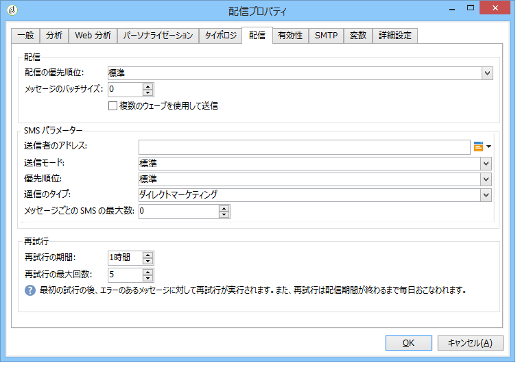

* **単一のメッセージに複数の SMS を使用**：メッセージの長さが 160 字を超える場合に複数の SMS メッセージを使用して送信することを許可します。

**SMPP コネクタに特有のパラメーター**

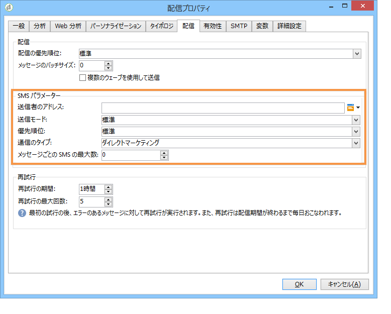

* **メッセージごとの SMS の最大数**：1 件のメッセージ送信に使用できる SMS の数を指定します。値が 0 の場合、メッセージの配信に使用する SMS の数に制限はありません。また、例えば 1 や 2 の場合、この数の SMS に収まらない長さのメッセージは送信されません。

## SMS 配信の監視とトラッキング {#monitoring-and-tracking-sms-deliveries}

メッセージを送信した後は、配信を監視およびトラッキングできます。詳しくは、以下の節を参照してください。

* [配信の監視](../../delivery/using/monitoring-a-delivery.md)
* [配信エラーの理解](../../delivery/using/understanding-delivery-failures.md)
* [メッセージトラッキングについて](../../delivery/using/about-message-tracking.md)

## インバウンドメッセージの処理 {#processing-inbound-messages}

**nlserver sms** モジュールは、一定の時間間隔で SMS ルーターにクエリを発行します。これにより、Adobe Campaign で配信の進行状況をトラッキングし、ステータスレポートや受信者の購読解除リクエストに対処できます。

* **ステータスレポート**：配信ログを参照してメッセージのステータスをチェックできます。

   >[!NOTE]
   >
   >送信されるそれぞれの SMS のプライマリキーは、外部アカウントにリンクされます。これは次のことを意味します。
   >
   > * 削除された SMS アカウントのステータスレポートは、正常に処理されません。
   > * 1 つの SMS アカウントは 1 つの外部アカウントとしかリンクできないので、ステータスレポートは常に正しいアカウントと関連付けられます。


* **購読解除**：SMS 配信の停止を希望する受信者は、STOP という単語を含んだメッセージを返信することで受信を停止できます。プロバイダーとの契約上認められている場合は、**インバウンド SMS** ワークフローアクティビティを使用してメッセージを取得し、クエリを作成して、関係する複数の受信者のために「**今後のこの受信者への連絡は不要**」オプションを有効化できます。

   [ワークフロー](../../workflow/using/executing-a-workflow.md#architecture)ガイドを参照してください。

## InSMS スキーマ {#insms-schema}

InSMS スキーマには、受信 SMS に関する情報が含まれます。それらの情報に関するフィールドの説明は、desc 属性を使用して取得できます。

* **message**：受信した SMS の内容
* **origin**：メッセージ送信元の携帯電話番号
* **providerId**：SMSC（メッセージセンター）から返されたメッセージの識別子
* **created**：受信メッセージが Adobe Campaign に挿入された日付
* **extAccount**：Adobe Campaign の外部アカウント

   >[!CAUTION]
   >
   >次のフィールドは NetSize に特有のものです。
   >
   >使用する通信事業者が NetSize ではない場合、これらのフィールドの値は空とみなされます。

* **alias**：受信メッセージのエイリアス
* **separator**：エイリアスとメッセージ本文との区切り記号
* **messageDate**：通信事業者がメッセージに付けた日付
* **receivalDate**：メッセージが通信事業者から SMSC（メッセージセンター）に届いた日付
* **deliveryDate**：メッセージが SMSC（メッセージセンター）から送信された日付
* **largeAccount**：受信 SMS にリンクされた顧客アカウントコード
* **countryCode**：通信事業者の国コード
* **operatorCode**：通信事業者のネットワークコード
* **linkedSmsId**：応答の SMS において、送信 SMS にリンクされた Adobe Campaign 識別子（broadlogId）

## 自動返信の管理（米国における規制対応）{#managing-automatic-replies--american-regulation-}

Adobe Campaign 経由で送信した SMS メッセージに対し、購読者から STOP、HELP、YES のようなキーワードを含む応答が返ってきた場合、米国市場では、自動応答メッセージを返すように設定しておく必要があります。

例えば、STOP というキーワードを含むメッセージが受信者から届いた場合は、その受信者に対して、購読解除を受け付けたことを示す確認メッセージを送信します。

このタイプのメッセージで使用する送信者名は、配信の送信時に通常使用される短いコードです。

>[!CAUTION]
>
>次の詳細手順は、SMPP コネクタ（拡張された SMPP コネクタは除く）の場合のみ有効です。詳しくは、[SMPP 外部アカウントの作成](#creating-an-smpp-external-account)の節を参照してください。
>
>これは、米国の通信事業者が国内のマーケティングキャンペーンで実行する認証プロセスの一環です。このようなキーワードを含む購読者の SMS メッセージを受信した場合は、ただちに購読者に返信する必要があります。

1. 次のような XML ファイルを作成します。

   ```
   <autoreply>
     <shortcode name="12345">
       <reply keyword="STOP" text="You will not receive SMS anymore" />
       <reply keyword="HELP" text="Powered by Adobe Campaign" />
     </shortcode>
     <shortcode name="43115">
       <reply keyword="STOP" text="Vous ne recevrez plus de SMS" />
       <reply keyword="HELP" text="Service rendu par Adobe Campaign" />
     </shortcode>
     <shortcode name="*">
       <reply keyword="ADOBE" text="This text is replied when you send ADOBE to any short code" />
     </shortcode>
   </autoreply>
   ```

1. **`<shortcode>`** タグの **name** 属性には、メッセージ送信者の名前の代わりに表示されるショートコードを指定します。

   各 **`<reply>`** タグでは、キーワードを **keyword** 属性で指定し、そのキーワードに対して送信するメッセージを **text** 属性で指定します。

   >[!NOTE]
   >
   >各キーワードは、大文字の英字で記述する必要があります。

   複数のキーワードに対して同じメッセージを送信する場合は、該当する行をコピーします。

   次に例を示します。

   ```
   <reply keyword="STOP" text="You will not receive SMS anymore" />
   <reply keyword="QUIT" text="You will not receive SMS anymore" />
   ```

1. 完成したら、ファイルを **smsAutoReply.xml** という名前で保存します。

   Linux ではファイル名の大文字と小文字が区別される点に注意してください。

1. このファイルを、Adobe Campaign の **conf** ディレクトリ内の、Web サーバーと同じ場所にコピーします。

>[!CAUTION]
>
>こうした自動メッセージは、履歴には記録されず、[配信ダッシュボード](../../delivery/using/monitoring-a-delivery.md#delivery-dashboard)にも表示されません。
>
>これらのメッセージは、[商業的な頻度ルール](../../campaign/using/pressure-rules.md)の対象とはみなされません。
