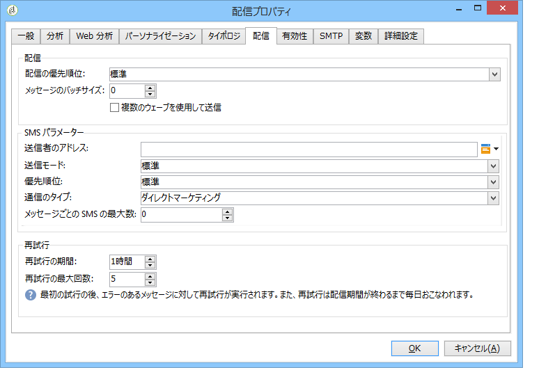
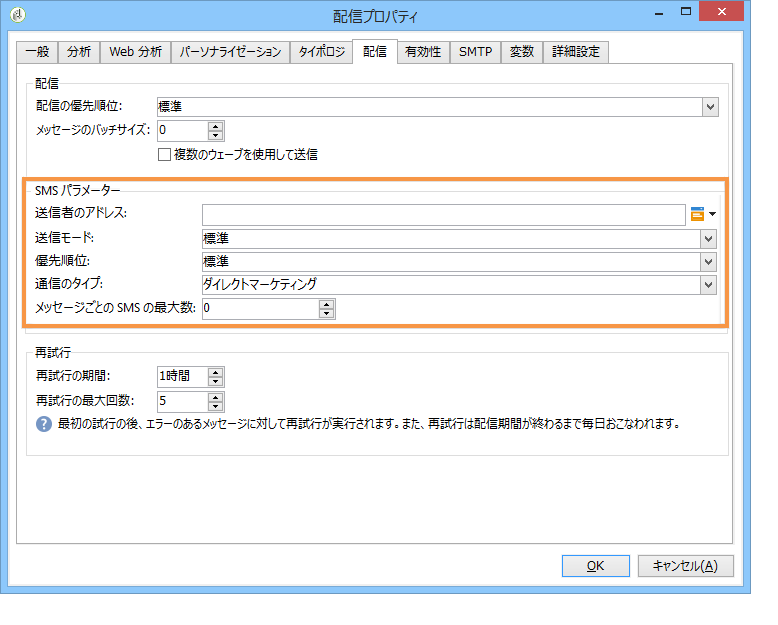

# SMS 配信の送信、監視、追跡{#sms-properties}


## SMS メッセージの送信 {#sending-sms-messages}

メッセージを承認し、作成する配信の受信者に対して送信するには、「**[!UICONTROL 送信]**」をクリックします。

配信を検証および送信する際の詳細なプロセスについては、以下の節を参照してください。

* [配信の検証](steps-validating-the-delivery.md)
* [配信の送信](steps-sending-the-delivery.md)

## 詳細設定パラメーター {#advanced-parameters}

**[!UICONTROL プロパティ]**&#x200B;ボタンをクリックすると、高度な配信パラメーターにアクセスできます。SMS 配信に特有のパラメーターは、「**[!UICONTROL 配信]**」タブの「**[!UICONTROL SMS パラメーター]**」節にあります。

次のオプションを使用できます。

* **送信者のアドレス**：配信の送信者名をパーソナライズできます。使用できる文字は半角英数字のみ、長さは 11 字以内です。また、数字のみで構成される文字列は指定できません。条件を指定することにより、例えば、受信者の市外局番に基づいて名前を変更できます。

   ```
   <% if( String(recipient.mobilePhone).indexOf("+1") == 0){ %>NeoShopUS<%} else %>
   ```

   >[!IMPORTANT]
   >
   >送信者名の変更については規制が適用される場合があります。お住まいの国の法律を確認してください。また、通信事業者が送信者名の変更機能を提供しているかどうかについても確認する必要があります。

* **送信モード**：SMS によるメッセージ送信です。
* **優先順位**：メッセージに付与する重要度レベルです。デフォルトでは「**[!UICONTROL 標準]**」が選択されています。優先順位「**[!UICONTROL 高]**」を指定して SMS を送信する場合のコストについては、サービスプロバイダーに確認してください。
* **通信のタイプ**：SMS 配信に割り当てるアプリケーションを選択します。最もよく使用されるオプションは、デフォルトで選択されている「**[!UICONTROL ダイレクトマーケティング]**」です。

**NetSize コネクタに特有のパラメーター**



* **単一のメッセージに複数の SMS を使用**：メッセージの長さが 160 字を超える場合に複数の SMS メッセージを使用して送信することを許可します。

**SMPP コネクタに特有のパラメーター**



* **メッセージごとの SMS の最大数**：1 件のメッセージ送信に使用できる SMS の数を指定します。値が 0 の場合、メッセージの配信に使用する SMS の数に制限はありません。また、例えば 1 や 2 の場合、この数の SMS に収まらない長さのメッセージは送信されません。

## SMS の監視と追跡 {#monitoring-and-tracking-sms-deliveries}

メッセージを送信した後は、配信を監視およびトラッキングできます。詳しくは、以下の節を参照してください。

* [配信の監視](about-delivery-monitoring.md)
* [配信エラーについて](understanding-delivery-failures.md)
* [メッセージのトラッキングについて](about-message-tracking.md)

## 受信メッセージの処理 {#processing-inbound-messages}

**nlserver sms** モジュールは、一定の時間間隔で SMS ルーターにクエリを発行します。これにより、Adobe Campaign で配信の進行状況をトラッキングし、ステータスレポートや受信者の購読解除リクエストに対処できます。

* **ステータスレポート**：配信ログを参照してメッセージのステータスをチェックできます。

   >[!NOTE]
   >
   >送信されるそれぞれの SMS のプライマリキーは、外部アカウントにリンクされます。これは次のことを意味します。
   >
   > * 削除された SMS アカウントのステータスレポートは、正常に処理されません。
   > * 1 つの SMS アカウントは 1 つの外部アカウントとしかリンクできないので、ステータスレポートは常に正しいアカウントと関連付けられます。


* **購読解除**：SMS 配信の停止を希望する受信者は、STOP という単語を含んだメッセージを返信することで受信を停止できます。プロバイダーとの契約上認められている場合は、**インバウンド SMS** ワークフローアクティビティを使用してメッセージを取得し、クエリを作成して、関係する複数の受信者のために「**今後のこの受信者への連絡は不要**」オプションを有効化できます。

   [ワークフロー](../../workflow/using/architecture.md)ガイドを参照してください。

## InSMS スキーマ {#insms-schema}

InSMS スキーマには、受信 SMS に関する情報が含まれます。それらの情報に関するフィールドの説明は、desc 属性を使用して取得できます。

* **message**：受信した SMS の内容
* **origin**：メッセージ送信元の携帯電話番号
* **providerId**：SMSC（メッセージセンター）から返されたメッセージの識別子
* **created**：受信メッセージが Adobe Campaign に挿入された日付
* **extAccount**：Adobe Campaign の外部アカウント

   >[!IMPORTANT]
   >
   >次のフィールドは NetSize に特有のものです。
   >
   >使用する通信事業者が NetSize ではない場合、これらのフィールドの値は空と見なされます。

* **alias**：受信メッセージのエイリアス
* **separator**：エイリアスとメッセージ本文との区切り記号
* **messageDate**：通信事業者がメッセージに付けた日付
* **receivalDate**：メッセージが通信事業者から SMSC（メッセージセンター）に届いた日付
* **deliveryDate**：メッセージが SMSC（メッセージセンター）から送信された日付
* **largeAccount**：受信 SMS にリンクされた顧客アカウントコード
* **countryCode**：通信事業者の国コード
* **operatorCode**：通信事業者のネットワークコード
* **linkedSmsId**：応答の SMS において、送信 SMS にリンクされた Adobe Campaign 識別子（broadlogId）

## 自動返信の管理（米国の規制への対応） {#managing-automatic-replies--american-regulation-}

Adobe Campaign 経由で送信した SMS メッセージに対し、購読者から STOP、HELP、YES のようなキーワードを含む応答が返ってきた場合、米国市場では、自動応答メッセージを返すように設定しておく必要があります。

例えば、STOP というキーワードを含むメッセージが受信者から届いた場合は、その受信者に対して、購読解除を受け付けたことを示す確認メッセージを送信します。

このタイプのメッセージで使用する送信者名は、配信の送信時に通常使用される短いコードです。

>[!IMPORTANT]
>
>次の詳細手順は、SMPP コネクタ（拡張された SMPP コネクタは除く）の場合のみ有効です。詳しくは、[SMPP 外部アカウントの作成](sms-set-up.md#creating-an-smpp-external-account)の節を参照してください。
>
>これは、米国の通信事業者が国内のマーケティングキャンペーンで実行する認証プロセスの一環です。このようなキーワードを含む購読者の SMS メッセージを受信した場合は、直ちに購読者に返信する必要があります。

1. 次のような XML ファイルを作成します。

   ```
   <autoreply>
     <shortcode name="12345">
       <reply keyword="STOP" text="You will not receive SMS anymore" />
       <reply keyword="HELP" text="Powered by Adobe Campaign" />
     </shortcode>
     <shortcode name="43115">
       <reply keyword="STOP" text="Vous ne recevrez plus de SMS" />
       <reply keyword="HELP" text="Service rendu par Adobe Campaign" />
     </shortcode>
     <shortcode name="*">
       <reply keyword="ADOBE" text="This text is replied when you send ADOBE to any short code" />
     </shortcode>
   </autoreply>
   ```

1. **`<shortcode>`** タグの **name** 属性には、メッセージ送信者の名前の代わりに表示されるショートコードを指定します。

   各 **`<reply>`** タグでは、キーワードを **keyword** 属性で指定し、そのキーワードに対して送信するメッセージを **text** 属性で指定します。

   >[!NOTE]
   >
   >各キーワードは、大文字の英字で記述する必要があります。

   複数のキーワードに対して同じメッセージを送信する場合は、該当する行をコピーします。

   次に例を示します。

   ```
   <reply keyword="STOP" text="You will not receive SMS anymore" />
   <reply keyword="QUIT" text="You will not receive SMS anymore" />
   ```

1. 完成したら、ファイルを **smsAutoReply.xml** という名前で保存します。

   Linux ではファイル名の大文字と小文字が区別される点に注意してください。

1. このファイルを、Adobe Campaign の **conf** ディレクトリ内の、web サーバーと同じ場所にコピーします。

>[!IMPORTANT]
>
>こうした自動メッセージは、履歴には記録されず、そのため、配信ダッシュボードには表示されません。[詳細情報](delivery-dashboard.md)。
>
>これらのメッセージは、商業的圧力ルールでは考慮されていません。 [詳細情報](../../campaign-opt/using/pressure-rules.md)。
