# ミッドソーシングインフラストラクチャでの SMS チャネルの設定 {#setting-up-sms-channel}

ミッドサーバーを使用して携帯電話に送信するには、次が必要です。

1. マーケティングサーバーで作成された SMS 外部アカウントに使用するミッドサーバーで作成された SMS オペレーター。

1. チャネルと配信モードを指定する、マーケティングサーバー上の外部アカウント。

1. コネクタとメッセージタイプの詳細を示す、ミッドサーバー上の外部アカウント。

1. 送信プロセスを効率化するために、外部アカウントを参照する配信テンプレート。

>[!NOTE]
>
> SMS 配信の場合、タイポロジでは、**1 つ**&#x200B;の専用アプリケーションサーバーコンテナで作成された特定の SMS アフィニティを使用する必要があります。[詳細情報](../../installation/using/configure-delivery-settings.md#managing-outbound-smtp-traffic-with-affinities)

## ミッドサーバーでの SMS オペレーターの作成 {#create-sms-operator}

設定プロセスを開始するには、特に外部アカウント用の SMS オペレーターをミッドサーバー上に作成する必要があります。

>[!IMPORTANT]
>
>各 SMS コネクタには、一意の SMS オペレーターが必要です。

1. ツリーの&#x200B;**[!UICONTROL 管理]**／**[!UICONTROL アクセス管理]**／**[!UICONTROL オペレーターノード]**&#x200B;ノードで、「**[!UICONTROL 新規]**」アイコンをクリックします。

   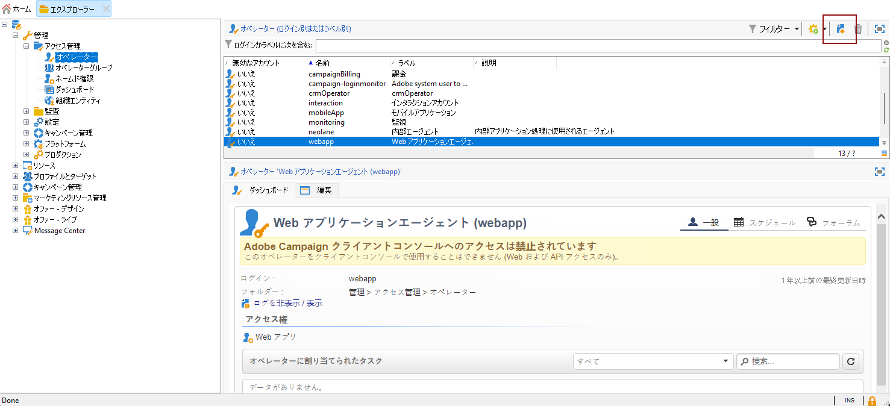

1. ログイン、パスワード、名前などのユーザーの&#x200B;**[!UICONTROL 識別パラメーター]**&#x200B;を指定します。オペレーターが Adobe Campaign に安全にログインするには、ログイン名とパスワードが必要です。

   **[!UICONTROL 名前（ログイン）]**&#x200B;は、後からミッドサーバーで SMPP 外部アカウントに名前を付けるために使用します。

   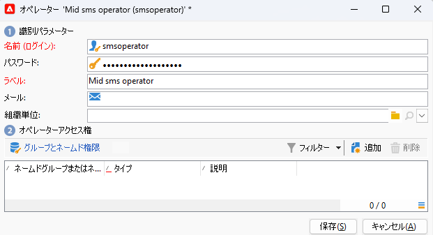

1. 「オペレーターアクセス権」セクションで、オペレーターに付与する権限を選択します。

   オペレーターに権限を割り当てるには、権限のリストの上にある「**[!UICONTROL 追加]**」ボタンをクリックします。次に、使用可能なグループのリストから「**[!UICONTROL オペレーターグループ]**」または「**[!UICONTROL ネームド権限]**」を選択します。

   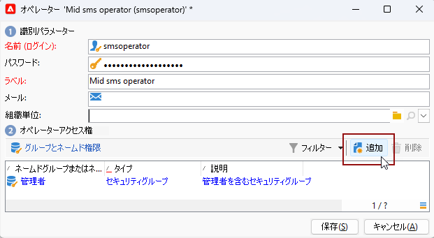

1. 「**[!UICONTROL 保存]**」をクリックしてオペレーターの作成を完了します。これで、プロファイルが既存のオペレーターのリストに含まれます。

## マーケティングサーバーでの SMS 外部アカウントの作成 {#create-accound-mkt}

ミッドサーバーを使用して携帯電話に SMS を送信するには、まずマーケティングサーバー上に SMS 外部アカウントを作成する必要があります。

1. ツリーの&#x200B;**[!UICONTROL プラットフォーム]**／**[!UICONTROL 外部アカウント]**&#x200B;ノードで、**[!UICONTROL 新規]**&#x200B;アイコンをクリックします。

   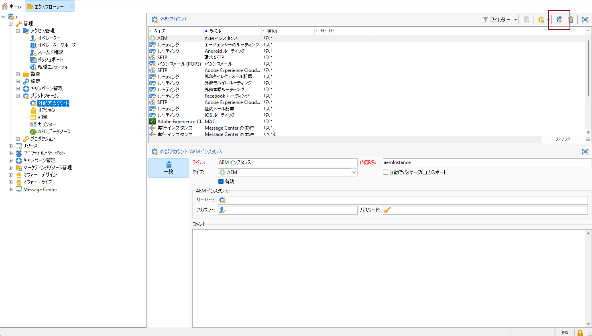

1. **[!UICONTROL ラベル]**&#x200B;と&#x200B;**[!UICONTROL 内部名]**&#x200B;を入力します。内部名は、後からミッドサーバーで SMPP 外部アカウントに名前を付けるために使用します。

1. アカウントタイプを&#x200B;**[!UICONTROL ルーティング]**、チャネルを&#x200B;**[!UICONTROL モバイル（SMS）]**、配信モードを&#x200B;**[!UICONTROL ミッドソーシング]**&#x200B;として定義します。

   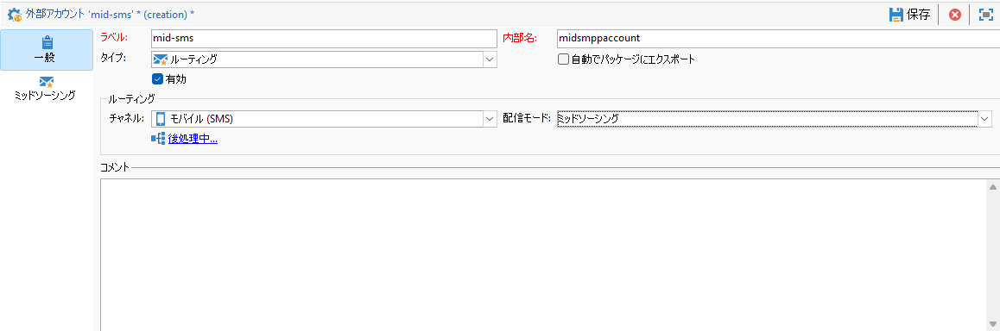

1. 「**[!UICONTROL ミッドソーシング]**」タブで、ミッドソーシングサーバーの接続パラメーターを指定します。

   [以前に作成した SMS コネクタ](#create-sms-operator)の詳細を「**[!UICONTROL アカウント]**」フィールドと「**[!UICONTROL パスワード]**」フィールドに入力します。

   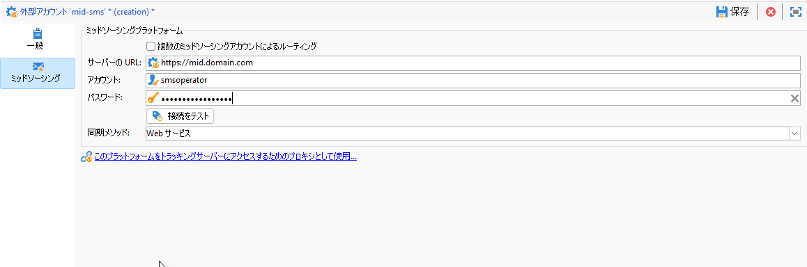

1. 「**[!UICONTROL 接続をテスト]**」をクリックして設定を確認します。

1. 「**[!UICONTROL 保存]**」をクリックします。

## ミッドサーバーでの SMPP 外部アカウントの作成 {#creating-smpp-mid}

>[!IMPORTANT]
>
>複数の外部 SMS アカウントに同じアカウントとパスワードを使用すると、アカウント間で競合や重複が生じる可能性があります。 [SMS のトラブルシューティングページ](troubleshooting-sms.md#external-account-conflict)を参照してください。

マーケティングサーバーで SMS 外部アカウントを正常に設定したら、次の手順は、ミッドサーバーに SMPP 外部アカウントを確立することです。

SMS プロトコルと設定の詳細については、こちらの [ページ](sms-protocol.md)を参照してください。

これをおこなうには、以下の手順に従います。

1. ツリーの&#x200B;**[!UICONTROL プラットフォーム]**／**[!UICONTROL 外部アカウント]**&#x200B;ノードで、**[!UICONTROL 新規]**&#x200B;アイコンをクリックします。

1. **[!UICONTROL ラベル]**&#x200B;と&#x200B;**[!UICONTROL 内部名]**&#x200B;を入力します。

   >[!WARNING]
   >
   >**[!UICONTROL 内部名]**を割り当てる際は、指定された命名規則に従ってください。
   >  `SMS Operator Name_Internal Name of the Marketing SMS external account`

   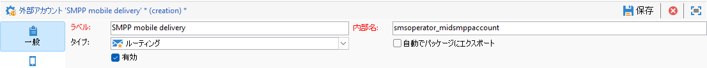

1. アカウントタイプを「**ルーティング**」、チャネルを「**モバイル (SMS)**」、配信モードを「**一括配信**」にそれぞれ設定します。

   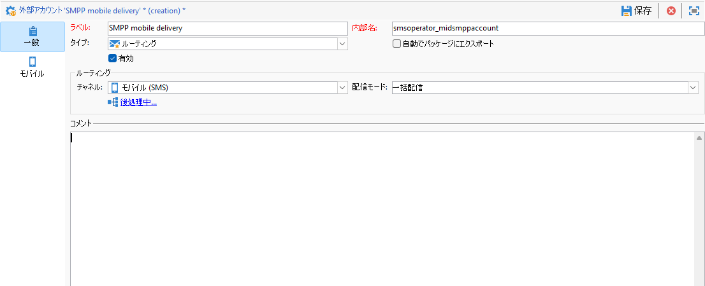

1. 「**[!UICONTROL 有効]**」ボックスをオンにします。

1. 「**[!UICONTROL モバイル]**」タブで、**[!UICONTROL コネクタ]**&#x200B;ドロップダウンリストから「**[!UICONTROL 拡張された汎用 SMPP]**」を選択します。

   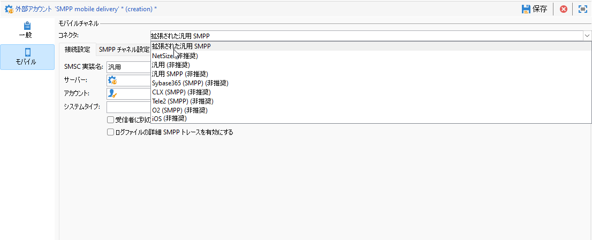

1. 「**[!UICONTROL ログファイルの詳細 SMPP トレースを有効にする]**」オプションを使用すると、ログファイル内のすべての SMPP トラフィックをダンプできます。コネクタのトラブルシューティングやプロバイダー側が確認できるトラフィックとの比較を行うには、このオプションを有効にする必要があります。

1. 「**[!UICONTROL 接続設定]**」タブで各種の外部アカウントフィールドを入力する方法については、SMS サービスプロバイダーにお問い合わせください。

   また、「**[!UICONTROL SMSC 実装名]**」フィールドに入力する値については、選択したプロバイダーにお問い合わせください。

   MTA の子ごとのプロバイダーへの接続数を指定できます。デフォルトでは 1 に設定されています。

1. デフォルトでは、SMS の文字数は GSM 標準に準じています。

   GSM エンコードを使用する SMS メッセージは 160 文字以内に制限されています。複数の部分に分けて送信されるメッセージの場合は、SMS 1 件につき 153 文字以内です。

   >[!NOTE]
   >
   >2 文字としてカウントされる文字もあります（中括弧、角括弧、ユーロ記号など）。
   >
   >使用可能な GSM 文字のリストについては、[この節](sms-set-up.md#about-character-transliteration)を参照してください。

   また、対応するチェックボックスをオンにして、文字の表記変換を許可することもできます。

   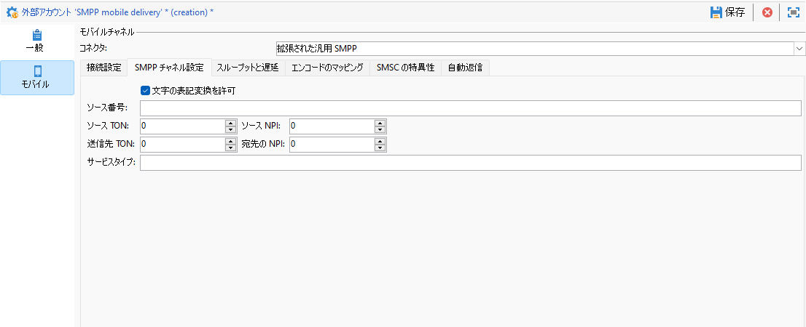

1. 「**[!UICONTROL スループットと遅延]**」タブでは、送信メッセージの最大スループット（「MT」：モバイル終了）を 1 秒あたりの MT として指定できます。該当するフィールドに「0」と入力した場合、スループットは無制限となります。

   期間を示すどのフィールドでも、値は秒単位で入力する必要があります。

1. 「**[!UICONTROL エンコードのマッピング]**」タブでは、エンコードを定義できます。

   詳しくは、[この節](sms-set-up.md#about-text-encodings)を参照してください。

1. デフォルトでは、「**[!UICONTROL SMSC 特異性]**」タブの「**[!UICONTROL 完全な電話番号を送信]**」オプションは無効になっています。SMPP プロトコルに準拠し、数字のみを SMS プロバイダー（SMSC）のサーバーに送信する場合は、このオプションを有効にしないでください。

   ただし、特定のプロバイダーで「+」がプレフィックスとして必要な場合は、プロバイダーにお問い合わせください。必要に応じて、このオプションを有効にするようプロバイダーから指示があります。

   「**[!UICONTROL SMPP 経由での TLS を有効化]**」チェックボックスを使用すると、SMPP トラフィックを暗号化することができます。詳しくは、この [ページ](sms-protocol.md)を参照してください。

1. **[!UICONTROL 拡張された汎用 SMPP]** コネクタを設定している場合は、自動応答を設定できます。

   詳しくは、[この節](sms-set-up.md#automatic-reply)を参照してください。

## 配信テンプレートの変更 {#changing-the-delivery-template}

Adobe Campaign には、**[!UICONTROL リソース／テンプレート／配信テンプレート]**&#x200B;ノードにモバイル配信テンプレートが用意されています。詳しくは、[テンプレートについて](about-templates.md)の節を参照してください。

SMS チャネル経由でメッセージを送信するには、チャネルコネクタへの参照を含むテンプレートを作成する必要があります。

ネイティブ配信テンプレートを保持しておくために、テンプレートのコピーを作成してから設定することをお勧めします。

次の例では、以前に作成した SMPP アカウントを使用してメッセージの配信を簡単にするテンプレートを生成します。手順は次のとおりです。

1. ツリーの&#x200B;**[!UICONTROL リソース]**／**[!UICONTROL テンプレート]**／**[!UICONTROL 配信テンプレート]**&#x200B;ノードで、「**[!UICONTROL モバイルに送信]**」テンプレートを右クリックし、「**[!UICONTROL 複製]**」を選択します。

   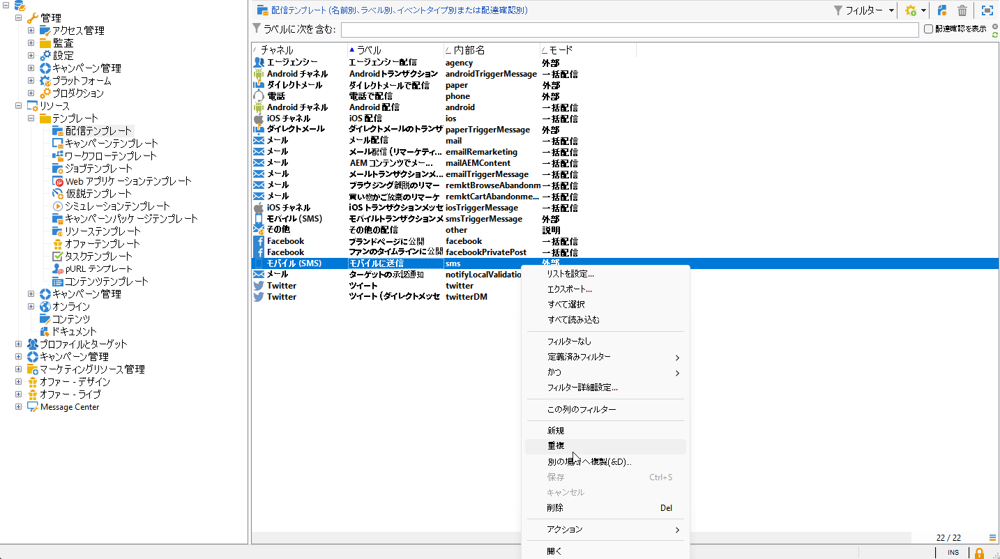

1. テンプレートのラベルを変更します（例：**モバイルに送信済み（SMPP）**）。

   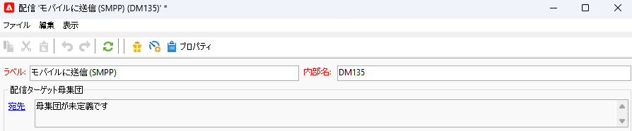

1. 「**[!UICONTROL プロパティ]**」をクリックします。

1. 「**[!UICONTROL 一般]**」タブで、[マーケティングサーバーでの SMS 外部アカウントの作成](#create-accound-mkt)の節で作成した外部アカウントに対応するルーティングモードを選択します。

   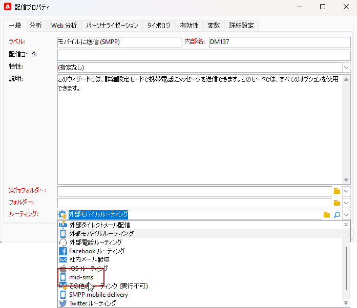

1. 「**[!UICONTROL 保存]**」をクリックし、テンプレートを作成します。

   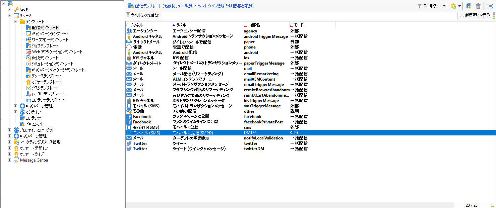

これで、SMS 経由で配信できる外部アカウントと配信テンプレートを用意できました。

## 関連トピック {#related-topics}

* [SMS 文字の表記変換](sms-set-up.md#about-character-transliteration)
* [テキストエンコーディング](sms-set-up.md#about-text-encodings)
* [自動返信](sms-set-up.md#automatic-reply)
