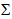
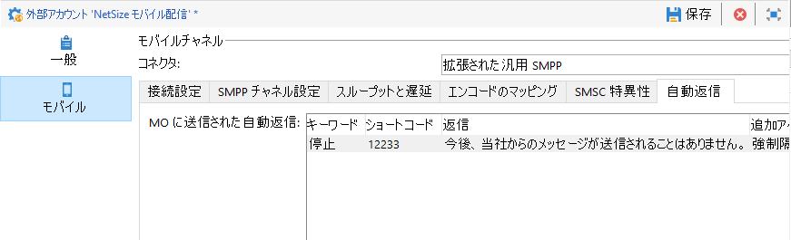
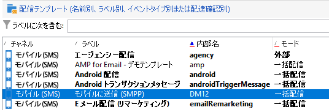

# SMSチャネルのセットアップ{#setting-up-sms-channel}

携帯電話に送信するには、次が必要です。

1. コネクタとメッセージのタイプを指定する外部アカウント。

   レガシーコネクタは非推奨になりました。 非推奨（廃止予定）の機能は引き続き使用できますが、それ以上の機能強化やサポートはおこなわれません。詳しくは、[このページ](../../rn/using/deprecated-features.md)を参照してください。

1. 使用する外部アカウントへの参照を含んだ配信テンプレート。

## SMPP外部アカウントの作成{#creating-an-smpp-external-account}

携帯電話に SMS を送信するには、まず SMPP 外部アカウントを作成する必要があります。
SMSのプロトコルと設定の詳細については、[ページ](../../delivery/using/sms-protocol.md)を参照してください。

これをおこなうには、以下の手順に従います。

1. ツリーの&#x200B;**[!UICONTROL プラットフォーム]**／**[!UICONTROL 外部アカウント]**&#x200B;ノードで、**[!UICONTROL 新規]**&#x200B;アイコンをクリックします。
1. アカウントタイプを「**ルーティング**」、チャネルを「**モバイル (SMS)**」、配信モードを「**一括配信**」にそれぞれ設定します。

   

1. 「**[!UICONTROL 有効]**」ボックスをオンにします。
1. 「**[!UICONTROL モバイル]**」タブで、**[!UICONTROL コネクタ]**&#x200B;ドロップダウンリストから「**[!UICONTROL 拡張された汎用 SMPP]**」を選択します。

   

   >[!CAUTION]
   >
   > リリース 20.2 より、従来のコネクタは廃止され、サポートされていません。**[!UICONTROL 拡張された汎用 SMPP]** コネクタの使用をお勧めします。推奨コネクタに移行する方法について詳しくは、この[ページ](../../delivery/using/unsupported-connector-migration.md)を参照してください。

1. 「**[!UICONTROL ログファイルの詳細 SMPP トレースを有効にする]**」オプションを使用すると、ログファイル内のすべての SMPP トラフィックをダンプできます。コネクタのトラブルシューティングやプロバイダー側が確認できるトラフィックとの比較をおこなうには、このオプションを有効にする必要があります。

1. 「**[!UICONTROL 接続設定]**」タブで各種の外部アカウントフィールドを入力する方法については、SMS サービスプロバイダーにお問い合わせください。

   また、「**[!UICONTROL SMSC 実装名]**」フィールドに入力する値については、選択したプロバイダーにお問い合わせください。

   MTA の子ごとのプロバイダーへの接続数を指定できます。デフォルトでは 1 に設定されています。

1. デフォルトでは、SMS の文字数は GSM 標準に準じています。

   GSM エンコードを使用する SMS メッセージは 160 文字以内に制限されています。複数の部分に分けて送信されるメッセージの場合は、SMS 1 件につき 153 文字以内です。

   >[!NOTE]
   >
   >2 文字としてカウントされる文字もあります（中括弧、角括弧、ユーロ記号など）。
   >
   >使用可能な GSM 文字の一覧については、下記を参照してください。

   必要に応じて、文字の表記変換をチェックボックスで指定できます。

   

   詳しくは、[この節](#about-character-transliteration)を参照してください。

1. 「**[!UICONTROL スループットと遅延]**」タブでは、送信メッセージの最大スループット（「MT」：モバイル終了）を 1 秒あたりの MT として指定できます。該当するフィールドに「0」と入力した場合、スループットは無制限となります。

   期間を示すどのフィールドでも、値は秒単位で入力する必要があります。

1. 「**[!UICONTROL エンコードのマッピング]**」タブでは、エンコードを定義できます。

   詳しくは、[この節](#about-text-encodings)を参照してください。

1. デフォルトでは、「**[!UICONTROL SMSC 特異性]**」タブの「**[!UICONTROL 完全な電話番号を送信]**」オプションは無効になっています。SMPP プロトコルに準拠し、数字のみを SMS プロバイダー（SMSC）のサーバーに送信する場合は、このオプションを有効にしないでください。

   ただし、特定のプロバイダーで「+」がプレフィックスとして必要な場合は、プロバイダーにお問い合わせください。必要に応じて、このオプションを有効にするようプロバイダーから指示があります。

   「**[!UICONTROL SMPP 経由での TLS を有効化]**」チェックボックスを使用すると、SMPP トラフィックを暗号化することができます。詳しくは、この[ページ](../../delivery/using/sms-protocol.md)を参照してください。

1. **[!UICONTROL 拡張された汎用 SMPP]** コネクタを設定している場合は、自動応答を設定できます。

   詳しくは、[この節](#automatic-reply)を参照してください。

## SMS文字変換{#about-character-transliteration}

文字の表記変換は、「**[!UICONTROL モバイル]**」タブの SMPP モバイル配信外部アカウントで設定できます。

表記変換では、SMS の特定の文字が GSM 標準に準じていない場合に、別の文字に置き換えられます。

* 表記変換が&#x200B;**[!UICONTROL 許可されている]**&#x200B;場合、標準に準じていない文字はメッセージの送信時に GSM 文字に置き換えられます。例えば、「ë」は「e」に置き換えられます。そのため、メッセージは若干改変されますが、文字制限は同じです。
* 表記変換が&#x200B;**[!UICONTROL 許可されていない]**&#x200B;場合、標準に準じていない文字があるメッセージはバイナリフォーマット（Unicode）で送信されます。そのため、すべての文字がそのまま送信されます。ただし、Unicode を使用する SMS メッセージは 70 文字以内に制限されています。複数の部分に分けて送信されるメッセージの場合は、SMS 1 件につき 67 文字以内です。文字数が上限を超えると、メッセージは複数に分かれて送信されますが、追加料金が発生する場合があります。

>[!IMPORTANT]
>
>パーソナライゼーションフィールドを SMS メッセージのコンテンツに入れると、GSM エンコードに対応していない文字が含まれる場合があります。

デフォルトでは、文字の表記変換は無効です。SMS メッセージのすべての文字をそのまま送信する場合（例えば、固有名詞が改変されないようにする場合）、このオプションは無効にしておくことをお勧めします。

ただし、SMS メッセージに Unicode メッセージ用の文字が多数含まれる場合、このオプションを有効にしてメッセージ送信のコストを抑えることもできます。

下記の表では、GSM 標準に準じた文字を紹介します。メッセージ本文に、ここで紹介されていない文字が含まれている場合、メッセージ全体がバイナリフォーマット（Unicode）に変換され、文字数が 70 文字以内に制限されます。

**基本的な文字**

<table> 
 <tbody> 
  <tr> 
   <td> @ </td> 
   <td>  </td> 
   <td> SP </td> 
   <td> 0 </td> 
   <td> ¡ </td> 
   <td> P </td> 
   <td> ¿ </td> 
   <td> p </td> 
  </tr> 
  <tr> 
   <td> £ </td> 
   <td> _ </td> 
   <td> ! </td> 
   <td> 1 </td> 
   <td> A </td> 
   <td> Q </td> 
   <td> a </td> 
   <td> q </td> 
  </tr> 
  <tr> 
   <td> $ </td> 
   <td>  </td> 
   <td> " </td> 
   <td> 2 </td> 
   <td> B </td> 
   <td> R </td> 
   <td> b </td> 
   <td> r </td> 
  </tr> 
  <tr> 
   <td> ¥ </td> 
   <td>  </td> 
   <td> # </td> 
   <td> 3 </td> 
   <td> C </td> 
   <td> S </td> 
   <td> c </td> 
   <td> s </td> 
  </tr> 
  <tr> 
   <td> è </td> 
   <td>  </td> 
   <td> ¤ </td> 
   <td> 4 </td> 
   <td> D </td> 
   <td> T </td> 
   <td> d </td> 
   <td> t </td> 
  </tr> 
  <tr> 
   <td> é </td> 
   <td>  </td> 
   <td> % </td> 
   <td> 5 </td> 
   <td> E </td> 
   <td> U </td> 
   <td> e </td> 
   <td> u </td> 
  </tr> 
  <tr> 
   <td> ù </td> 
   <td>  </td> 
   <td> &amp; </td> 
   <td> 6 </td> 
   <td> F </td> 
   <td> V </td> 
   <td> f </td> 
   <td> v </td> 
  </tr> 
  <tr> 
   <td> ì </td> 
   <td>  </td> 
   <td> ' </td> 
   <td> 7 </td> 
   <td> G </td> 
   <td> W </td> 
   <td> g </td> 
   <td> w </td> 
  </tr> 
  <tr> 
   <td> ò </td> 
   <td>  </td> 
   <td> ( </td> 
   <td> 8 </td> 
   <td> H </td> 
   <td> X </td> 
   <td> h </td> 
   <td> x </td> 
  </tr> 
  <tr> 
   <td> Ç </td> 
   <td>  </td> 
   <td> ) </td> 
   <td> 9 </td> 
   <td> I </td> 
   <td> Y </td> 
   <td> i </td> 
   <td> y </td> 
  </tr> 
  <tr> 
   <td> LF </td> 
   <td>  </td> 
   <td> * </td> 
   <td> : </td> 
   <td> J </td> 
   <td> Z </td> 
   <td> j </td> 
   <td> z </td> 
  </tr> 
  <tr> 
   <td> Ø </td> 
   <td> ESC </td> 
   <td> + </td> 
   <td> ; </td> 
   <td> K </td> 
   <td> Ä </td> 
   <td> k </td> 
   <td> ä </td> 
  </tr> 
  <tr> 
   <td> ø </td> 
   <td> Æ </td> 
   <td> , </td> 
   <td> &lt; </td> 
   <td> L </td> 
   <td> Ö </td> 
   <td> l </td> 
   <td> ö </td> 
  </tr> 
  <tr> 
   <td> CR </td> 
   <td> æ </td> 
   <td> - </td> 
   <td> = </td> 
   <td> M </td> 
   <td> Ñ </td> 
   <td> m </td> 
   <td> ñ </td> 
  </tr> 
  <tr> 
   <td> Å </td> 
   <td> ß </td> 
   <td> . </td> 
   <td> &gt; </td> 
   <td> N </td> 
   <td> Ü </td> 
   <td> n </td> 
   <td> ü </td> 
  </tr> 
  <tr> 
   <td> å </td> 
   <td> É </td> 
   <td> / </td> 
   <td> ? </td> 
   <td> O </td> 
   <td> § </td> 
   <td> o </td> 
   <td> à </td> 
  </tr> 
 </tbody> 
</table>

SP：スペース

ESC：エスケープ

LF：ラインフィード

CR：キャリッジリターン

**高度な文字（2 回カウント）**

^ { } `[ ~ ]` | €

## テキストのエンコードについて {#about-text-encodings}

Adobe Campaign では、SMS メッセージの送信時に 1 つまたは複数のテキストエンコードを使用できます。エンコードごとに独自の文字セットがあり、SMS メッセージに入力できる文字数もそれぞれ異なります。

新しい SMPP モバイル配信外部アカウントを設定する場合は、「**[!UICONTROL Mobile]**」タブで&#x200B;**[!UICONTROL エンコードのマッピング]**&#x200B;を定義できます。「**[!UICONTROL data_coding]**」フィールドには、Adobe Campaign が SMSC に使用するエンコードが示されます。

>[!NOTE]
>
>**data_coding** の値と実際に使用されているエンコードの間のマッピングは標準化されています。しかし、一部の SMSC には独自のマッピングがあり、その場合、**Adobe Campaign** 管理者がこのマッピングを宣言する必要があります。詳しくは、プロバイダーにお問い合わせください。

必要に応じて、**data_codings** を宣言してエンコードを強制適用できます。この場合、表のエンコードの 1 つを指定します。

* エンコードのマッピングが定義されていない場合、コネクタは一般的な動作をおこないます。

   * **data_coding = 0** を設定して、GSM エンコードの使用を試行します。
   * GSM エンコードが失敗した場合は、**data_coding = 8** を設定して、**UCS2** エンコードの使用を試行します。

* 使用するエンコードと、リンクされた **[!UICONTROL data_coding]** フィールド値を指定した場合、Adobe Campaign はリストの最初のエンコードを使用します。最初のエンコードが使用できない場合、その次のエンコードを使用します。

>[!IMPORTANT]
>
>宣言の順序は重要です。**コスト**&#x200B;が少ない順にリストを設定し、SMS メッセージになるべく多くの文字を使用できるようにすることをお勧めします。
>
>使用するエンコードのみを宣言してください。SMSC から提供されているエンコードの中に、使用目的に該当しないものがあれば、それはリストで宣言しないでください。

## 自動返信 {#automatic-reply}

拡張された汎用 SMPP コネクタを設定している場合は、自動返信を設定できます。

購読者が、Adobe Campaign により自分に送信された SMS メッセージに返信し、その返信メッセージに「STOP」などのキーワードが含まれている場合、「**[!UICONTROL MO に自動返信が送信されました]**」セクションで自動送信メッセージを設定できます。

>[!NOTE]
>
>キーワードは大文字と小文字が区別されません。

キーワードごとにショートコードを指定します。これは、通常は配信の送信に使用する数字で、送信者名を表します。その後、購読者に送信するメッセージを入力します。

自動応答には、「**[!UICONTROL 強制隔離に送信]**」または「**[!UICONTROL 強制隔離から削除]**」のいずれかのアクションをリンクすることもできます。例えば、受信者が「STOP」というキーワードを送信した場合、その受信者には自動的に購読解除の確認が送信され、さらにその受信者が強制隔離に送信されます。

**[!UICONTROL 強制隔離から削除]**&#x200B;アクションを自動返信にリンクした場合、対応するキーワードを送信した受信者は自動的に強制隔離から削除されます。

受信者は、**[!UICONTROL 管理]**／**[!UICONTROL キャンペーン管理]**／**[!UICONTROL 配信不能件数の管理]**&#x200B;メニューから利用できる&#x200B;**[!UICONTROL 配信不能件数およびアドレス]**&#x200B;テーブルにリストされます。

* ショートコードに関わらず同じ返信を送信する場合は、「**[!UICONTROL ショートコード]**」列を空白のままにします。
* キーワードに関わらず同じ返信を送信する場合は、「**[!UICONTROL キーワード]**」列を空白のままにします。
* 返信せずにアクションを実行する場合は、「**[!UICONTROL 回答]**」列を空白のままにします。これにより、例えば、「STOP」以外のメッセージを送信したユーザーを強制隔離から削除できます。

複数の外部アカウントが同じプロバイダーアカウントで拡張された汎用 SMPP コネクタを使用している場合、ショートコードへの返信がどの外部アカウント接続で受信されるかわからない、といった問題が発生する可能性があります。これにより、送信された自動返信が予期されるメッセージではない可能性があります。こうした問題を回避するには、使用しているプロバイダーに応じて次のいずれかのソリューションを適用します。

* 各外部アカウントに対して 1 つのプロバイダーアカウントを作成
* **[!UICONTROL モバイル]**／「**[!UICONTROL 接続設定]**」タブの「**[!UICONTROL システムタイプ]**」フィールドを使用して、各ショートコードを区別各アカウントに異なる値を提供するようプロバイダーに依頼

   

拡張汎用SMPPコネクタを使用した外部アカウントの設定手順については、「[SMPP外部アカウントの作成](#creating-an-smpp-external-account)」の節を参照してください。

## 配信テンプレートを変更{#changing-the-delivery-template}

Adobe Campaign には、モバイルへの配信用テンプレートが用意されています。このテンプレートは&#x200B;**[!UICONTROL リソース／テンプレート／配信テンプレート]**&#x200B;ノードにあります。詳しくは、[テンプレートについて](../../delivery/using/about-templates.md)の節を参照してください。

SMS チャネルでの配信の場合は、使用するチャネルコネクタへの参照を含んだテンプレートを作成する必要があります。

ネイティブ配信テンプレートを保持しておくために、テンプレートのコピーを作成してから設定することをお勧めします。

次の例では、既に有効化した SMPP アカウントを使用してメッセージを配信するテンプレートを作成します。手順は次のとおりです。

1. 「**[!UICONTROL 配信テンプレート]**」ノードを表示します。
1. 「**[!UICONTROL モバイルに送信]**」テンプレートを右クリックし、「**[!UICONTROL 複製]**」を選択します。

   

1. テンプレートのラベルを変更します（例：**モバイルに送信済み（SMPP）**）。

   

1. 「**[!UICONTROL プロパティ]**」をクリックします。
1. 「**[!UICONTROL 一般]**」タブで、前の手順で作成した外部アカウントに対応するルーティングモードを選択します。

   

1. 「**[!UICONTROL 保存]**」をクリックし、テンプレートを作成します。

   

これで、SMS 経由で配信できる外部アカウントと配信テンプレートを用意できました。
