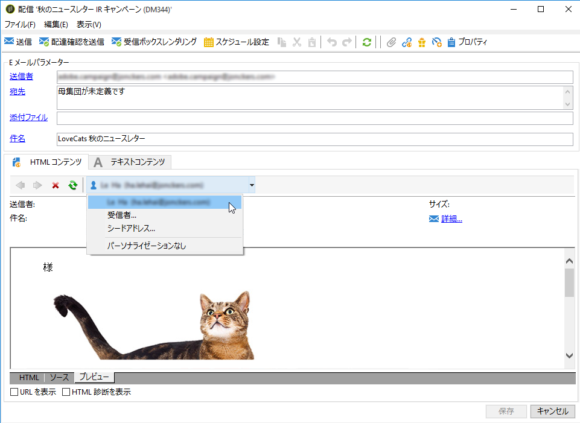
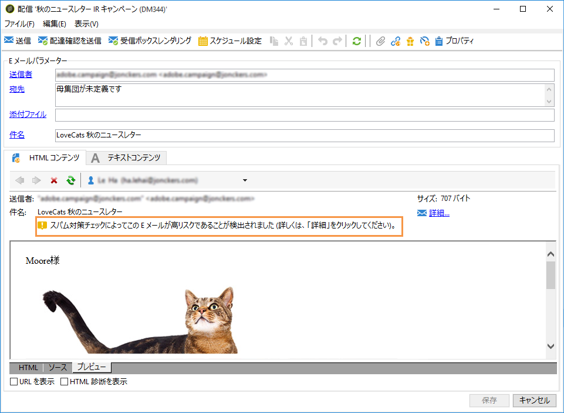
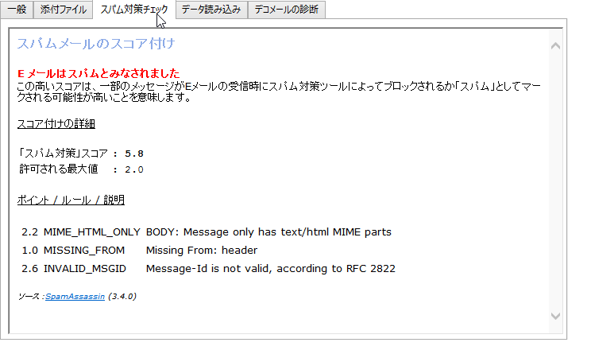

# SpamAssassin{#spamassassin}

Adobe Campaign は、メールスパムフィルタリングに使用されるサードパーティのサービスである、[SpamAssassin](https://spamassassin.apache.org) と連携するように設定できます。 これを使用すると、メールを採点して、受信時に使用されるスパム対策ツールによってメッセージがスパムとみなされるリスクがあるかどうかを判断できます。

SpamAssassin は、次のような様々なスパム検出技法を活用します。

* DNS ベースおよびファジーチェックサムベースのスパム検出
* ベイジアンフィルタリング
* 外部プログラム
* ブロックリスト
* オンラインデータベース

>[!NOTE]
>
>SpamAssassin は、Adobe Campaign アプリケーションサーバーにインストールして、設定する必要があります。 詳しくは、[この節](../../installation/using/configuring-spamassassin.md)を参照してください。
>
>要素がスパムかどうかを左右するルールは、SpamAssassin で管理され、権限を持つ管理者が編集できます。

## Campaign での SpamAssassin の使用 {#using-spamassassin}

メール配信を作成して、そのコンテンツを定義したら、以下の手順に従って、リスクを評価します。

配信の作成およびデザインについて詳しくは、[この節](about-email-channel.md)を参照してください。

1. 「**[!UICONTROL プレビュー]**」タブに移動します。
1. 配信をプレビューする受信者を選択します。

   

   >[!NOTE]
   >
   >受信者を選択しないと、スパム対策チェックは実行できません。

1. テストの結果が警告メッセージとして表示されます。 高レベルのリスクが検出された場合、次の警告メッセージが表示されます。

   

1. 警告の隣にある&#x200B;**[!UICONTROL 詳細...]** リンクをクリックします。
1. 「**[!UICONTROL スパム対策チェック]**」タブを選択します。
1. 「**[!UICONTROL ポイント / ルール / 説明]**」セクションに移動して、このリスクの原因を表示します。

   

>[!NOTE]
>
>「**[!UICONTROL スパム対策チェック]**」をクリックするたびに、SpamAssassin サービスが呼び出され、スパム対策検出のためにメッセージが再分析されます。 コンテンツを変更してから、スパム対策分析を再実行するようにしてください。
