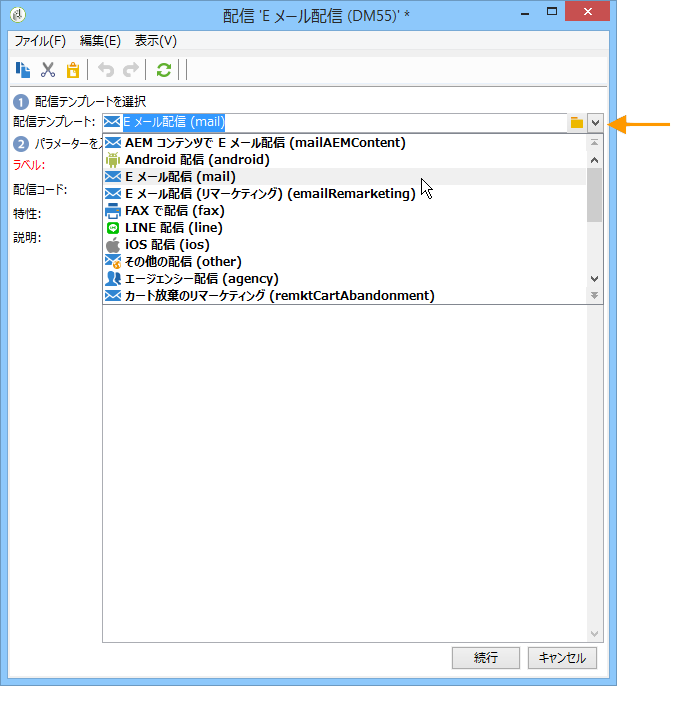
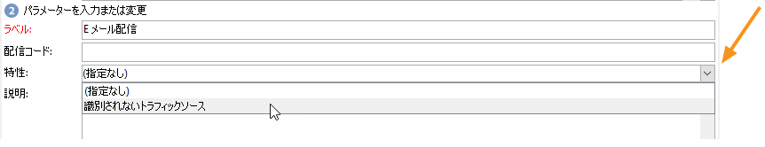

# 配信の作成と識別 {#create-and-identify-the-delivery}

## 配信の作成 {#creating-the-delivery}

配信は、概要から、または&#x200B;**[!UICONTROL 作成／配信]**&#x200B;メニューから作成できます。

配信を作成するには、配信リストの上にある「**[!UICONTROL 作成]**」をクリックします。新しい配信を作成する際には、使用する配信チャネルを指定する必要があります。そのためには、「**[!UICONTROL 配信テンプレート]**」フィールドのドロップダウンリストから適切な配信テンプレートを選択します。

ダイレクトメール、E メール、FAX、電話、モバイルチャネル（SMS）、Facebook、Twitter など、インストールしたすべてのチャネルに、それぞれのデフォルトテンプレートが用意されています。

>[!NOTE]
>
>リストに表示されるチャネルの種類は、ライセンス契約の内容に応じて異なります。

ニーズに合わせて具体的なパラメーターをあらかじめ設定しておきたい場合は、新しい配信テンプレートを作成できます。テンプレートについて詳しくは、[この節](../../delivery/using/about-templates.md)を参照してください。

## 配信の識別 {#identifying-the-delivery}

配信を識別するには、パラメーターを設定する必要があります。手順は次のとおりです。

1. 「**[!UICONTROL ラベル]**」フィールドに配信の名前を入力します。

   また、配信には配信コードを割り当てることもできます。配信名と配信コードは、配信リストに表示されますが、受信者からは見えません。

1. 「**[!UICONTROL 説明]**」フィールドに説明を追加します。
1. 関連するフィールドで配信の特性を選択します。この情報は配信トラッキングに役立ちます。この基準に基づいて配信リストの表示をフィルタリングしたり、クエリの作成にこの選択基準を使用したりできます。

   

1. 「**[!UICONTROL 続行]**」をクリックすると、入力した情報が確定され、メッセージ設定ウィンドウが表示されます。

配信コンテンツの設定準備が整いました。配信コンテンツ定義は、各チャネル専用です。詳しくは、該当する節を参照してください。

* [E メールコンテンツの定義](../../delivery/using/defining-the-email-content.md)
* [SMS コンテンツの定義](../../delivery/using/sms-channel.md#defining-the-sms-content)
* [ダイレクトメールコンテンツの定義](../../delivery/using/defining-the-direct-mail-content.md)
* [プッシュ通知](../../delivery/using/about-mobile-app-channel.md)

