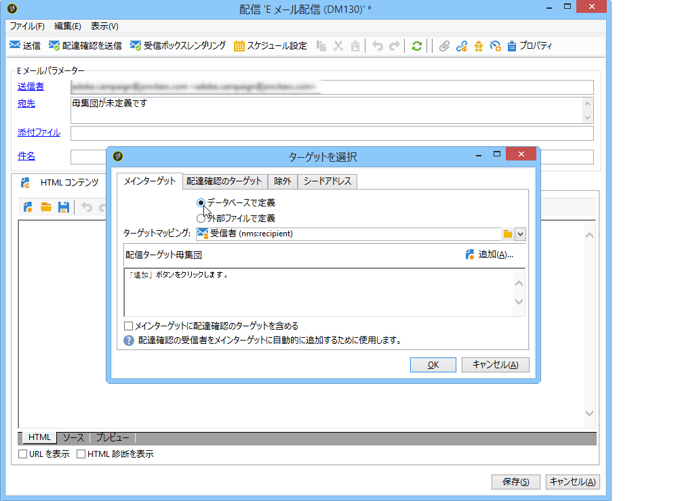

# ターゲット母集団の定義 {#defining-the-target-population}

## ターゲット母集団について {#about-target-populations}

各配信に対して、複数のタイプのターゲット母集団を定義できます。 選択方法の詳細については、以下の節を参照してください。

* **配信のメイン受信者**。 [詳細を表示](../../delivery/using/steps-defining-the-target-population.md#selecting-the-main-target).
* **検証サイクルを設定するため**、証明メッセージの受信者。 [詳細を表示](../../delivery/using/steps-defining-the-target-population.md#defining-a-specific-proof-target).

また、シードアドレスや制御グ [ループを定義す](../../delivery/using/about-seed-addresses.md)るこ [ともできます](../../campaign/using/marketing-campaign-deliveries.md#defining-a-control-group)。 配信がマーケティングキャンペーンに含まれる場合。

## 配信のメイン受信者の選択 {#selecting-the-main-target}

ほとんどの場合、メインターゲットは Campaign データベースから抽出されます（デフォルトモード）。

受信者は、外部ファイルに保存することもできます。The configuration of this type of delivery is presented in [Selecting external recipients](../../delivery/using/steps-defining-the-target-population.md#selecting-external-recipients).

作成する配信の受信者を選択するには、次の手順に従います。

1. リンクをクリック **[!UICONTROL To]** します。
1. 受信者の情報がデータベースに格納されている場合は、第 1 のオプションを選択します。

   

1. Select the target mapping in the **[!UICONTROL Target mapping]** drop-down list. Adobe Campaign default target mapping is **[!UICONTROL Recipients]**.

   他のターゲットマッピングも使用でき、一部のターゲットマッピングは特定の設定に関連付けることができます。ターゲット・マッピングの詳細は、「ターゲット・マッピ [ングの選択」を参照してくださ](../../delivery/using/selecting-a-target-mapping.md)い。

1. Click the **[!UICONTROL Add]** button to define restriction filters.

   次に、適用するフィルターのタイプを選択します。

   

   受信者の選択は、データベース内に定義されているターゲティングのタイプを使用しておこなうことができます。To use a target type, select it and click **[!UICONTROL Next]**. For each target, you can display the recipients concerned by clicking the **[!UICONTROL Preview]** tab. For certain types of target, the **[!UICONTROL Refine target]** button lets you combine several targeting criteria.

   デフォルトで用意されているターゲットタイプは次のとおりです。

   * **[!UICONTROL Filtering conditions]** :このオプションを使用すると、クエリーを定義し、結果を表示できます。 クエリの定義方法については、[この節](../../platform/using/creating-filters.md#creating-an-advanced-filter)を参照してください。
   * **[!UICONTROL Subscribers of an information service]** :このオプションを使用すると、受信者が作成する配信のターゲットにするニュースレターを購読する必要があります。

      

   * **[!UICONTROL Recipients of a delivery]** :このオプションを使用すると、既存の配信の受信者をターゲット条件として定義できます。 その後、リストから配信を選択する必要があります。

      

   * **[!UICONTROL Delivery recipients belonging to a folder]** :このオプションを使用すると、配信フォルダーを選択し、そのフォルダー内の配信の受信者をターゲットに設定できます。

      

      受信者の行動を、次のようにドロップダウンリストから選択することでフィルタリングできます。

      

      >[!NOTE]
      >
      >The **[!UICONTROL Include sub-folders]** option also lets you target the deliveries contained in folders located in the tree structure below the selected node.

   * **[!UICONTROL Recipients included in a folder]** :このオプションを使用すると、ツリーの特定のフォルダーに含まれるプロファイルをターゲットに設定できます。
   * **[!UICONTROL A recipient]** :このオプションを使用すると、データベース内のプロファイルから特定の受信者を選択できます。
   * **[!UICONTROL A list of recipients]** :このオプションを使用すると、受信者のリストをターゲットに設定できます。 リストについて詳しくは、[この節](../../platform/using/creating-and-managing-lists.md)を参照してください。
   * **[!UICONTROL User filters]** :このオプションを使用すると、事前に設定されたフィルターにアクセスして、データベース内のプロファイルのフィルター条件として使用できます。 事前設定済みフィルターについては、[この節](../../platform/using/creating-filters.md#saving-a-filter)を参照してください。
   * このオプションを **[!UICONTROL Exclude recipients corresponding to this segment]** 使用すると、定義されたターゲット条件を満たさない受信者をターゲットに設定できます。 これを使用するには、適切なボックスを選択し、事前に定義した、該当するプロファイルを除外するためのターゲティングを適用します。

      

1. Enter a name for this targeting in the **[!UICONTROL Label]** field. デフォルトでは、ラベルは最初のターゲット条件のラベルと同じになります。組み合わせを指定する場合は、扱いやすいように明示的に名前を付けると便利です。
1. Click **[!UICONTROL Finish]** to validate the configured targeting.

   定義したターゲット条件は、メインターゲット設定タブの中央部セクションにまとめて表示されます。特定の条件をクリックすると、その内容（設定とプレビュー）が表示されます。条件を削除するには、ラベルの後にある「X」をクリックします。

   

### 外部受信者の選択 {#selecting-external-recipients}

配信は、データベースではなく外部ファイルに格納されている受信者宛てに送信することもできます。例えば、ここではテキストファイルからインポートした受信者に配信を送信します。

手順は次のとおりです。

1. Click the **[!UICONTROL To]** link to select the recipients of your delivery.
1. オプションを選 **[!UICONTROL Defined in an external file]** 択します。

   

1. デフォルトでは、受信者はデータベースにインポートされます。を選択する必要がありま **[!UICONTROL Target mapping]**&#x200B;す。 ターゲット・マッピングの詳細については、「ターゲット・マ [ッピングの選択」を参照してください。](../../delivery/using/selecting-a-target-mapping.md)

   また、を選択することもできま **[!UICONTROL Do not import the recipients into the database]**&#x200B;す。

1. When importing the recipients, click the **[!UICONTROL File format definition...]** link to select and configure the external file.

   データのインポートについて詳しくは、[この節](../../platform/using/importing-data.md#step-2---source-file-selection)を参照してください。

1. Click **[!UICONTROL Finish]** and configure your delivery as a standard delivery.

>[!CAUTION]
>
>E メール配信用のメッセージコンテンツを定義する際に、ミラーページへのリンクを含めないように注意してください。この配信モードでは、ミラーページを生成できません。

### 除外設定の設定 {#customizing-exclusion-settings}

アドレスエラーと品質評価の情報はサービスプロバイダー（IAP）から提供されます。この情報は、配信アクションの後、サービスプロバイダーから返されるファイルに基づき、受信者プロファイルに自動的に反映されます。また、プロファイル上では読み取り専用情報として参照できます。

一定回数にわたって連続してエラーが発生したアドレスや、このウィンドウで指定したしきい値を下回る低い品質評価が付けられたアドレスについては、配信から除外できます。また、データが何も返されない未適合アドレスを承認するかどうかを選択できます。

>[!NOTE]
>
>ダイレクトメール配信で、2 人の受信者の姓名、郵便番号、市区町村が同じである場合、重複エラーが発生し、重複分が対象から除外されます。

The **[!UICONTROL Exclusions]** tab is used to limit the number of messages.

>[!NOTE]
>
>デフォルトのパラメーターを使用することをお勧めしますが、ニーズに応じて設定を適応させることができます。ただし、誤用やエラーを避けるために、これらのオプションはエキスパートユーザーのみが変更してください。

Click the **[!UICONTROL Edit...]** link to modify the default configuration.

次のオプションを使用できます。

* **[!UICONTROL Exclude duplicate addresses during delivery]**. このオプションは、デフォルトでアクティブに設定され、配信中に重複した E メールアドレスを排除できます。適用される除外方法は、Adobe Campaign の使用方法と、データベースに格納されているデータのタイプによって異なる場合があります。

   このオプションのデフォルト値は、配信テンプレートごとに設定可能です。

   次に例を示します。

   * ニュースレターの配信、または電子文書の配信：重複アドレスが自然に発生するような性質のデータである場合を除き、重複アドレスを除外しない設定にします。例えば、1 つの E メールアドレスを共用しているカップルが、同じニュースレターをそれぞれ購読している場合、それぞれの宛名でパーソナライズされた 2 通の E メールメッセージを受け取るのが自然だと考えられます。この場合、このオプションはオフにできます。
   * マーケティングキャンペーンの配信：同じ受信者に多数のメッセージが送信されないようにするために、重複アドレスの除外は必要不可欠です。この場合、このオプションをオンにできます。

      If you unselect this option, you can access an additional option: **[!UICONTROL Keep duplicate records (same identifier)]**. これは、複数のターゲット条件を満たす受信者に対して配信を複数個送信することを許可するオプションです。

      

* **[!UICONTROL Exclude recipients who no longer want to be contacted]** (例：電子メールアドレスがブラックリストに登録されている受信者（「オプトアウト」）)。 E マーケティングのビジネス倫理を尊重し、E コマースを規制する法律を遵守するために、このオプションは必ずオンにしておいてください。
* **[!UICONTROL Exclude quarantined recipients]**. プロファイルに入力されているアドレスからの応答がないターゲットを除外します。このオプションは必ずオンにしておくことをお勧めします。

   >[!NOTE]
   >
   >検疫管理の詳細については、「検疫管理につい [て」を参照してください](../../delivery/using/understanding-quarantine-management.md)。

* **[!UICONTROL Limit delivery]** 指定された数のメッセージに対して 送信するメッセージの最大数を指定し、配信件数を限定します。指定されたメッセージの最大数よりもターゲットの規模が大きい場合は、ターゲットの中から送信先がランダムに選択されます。

### ターゲット母集団のサイズの縮小 {#reducing-the-size-of-the-target-population}

ターゲット母集団のサイズは縮小することもできます。To do this, specify the number of recipients to be exported in the **[!UICONTROL Requested quantity]** field.

## 校正メッセージの受信者の選択 {#selecting-the-proof-target}

配達確認は、配信をメインターゲットに送信する前にテストするための特別なメッセージです。配達確認受信者は、メッセージのフォームおよびコンテンツの両方を承認します。

配達確認のターゲットを選択するには、次の手順に従います。

1. リンクをクリック **[!UICONTROL To]** します。
1. タブをクリック **[!UICONTROL Target of the proofs]** します。
1. フィールドをク **[!UICONTROL Targeting mode]** リックして、適用する方法を選択します。 **[!UICONTROL Definition of a specific proof target]** 、、 **[!UICONTROL Substitution of the address]** 、ま **[!UICONTROL Seed addresses]** たは **[!UICONTROL Specific target and seed addresses]**。

>[!NOTE]
>
>通常は、配達確認ターゲットをメインターゲットにも追加します。To do this, select the appropriate option in the lower section of the **[!UICONTROL Main target]** tab.

## 特定の配達確認ターゲットの定義 {#defining-a-specific-proof-target}

When selecting the proof target, the **[!UICONTROL Definition of a specific proof target]** option lets you select the proof recipients from the profiles in the database.

Select this option to choose recipients using the **[!UICONTROL Add]** button, as in the case of defining the main target. See [Selecting the main target](../../delivery/using/steps-defining-the-target-population.md#selecting-the-main-target).

For more on proof sending, refer to [this section](../../delivery/using/steps-validating-the-delivery.md#sending-a-proof).

### 配達確認のアドレス置換の使用 {#using-address-substitution-in-proof}

Instead of selecting dedicated recipients in the database, you can use the **[!UICONTROL Substitution of the address]** option.

配信の受信者プロファイルを使用しますが、E メールアドレスを、配達確認受信用の 1 つまたは複数のアドレスで置き換えます。

このオプションを選択した場合は、置き換え設定用の特別なエディターを使用して配達確認用アドレスを入力します。

設定の手順は次のとおりです。

1. Click the **[!UICONTROL Add]** icon to define a substitution.
1. 使用する受信者アドレスを入力するか、リストから選択します。
1. Select the profile to use in the proof: save the **[!UICONTROL Random]** value in the **[!UICONTROL Profile to use]** column to use the data of any profile of the target in the proof.

   

1. Click the **[!UICONTROL Detail]** icon to select a profile from the main target, as in the following example:

   

   代用アドレスは、必要に応じていくつでも定義できます。

## 配達確認としてのシードアドレスの使用 {#using-seed-addresses-as-proof}

You can use **[!UICONTROL Seed addresses]** as target of the proofs: this option lets you use or import a list of existing seed addresses.

>[!NOTE]
>
>シードアドレスは、シードアドレスにつ [いてで示されます](../../delivery/using/about-seed-addresses.md)。

You can combine the definition of a specific proof target and the use of seed addresses using the **[!UICONTROL Specific target and Seed addresses]** option. 関連する設定は、異なる 2 つのサブタブで定義します。
