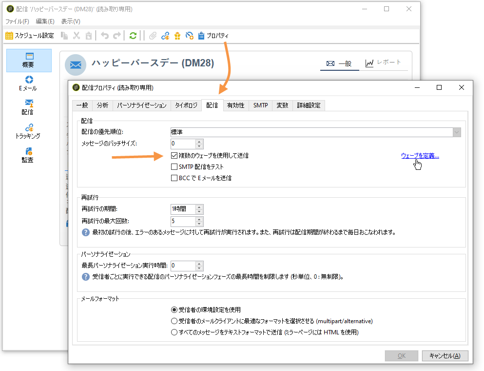

# 配信の設定と送信 {#configuring-and-sending-the-delivery}

>[!NOTE]
>
>配信のオーナーのみが配信を開始できます。In order for another operator (or operator group) to be able to start a delivery, you have to add them as reviewers in the **[!UICONTROL Delivery start:]** field.
>
>詳しくは、[この節](../../campaign/using/marketing-campaign-approval.md#selecting-reviewers)を参照してください。

## 追加のパラメーターの配信 {#delivery-additiona-parameters}

Before sending the delivery, you can define the sending parameters in the delivery properties, via the **[!UICONTROL Delivery]** tab.

* **[!UICONTROL Delivery priority]**:このオプションを使用すると、配信の優先順位（通常、高、低）を示すことで、配信の送信順序に影響を与えることができます。 これは、より緊急度の高い配信をそれ以外の配信よりも優先させるのに便利です。

* **[!UICONTROL Message batch quantity]**:このオプションを使用すると、同じXML配信パッケージ内でグループ化されるメッセージの数を定義できます。 パラメーターが0に設定されている場合、メッセージは自動的にグループ化されます。 The package size is defined by the calculation `<delivery size>/1024`, with a minimum of 8 and a maximum of 256 messages by package.

   >[!CAUTION]
   >
   >配信が重複した場合はパラメーターがリセットされます。

* **[!UICONTROL Send using multiple waves]**:この詳細については、「複数の波を使用 [した送信」を参照してください](#sending-using-multiple-waves)。

* **[!UICONTROL Test SMTP delivery]**:このオプションを使用すると、SMTP経由での配信の送信をテストできます。 配信は、SMTP サーバーに接続するところまで進められますが、送信されません。

   >[!NOTE]
   >
   >MTA を呼び出さない、ミッドソーシングを使用するインストールの場合、このオプションを使用することは望ましくありません。
   >
   >SMTP サーバーの設定について詳しくは、[この節](../../installation/using/configuring-campaign-server.md#personalizing-delivery-parameters)を参照してください。

* **[!UICONTROL Archive emails]**:このオプションを使用すると、BCC電子メールアドレスをメッセージターゲットに追加するだけで、BCC経由で外部システムに電子メールを保存できます。 For more on this, refer to [Archiving emails](../../delivery/using/sending-messages.md#archiving-emails).

配信が設定され、送信の準備が整ったら、配信分析を実行したことを確認 [します](../../delivery/using/steps-validating-the-delivery.md#analyzing-the-delivery)。 完了したら、をクリック **[!UICONTROL Confirm delivery]** して、メッセージの配信を開始します。

You can then close the delivery wizard and track the execution of the delivery from the **[!UICONTROL Delivery]** tab, accessible via the detail of this delivery or via the list of deliveries.

メッセージを送信した後は、配信を監視およびトラッキングできます。詳しくは、以下の節を参照してください。

* [配信の監視](../../delivery/using/monitoring-a-delivery.md)
* [配信エラーの理解](../../delivery/using/understanding-delivery-failures.md)
* [メッセージトラッキングについて](../../delivery/using/about-message-tracking.md)

## 配信送信のスケジュール設定 {#scheduling-the-delivery-sending}

配信をスケジュールしたり、母集団に対する営業頻度を管理して過剰な営業活動をしないようするために、メッセージの配信を遅らせることができます。

1. ボタンをクリ **[!UICONTROL Send]** ックし、オプションを選択 **[!UICONTROL Postpone delivery]** します。

1. Specify a start date in the **[!UICONTROL Contact date]** field.

1. その後、配信分析を開始し、配信の送信を確認できます。 ただし、配信の送信は、フィールドに指定された日付まで開始され **[!UICONTROL Contact date]** ません。

>[!CAUTION]
>
>分析を開始すると、定義したコンタクト日が固定されます。この日付を修正する場合は、修正内容が考慮されるように、分析を再度実行する必要があります。

配信リストには、配信がステータスと共に表示さ **[!UICONTROL Pending]** れます。

Scheduling can also be configured upstream via the **[!UICONTROL Scheduling]** button of the delivery.

これにより、配信を後の日付まで遅らせたり、暫定カレンダーに配信を保存したりできます。

* このオ **[!UICONTROL Schedule delivery (no automatic execution)]** プションを使用すると、配信の暫定分析をスケジュールできます。

   When this configuration is saved, the delivery changes to **[!UICONTROL Targeting pending]** status. 分析は指定した日付に開始されます。

* このオ **[!UICONTROL Schedule delivery (automatic execution on planned date)]** プションでは、配信日を指定できます。

   Click **[!UICONTROL Send]** and select **[!UICONTROL Postpone delivery]** then launch the analysis and confirm delivery. 分析が完了すると、配信ターゲットの準備ができた状態になり、メッセージは指定した日付が来ると自動的に送信されます。

日付と時刻は、作業しているオペレーターのタイムゾーンに基づいて表されます。The **[!UICONTROL Time zone]** drop-down list located below the contact date input field lets you automatically convert the entered date and time into the selected time zone.

例えば、ロンドン時間の 8:00 に配信を自動実行するスケジュールを設定すると、時間は選択したタイムゾーンに自動的に変換されます。

## 複数のウェーブを使用した送信 {#sending-using-multiple-waves}

負荷を分散するには、配信を複数のバッチに分割します。全体の配信を基準にしてバッチの数とその比率を設定します。

>[!NOTE]
>
>定義できるのは、サイズと 2 つの連続するウェーブの間隔のみです。受信者の選択条件をウェーブごとに設定することはできません。

1. Open the delivery properties window and click the **[!UICONTROL Delivery]** tab.
1. オプションを選 **[!UICONTROL Send using multiple waves]** 択し、リンクをクリック **[!UICONTROL Define waves...]** します。

   

1. ウェーブを設定するには、次のいずれかをおこないます。

   * 各ウェーブのサイズを定義します。For example, if you enter **[!UICONTROL 30%]** in the corresponding field, each wave will represent 30% of the messages included in the delivery, except the last one, which will represent 10% of the messages.

      In the **[!UICONTROL Period]** field, specify the delay between the start of two consecutive waves. 例えば、**[!UICONTROL 2d]** と入力した場合、最初のウェーブはただちに開始され、2 番目のウェーブは 2 日後に、3 番目のウェーブは 4 日後にといった具合に開始されます。

      

   * 各ウェーブを送信するためのカレンダーを定義します。

      In the **[!UICONTROL Start]** column, specify the delay between the start of two consecutive waves. In the **[!UICONTROL Size]** column, enter a fixed number or a percentage.

      以下の例では、最初のウェーブは、配信に含まれるメッセージ総数の 25％を表しており、ただちに開始されます。次の 2 つのウェーブで配信が完了しますが、これらのウェーブは、6 時間間隔で開始するように設定されています。

      
   A specific typology rule, **[!UICONTROL Wave scheduling check]**, ensures that the last wave is planned before the delivery validity limit. Campaign typologies and their rules, configured in the **[!UICONTROL Typology]** tab of the delivery properties, are presented in [Validation process with typologies](../../delivery/using/steps-validating-the-delivery.md#validation-process-with-typologies).

   >[!CAUTION]
   >
   >Make sure the last waves do not exceed the delivery deadline, which is defined in the **[!UICONTROL Validity]** tab. 配信期限を過ぎると、一部のメッセージが送信されない場合があります。
   >
   >また、最後のウェーブを設定するときに、再試行の時間を十分にみておく必要があります。[この節](../../delivery/using/steps-sending-the-delivery.md#configuring-retries)を参照してください。

1. 送信状況を監視するには、配信ログを参照してください。[このページ](../../delivery/using/monitoring-a-delivery.md#delivery-logs-and-history)を参照してください。

   You can see the deliveries that were already sent in the processed waves (**[!UICONTROL Sent]** status) and the deliveries to be sent in the remaining waves (**[!UICONTROL Pending]** status).

以下の 2 つの例は、最も一般的な複数のウェーブの使用例です。

* **ランプアッププロセス時**

   新しいプラットフォームを使用して E メールが送信された場合、インターネットサービスプロバイダー（ISP）は認識されない IP アドレスを疑わしく思います。多くの場合、大量の E メールが突然送信されると、ISP はそれらの E メールをスパムとしてマークします。

   ウェーブを使用して送信するボリュームを徐々に増やすことで、スパムとしてマークされないようにできます。この方法により、スタートアップフェーズをスムーズに進め、無効なアドレスが全体に占める割合を減らすことができます。

   これを行うには、このオプションを使用 **[!UICONTROL Schedule waves according to a calendar]** します。 例えば、最初のウェーブを 10％に、2 番目のウェーブを 15％にといった具合に設定します。

   

* **コールセンターが関与するキャンペーン**

   電話によるロイヤリティキャンペーンを管理する場合、組織が処理できる購読者への電話の本数には限界があります。

   ウェーブを使用して、1 日あたりのメッセージ数を 20 に制限できます（コールセンターの 1 日あたりの処理能力）。

   To do this, select the **[!UICONTROL Schedule multiple waves of the same size]** option. Enter **[!UICONTROL 20]** as the wave&#39;s size and **[!UICONTROL 1d]** in the **[!UICONTROL Period]** field.

   

## 再試行の設定 {#configuring-retries}

**ソフト**&#x200B;または&#x200B;**無視**&#x200B;のエラーによって一時的に配信できなかったメッセージは、自動再試行の対象となります。配信エラーのタイプと理由については、[この節](../../delivery/using/understanding-delivery-failures.md#delivery-failure-types-and-reasons)を参照してください。

The central section of the **[!UICONTROL Delivery]** tab for delivery parameters indicates how many retries should be performed the day after the delivery and the minimum delay between retries.

デフォルトでは、配信後の最初の日には、最低 1 時間の間隔をおいて 24 時間のうちに 5 回の再試行がスケジュールされます。One retry per day is programmed after that and until the delivery deadline, which is defined in the **[!UICONTROL Validity]** tab (see [Defining validity period](../../delivery/using/steps-sending-the-delivery.md#defining-validity-period)).

>[!NOTE]
>
>ホストインストールまたはハイブリッドインストールの場合、拡張MTAにアップグレードした場合、配信の再試行設定はCampaignで使用されなくなります。 ソフトバウンスの再試行回数とその間隔は、メッセージの電子メールドメインから返されるバウンス応答のタイプと重大度に基づいて、拡張MTAによって決定されます。
>
>すべての影響について詳しくは、 [Adobe Campaign Enhanced MTAドキュメントを参照してください](https://helpx.adobe.com/campaign/kb/campaign-enhanced-mta.html) 。

## 有効期間の定義 {#defining-validity-period}

メッセージの送信（および再試行）が可能な期間は、配信が開始されたときから配信期限までです。This is indicated in the delivery properties, via the **[!UICONTROL Validity]** tab.

* The **[!UICONTROL Delivery duration]** field lets you enter the limit for global delivery retries. Adobe Campaign は、開始日にメッセージの送信を開始した後、エラーのみを返すメッセージについて、設定された定期的な再試行を、有効期限日に達するまで実行します。

   日付を指定することもできます。これを行うには、を選択しま **[!UICONTROL Explicitly set validity dates]**&#x200B;す。 この場合、配信および有効期限日に時刻を指定することもできます。デフォルト値は現在時刻ですが、入力フィールドを使用して直接変更できます。

* **リソースの有効期限**:このフ **[!UICONTROL Validity limit]** ィールドは、主にミラーページと画像のアップロードされたリソースに使用されます。 ディスクスペースを節約するために、このページ上のリソースが有効な期間は限られています。

   このフィールドの値は、[この節](../../platform/using/adobe-campaign-workspace.md#default-units)にリストされている単位で表示できます。

>[!NOTE]
>
>ホストインストールまたはハイブリッドインストールの場合、拡張MTAにアップグレードした場合、キャンペーン配信の設定は、 **[!UICONTROL Delivery duration]****** 3.5日以下に設定された場合にのみ使用されます。 3.5日を超える値を定義した場合、その値は考慮されません。
>
>すべての影響について詳しくは、 [Adobe Campaign Enhanced MTAドキュメントを参照してください](https://helpx.adobe.com/campaign/kb/campaign-enhanced-mta.html) 。
