# 配信の検証 {#validating-the-delivery}

配信を作成して設定したら、メインターゲットに送信する前に検証する必要があります。

手順は次のとおりです。

1. **配信の分析**:この手順を使用すると、配信するメッセージを準備できます。 「配信の分 [析」を参照](#analyzing-the-delivery)。

   使用可能な検証モードについては、承認モ [ードの変更を参照してください](../../delivery/using/steps-validating-the-delivery.md#changing-the-approval-mode)。

1. **校正の送信**:この手順では、コンテンツ、URL、パーソナライゼーションフィールドなどを承認できます。 「校正の送信 [」および「特定](../../delivery/using/steps-validating-the-delivery.md#sending-a-proof) の校正ターゲットの定義 [」を参照してください](../../delivery/using/steps-defining-the-target-population.md#defining-a-specific-proof-target)。

>[!CAUTION]
>
>メッセージコンテンツを変更するたびに、これらの手順を両方とも実行する必要があります。

## 配信の分析 {#analyzing-the-delivery}

分析は、ターゲット母集団が計算され、配信コンテンツが準備される段階です。完了すると、配信を送信する準備が整います。 配信分析を開始するには、をクリックし **[!UICONTROL Send]**&#x200B;て、を選択しま **[!UICONTROL Deliver as soon as possible]**&#x200B;す。

The **[!UICONTROL Analyze]** button lets you launch the analysis manually. 分析の進行状況がプログレスバーに表示され、ウィンドウ下部のセクションに分析結果が表示されます。警告がある場合は、特別なアイコンが表示されます。

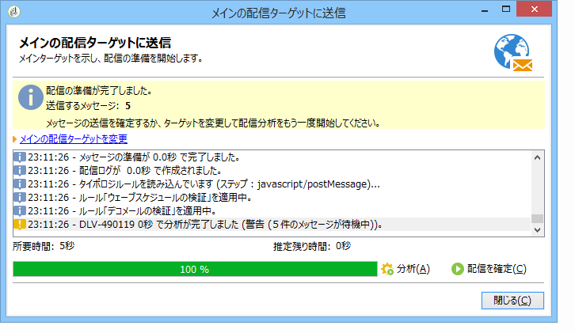

>[!NOTE]
>
>検証ルールは、検証プロセスでタ [イポロジと共に説明されます](../../delivery/using/steps-validating-the-delivery.md#validation-process-with-typologies)。

You can stop this job at any time by clicking **[!UICONTROL Stop]**.

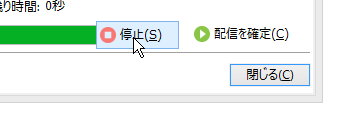

分析フェーズでは、メッセージが送信されないので、安全にジョブを開始またはキャンセルできます。

>[!CAUTION]
>
>分析を実行すると、その時点で、配信（または配達確認）が凍結されます。配信（または配達確認）への変更を適用するには、再度分析する必要があります。

最後のログメッセージには、エラーメッセージとエラー件数が表示されます。特殊なアイコンでエラータイプが示されます。黄色のアイコンは致命的でない処理エラーを、赤色のアイコンは配信開始を阻む致命的なエラーを示します。

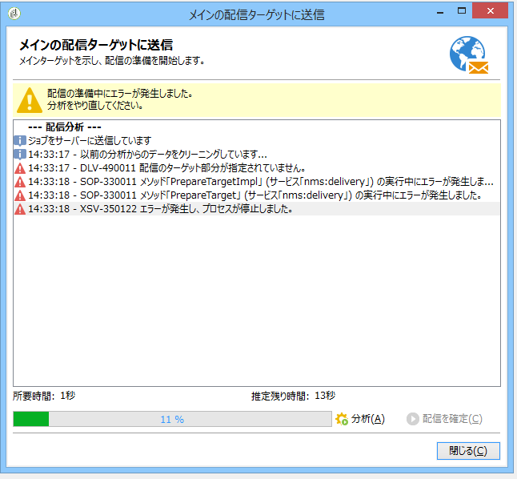

Click **[!UICONTROL Close]** to correct the errors. 変更を加えた後は、分析を再度実行する必要があります。

Check the result of the analysis before clicking **[!UICONTROL Confirm delivery]** to send the message to the specified target. 配信の開始を確認するメッセージが表示されます。

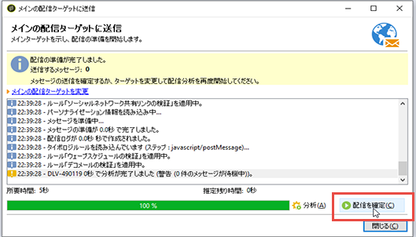

>[!NOTE]
>
>送信するメ **[!UICONTROL Change the main delivery target]** ッセージの数が設定と一致しない場合は、リンクをクリックします。 これにより、ターゲット母集団の定義を変更して、分析を再度実行できます。

The delivery parameters **[!UICONTROL Analysis]** tab lets you define a set of information concerning the preparation of messages during the analysis phase.

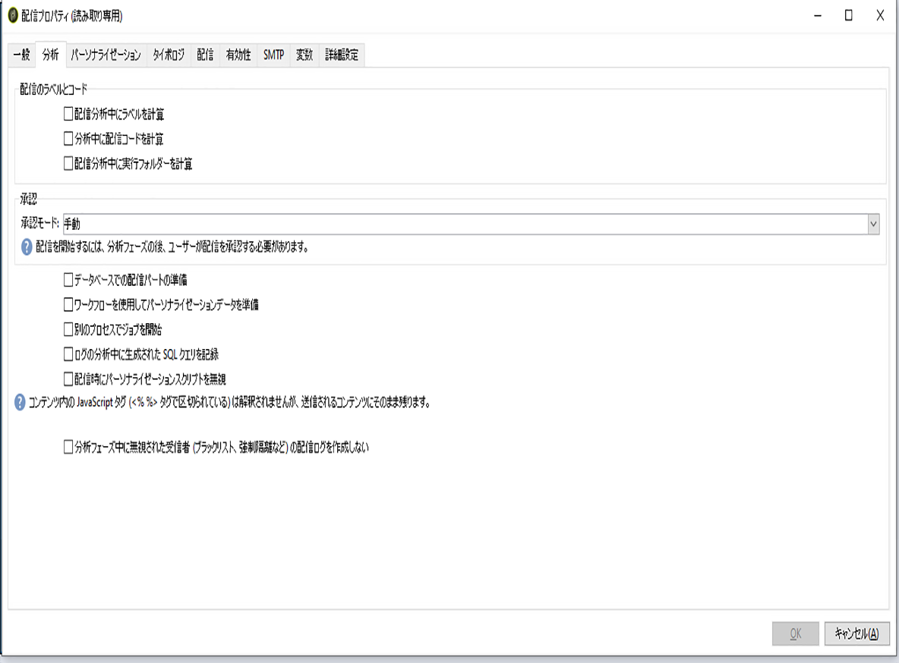

このタブで設定できるオプションを次に示します。

* **[!UICONTROL Label and code of the delivery]** :画面のこのセクションに関するオプションを使用して、配信分析段階でこれらのフィールドの値を計算します。 このフ **[!UICONTROL Calculate the execution folder during the delivery analysis]** ィールドは、分析段階でこの配信アクションを含むフォルダーの名前を計算します。
* **[!UICONTROL Approval mode]** :このフィールドでは、配信承認のタイプを選択できます。 承認モードは、検証プロセスでタ [イポロジと共に表示されます](../../delivery/using/steps-validating-the-delivery.md#validation-process-with-typologies)。
* **[!UICONTROL Prepare the personalization data with a workflow]** :このオプションを使用すると、配信に含まれるパーソナライゼーションデータを自動ワークフローで準備できます。 これにより、大量のデータを処理する場合（特にパーソナライゼーションデータが FDA を通じて外部テーブルから提供される場合）、配信分析のパフォーマンスを大幅に向上させることが可能です。[外部データベース](../../platform/using/accessing-an-external-database.md#optimizing-email-personalization-with-external-data)の節を参照してください。
* **[!UICONTROL Start job in a detached process]** :このオプションを使用すると、別のプロセスで配信分析を開始できます。 分析機能は、デフォルトでは、Adobe Campaign アプリケーションサーバープロセス（web nlserver）を使用します。このオプションを選択すると、アプリケーションサーバーにエラーが発生した場合でも分析を完了できます。
* **[!UICONTROL Log SQL queries generated during the analysis in the journal]** :このオプションは、分析フェーズ中にSQLクエリログを配信仕訳帳に追加します。
* **[!UICONTROL Ignore personalization scripts during sending]** :このオプションを使用すると、HTMLコンテンツ内のJavaScriptディレクティブの解釈を回避できます。 このオプションを選択すると、配信されるコンテンツ内に、These directives are introduced with the **&lt;%=** tag).

### 分析の優先順位の設定 {#analysis-priority-}

When the delivery is part of a campaign, the **[!UICONTROL Advanced]** tab offers an additional option. このオプションを使用すると、同じキャンペーンに含まれる配信の処理順を調整できます。

各配信は、送信前に分析されます。分析の所要時間は配信の抽出ファイルによって異なります。ファイルサイズが大きいほど、分析にかかる時間は長くなり、後に続く配信が遅くなります。

のオプションを使用すると、 **[!UICONTROL Message preparation by the scheduler]** キャンペーンワークフローでの配信分析に優先順位を付けることができます。

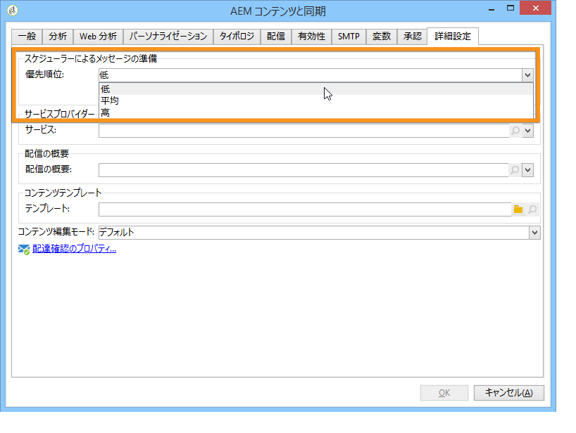

配信が非常に大きい場合、低い優先順位を設定することが、同じワークフローに含まれる他の配信の遅延を防ぐために有効と考えられます。

>[!NOTE]
>
>To ensure that the larger delivery analyses do not slow down the progress of your workflows, you can schedule their executions by ticking the **[!UICONTROL Schedule execution for a time of low activity]**.

## 配達確認の送信 {#sending-a-proof}

メッセージの設定にエラーが含まれていそうな箇所を見つけるために、配信の検証サイクルを設定することを強くお勧めします。必要に応じて、テスト受信者に配達確認を送信してコンテンツを承認するサイクルを実施します。この場合、変更を加えるたびに配達確認を送信して、コンテンツを承認することになります。

>[!NOTE]
>
>* 使用可能な検証モードについては、承認モ [ードの変更を参照してください](../../delivery/using/steps-validating-the-delivery.md#changing-the-approval-mode)。
>* 配達確認ターゲットの設定については、特定の配達 [確認ターゲットの定義で説明します](../../delivery/using/steps-defining-the-target-population.md#defining-a-specific-proof-target)。
>

配達確認を送信するには、以下の手順に従います。

1. 「特定の校正ターゲットの定義」の説明に従って、校正ターゲットが設 [定されていることを確認します](../../delivery/using/steps-defining-the-target-population.md#defining-a-specific-proof-target)。
1. 配信ウ **[!UICONTROL Send a proof]** ィザードの上部バーのをクリックします。

   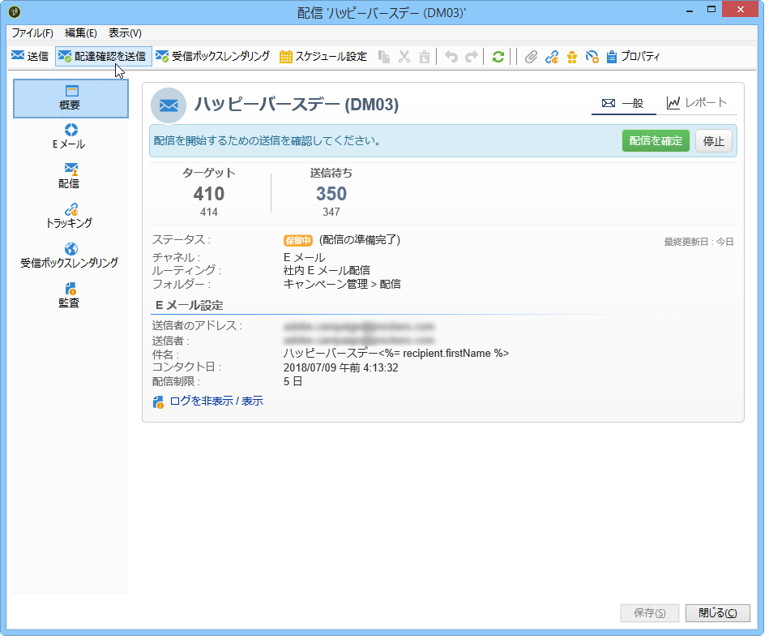

1. メッセージの分析を開始します。「配信 [の分析」を参照](../../delivery/using/steps-validating-the-delivery.md#analyzing-the-delivery)。
1. これで、配信を送信できます(「配信の [送信](../../delivery/using/steps-sending-the-delivery.md)」を参照)。

   配信が送信されると、配信リストに配信確認が表示され、自動的に作成され、番号が付けられます。 コンテンツやプロパティにアクセスしたい場合は、配達確認を編集できます。詳しくは、この[ページ](../../delivery/using/monitoring-a-delivery.md#delivery-dashboard)を参照してください。

   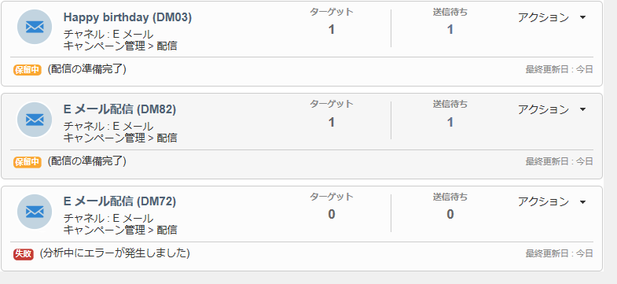

   >[!NOTE]
   >
   >配信用に複数の形式（HTMLおよびテキスト）が作成された場合は、ウィンドウの下部にある校正受信者に送信するメッセージの形式を選択できます。

   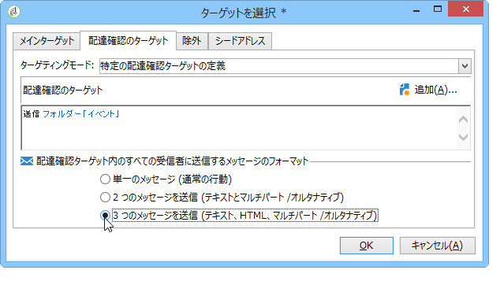

配達確認を受信した検証グループからのコメントを踏まえて配信コンテンツを変更する場合は、変更後に分析を再度実行してから、再度配達確認を送信する必要があります。それぞれの新しい配達確認には、番号が付けられ、配信ログに記録されます。

Once the delivery has been analyzed, you can view the various proofs sent via the **[!UICONTROL Proofs]** sub-tab of the log (**[!UICONTROL Audit]** tab).

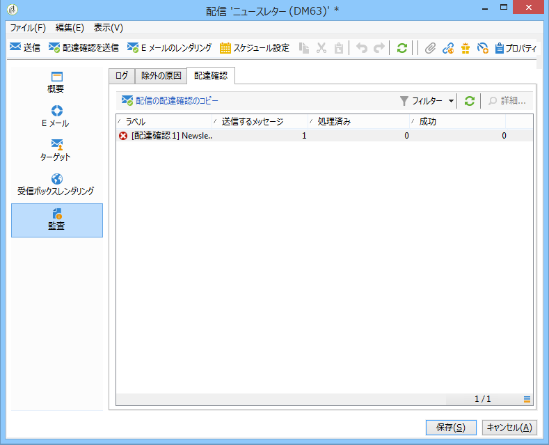

配信のコンテンツが最終的に確定するまで、何度でも必要な回数だけ配達確認を送信する必要があります。その後、配信をメインターゲットに送信して検証サイクルを終了できます。

The **[!UICONTROL Advanced]** tab of delivery properties lets you define the properties of the proof. 必要に応じて、受信者の除外ルールを上書きできます。

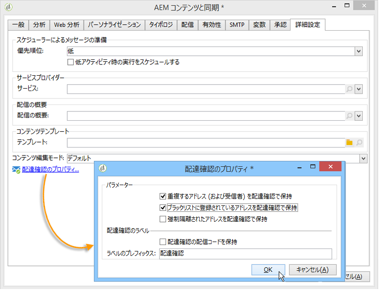

次のオプションを使用できます。

* 最初のオプションを選択すると、配達確認のコピーを保持できます。
* 2 番目と 3 番目のオプションを使用すると、ブラックリストに記載されている強制隔離中の受信者とアドレスを保持できます。See the description of these options for the main target in [Customizing exclusion settings](../../delivery/using/steps-defining-the-target-population.md#customizing-exclusion-settings). これらのアドレスは、配信ターゲットの場合はデフォルトで除外されますが、配達確認ターゲットの場合はデフォルトで保持されます。
* The **[!UICONTROL Keep the delivery code for the proof]** option lets you give the proof the same delivery code as the one defined for the delivery to which it relates. このコードは、配信ウィザードの最初の手順で指定されます。
* デフォルトでは、配達確認の件名の前には「配達確認#」が付けられます。ここで、「#」は配達確認の番号です。You can change this prefix in the **[!UICONTROL Label prefix]** field.

## タイポロジを使用したプロセスの検証 {#validation-process-with-typologies}

メッセージを送信する前に、キャンペーンを分析して、コンテンツと設定を検証する必要があります。分析フェーズ中に適用されるチェックルールは、**タイポロジ**&#x200B;内に定義されています。E メールの場合、デフォルトでは、分析には次の点が含まれます。

* オブジェクトの検証
* URL と画像の検証
* URL ラベルの検証
* 購読解除リンクの検証
* 配達確認のサイズの検証
* 有効期間の検証
* ウェーブのスケジュールの検証

The typology to be applied for each delivery is selected in the **[!UICONTROL Typologies]** tab in the delivery parameters.

ノードを介して、承認ルール、そのコンテンツ、実行順序および詳細を表示および編集でき **[!UICONTROL Administration > Campaign execution > Typology management > Typology rules]** ます。

このノードから、新しいルールを作成し、新しいタイポロジを定義できます。ただし、これらのタスクは JavaScript の知識があるエキスパートユーザー向けに用意されています。

To edit the current typology, click the **[!UICONTROL Edit link]** icon to the right of the **[!UICONTROL Typology]** field.

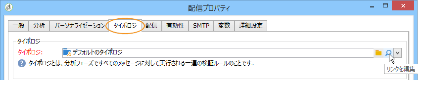

The **[!UICONTROL Rule]** tab gives a list of the typology rules to apply. Select a rule and click the **[!UICONTROL Detail...]** icon to view its configuration:

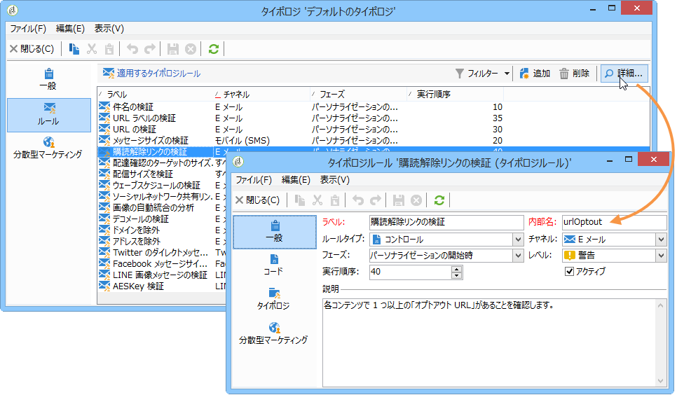

>[!NOTE]
>
>**[!UICONTROL Arbitration]** タイプタイポロジは、販売圧力管理のフレームワーク内で使用されます。 詳しくは、[この節](../../campaign/using/about-marketing-resource-management.md)を参照してください。

## 承認モードの変更 {#changing-the-approval-mode}

The **[!UICONTROL Analysis]** tab for delivery properties lets you select the validation mode. 分析時に警告が発生した場合（例えば、あるアクセント記号付き文字が配信の件名に含まれていた場合）、配信を設定して、配信を実行するかどうかを定義できます。デフォルトでは、分析フェーズの最後に、メッセージの送信をユーザーが確認する必要があります（**手動**&#x200B;検証）。

承認モードのフィールドで、ドロップダウンリストから別の承認モードを選択します。

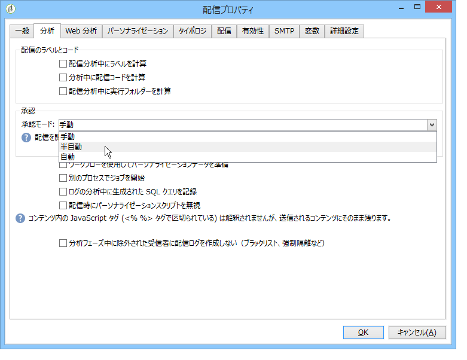

選択できる承認モードは次のとおりです。

* **[!UICONTROL Manual]**:分析段階の終わりに、ユーザーは送信を開始するために配信を確認する必要があります。 To do this, click the **[!UICONTROL Start]** button to launch the delivery.
* **[!UICONTROL Semi-automatic]**:分析段階で警告メッセージが生成されない場合は、自動的に送信が開始されます。
* **[!UICONTROL Automatic]**:送信は、結果に関係なく、分析段階の終わりに自動的に開始されます。
