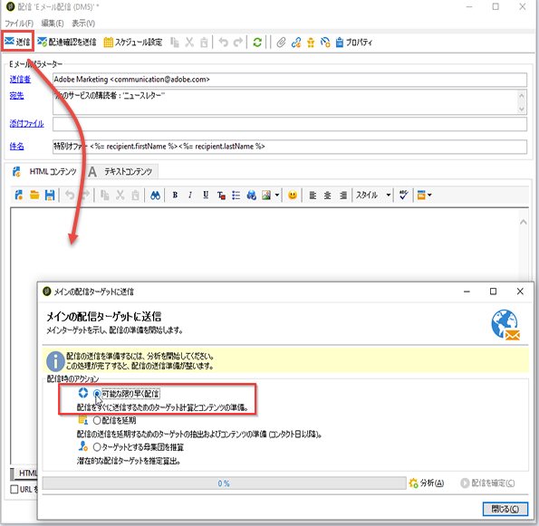

# 配信の検証 {#validating-the-delivery}

配信を作成して設定したら、メインターゲットに送信する前に検証する必要があります。

手順は次のとおりです。

1. **配信の分析**：この手順では、配信メッセージを準備できます。[配信の分析](#analyzing-the-delivery)を参照してください。

   分析時に適用されるルールについては、[この節](#validation-process-with-typologies)を参照してください。使用可能な検証モードについて詳しくは、[承認モードの変更](#changing-the-approval-mode)の節で説明しています。

1. **配達確認の送信**：この手順では、コンテンツ、URL、パーソナライゼーションフィールドなどを承認できます。[配達確認の送信](../../delivery/using/steps-validating-the-delivery.md#sending-a-proof)および[特定の配達確認ターゲットの定義](../../delivery/using/steps-defining-the-target-population.md#defining-a-specific-proof-target)を参照してください。

>[!IMPORTANT]
>
>メッセージコンテンツを変更するたびに、これらの手順を両方とも実行する必要があります。

## 配信の分析 {#analyzing-the-delivery}

分析は、ターゲット母集団が計算され、配信コンテンツが準備される段階です。この段階が完了すると、配信は送信できる状態になります。

### 分析の開始 {#launching-the-analysis}

1. 配信分析を開始するには、「**[!UICONTROL 送信]**」をクリックします。
1. 「**[!UICONTROL 可能な限り早く配信]**」を選択します。

   

1. 「**[!UICONTROL 分析]**」をクリックして、分析を手動で開始します。

   分析の進捗状況がプログレスバーに表示されます。

   

   >[!NOTE]
   >
   >分析時に使用される検証ルールについて詳しくは、[タイポロジを使用したプロセスの検証](../../delivery/using/steps-validating-the-delivery.md#validation-process-with-typologies)の節で説明しています。

1. 分析は、「**[!UICONTROL 停止]**」をクリックしていつでも停止できます。

   

   準備フェーズでは、メッセージが送信されないので、安全に分析を開始またはキャンセルできます。

   >[!IMPORTANT]
   >
   >分析の実行中、配信（または配達確認）は停止します。配信（または配達確認）への変更を適用するには、再度分析する必要があります。

1. 分析が完了するまで待ちます。

   分析が終了すると、ウィンドウの上部に、配信準備が完了した、またはエラーが発生したことを示すメッセージが表示されます。すべての検証手順、警告およびエラーが表示されます。色付きのアイコンは、メッセージタイプを示します。
   * 青色のアイコンは、情報メッセージを示します。
   * 黄色のアイコンは、重要でない処理エラーを示します。
   * 赤色のアイコンは、配信の送信を妨げる重大なエラーを示します。

   

1. 「**[!UICONTROL 閉じる]**」をクリックし、該当する場合はエラーを修正します。

1. 変更をおこなった後、「**[!UICONTROL 分析]**」をクリックして分析を再開します。

分析の結果を確認した後、「**[!UICONTROL 配信を確定]**」をクリックして、指定したターゲットにメッセージを送信できます。配信の開始を確認するメッセージが表示されます。

>[!NOTE]
>
>送信するメッセージの数が設定と合っていない場合は、「**[!UICONTROL メインの配信ターゲットを変更]**」リンクをクリックします。これにより、ターゲット母集団の定義を変更して、分析を再度実行できます。

### 分析パラメーター {#analysis-parameters}

配信プロパティの「**[!UICONTROL 分析]**」タブでは、分析フェーズ中のメッセージの準備に関する情報を定義できます。

このタブで設定できるオプションを次に示します。

* **[!UICONTROL 配信のラベルとコード]**：このセクションのオプションは、配信分析フェーズでこれらのフィールドの値を計算するために使用されます。「**[!UICONTROL 配信分析中に実行フォルダーを計算]**」フィールドを選択すると、分析フェーズにこの配信アクションを格納するフォルダーの名前が計算されます。
* **[!UICONTROL 承認モード]**：このフィールドでは、分析が完了した後に手動または自動で配信を定義できます。検証モードについて詳しくは、[承認モードの変更](#changing-the-approval-mode)の節で説明しています。
* **[!UICONTROL データベース内で配信部分を準備]**：このオプションを使用すると、配信分析のパフォーマンスを向上できます。詳しくは、[この節](#improving-delivery-analysis)を参照してください。
* **[!UICONTROL ワークフローを使用してパーソナライゼーションデータを準備]**：このオプションを使用すると、配信に含まれるパーソナライゼーションデータを自動ワークフローで準備でき、パーソナライゼーションの実行パフォーマンスを大幅に向上させることができます。詳しくは、[パーソナライゼーションの最適化](../../delivery/using/personalization-fields.md#optimizing-personalization)を参照してください。
* **[!UICONTROL 別のプロセスでジョブを開始]**：このオプションを選択すると、別のプロセスで配信分析を開始できます。分析機能は、デフォルトでは、Adobe Campaign アプリケーションサーバープロセス（web nlserver）を使用します。このオプションを選択すると、アプリケーションサーバーにエラーが発生した場合でも分析を完了できます。
* **[!UICONTROL ログの分析中に生成された SQL クエリを記録]**：分析フェーズ中、配信ログに SQL クエリのログを記録します。
* **[!UICONTROL 配信時にパーソナライゼーションスクリプトを無視]**：HTML コンテンツに含まれる JavaScript ディレクティブの解釈をスキップします。このオプションを選択すると、配信されるコンテンツ内に、**&lt;%=** タグで始まる JavaScript ディレクティブがそのまま表示されます。

### 配信分析のパフォーマンスの向上 {#improving-delivery-analysis}

配信準備にかかる時間を短縮するには、分析を開始する前に「**[!UICONTROL データベース内で配信部分を準備]**」オプションにチェックを入れます。

このオプションを有効にすると、配信準備がデータベース内で直接おこなわれ、分析時間が大幅に短縮されます。

現在、このオプションは、次の条件を満たす場合にのみ使用できます。
* 配信は E メールである必要があります。現時点では、その他のチャネルはサポートされていません。
* ミッドソーシングや外部ルーティングは使用できません。一括配信ルーティングタイプのみ使用できます。**[!UICONTROL 配信プロパティ]**&#x200B;の「**[!UICONTROL 一般]**」タブで、使用するルーティングを確認できます。
* 外部ファイルからの母集団をターゲットに指定することはできません。単一の配信の場合、**[!UICONTROL E メールパラメーター]**&#x200B;から&#x200B;**[!UICONTROL 宛先]**&#x200B;リンクをクリックし、「**[!UICONTROL データベースで定義]**」オプションが選択されていることを確認します。ワークフローで使用される配信の場合、「**[!UICONTROL 配信]**」タブにおいて受信者が&#x200B;**[!UICONTROL インバウンドイベントで指定]**&#x200B;されていることを確認します。
* PostgreSQL データベースを使用する必要があります。

### 分析の優先順位の設定 {#analysis-priority-}

配信をキャンペーンの一環として使用する場合は、「**[!UICONTROL 詳細設定]**」タブに特別なオプションが 1 つ追加されます。このオプションを使用すると、同じキャンペーンに含まれる配信の処理順を調整できます。

各配信は、送信前に分析されます。分析の所要時間は配信の抽出ファイルによって異なります。ファイルサイズが大きいほど、分析にかかる時間は長くなり、後に続く配信が遅くなります。

「**[!UICONTROL スケジューラーによるメッセージの準備]**」のオプションで、キャンペーンワークフローの配信分析を優先順位付けできます。

配信が非常に大きい場合、低い優先順位を設定することが、同じワークフローに含まれる他の配信の遅延を防ぐために有効と考えられます。

>[!NOTE]
>
>「**[!UICONTROL 低アクティビティ時の実行をスケジュール]**」オプションを選択すると、大きな配信分析によってワークフロー全体の進行が遅くなるのを防ぐことができます。

## 配達確認の送信 {#sending-a-proof}

メッセージの設定にエラーが含まれていそうな箇所を見つけるために、配信の検証サイクルを設定することを強くお勧めします。必要に応じて、テスト受信者に配達確認を送信してコンテンツを承認するサイクルを実施します。この場合、変更を加えるたびに配達確認を送信して、コンテンツを承認することになります。

>[!NOTE]
>
>* 使用可能な検証モードについて詳しくは、[承認モードの変更](../../delivery/using/steps-validating-the-delivery.md#changing-the-approval-mode)で説明しています。
>* 配達確認のターゲットの設定について詳しくは、[特定の配達確認ターゲットの定義](../../delivery/using/steps-defining-the-target-population.md#defining-a-specific-proof-target)を参照してください。

>

配達確認を送信するには、以下の手順に従います。

1. [特定の配達確認ターゲットの定義](../../delivery/using/steps-defining-the-target-population.md#defining-a-specific-proof-target)の説明に従って、配達確認のターゲットを設定したことを確認します。
1. 配信ウィザードの上部のバーで「**[!UICONTROL 配達確認を送信]**」をクリックします。

   

1. メッセージの分析を開始します。[配信の分析](../../delivery/using/steps-validating-the-delivery.md#analyzing-the-delivery)を参照してください。
1. これで、配信を送信できます（[配信の送信](../../delivery/using/steps-sending-the-delivery.md)を参照）。

   配信が送信されると、配達確認は自動的に作成されて番号が付けられ、配信リストに表示されます。コンテンツやプロパティにアクセスしたい場合は、配達確認を編集できます。詳しくは、この[ページ](../../delivery/using/monitoring-a-delivery.md#delivery-dashboard)を参照してください。

   

   >[!NOTE]
   >
   >配信に複数のメッセージ形式（HTML とテキスト）が含まれる場合は、ウィンドウ下部のセクションで、配達確認受信者に送信するメッセージの形式を選択できます。

   

配達確認を受信した検証グループからのコメントを踏まえて配信コンテンツを変更する場合は、変更後に分析を再度実行してから、再度配達確認を送信する必要があります。それぞれの新しい配達確認には、番号が付けられ、配信ログに記録されます。

配信が分析されると、ログ（「**[!UICONTROL 監査]**」タブ）の「**[!UICONTROL 配達確認]**」サブタブで、送信された様々な配達確認の記録を表示できます。

配信のコンテンツが最終的に確定するまで、何度でも必要な回数だけ配達確認を送信する必要があります。その後、配信をメインターゲットに送信して検証サイクルを終了できます。

配信プロパティの「**[!UICONTROL 詳細設定]**」タブでは、配達確認のプロパティを定義できます。必要に応じて、受信者の除外ルールを上書きできます。

次のオプションを使用できます。

* 最初のオプションを選択すると、配達確認のコピーを保持できます。
* 次の2つのオプションを使用すると、受信者上のブロックリストとアドレスを強制隔離で保持できます。 メインターゲットに対するこれらのオプション指定について詳しくは、[除外設定のカスタマイズ](../../delivery/using/steps-defining-the-target-population.md#customizing-exclusion-settings)を参照してください。これらのアドレスは、配信ターゲットの場合はデフォルトで除外されますが、配達確認ターゲットの場合はデフォルトで保持されます。
* 「**[!UICONTROL 配達確認の配信コードを保持]**」オプションを選択すると、配達確認の配信コードが、対応する配信の配信コードと同じ値になります。このコードは、配信ウィザードの最初の手順で指定されます。
* デフォルトでは、配達確認の件名の前には「配達確認#」が付けられます。ここで、「#」は配達確認の番号です。このプレフィックスは「**[!UICONTROL ラベルのプレフィックス]**」フィールドで変更できます。

## タイポロジを使用したプロセスの検証 {#validation-process-with-typologies}

メッセージを送信する前に、キャンペーンを分析して、コンテンツと設定を検証する必要があります。分析フェーズ中に適用されるチェックルールは、**タイポロジ**&#x200B;内に定義されています。E メールの場合、デフォルトでは、分析には次の点が含まれます。

* オブジェクトの検証
* URL と画像の検証
* URL ラベルの検証
* 購読解除リンクの検証
* 配達確認のサイズの検証
* 有効期間の検証
* ウェーブのスケジュールの検証

各配信に適用されるタイポロジは、配信パラメーターの「**[!UICONTROL タイポロジ]**」タブで選択されます。

**[!UICONTROL 管理／キャンペーン管理／タイポロジ管理]**&#x200B;ノードで、検証のルール、内容、実行順、詳しい説明を表示および編集できます。

このノードから、新しいルールを作成し、新しいタイポロジを定義できます。ただし、これらのタスクは JavaScript の知識があるエキスパートユーザー向けに用意されています。

タイポロジルールについて詳しくは、[キャンペーンタイポロジについて](../../campaign/using/about-campaign-typologies.md)を参照してください。

現在のタイポロジを編集するには、「**[!UICONTROL タイポロジ]**」フィールドの右にある&#x200B;**[!UICONTROL リンクを編集]**&#x200B;アイコンをクリックします。

「**[!UICONTROL ルール]**」タブに、適用するタイポロジルールの一覧が表示されます。ルールを 1 つ選択し、「**[!UICONTROL 詳細]**」アイコンをクリックすると、設定が表示されます。

>[!NOTE]
>
>**[!UICONTROL 判別]**&#x200B;タイプのタイポロジは、営業頻度管理のフレームワーク内で使用します。詳しくは、[この節](../../campaign/using/about-marketing-resource-management.md)を参照してください。

## 承認モードの変更 {#changing-the-approval-mode}

配信プロパティの「**[!UICONTROL 分析]**」タブでは、検証モードを選択できます。分析時に警告が発生した場合（例えば、あるアクセント記号付き文字が配信の件名に含まれていた場合）、配信を設定して、配信を実行するかどうかを定義できます。デフォルトでは、分析フェーズの最後に、メッセージの送信をユーザーが確認する必要があります（**手動**&#x200B;検証）。

承認モードのフィールドで、ドロップダウンリストから別の承認モードを選択します。

選択できる承認モードは次のとおりです。

* **[!UICONTROL 手動]**：分析の終了時に、配信の送信開始をユーザーが確認する必要があります。「**[!UICONTROL 配信を確定]**」ボタンをクリックすると、配信が開始されます。
* **[!UICONTROL 半自動]**：分析フェーズで警告が発生しなかった場合には送信が自動的に開始されます。
* **[!UICONTROL 自動]**：分析が終了した時点で、その結果にかかわらず送信が自動的に開始されます。
