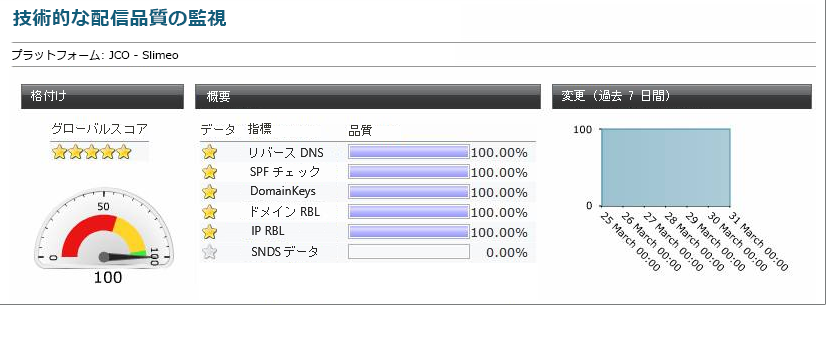

# 技術的監視{#technical-monitoring}

## 技術配信品質監視レポート {#technical-deliverability-monitoring}

技術的な配信品質の監視レポートは毎日更新され、/に移動して「Adobe Campaign」 **[!UICONTROL Monitoring]** タブからリ **[!UICONTROL Overview]** ンクをクリ **[!UICONTROL Technical monitoring]** ックすると利用でき **[!UICONTROL Home]** ます。 このレポートには、プラットフォームに関する多数の配信品質指標が含まれます。

これらの指標は毎日午前 9 時に更新されます。

>[!NOTE]
>
>さらに、指定したアドレスで、毎日のレポートを E メールで受け取ることができます。E メールまたは Adobe Campaign エクストラネットで、リクエストする E メールアドレスをお知らせください。

次の指標がレポートで使用されます。

* **[!UICONTROL Reverse DNS]** :Adobe Campaignは、IPアドレスに逆DNSが与えられていて、これがIPを正しく指しているかどうかを確認します。

* **[!UICONTROL SPF]** (Sender Policy Framework):ISPとメールボックスプロバイダーが、電子メールの送信者が送信ドメインで承認されているかどうかを確認できる認証メカニズムです。

   <!--
    >[!NOTE]
    >
    >The SPF may look **[!UICONTROL Acceptable]** (instead of **[!UICONTROL Good]**) since the report is currently unable to detect the presence of a “redirect” or “include” mechanism. This bug has been submitted to Adobe Campaign R&D to be fixed. In the meantime, please feel free to add 15 points to your global score to obtain your real rating (a **[!UICONTROL Good]** one corresponds to 96 points or higher).
    -->

* **[!UICONTROL DomainKeys]** :Yahooが開発した、電子メール送信者のIDを認証するサービス。

* **[!UICONTROL IP and RBL domain]** （リアルタイムブラックホールリスト）:ブロックリスト組織が評判を低くするためにフラグを付けたIPアドレスとドメインのリスト。 これらのリストは、Spamhaus、Spamcop、SURBL/URIBLなどの専用の組織によって管理されます。 現在、Adobe Campaignは配信品質に大きな影響を与えるRBLに対するチェックを処理します。 これらのRBLは、送信の評判を反映しており、電子メールの受信を受け入れる前にISPから参照される場合があります。

* **[!UICONTROL SNDS]** (Smart Network Data Services):Windows [Live Hotmailスパム対策サービス](https://sendersupport.olc.protection.outlook.com/snds/FAQ.aspx)。 この種の情報を提供するISPは、Hotmailだけです。 ベンチマークスコアは、緑色のフィルタ結果、苦情率が0.1%未満、スパムゼロのトラップです。

<!--
* **[!UICONTROL Reputation Authority]**: This WatchGuard’s score is calculated in real time according to the feedback received from their network worldwide, and also from the different users who use their software.

    Administrators can use such tools to apply a first level filter on their messaging servers.
    If you click on the IP link within the technical report, it will lead you to reputationauthority.org, where you will have the possibility to clean the IP history and get a neutral score again.
    Nevertheless, this action is limited to a number of times per month.
    Please also be aware there is no support provided by WatchGuard‘s Reputation Authority (sending delisting requests is therefore useless). Otherwise, this scoring is based on the following: 
    * Message content (for example: presence of spam words). 
    * IP/Domains reputation (for example: your IPs are listed on an RBL). 
    * IP configuration (for example: IPs associated to different domains). 
    * Volumes sent by IP (for example: presence of peaks or significant variations).
    
    * **[!UICONTROL Sender Score]** : A database of reputed servers ([https://www.senderscore.org/](https://www.senderscore.org/)) issuing a score created by Return Path about your reputation. Think of it like a credit score, but for email senders.-->

<!--## Delivery Reports - Broadcast Statistics {#delivery-reports-broadcast-statistics}

Each delivery will generate a broadcast statistics report when you open a delivery in the “Deliveries List”, which includes some reputation metrics that may impact your deliverability:

-->
