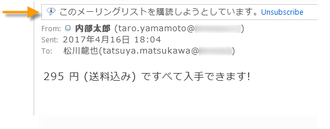
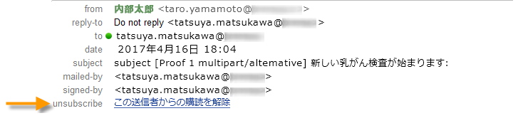
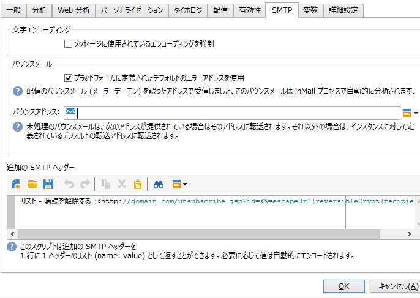

# 技術的な推奨事項{#technical-recommendations}

配信品質を向上させるために使用できるテクニック、設定、ツールのいくつかを以下に示します。

## 設定 {#configuration}

### リバース DNS {#reverse-dns}

Adobe Campaign は、IP アドレスに対してリバース DNS が提供されているかどうか、そのリバース DNS が正しく IP を指しているかどうかを確認します。

ネットワーク設定で重要な点は、送信メッセージの IP アドレスごとに正しいリバース DNS が必ず定義されるようにすることです。つまり、特定の IP アドレスには、最初の IP アドレスにループバックする対応 DNS（A レコード）を記述したリバース DNS レコード（PTR レコード）があるということです。

特定の ISP を扱う場合には、リバース DNS のドメイン選択が影響を及ぼします。AOL, in particular, only accepts feedback loops with an address in the same domain as the reverse DNS (see [Feedback loop](#feedback-loop)).

ドメインの設定を検証するツールを使用できます。https://mxtoolbox.com/SuperTool.aspx [](https://mxtoolbox.com/SuperTool.aspx).

### MX ルール {#mx-rules}

MX（Mail eXchanger）ルールは、送信サーバーと受信サーバーの間の通信を管理するルールです。

より正確には、キャンペーンMTA(Message Transfer Agent)が個々の電子メールドメインまたはISP（hotmail.com、comcast.netなど）に電子メールを送信する速度を制御するために使用されます。 これらのルールは、通常、ISP によって公開された制限（例：各 SMTP 接続あたり 20 を超えるメッセージを含めない）に基づいています。

For more on MX management, refer to the [dedicated section](../../installation/using/email-deliverability.md#mx-configuration).

### TLS {#tls}

TLS（トランスポート層セキュリティ）は、暗号化プロトコルで、2 つの E メールサーバー間の接続を保護したり、E メールのコンテンツを保護して意図された受信者以外によって読まれないようにするために使用できます。

## 認証 {#authentication}

### SPF {#spf}

SPF（Sender Policy Framework）は、E メール認証標準で、ドメインの所有者がドメインの代わりに E メールを送信できる E メールサーバーを指定できます。この標準は、E メールの「Return-Path」ヘッダー（「Envelope From」アドレスとも呼ばれる）のドメインを使用します。

SPFレコードを検証するツールを使用できます。https://www.kitterman.com/spf/validate.html [](https://www.kitterman.com/spf/validate.html)

SPFは、ある程度、電子メールで使用されるドメイン名が偽造されていないことを確認できる技術です。 あるドメインからメッセージが受信されると、そのドメインの DNS サーバーに対して問い合わせが実行されます。その応答は、このドメインから E メールを送信する権限がどのサーバーにあるかを記述した短いレコード（SPF レコード）になります。このレコードを変更する手段がドメインの所有者にしかないと仮定すると、送信者のアドレス（少なくとも「@」の右側の部分）の偽装はこの技術により防止できると考えることができます。

最終的な [RFC 4408仕様では](https://www.rfc-editor.org/info/rfc4408)、送信者と見なされるドメインを決定するために、メッセージの2つの要素が使用されます。SMTPの「HELO」（または「EHLO」）コマンドで指定されたドメインと、「Return-Path」（または「MAIL FROM」）ヘッダーのアドレスで指定されたドメイン。これはバウンスアドレスでもあります。 様々な事項を検討することにより、これらの値の一方のみを考慮に入れることが可能になります。両方のソースで指定されているドメインが必ず同じになるようにすることをお勧めします。

SPF の確認により、送信者ドメインの有効性が次のように評価されます。

* **なし**:評価は実行できませんでした。
* **中間**:照会されたドメインで評価が有効になっていません。
* **パス**:ドメインは、認証済みと見なされます。
* **失敗**:ドメインが偽造され、メッセージが拒否される。
* **SoftFail**:ドメインは偽造されているかもしれませんが、この結果だけに基づいてメッセージを拒否すべきではありません。
* **TempError**:一時的なエラーが評価を停止しました。 メッセージを拒否してもかまいません。
* **PermError**:ドメインのSPFレコードが無効です。

DNS サーバーのレベルで作成されたレコードを考慮するのに最大 48 時間かかる可能性があることに注意する必要があります。この遅延は、受信サーバーの DNS キャッシュの更新頻度によって異なります。

### DKIM {#dkim}

DKIM(DomainKeys Identified Mail)認証はSPFの後継機能で、公開鍵暗号化を使用して、受信電子メールサーバーが、送信元であると主張する個人またはエンティティによってメッセージが送信されたこと、および最初に送信された時刻（およびDKIM「署名済み」）から受信時刻までにメッセージ内容が変更されたかを検証します。 この標準は、通常、「From」または「Sender」ヘッダーのドメインを使用します。DKIMのセキュリティレベルを確保するために、暗号化サイズを推奨するベストプラクティスは1024bです。 これより小さいサイズの DKIM 鍵は、大多数のアクセスプロバイダーには有効とはみなされません。

DKIM は、Yahoo! の DomainKeys と Cisco の Identified Internet Mail という 2 つの送信ドメイン認証方式を組み合わせて策定されたもので、送信者ドメインの信憑性を確認し、メッセージの整合性を保証するために使用されます。

DKIM が **DomainKeys** 認証方式の後継となりました。

>[!IMPORTANT]
>
>ホストインストールまたはハイブリッドインストールの場合、拡張MTAにアップグレードした場合、DKIM電子メール認証の署名は拡張MTAによって行われます。 ネイティブCampaign MTAによるDKIM署名は、拡張MTAアップグレードの一 **[!UICONTROL Domain management]** 環として、テーブル内で無効になります。
>
>Adobe Campaign拡張MTAについて詳しくは、このドキュメントを参照してく [ださい](https://helpx.adobe.com/campaign/kb/campaign-enhanced-mta.html)。

DKIM を使用するには、次のように、いくつかの前提条件を満たす必要があります。

* **セキュリティ**：暗号化が DKIM の重要な要素であり、2013 年春以降の DKIM のセキュリティレベルを保証するには、1024 ビットが、ベストプラクティスで推奨される暗号化サイズです。これより小さいサイズの DKIM 鍵は、大多数のアクセスプロバイダーには有効とはみなされません。
* **レピュテーション**：レピュテーションは IP やドメインに基づいたものですが、より透明性の低い DKIM セレクターも考慮に入れるべき重要な要素です。セレクターの選択は重要です。「default」のままにしないようにします。これは誰にでも使用できるものなので、レピュテーションは非常に弱くなります。**顧客維持／獲得用の通信**&#x200B;と認証には、別のセレクターを実装する必要があります。
* **Adobe Campaign オプションの宣言**：Adobe Campaign では、DKIM 秘密鍵は DKIM セレクターとドメインに基づきます。同じドメイン／サブドメインに対して、セレクターの異なる複数の秘密鍵を作成することは、現時点ではできません。プラットフォームでも E メールでも、どのセレクタードメイン／サブドメインを認証に使用すべきかを定義することはできません。プラットフォームでは、その代わりに、秘密鍵のいずれか 1 つを選択します。つまり、認証は失敗する可能性が高くなります。

>[!NOTE]
>
>* お使いの Adobe Campaign インスタンスに DomainKeys を設定してある場合は、ドメイン処理ルールで **dkim** を選択するだけです。そうでない場合は、DomainKeys の場合と同じ設定手順（秘密鍵／公開鍵）に従います。
>* DKIM は DomainKeys の改良版なので、同じドメインに DomainKeys と DKIM の両方を有効にする必要はありません。
>* 次のドメインは、現在DKIMを検証しています。AOL、Gmail。


### DMARC {#dmarc}

DMARC（Domain-based Message Authentication, Reporting and Conformance）は、最新の E メール認証です。SPF と DKIM 認証の両方に基づいて E メールの合否を判定します。DMARC は以下の 2 つの点においてユニークで強力な認証方法です。

* 適合性 - 送信者は、認証に失敗したすべてのメッセージをどのように処理するか（「承諾しない」など）について ISP に指示できます。
* レポート - DMARC 認証に失敗したすべてのメッセージを、それぞれに使用された「From」ドメインおよび IP アドレスと共に詳細なレポートを送信者に提供します。これにより、認証に失敗し、ある種の「修正」（IP アドレスの SPF レコードへの追加など）が必要な正当な E メールを、その E メールドメインのフィッシング攻撃のソースおよび横行率と共に識別できます。

DMARC can leverage the reports generated by [250ok](https://250ok.com/).

<!--#### Configuring the application {#configuring-the-application}

To define the domain used for the HELO command, edit the instance's configuration file (conf/config-instance.xml) and define a "localDomain" attribute as follows:

```
<serverConf>
  <shared>
    <dnsConfig localDomain="mydomain.net"/>
  </shared>
</serverConf>
```

The MAIL FROM domain is the domain used in technical bounce messages. This address is defined in the deployment wizard or via the NmsEmail_DefaultErrorAddr option.

#### DNS configuration {#dns-configuration}

An SPF record can currently be defined on a DNS server as a TXT type record (code 16) or an SPF type record (code 99). An SPF record takes the form of a character string. For example:

```
v=spf1 ip4:12.34.56.78/32 ip4:12.34.56.79/32 ~all
```

defines the 2 IP addresses 12.34.56.78 and 12.34.56.79 as authorized to send emails for the domain. **~all** means that any other address should be interpreted as a SoftFail.

Recommendations for defining an SPF record:

* Add **~all** (SoftFail) or **-all** (Fail) at the end to reject all servers other than those defined. Without this, servers will be able to forge this domain (with a Neutral evaluation).
* Do not add **ptr** (openspf.org recommends against this as costly and unreliable).-->

## フィードバックループ {#feedback-loop}

メッセージの送信に使用される IP アドレスの範囲に対して、特定の E メールアドレスを ISP レベルで宣言することにより、フィードバックループが機能します。ISP では、受信者からスパムとして報告されたメッセージを、バウンスメッセージの場合と同様の方法で、このメールボックスに送信します。苦情を訴えたユーザーへの今後の配信をブロックするように、プラットフォームを設定する必要があります。これらのユーザーが正しいオプトアウトリンクを使用しなかったとしても、そうしたユーザーにはもう連絡しないことが重要です。ISP では、このような苦情に基づいて、IP アドレスをブラックリストに載せます。ISP によっては、苦情率がおよそ 1％になると、IP アドレスがブラックリストに載ります。

フィードバックループメッセージの形式を定義する標準 [Abuse Feedback Reporting Format（ARF）](https://tools.ietf.org/html/rfc6650)が現在策定中です。

インスタンスのフィードバックループを実装するには、次が必要です。

* 対象インスタンス専用のメールボックス（バウンスメールボックスとなる場合があります）
* 対象インスタンス専用の IP 送信アドレス

Adobe Campaignで単純なフィードバックループを実装する場合は、バウンスメッセージ機能を使用します。 フィードバックループメールボックスは、バウンスメールボックスとして使用され、これらのメッセージを検出するためのルールが定義されます。メッセージをスパムとして報告した受信者の E メールアドレスは、強制隔離リストに追加されます。

* バウンスメールルール **Feedback_loopを作成または変更します(** Refused **[!UICONTROL Administration > Campaign Management > Non deliverables Management > Mail rule sets]** 、 **Hard** の各タイプの理由を使用) ****。
* If a mailbox has been defined specially for the feedback loop, define the parameters to access it by creating a new external Bounce Mails account in **[!UICONTROL Administration > Platform > External accounts]**.

苦情の通知を処理するメカニズムがただちに有効になります。このルールが正しく機能していることを確認するには、これらのメッセージが収集されないようにアカウントを一時的に無効にした後、フィードバックループメールボックスの内容を手動で確認します。サーバー上で、次のコマンドを順に実行します。

```
nlserver stop inMail@instance,
nlserver inMail -instance:instance -verbose.
```

複数のインスタンスに単一のフィードバックループアドレスを使用せざるを得ない場合は、次をおこなう必要があります。

* 受信したメッセージをインスタンスと同数のメールボックス上に複製します。
* インスタンスごとに各メールボックスが選択されるようにします。
* インスタンスに関連するメッセージのみを処理するようにインスタンスを設定します。インスタンス情報は、Adobe Campaignから送信されるメッセージのMessage-IDヘッダーに含まれるので、フィードバックループメッセージにも配置されます。 インスタンス設定ファイルの **checkInstanceName** パラメーターを指定するだけです（デフォルトでは、インスタンスは検証されず、その結果、特定のアドレスが誤って強制隔離される可能性があります）。

   ```
   <serverConf>
     <inMail checkInstanceName="true"/>
   </serverConf>
   ```

Adobe Campaignの配信品質サービスは、以下のISPに対するフィードバックループサービスの購読を管理します。AOL、BlueTie、Comcast、Cox、EarthLink、FastMail、Gmail、Hotmail、HostedEmail、Libero、Mail.ru、MailTrust、OpenSRS、QQ、RoadRunner、Synacor、Terra、UnitedOnline、USA、USA、XS4ALL、Yahoo、Yandex、Zoho。

## List-Unsubscribe {#list-unsubscribe}

### List-Unsubscribe について {#about-list-unsubscribe}

配信品質の最適な管理を実現するには、**List-Unsubscribe** という SMTP ヘッダーを付けることが不可欠です。

このヘッダーは、「スパムとして報告」アイコンの代わりに使用できます。これを付けると、E メールインターフェイスに購読解除リンクが表示されます。

この機能を使用すると、評判を守ることができ、フィードバックは購読解除として実行されます。

>[!NOTE]
>
>この機能はビルド 6831 から使用できます。

List-Unsubscribe を使用するには、次のようなコマンドラインを入力する必要があります。

```
List-Unsubscribe: mailto: client@newsletter.example.com?subject=unsubscribe?body=unsubscribe
```

>[!IMPORTANT]
>
>上記の例は受信者テーブルに基づいています。データベースの実装が別のテーブルに基づいておこなわれている場合は、正しい情報を反映するようにコマンドラインを修正する必要があります。

次のコマンドラインは、動的な **List-Unsubscribe** の作成に使用できます。

```
List-Unsubscribe: mailto: %=errorAddress%?subject=unsubscribe%=message.mimeMessageId%
```

Gmail、Outlook.com および Microsoft Outlook はこの手法をサポートしており、それぞれのインターフェイスで直接、購読解除ボタンを使用できます。この手法を利用すると、苦情率が下がります。





**List-Unsubscribe** は、次のいずれかの方法で実装できます。

* 配信テンプレートにコマンドラインを直接追加する（[この節](#adding-a-command-line-in-a-delivery-template)を参照）。
* タイポロジルールを作成する（[この節](#creating-a-typology-rule)を参照）。

### 配信テンプレートへのコマンドラインの追加 {#adding-a-command-line-in-a-delivery-template}

コマンドラインは、E メールの SMTP ヘッダーの追加セクションに追加する必要があります。

この追加は E メールごとにおこなうこともできますし、既存の配信テンプレートでおこなうこともできます。また、この機能を組み込んだ配信テンプレートを新しく作成することもできます。

### タイポロジルールの作成 {#creating-a-typology-rule}

ルールには、コマンドラインを生成するスクリプトが含まれている必要があり、このルールを E メールヘッダーに組み込む必要があります。

>[!NOTE]
>
>タイポロジルールを作成することをお勧めします。各 E メールに List-Unsubscribe 機能が自動的に追加されます。

1. List-Unsubscribe:&lt;mailto:unsubscribe@domain.com>

   ユーザーが&#x200B;**購読解除**&#x200B;リンクをクリックすると、デフォルトの E メールクライアントが開きます。このタイポロジルールは、E メールの作成に使用されるタイポロジに追加する必要があります。

1. List-Unsubscribe: `<https://domain.com/unsubscribe.jsp>`

   ユーザーが&#x200B;**購読解除**&#x200B;リンクをクリックすると、購読解除フォームにリダイレクトされます。

   例：

   

## 電子メールの最適化 {#email-optimization}

### SMTP {#smtp}

SMTP (Simple mail transfer protocol)は、電子メール送信のインターネット標準です。

ルールで確認されないSMTPエラーは、 > > > **[!UICONTROL Administration]** >フォルダー **[!UICONTROL Campaign Management]** に表示 **[!UICONTROL Non deliverables Management]** され **[!UICONTROL Delivery log qualification]** ます。 これらのエラーメッセージは、デフォルトでは、到達不能なソフトエラーと解釈されます。最も一般的なエラーを特定し、SMTPサーバからのフィードバックを正しく修飾する場合は、> > **[!UICONTROL Administration]** > **[!UICONTROL Campaign Management]****[!UICONTROL Non deliverables Management]****[!UICONTROL Mail rule sets]** に対応するルールを追加する必要があります。 これをおこなわないと、プラットフォームは不要な再試行を実行したり（不明ユーザーの場合）、一定回数のテストの後に特定の受信者を誤って強制隔離したりすることになります。

### 専用の IP {#dedicated-ips}

アドビは、高いレピュテーションを得て配信パフォーマンスを最適化するために、ランプアップ IP を持つ各顧客に専用の IP 戦略を提供します。

## IP 証明書 {#ip-certification}

IP証明書は、スパム対策フィルターや他の電子メールブロックシステムによってブロックされることなく、電子メールを確実に受信できるようにするためのホワイトリストおよび送信プラクティスプログラムです。

現在、2つのプロバイダーがIP証明書を提供しています。リターンパスと認定送信者同盟を参照してください。

認証された送信者は、グローバルメールボックスプロバイダーや電子メールセキュリティ会社が使用する電子メールホワイトリストに追加されます。 これらの商用ホワイトリストは、送信者がスパム対策フィルターを完全に回避したり、システムに入る際に増分ポイントを割り当てることを可能にするシステムに基づいています。

Return Path Certification [（リターンパス証明）プログラムには](https://www.validity.com/products/returnpath/certification/) 、次のような多くの利点があります。

* Microsoft、AOL、Yahoo、Gmail、Comcast、Orange、Mail.ruなど、トップのメールボックスプロバイダでのインボックスの配置が大幅に増加
* Cloudmark、SpamAssicin、Cisco Ironportなどの重要なフィルターでの評判と治療
* 24時間365日の監視に専念したコンプライアンス・チームが、セキュリティ・アラートを提供し、妥協の解決を通じてお客様と協力
* KPI、配置、および証明書のパフォーマンスに関する詳細情報を提供するメールボックスプロバイダのデータ
* IPの温調化をシンプル化し、高速化。新しいIPアドレスを移行または取得する際の評判と認識の強化を含む。

認定送 [信者同盟認定は](https://certified-senders.org/certification-process/) 、次のようなメリットを提供します。

* 高品質な標準に準拠できる商用電子メールの送信者の認証
* 商用電子メールの配信と配信性を改善し、インボックスの配置率を上げ、スパムフィルターを削減
* 法的基準に完全に準拠して法的リスクや金融リスクから保護
* CSA苦情・オフィスと日次スパム・トラップ・レポートから早期警告を受け、評判を保護

ISP は、これらのサービスを自由に使用するので、ISP の数はホワイトリストによって異なる可能性があります。

ただし、IP証明書を使用すると、受信トレイの所有者の行動に基づいてスパム対策フィルターを構築するISPが増えているので、受信トレイの配置や配信の保証にはなりません。
