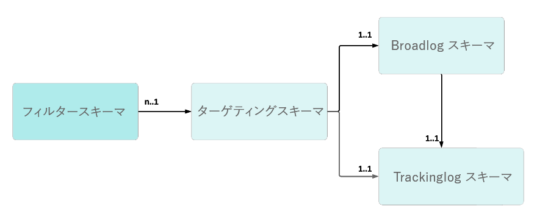

# トラッキングのトラブルシューティング{#tracking-troubleshooting}

この節では、Adobe Campaign Classicの設定と導入のトラッキングに関するよくある質問を見つけます。

## トラッキングワークフローは{#tracking-workflow-failing}に失敗しています

トラッキングワークフローに失敗しています。トラッキングファイル内の破損した行を検出するにはどうすればよいですか。

>[!NOTE]
>
>Windowsでのみ使用可能

破損したトラッキングログファイル…/nl6/var/&lt;instance_name>/redir/log/0x0000ログは、トラッキングワークフローを停止できます。 破損した行を簡単に検出して削除し、トラッキングワークフローを再開するには、次のコマンドを使用します。

### どのファイルに破損した行があるかは分かっています

この場合、0x0000000000A00000A0000.logファイル内に破損した行が見つかりますが、同じ処理をファイルのセット（1つずつ）に適用できます。

```
$ cd {install directory}/var/{instance name}/redir/log
$ cat 0x00000000000A0000.log | sed -nE '/^[[:alnum:]]{2}x[[:alnum:]]*\t[0-9T:\.-]*\t[0-9a-fA-F]*\t[0-9a-fA-F]*\t[0-9a-fA-F]*\t[[:alnum:]]*\t[[:alnum:]-]*\t[[:print:]]*\t[[:print:]]*\t[[:print:]]*\t([0-9a-fA-F\.:]*|[0-9a-fA-F\.:]*\t[[:print:]]*|[0-9a-fA-F\.:]*,[[:print:]]*)$/!p'
```

その後、追跡ワークフローを停止し、破損した行を削除して、ワークフローを再開できます。

### 現在、破損した行がどのファイルにあるかは分かりません

1. 次のコマンドラインを使用して、すべてのトラッキングファイルをチェックインします。

   ```
   $ cd {install directory}/var/{instance name}/redir/log
   $ cat *.log | sed -nE '/^[[:alnum:]]{2}x[[:alnum:]]*\t[0-9T:\.-]*\t[0-9a-fA-F]*\t[0-9a-fA-F]*\t[0-9a-fA-F]*\t[[:alnum:]]*\t[[:alnum:]-]*\t[[:print:]]*\t[[:print:]]*\t[[:print:]]*\t([0-9a-fA-F\.:]*|[0-9a-fA-F\.:]*\t[[:print:]]*|[0-9a-fA-F\.:]*,[[:print:]]*)$/!p'
   ```

1. コマンドは、破損した行をすべてリストします。 例：

   ```
   50x000000000FD7EC86 2017-06-24T21:00:50.96 1f506d71 1aeab4b6 1af77020 0 e5155671-4ab7-4ce4-a763-3b82dda6d881 h
   Mozilla/5.0 (Macintosh; Intel Mac OS X 10_12_4) AppleWebKit/537.36 (KHTML, like Gecko) Chrome/55.0.2883.95 Safari/537.36 52.46.20.64
   ```

   >[!NOTE]
   >
   >読み込みを改善し、効果的なレンダリングを反映しないように、User Agentの前にキャリッジリターンが追加されました。

1. grepコマンドを実行して、対応するファイルを探します。

```
$ grep -Rn <Log Id>
# for example:
$ grep -Rn 50x000000000FD7EC86
```

1. ファイル名と行番号を使用して、障害のあるログを見つけます。 例：

   ```
   ./0x000000000FD7E000.log:3207:50x000000000FD7EC86 2017-06-24T21:00:50.96 1f506d71 1aeab4b6 1af77020 0 e5155671-4ab7-4ce4-a763-3b82dda6d881 h
   Mozilla/5.0 (Macintosh; Intel Mac OS X 10_12_4) AppleWebKit/537.36 (KHTML, like Gecko) Chrome/55.0.2883.95 Safari/537.36 52.46.20.64
   ```

   >[!NOTE]
   >
   >読み込みの向上を図るため、また効果的なレンダリングを反映しないために、User Agentの前にキャリッジリターンが追加されました。

その後、追跡ワークフローを停止し、破損した行を削除して、ワークフローを再開できます。

## リンクのトラッキングが断続的に失敗する{#tracking-links-fail-intermittently}

トラッキングリンクにアクセスしようとすると、次のメッセージが表示されます。

`Requested URL '/r/ id=h787bc0,281a4d8,281a4da&amp;p1=1' cannot be found`

1. &lt;redirection_server>/r/test URLにアクセスし、ビルド番号とlocalhostが要求によって返されたかどうかを確認します。

1. トラッキングサーバーのserverConf.xmlファイルで、spareServerの設定を確認します。 この構成はリダイレクトモードにする必要があります。

   ```
   <redirection>
      <spareServer _operation="update" enabledIf="$(hostname)!='test-rt1'" id="1"
      url="http://test-rt1:8080"/>
      <spareServer _operation="insert" enabledIf="$(hostname)!='test-rt4'" id="4"
      url="http://test-rt4:8080"/>
      <spareServer _operation="insert" enabledIf="$(hostname)!='test-rt3'" id="3"
      url="http://test-rt3:8080"/>
      <spareServer _operation="insert" enabledIf="$(hostname)!=test-rt2'" id="2"
      url="http://test-rt2:8080"/>
   </redirection>
   ```

1. &lt;deliveryID>.xmlファイルがマシン上の…に存在するかどうかを手動で確認します。/nl6/var/&lt;インスタンス名>/redir/url/&lt;YYYY>ディレクトリ(YYYYは配信の年を表します)。

1. &lt;trackingUrlId>が&lt;deliveryID>.xmlファイル内に見つかるかどうかを手動で確認します。

1. 関連するdeliveryID配信内にbroadlogIDが手動で存在するかどうかを確認します。

1. &lt;deliveryID>.xmlファイルの権限を。./nl6/var/&lt;instance_name>/redir/url/yearディレクトリ。

   リクエストされたリンクをリダイレクトするためにApacheがトラッキングURLを読み取れるように、少なくとも644の権限が必要です。

## NmsTracking_Pointerオプションを更新していますか？{#updating-option}

NmsTracking_Pointerオプションを更新する場合は、次の手順に従います。

1. 追跡ワークフローを停止します。

1. trackinglogdサービスを停止します。

1. NmsTracking_Pointerオプションを必要な値に更新します。

1. trackinglogdサービスを再起動します。

1. トラッキングワークフローを再開します。

## 追跡が一部のWebMail {#webmail}で動作しないようです

クリック追跡の数式をカスタマイズして、カスタムのAdobe Analytics追跡の数式を指定できます。

このようなカスタマイズは、改行文字の追加を避けるために、注意して行う必要があります。 JavaScript式以外に存在する改行文字はすべて、最終式に含まれます。

この種の追加の改行文字がトラッキングURLに含まれている場合、一部のwebMail（AOL、GMailなど）で問題が発生します。

**最初の例：**

* 構文が正しくありません

   ```
   <%@ include option='NmsTracking_ClickFormula' %><% // Parameters expected by Adobe-Genesis
   var pattern = new RegExp("(nl611\.test15|google\.com)", 'i')
   if( $(urlstring).match(pattern) && delivery.FCP == false )
   {
   %>
   &cid=<%= message.delivery.internalName %>&bid=<%= message.id.toString().toLowerCase() %><% } %>
   ```

* 正しい構文

   ```
   <%@ include option='NmsTracking_ClickFormula' %><% // Parameters expected by Adobe-Genesis
   var pattern = new RegExp("(nl611\.test15|google\.com)", 'i')
   if( $(urlstring).match(pattern) && delivery.FCP == false )
   {
   %>&cid=<%= message.delivery.internalName %>&bid=<%= message.id.toString().toLowerCase() %><% } %>
   ```

余分な改行がどこにあるかを理解するために、javascript式を固定文字列STRINGで置き換えることができます。

```
// Incorrect
STRING1
&cid=STRING2&bid=STRING3

// Correct
STRING1&cid=STRING2&bid=STRING3
```

**2つ目の例**

* 構文が正しくありません

   ```
   <%@ include option='NmsTracking_ClickFormula' %>
   <% // Parameters expected by Adobe-Genesis
   var pattern = new RegExp("(vistaprint|entryUrl)", 'i')
   if( $(urlstring).match(pattern) && delivery.FCP == false )
   {%>&cid=<%= message.delivery.internalName%>&bid=<%= message.id.toString().toLowerCase()%>&SHPID=<%= message.recipient.factShopper.shopper_id %><% }
   
   %>
   ```

* 正しい構文

   ```
   <%@ include option='NmsTracking_ClickFormula' %><% // Parameters expected by Adobe-Genesis
   var pattern = new RegExp("(vistaprint|entryUrl)", 'i')
   if( $(urlstring).match(pattern) && delivery.FCP == false )
   {%>&cid=<%= message.delivery.internalName%>&bid=<%= message.id.toString().toLowerCase()%>&SHPID=<%= message.recipient.factShopper.shopper_id %><% }
   
   %>
   ```

余分な改行がどこにあるかを理解するために、javascript式を固定文字列STRINGで置き換えることができます。

```
// Incorrect
STRING1&cid=STRING2&bid=STRING3&SHPID=STRING4

// Correct
STRING1&cid=STRING2&bid=STRING3&SHPID=STRING4
```

## トラッキングログの取得が遅すぎます{#slow-retrieval}

インスタンスが直接トラッキングログを取得せず、遠く離れたAdobe Campaign Classicサーバーからログを取得する場合、そのログはremoteTrackingスキーマで定義されているGetTrackingLogs SOAP呼び出しを通じて取得されます。

serverConf.xmlファイルのオプションを使用すると、次のメソッドを使用して一度に取得されるログの数を設定できます。logCountPerRequest.

logCountPerRequestのデフォルト値は1000です。場合によっては、値が小さすぎることが証明されることがあります。 指定できる値は0 ～ 10.000の範囲です。

## トラッキングログを受信者{#link-recipients}にリンクできませんでした

Adobe Campaign Classicでは、ターゲットマッピングは、受信者スキーマとブロードログ/トラッキングログスキーマの点で一意であると見なされます。



追跡ワークフローでは、データとターゲティングIDを調整できないので、同じ追跡ログスキーマで複数のターゲティングスキーマを使用することはできません。

nms:受信者で標準搭載されたターゲットマッピングを使用しない場合は、次の方法を使用することをお勧めします。

* カスタムターゲティングディメンションを使用する場合、nms:broadlogをテンプレートとして使用するカスタムbroadLog/trackingLogスキーマを作成する必要があります（例：nms:broadLogRcp、nms:broadLogSvcなど）。

* OOB trackingLogRcp/broadLogRcpを使用する場合、ターゲティングディメンションはnms:受信者である必要があり、フィルタリングディメンションはカスタムスキーマである可能性があります。
