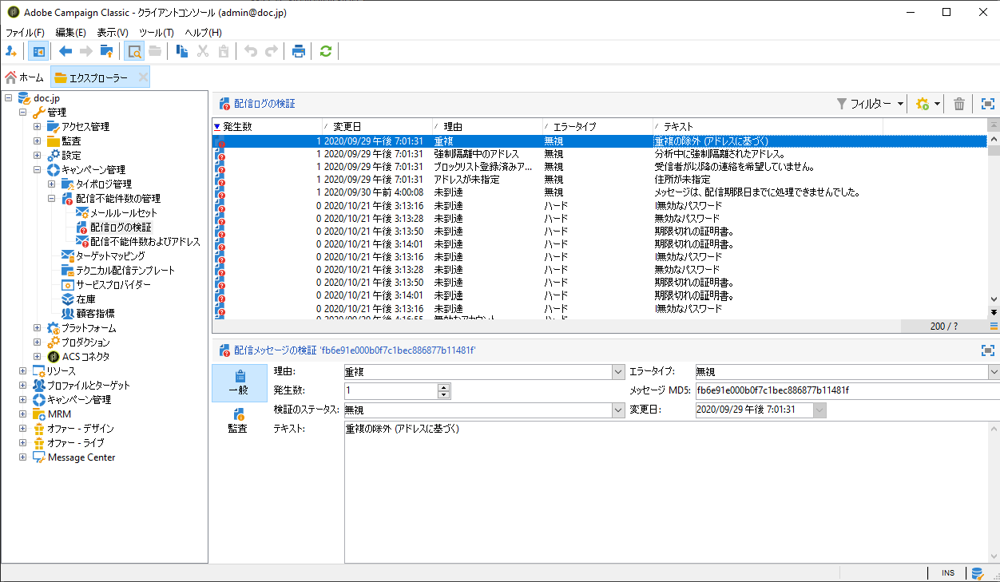
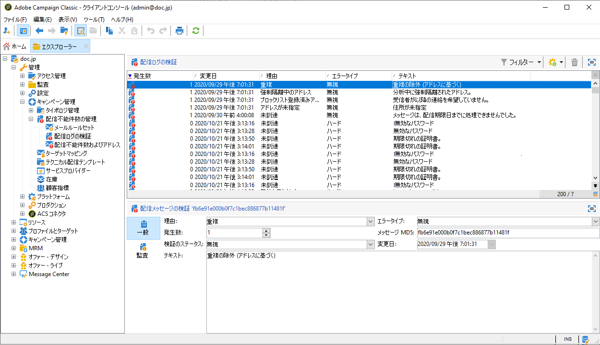
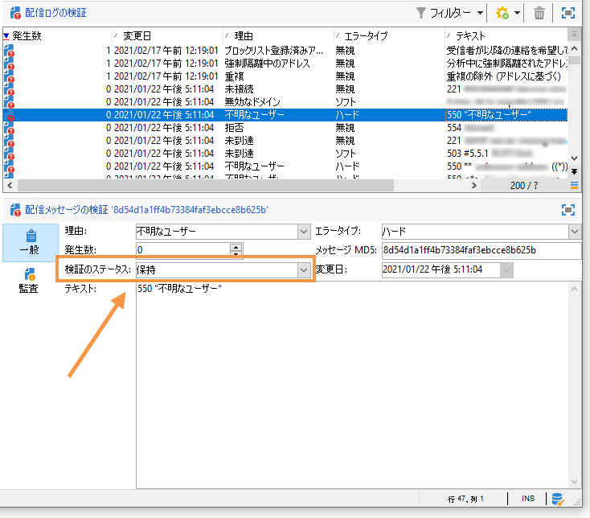
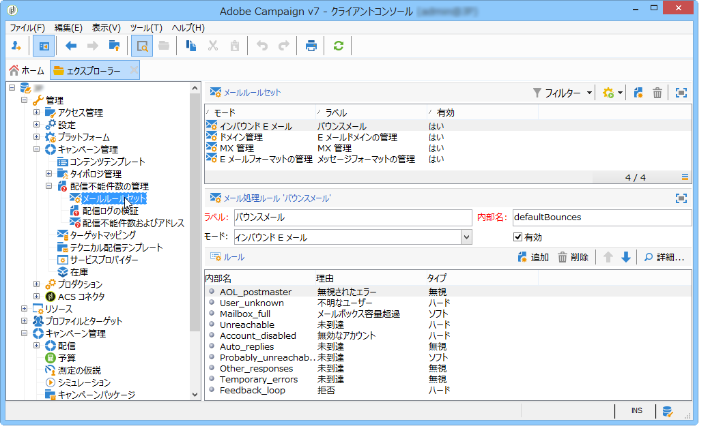
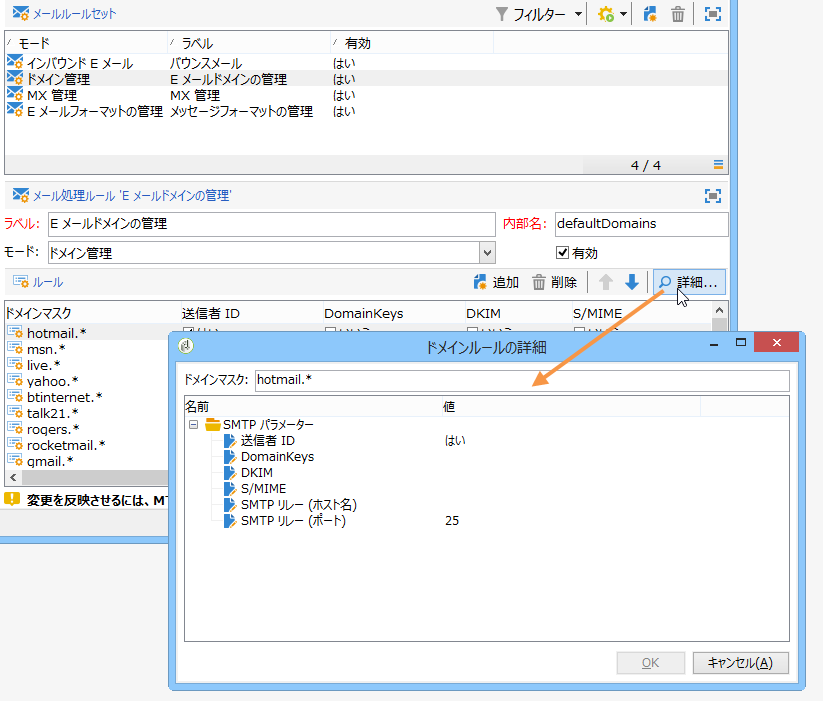

# 配信エラーの理解{#understanding-delivery-failures}

## 配信エラーについて {#about-delivery-failures}

メッセージ（E メール、SMS、プッシュ通知）をプロファイルに送信できない場合、リモートサーバーは自動的にエラーメッセージを送信します。このメッセージは Adobe Campaign プラットフォームによってピックアップされ、その E メールアドレスまたは電話番号を強制隔離するかどうかを決定するために評価されます。バウンスメ [ール管理を参照してください](#bounce-mail-management)。

>[!NOTE]
>
>E メールメッセージ（「バウンス」）は inMail プロセスによって評価されます。SMS エラーメッセージ（ステータスレポートを表す「SR」）は MTA プロセスによって評価されます。

メッセージの送信後、配信ログによって各プロファイルの配信ステータスと、関連するエラーのタイプおよび理由を確認できます。

アドレスが強制隔離されているか、プロファイルがブラックリストに登録されている場合、配信準備の際にメッセージを除外することもできます。除外されたメッセージのリストは、配信ダッシュボードに表示されます。

**関連トピック：**

* [配信ログと履歴](../../delivery/using/monitoring-a-delivery.md#delivery-logs-and-history)
* [失敗ステータス](../../delivery/using/monitoring-a-delivery.md#failed-status)
* [配信エラーのタイプと理由](#delivery-failure-types-and-reasons)

## 配信エラーのタイプと理由 {#delivery-failure-types-and-reasons}

メッセージエラーには次の 3 つのタイプがあります。それぞれのエラータイプによって、アドレスが強制隔離されるかどうかが決まります。この詳細については、「検疫へのア [ドレス送信の条件」を参照してください。](../../delivery/using/understanding-quarantine-management.md#conditions-for-sending-an-address-to-quarantine)

* **ハード**:「ハード」エラーは、無効なアドレスを示します。 これには、次のように、アドレスが無効であることを明示的に示すエラーメッセージが含まれます。&quot;不明なユーザー&quot;。
* **ソフト**:これは一時的なエラーであるか、次のように分類できなかった可能性があります。&quot;無効なドメイン&quot;または&quot;メールボックスがいっぱい&quot;です。
* **無視**:これは、「不在」や技術的なエラーなど、一時的なエラーであることがわかっているエラーです。例えば、送信者のタイプが「postmaster」の場合などです。

配信エラーの理由として考えられるものを以下に示します。

<table> 
 <tbody> 
  <tr> 
   <td> エラーラベル </td> 
   <td> エラータイプ </td> 
   <td> 技術値 </td> 
   <td> 説明 </td> 
  </tr> 
  <tr> 
   <td> 無効なアカウント </td> 
   <td> ソフト／ハード </td> 
   <td> 4 </td> 
   <td> アドレスにリンクされているアカウントはもはやアクティブではありません。インターネットアクセスプロバイダー（IAP）は、長期間使用されていないことを検出すると、そのユーザーのアカウントをクローズできます。そのユーザーのアドレスへの配信は不可能になります。アカウントが 6 ヶ月間使用されていないことが原因で一時的に無効になっていて、まだ有効化することができる場合は、エラーありステータスが割り当てられ、エラーカウンターが 5 に達するまでアカウントが再試行されます。アカウントが永続的に無効化されたことをエラーが示している場合は、アカウントは直接強制隔離に設定されます。  </td> 
  </tr> 
  <tr> 
   <td> 強制隔離中のアドレス </td> 
   <td> ハード </td> 
   <td> 9 </td> 
   <td> アドレスは強制隔離されました。  </td> 
  </tr> 
  <tr> 
   <td> アドレスが未指定 </td> 
   <td> ハード </td> 
   <td> 7 </td> 
   <td> 受信者のアドレスが指定されていません。  </td> 
  </tr> 
  <tr> 
   <td> 低品質のアドレス </td> 
   <td> 無視 </td> 
   <td> 14 </td> 
   <td> このアドレスの品質評価が低すぎます。  </td> 
  </tr> 
  <tr> 
   <td> ブラックリストに登録されたアドレス </td> 
   <td> ハード </td> 
   <td> 8 </td> 
   <td> このアドレスは送信時にブラックリストに登録されていました。このステータスは、データを Adobe Campaign の強制隔離リストにインポートするときに外部リストおよび外部システムからデータをインポートするために使用します。  </td> 
  </tr> 
  <tr> 
   <td> 制御アドレス </td> 
   <td> 無視 </td> 
   <td> 127 </td> 
   <td> 受信者のアドレスはコントロール母集団に含まれています。  </td> 
  </tr> 
  <tr> 
   <td> 重複 </td> 
   <td> 無視 </td> 
   <td> 10 </td> 
   <td> 受信者のアドレスがこの配信に既に存在しました。  </td> 
  </tr> 
  <tr> 
   <td> 無視されたエラー </td> 
   <td> エラーなし </td> 
   <td> 2018 年 </td> 
   <td> アドレスはホワイトリストに含まれています。したがってエラーは無視され、E メールは送信されます。  </td> 
  </tr> 
  <tr> 
   <td> 判別後に除外 </td> 
   <td> 無視 </td> 
   <td> 12 </td> 
   <td> 受信者が「判別」タイプのキャンペーンタイポロジルールによって除外されました。  </td> 
  </tr> 
  <tr> 
   <td> SQL ルールによって除外 </td> 
   <td> 無視 </td> 
   <td> 11 </td> 
   <td> 受信者が「SQL」タイプのキャンペーンタイポロジルールによって除外されました。  </td> 
  </tr> 
  <tr> 
   <td> 無効なドメイン </td> 
   <td> ソフト </td> 
   <td> 2 </td> 
   <td> E メールアドレスのドメインが正しくないか、存在しません。このプロファイルは、エラーカウントが 5 にならない限り、再びターゲットになります。その後、レコードは強制隔離ステータスに設定され、以降は再試行されなくなります。  </td> 
  </tr> 
  <tr> 
   <td> メールボックス容量超過 </td> 
   <td> ソフト </td> 
   <td> 2018 年 </td> 
   <td> このユーザーのメールボックスはいっぱいになっていて、メッセージをこれ以上受け入れることができません。このプロファイルは、エラーカウントが 5 にならない限り、再びターゲットになります。その後、レコードは強制隔離ステータスに設定され、以降は再試行されなくなります。 このタイプのエラーはクリーンアッププロセスによって管理されます。アドレスは 30 日後に有効なステータスに設定されます。  警告：隔離されたアドレスのリストからアドレスを自動的に削除するには、データベースクリーンアップの技術ワークフローを開始する必要があります。  </td> 
  </tr> 
  <tr> 
   <td> 未接続 </td> 
   <td> 無視 </td> 
   <td> 2018 年 </td> 
   <td> メッセージが送信されたときに受信者の携帯電話の電源が切れていたか、ネットワークに接続されていませんでした。  </td> 
  </tr> 
  <tr> 
   <td> 未定義 </td> 
   <td> 未定義 </td> 
   <td> 0 </td> 
   <td> エラーがまだインクリメントされていないので、アドレスは検証中です。このタイプのエラーは、サーバーが新しいエラーメッセージを送信すると発生します。単独のエラーである可能性もありますが、再度発生した場合はエラーカウンターがインクリメントされ、テクニカルチームに警告されます。その後、テクニカルチームは、ツリー構造の管理／キャンペーン管理／配信不能件数の管理ノードからメッセージの分析を実行し、このエラーを検証します。  </td> 
  </tr> 
  <tr> 
   <td> オファーを受ける資格がない </td> 
   <td> 無視 </td> 
   <td> 16 </td> 
   <td> 受信者には配信でオファーを受ける資格がありませんでした。  </td> 
  </tr> 
  <tr> 
   <td> 拒否 </td> 
   <td> ソフト／ハード </td> 
   <td> 20 </td> 
   <td> アドレスは、スパムレポートであるというセキュリティフィードバックが原因で強制隔離されました。アドレスは、エラーに応じて、エラーカウンターが 5 に達するまで再試行されるか、直接強制隔離されます。  </td> 
  </tr> 
  <tr> 
   <td> サイズが制限されたターゲット </td> 
   <td> 無視 </td> 
   <td> 17 </td> 
   <td> 受信者に対する最大配信サイズに達しました。  </td> 
  </tr> 
  <tr> 
   <td> 未適合のアドレス </td> 
   <td> 無視 </td> 
   <td> 2019 年 </td> 
   <td> 郵便物の送付先住所が選定されていません。  </td> 
  </tr> 
  <tr> 
   <td> 未到達 </td> 
   <td> ソフト／ハード </td> 
   <td> 3 </td> 
   <td> メッセージ配信チェーンでエラーが発生しました。SMTP リレーに関するインシデント、ドメインへの一時的な未到達などの可能性があります。アドレスは、エラーに応じて、エラーカウンターが 5 に達するまで再試行されるか、直接強制隔離されます。  </td> 
  </tr> 
  <tr> 
   <td> 不明なユーザー </td> 
   <td> ハード </td> 
   <td> 1 </td> 
   <td> アドレスが存在しません。このプロファイルに対する配信はこれ以上試行されません。  </td> 
  </tr> 
 </tbody> 
</table>

## 一時的な配信エラーの後の再試行 {#retries-after-a-delivery-temporary-failure}

一時的な&#x200B;**ソフト**&#x200B;または&#x200B;**無視**&#x200B;のエラーによるメッセージエラーが発生した場合、再試行が配信期間中におこなわれます

>[!NOTE]
>
>Temporarily undelivered messages can only be related to a **Soft** or **Ignored** error, but not a **Hard** error (see [Delivery failure types and reasons](#delivery-failure-types-and-reasons)).

配信の期間を変更するには、配信の高度なパラメーターまたは配信テンプレートにアクセスし、対応するフィールドで希望の期間を指定します。高度な配信プロパティについては、[この節](../../delivery/using/steps-sending-the-delivery.md#defining-validity-period)で説明しています。

デフォルトの設定では、1 時間間隔で 5 回、その後 4 日間は 1 日に 1 回再試行されます。再試行の回数の変更は、グローバルに（アドビの技術管理者にお問い合わせください）、または配信または配信テンプレートごとに（[この節](../../delivery/using/steps-sending-the-delivery.md#configuring-retries)を参照）おこなうことができます。

## 同期エラーと非同期エラー {#synchronous-and-asynchronous-errors}

メッセージは、ただちにエラーになることも（同期エラー）、送信後しばらくしてエラーになることも（非同期エラー）あります。

* 同期エラー：Adobe Campaign 配信サーバーによってアクセスされたリモートメールサーバーがエラーメッセージを返します。配信をプロファイルのサーバーに送ることは許可されません。Adobe Campaign が個々のエラーを評価して、その E メールアドレスを強制隔離すべきかどうかを判断します。バウンスメ [ールの資格を参照してくださ](#bounce-mail-qualification)い。
* 非同期エラー：バウンスメールまたは SR が受信サーバーによって後で再送信された場合です。このメールは、メッセージにエラーのラベルを付けるためにアプリケーションが使用するテクニカルメールボックスに読み込まれます。非同期エラーは、配信の送信から 1 週間が経過するまで発生する可能性があります。

   >[!NOTE]
   >
   >バウンスメールボックスの設定については、[この節](../../installation/using/deploying-an-instance.md#managing-bounced-emails)で詳しく説明しています。

   フィードバックループはバウンス E メールのように機能します。ユーザーが E メールをスパムとみなしたら、Adobe Campaign で E メールルールを設定して、このユーザーへのすべての配信をブロックできます。E メールをスパムとみなしたユーザーに送信されたメッセージは、この目的用に特別に作成された E メールボックスに自動的にリダイレクトされます。このようなユーザーのアドレスは、購読解除リンクをクリックしなかった場合でも、ブラックリストに登録されます。アドレスは、（**NmsRecipient**）受信者テーブルではなく、（**NmsAddress**）強制隔離テーブルでブラックリストに登録されます。

   >[!NOTE]
   >
   >苦情数管理については、[配信品質の管理](../../delivery/using/about-deliverability.md)の節で詳しく説明しています。

## バウンスメール管理 {#bounce-mail-management}

Adobe Campaign プラットフォームでは、バウンスメール機能を使用して、E メール配信の失敗を管理できます。E メールを受信者に配信できない場合は、リモートメッセージングサーバーが、専用のテクニカル受信ボックスにエラーメッセージ（バウンスメール）を自動的に返します。E メール管理ルールのリストを充実させるために、エラーメッセージは Adobe Campaign プラットフォームによって収集され、inMail プロセスによって評価されます。

### バウンスメール強制隔離 {#bounce-mail-qualification}

E メールの配信が失敗すると、Adobe Campaign の配信サーバーはメッセージングサーバーまたはリモート DNS サーバーからエラーメッセージを受け取ります。エラーのリストは、リモートサーバーが返したメッセージに含まれる文字列で構成されます。エラータイプと理由が各エラーメッセージに割り当てられます。

このリストはノードを介して使用で **[!UICONTROL Administration > Campaign Management > Non deliverables Management > Delivery log qualification]** きます。 このリストには、配信エラーを評価するために Adobe Campaign が使用するすべてのルールが含まれています。このリストは、完成されたものではなく、Adobe Campaign によって定期的に更新されます。ユーザーが管理することもできます。

* The message returned by the remote server on the first occurrence of this error type is displayed in the **[!UICONTROL First text]** column of the **[!UICONTROL Delivery log qualification]** table. If this column is not displayed, click the **[!UICONTROL Configure list]** button at the right bottom of the list to select it.

Adobe Campaignは、このメッセージをフィルタリングして変数の内容（ID、日付、電子メールアドレス、電話番号など）を削除します。フィルターを適用した結果を列に表示 **[!UICONTROL Text]** します。 The variables are replaced with **`#xxx#`**, except addresses that are replaced with **`*`**.

このプロセスで同じタイプのすべてのエラーをまとめることにより、同じようなエラーの複数のエントリが配信ログの検証テーブルに含まれないようにすることができます。

>[!NOTE]
>
>The **[!UICONTROL Number of occurrences]** field displays the number of occurrences of the message in the list. 上限は 100,000 回です。このフィールドは、リセットする場合など、必要に応じて編集できます。

バウンスメールは、次の検証ステータスを持つことができます。

* **[!UICONTROL To qualify]** :バウンスメールは資格を得られませんでした。 選定を配信品質チームに割り当てて、効率的なプラットフォーム配信品質を保証する必要があります。選定されていないバウンスメールは、E メール管理ルールのリストのエンリッチメントには使用されません。
* **[!UICONTROL Keep]** :バウンスメールは資格があり、配信品質のワークフローを既存の電子メール管理ルールと比較し **** 、リストを強化するために更新で使用されます。
* **[!UICONTROL Ignore]** :バウンスメールは認定されましたが、配信品質のワークフローのために **更新で使用されません** 。 バウンスメールはクライアントインスタンスに送信されません。

>[!NOTE]
>
>ホストインストールまたはハイブリッドインストールの場合、拡張MTAにアップグレードした場合、表のバウンス **[!UICONTROL Delivery log qualification]** 条件は使用されなくなります。 拡張MTAは、バウンスのタイプと資格を決定し、その情報をCampaignに返します。
>
>Adobe Campaign拡張MTAについて詳しくは、このドキュメントを参照してく [ださい](https://helpx.adobe.com/campaign/kb/campaign-enhanced-mta.html)。

### E メール管理ルール {#email-management-rules}

メールルールはノードを介してアクセス **[!UICONTROL Administration > Campaign Management > Non deliverables Management > Mail rule sets]** されます。 E メール管理ルールがウィンドウの下部に表示されます。

これらのルールには、リモートサーバーが返すことができ、エラー（**ハード**、**ソフト**&#x200B;または&#x200B;**無視**）を検証できる文字列のリストが含まれます。

>[!NOTE]
>
>プラットフォームのデフォルトのパラメーターは、デプロイウィザードで設定します。詳しくは、[この節](../../installation/using/deploying-an-instance.md)を参照してください。

デフォルトのルールには次のものがあります。

* **インバウンド E メール**

   E メールが失敗すると、リモートサーバーがプラットフォームのパラメーターで指定されたアドレスにバウンスメールを返します。Adobe Campaign は、各バウンスメールのコンテンツをルールのリストの文字列と比較して、3 つのエラータイプのいずれかを割り当てます。

   ユーザーは独自のルールを作成できます。

   >[!CAUTION]
   >
   >パッケージをインポートしたり、**配信品質の更新**&#x200B;ワークフローでデータを更新すると、ユーザーが作成したルールが上書きされます。

* **ドメイン管理**

   ドメイン管理ルールを使用して、特定のドメインに送信される E メールのフローを規制します。このルールは、バウンスメッセージをサンプリングし、必要に応じて送信をブロックします。Adobe Campaign のメッセージングサーバーは、ドメイン独自のルールを適用します。一般的なケース用のルールは、ルールのリストにアスタリスクで表されます。デフォルトでは、Adobe Campaign で Hotmail ドメインと MSN ドメイン用のルールを使用できます。

   Click the **[!UICONTROL Detail]** icon to access rule configuration.

   

   ドメイン管理ルールを設定するには、しきい値を設定して、特定の SMTP パラメーターを選択するだけです。**しきい値**&#x200B;とは、特定のドメイン宛てのメッセージをブロックする基準となるエラー率です。エラー率がこの値を超えると、特定のドメイン宛てのすべてのメッセージがブロックされます。

   例えば一般的なケースでは、300 件以上のメッセージに対してエラー率が 90％に達すると、E メールの送信が 3 時間ブロックされます。

   **SMTP パラメーター**&#x200B;は、ブロッキングルールに適用されるフィルターの役割を果たします。

   * 特定の識別標準や、**送信者 ID**、**DomainKeys**、**DKIM**、**S/MIME** などドメイン名をチェックするための暗号鍵を有効化するかどうかを選択できます。
   * **SMTP リレー**：特定のドメインのリレーサーバーの IP アドレスおよびポートを設定できます。

* **MX 管理**

   MX 管理について詳しくは、[この節](../../installation/using/email-deliverability.md#mx-configuration)を参照してください。

   >[!NOTE]
   >
   >ホストインストールまたはハイブリッドインストールの場合、拡張MTAにアップグレードした場合、配信スル **[!UICONTROL MX management]** ープットルールは使用されなくなります。 拡張MTAは独自のMXルールを使用し、独自の履歴電子メールの評判や、電子メールを送信するドメインからのリアルタイムフィードバックに基づいて、ドメインごとにスループットをカスタマイズできます。
   >
   >Adobe Campaign拡張MTAについて詳しくは、このドキュメントを参照してく [ださい](https://helpx.adobe.com/campaign/kb/campaign-enhanced-mta.html)。

>[!CAUTION]
>
>* パラメーターを変更した場合は、配信サーバー（MTA）を再起動する必要があります。
>* 管理ルールを変更または作成できるのは、エキスパートユーザーのみです。

