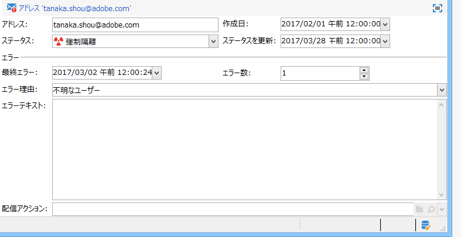
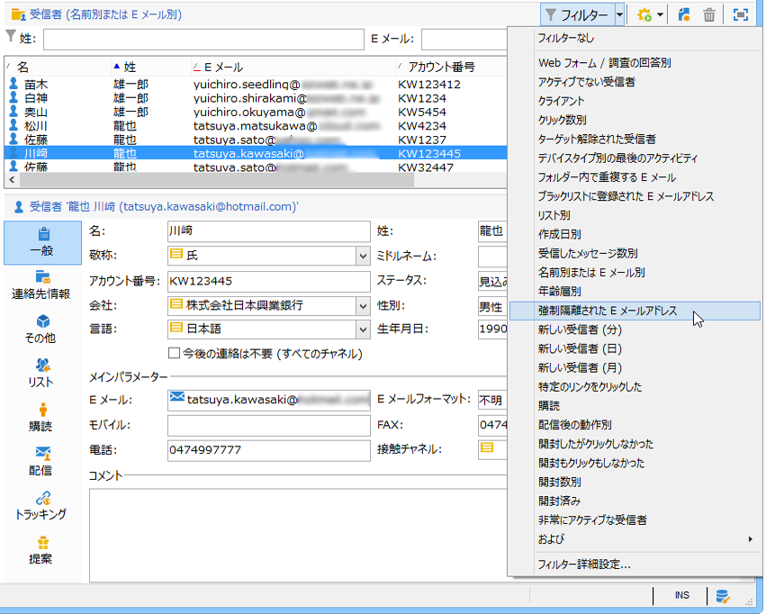
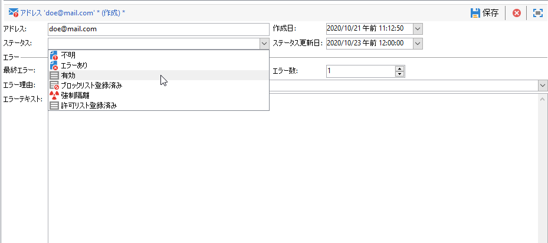
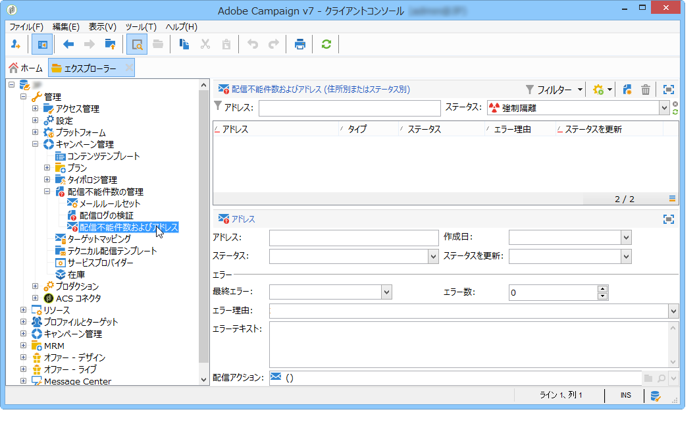
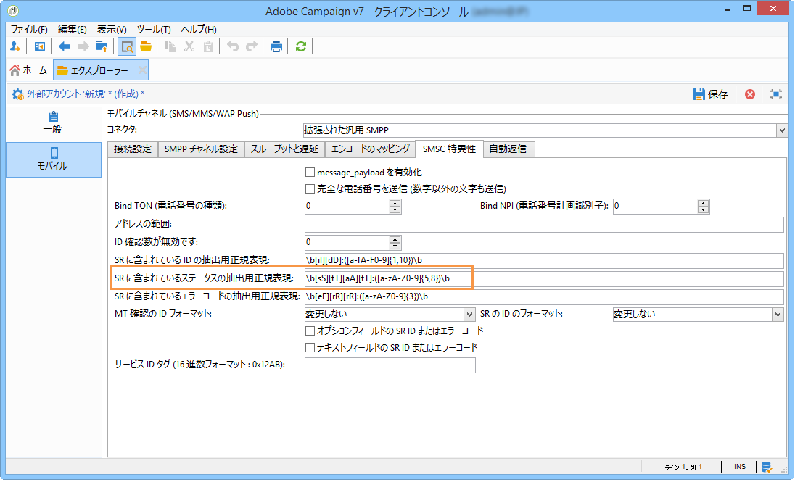

# 強制隔離管理の理解{#understanding-quarantine-management}

## 強制隔離について {#about-quarantines}

Adobe Campaign では、強制隔離されたアドレスのリストを管理します。アドレスが強制隔離されている受信者は、配信分析時にデフォルトで除外され、ターゲットにされなくなります。例えば、メールボックスの容量が超過している場合や、アドレスが存在しない場合などに、E メールアドレスを強制隔離できます。どのような場合でも、強制隔離手順は、次に説明する特定のルールに従います。

>[!NOTE]
>
>この節は、オンラインチャネル（E メール、SMS、プッシュ通知）に当てはまります。

### 強制隔離による配信の最適化 {#optimizing-your-delivery-through-quarantines}

The profiles whose email addresses or phone number are in quarantine are automatically excluded during message preparation (see [Identifying quarantined addresses for a delivery](#identifying-quarantined-addresses-for-a-delivery)). これによって配信が迅速になります。エラー率は配信の速度に大きく影響するからです。

一部のインターネットアクセスプロバイダーは、無効なアドレスの割合が高すぎる場合、E メールを自動的にスパムとみなします。そのため、強制隔離することで、こうしたプロバイダーによるブラックリストへの登録を回避できます。

また、強制隔離は、誤りのある電話番号を配信から除外することで、SMS の送信コスト削減にも役立ちます。配信を保護および最適化するベストプラクティスについて詳しくは、[このページ](https://docs.campaign.adobe.com/doc/AC/getting_started/EN/deliveryBestPractices.html)を参照してください。

### 強制隔離とブラックリストへの登録 {#quarantine-vs-blacklisting}

**強制隔離**&#x200B;は、プロファイル自体ではなく、アドレスのみに適用されます。つまり、2 つのプロファイルに同じ E メールアドレスがある場合、そのアドレスが強制隔離されると、両方のプロファイルが影響を受けます。

同様に、E メールアドレスが強制隔離されているプロファイルは、プロファイルを更新して新しいアドレスを入力できるので、再び配信アクションのターゲットになる可能性があります。

一方、**ブラックリストへの登録**&#x200B;では、登録されたプロファイルが、購読解除（オプトアウト）後のように、それ以降はどのような配信のターゲットにもならなくなります。

>[!NOTE]
>
>SMS 配信からのオプトアウトのために「STOP」のようなキーワードを使ってユーザーが SMS メッセージに返信しても、そのユーザーのプロファイルは、E メールのオプトアウトプロセスのようにはブラックリストに登録されません。強制隔離されるのはプロファイルの電話番号なので、そのユーザーは引き続き E メールメッセージを受信できます。

## 強制隔離アドレスの識別 {#identifying-quarantined-addresses}

強制隔離されたアドレスは、特定の配信またはプラットフォーム全体を対象としてリストすることができます。

### 配信用の強制隔離アドレスの識別 {#identifying-quarantined-addresses-for-a-delivery}

Quarantined addresses for a specific delivery are listed during the delivery preparation phase, in the delivery logs of the delivery dashboard (see [Delivery logs and history](../../delivery/using/monitoring-a-delivery.md#delivery-logs-and-history)).

### プラットフォーム全体の強制隔離アドレスの識別 {#identifying-quarantined-addresses-for-the-entire-platform}

管理者は、ノードからプラットフォーム全体の検疫済みのアドレスを一覧表示で **[!UICONTROL Administration > Campaign Management > Non deliverables Management > Non deliverables and addresses]** きます。

>[!NOTE]
>
>このメニューでは、**E メール**、**SMS** および&#x200B;**プッシュ通知**&#x200B;チャネルの強制隔離された要素のリストが表示されます。

アドレスごとに次の情報を表示できます。



>[!NOTE]
>
>強制隔離数の増加は、データベースの「老朽化」に関連する、正常な影響です。例えば、E メールアドレスの寿命が 3 年と考えられ、受信者テーブルが毎年 50％増加する場合、強制隔離の増加は次のように計算できます。
>
>1年目の終わり：(1*0.33)/(1+0.5)=22%。
2年目の終わり：(1.22*0.33)+0.33)/(1.5+0.75)=32.5%.

### 配信レポートでの強制隔離アドレスの識別 {#identifying-quarantined-addresses-in-delivery-reports}

次のレポートには、強制隔離中のアドレスに関する情報が含まれます。

* For each delivery, the **[!UICONTROL Delivery summary]** report shows the number of addresses in quarantine in the delivery target. 次のものが表示されます。

   * 配信分析時に強制隔離されたアドレス数

   * 配信アクション後に強制隔離されたアドレス数

* The **[!UICONTROL Non-deliverables and bounces]** report displays information about the addresses in quarantine, the types of error encountered, etc., and a failure breakdown by domain.

プラットフォームのすべての配信について（**ホームページ／レポート**）または特定の配信について、この情報を調べることができます。カスタマイズされたレポートを作成して、表示する情報を選択することもできます。

### 受信者の強制隔離アドレスの識別 {#identifying-quarantined-addresses-for-a-recipient}

あらゆる受信者の E メールアドレスのステータスを調べることができます。To do this, select the recipient profile and click the **[!UICONTROL Deliveries]** tab. その受信者へのすべての配信について、アドレスへの配信が失敗したかどうか、分析時に強制隔離されたかどうかなどを調べることができます。フォルダーごとに、E メールアドレスが強制隔離中の受信者のみを表示できます。これを行うには、アプリケーションフィルタ **[!UICONTROL Quarantined email address]** ーを使用します。



### 強制隔離されたアドレスの削除 {#removing-a-quarantined-address}

If you need to remove an address from quarantine, change its status manually to **[!UICONTROL Valid]**.



If you change the status to **[!UICONTROL Whitelisted]**, the address will be targeted systematically each time even if an error is encountered.

>[!CAUTION]
ブラックリストに登録されたアドレスは強制隔離システムで扱わないので、このアドレスのステータスを変更してもターゲットにはなりません。

エラー数およびエラーとエラーの間隔も変更できます。そのためには、デプロイウィザードの設定（E メールチャネル／詳細設定）を変更します。デプロイウィザードについて詳しくは、[この節](../../installation/using/deploying-an-instance.md)を参照してください。

## アドレスを強制隔離する条件 {#conditions-for-sending-an-address-to-quarantine}

Adobe Campaignは、配信失敗のタイプと、エラーメッセージの資格(バウンスメールの資格を参照 [)および配信失敗のタイプと理由に従って、](../../delivery/using/understanding-delivery-failures.md#bounce-mail-qualification)検疫を管理します [](../../delivery/using/understanding-delivery-failures.md#delivery-failure-types-and-reasons)。

* **無視のエラー**：アドレスを強制隔離しません。
* **ハードエラー**：対応する E メールアドレスがただちに強制隔離されます。
* **ソフトエラー**：ただちにアドレスが強制隔離されることはありませんが、エラーカウンターがインクリメントされます。詳しくは、「ソフトエラー管理」を [参照してください](#soft-error-management)。

ユーザーが E メールをスパム（**フィードバックループ**）と評価した場合、メッセージはアドビが管理するテクニカルメールボックスに自動的にリダイレクトされます。さらに、その E メールアドレスは自動的に強制隔離されます。

In the list of quarantined addresses, the **[!UICONTROL Error reason]** field indicates why the selected address was placed in quarantine. Adobe Campaignでの検疫では、大文字と小文字が区別されます。 後で再ターゲットされないように、電子メールアドレスは小文字でインポートしてください。



### ソフトエラー管理 {#soft-error-management}

ハードエラーとは異なり、ソフトエラーは、検疫のためのアドレスを直ちに送信せず、代わりにエラーカウンターを増分します。

* エラーカウンターが制限しきい値に達すると、アドレスは検疫の対象になります。
* デフォルトの設定では、しきい値はエラー 5 回に設定されています。2 つのエラーは、24 時間以上間隔を開けて発生する場合に意味を持ちます。5回目の誤りで住所が検疫中です。
* エラーカウンターのしきい値は変更できます。この詳細については、「配信の一時的な失 [敗後の再試行」を参照してください](../../delivery/using/understanding-delivery-failures.md#retries-after-a-delivery-temporary-failure)。

最後の重大なエラーが10日以上前に発生した場合、エラーカウンターが再初期化されます。 The address status then changes to **Valid** and it is deleted from the list of quarantines by the **Database cleanup** workflow.

## プッシュ通知の強制隔離 {#push-notification-quarantines}

プッシュ通知の強制隔離メカニズムは、全体として通常のプロセスと同じものです。「検疫につ [いて」を参照してくださ](#about-quarantines)い。 ただし、プッシュ通知では一部のエラーの管理方法が異なります。例えば、一部のソフトエラーでは、同じ配信の再試行は実行されません。プッシュ通知特有の方式を以下に示します。再試行の方式（再試行の回数、頻度）は E メールの場合と同じです。

強制隔離される項目はデバイストークンです。

### iOS での強制隔離 {#ios-quarantine}

**iOS の場合：バイナリコネクタ**

Adobe Campaign は通知ごとに APNS サーバーから同期エラーと非同期エラーを受け取ります。次の同期エラーについては、ソフトエラーが生成されます。

* Payload length issues: no retry, the failure reason is **[!UICONTROL Unreachable]**.
* Certificate expiration issues: no retry, the failure reason is **[!UICONTROL Unreachable]**.
* Connection lost during the delivery: retry performed, the failure reason is **[!UICONTROL Unreachable]**.
* Service configuration issue (invalid certificate, invalid certificate password, no certificate): no retry, the failure reason is **[!UICONTROL Unreachable]**.

APNS サーバーは Adobe Campaign に対し、デバイストークンが（モバイルアプリケーションがユーザーによりアンインストールされた時点で）登録解除されたことを非同期的に通知します。**[!UICONTROL mobileAppOptOutMgt]** ワークフローは 6 時間ごとに実行されます。このワークフローは APNS フィードバックサービスにアクセスし、**AppSubscriptionRcp** テーブルを更新します。無効になっているすべてのトークンについて、「**無効**」フィールドが「**True**」に設定され、そのサービストークンにリンクされている購読は自動的にそれ以降の配信から除外されます。

**iOS の場合：HTTP/2 コネクタ**

http/2 プロトコルでは、プッシュ配信ごとの直接フィードバックおよびステータスを使用できます。http/2 プロトコルコネクタを使用する場合、フィードバックサービスが **[!UICONTROL mobileAppOptOutMgt]** ワークフローによって呼び出されることはありません。登録解除されたトークンの処理は、iOS バイナリコネクタと iOS http/2 コネクタでは異なります。モバイルアプリケーションのアンインストールまたは再インストールがおこなわれた場合、トークンは登録解除されたものとみなされます。

同時に、APNS がメッセージに対して登録解除ステータスを返した場合、ターゲットトークンはただちに強制隔離されます。

<table> 
 <tbody> 
  <tr> 
   <td> <strong>シナリオ</strong><br /> </td> 
   <td> <strong>ステータス</strong><br /> </td> 
   <td> <strong>エラーメッセージ</strong><br /> </td> 
   <td> <strong>エラータイプ</strong><br /> </td> 
   <td> <strong>エラーの理由</strong><br /> </td> 
   <td> <strong>再試行</strong><br /> </td> 
  </tr> 
  <tr> 
   <td> ターゲットデバイスの電源がオン<br /> </td> 
   <td> OK<br /> </td> 
   <td> </td> 
   <td> </td> 
   <td> </td> 
   <td> </td> 
  </tr> 
  <tr> 
   <td> ターゲットデバイスの電源がオフ<br /> </td> 
   <td> OK<br /> </td> 
   <td> </td> 
   <td> </td> 
   <td> </td> 
   <td> </td> 
  </tr> 
  <tr> 
   <td> ユーザーがアプリケーションの通知を無効化<br /> </td> 
   <td> OK<br /> </td> 
   <td> </td> 
   <td> </td> 
   <td> </td> 
   <td> </td> 
  </tr> 
  <tr> 
   <td> メッセージの作成／分析フェーズ - ペイロードが大きすぎる<br /> </td> 
   <td> 失敗<br /> </td> 
   <td> ペイロードが長すぎる<br /> </td> 
   <td> ソフト<br /> </td> 
   <td> 拒否<br /> </td> 
   <td> ×<br /> </td> 
  </tr> 
  <tr> 
   <td> メッセージの作成／分析フェーズ - 予期しないコンテンツ形式の問題<br /> </td> 
   <td> 失敗<br /> </td> 
   <td> エラーによってエラーメッセージが異なる<br /> </td> 
   <td> ソフト<br /> </td> 
   <td> 未定義<br /> </td> 
   <td> ×<br /> </td> 
  </tr> 
  <tr> 
   <td> 証明書の問題（パスワード、破損など）と、APNS へのテスト接続の問題<br /> </td> 
   <td> 失敗<br /> </td> 
   <td> エラーによってエラーメッセージが異なる<br /> </td> 
   <td> ソフト<br /> </td> 
   <td> 拒否<br /> </td> 
   <td> ×<br /> </td> 
  </tr> 
  <tr> 
   <td> 送信中にネットワーク接続が切断<br /> </td> 
   <td> 失敗<br /> </td> 
   <td> 接続エラー<br /> </td> 
   <td> 未定義<br /> </td> 
   <td> 未到達<br /> </td> 
   <td> ○<br /> </td> 
  </tr> 
  <tr> 
   <td> APNSメッセージ拒否：ユーザーが<br /> 、アプリケーションを削除したか、トークンの有効期限が切れています<br /> </td> 
   <td> 失敗<br /> </td> 
   <td> 登録解除<br /> </td> 
   <td> ハード<br /> </td> 
   <td> 不明なユーザー<br /> </td> 
   <td> ×<br /> </td> 
  </tr> 
  <tr> 
   <td> APNS メッセージ却下：その他のすべてのエラー<br /> </td> 
   <td> 失敗<br /> </td> 
   <td> エラー拒否の原因がエラーメッセージに表示されます<br /> </td> 
   <td> ソフト<br /> </td> 
   <td> 拒否<br /> </td> 
   <td> ×<br /> </td> 
  </tr> 
 </tbody> 
</table>

### Android での強制隔離 {#android-quarantine}

**Android V1 の場合**

Adobe Campaign は通知ごとに FCM サーバーから直接同期エラーを受け取ります。Adobe Campaign はこれを即時に処理し、エラーの重大度に応じてハードエラーまたはソフトエラーを生成します。これにより再試行が実行できるようになります。

* Payload length exceeded, connection issue, service availability issue: retry performed, soft error, failure reason is **[!UICONTROL Refused]**.
* Device quota exceeded: no retry, soft error, failure reason is **[!UICONTROL Refused]**.
* Invalid or unregistered token, unexpected error, sender account issue: no retry, hard error, failure reason is **[!UICONTROL Refused]**.

**[!UICONTROL mobileAppOptOutMgt]** ワークフローは 6 時間ごとに実行されます。このワークフローは **AppSubscriptionRcp** テーブルを更新します。登録解除または無効と宣言されたトークンについて、「**無効**」フィールドが「**True**」に設定され、そのサービストークンにリンクされている購読は自動的にそれ以降の配信から除外されます。

配信分析中に、ターゲットから除外されたすべてのデバイスが自動的に **excludeLogAppSubRcp** テーブルに追加されます。

>[!NOTE]
Baidu コネクタを使用している場合、さらに別の種類のエラーがあります。
* Connection issue at the beginning of the delivery: failure type **[!UICONTROL Undefined]**, failure reason **[!UICONTROL Unreachable]**, retry is performed.
* Connection lost during a delivery: soft error, failure reason **[!UICONTROL Refused]**, retry is performed.
* Synchronous error returned by Baidu during the sending: hard error, failure reason **[!UICONTROL Refused]**, no retry is performed.

Adobe Campaign は 10 分ごとに Baidu サーバーにアクセスし、送信済みメッセージのステータスを取得し、broadLog を更新します。If a message is declared as sent, the status of the message in the broadlogs is set to **[!UICONTROL Received]**. If Baidu declares an error, the status is set to **[!UICONTROL Failed]**.

**Android V2 の場合**

Android V2 の強制隔離メカニズムでは、Android V1 と同じプロセスを使用しており、購読と除外の更新についても同様です。詳しくは、[Android V1](#android-quarantine) の節を参照してください。

<table> 
 <tbody> 
  <tr> 
   <td> <strong>シナリオ</strong><br /> </td> 
   <td> <strong>ステータス</strong><br /> </td> 
   <td> <strong>エラーメッセージ</strong><br /> </td> 
   <td> <strong>エラータイプ</strong><br /> </td> 
   <td> <strong>エラーの理由</strong><br /> </td> 
   <td> <strong>再試行</strong><br /> </td> 
  </tr> 
  <tr> 
   <td> メッセージの作成／分析フェーズ：カスタムフィールドでの不正なキーワードの使用<br /> </td> 
   <td> 失敗<br /> </td> 
   <td> The following keywords cannot be used: {1}<br /> </td> 
   <td> ソフト<br /> </td> 
   <td> </td> 
   <td> ×<br /> </td> 
  </tr> 
  <tr> 
   <td> メッセージの作成／分析フェーズ：ペイロードが大きすぎる<br /> </td> 
   <td> 失敗<br /> </td> 
   <td> The notification is too heavy: {1} bits, while only {2} are authorized<br /> </td> 
   <td> ソフト<br /> </td> 
   <td> 拒否<br /> </td> 
   <td> ×<br /> </td> 
  </tr> 
  <tr> 
   <td> 送信中にネットワーク接続が切断<br /> </td> 
   <td> 失敗<br /> </td> 
   <td> No response from the Firebase Cloud Messaging service on the address: {1}<br /> </td> 
   <td> ソフト<br /> </td> 
   <td> 未到達<br /> </td> 
   <td> ○<br /> </td> 
  </tr> 
  <tr> 
   <td> FCM message rejection: The FCM server is temporarily unavailable (for example with timeouts). <br /> </td> 
   <td> 失敗<br /> </td> 
   <td> Firebase Cloud Messaging サービスを一時的に利用できません<br /> </td> 
   <td> ソフト<br /> </td> 
   <td> 未到達<br /> </td> 
   <td> ○<br /> </td> 
  </tr> 
  <tr> 
   <td> FCMメッセージの拒否：送信者アカウントの認証中にエラーが発生しました<br /> </td> 
   <td> 失敗<br /> </td> 
   <td> デベロッパーアカウントを識別できませんでした。ID とパスワードを確認してください<br /> </td> 
   <td> ソフト<br /> </td> 
   <td> 拒否<br /> </td> 
   <td> ×<br /> </td> 
  </tr> 
  <tr> 
   <td> FCMメッセージの拒否：デバイスの割り当てを超えました<br /> </td> 
   <td> 失敗<br /> </td> 
   <td> </td> 
   <td> ソフト<br /> </td> 
   <td> 拒否<br /> </td> 
   <td> ○<br /> </td> 
  </tr> 
  <tr> 
   <td> FCMメッセージの拒否：無効な登録/未登録<br /> </td> 
   <td> 失敗<br /> </td> 
   <td> </td> 
   <td> ハード<br /> </td> 
   <td> 不明なユーザー<br /> </td> 
   <td> ×<br /> </td> 
  </tr> 
  <tr> 
   <td> FCMメッセージの拒否：その他すべてのエラー<br /> </td> 
   <td> 失敗<br /> </td> 
   <td> Firebase Cloud Messagingサーバーが予期しないエラーコードを返しました：{1} </td> 
   <td> </td> 
   <td> 拒否<br /> </td> 
   <td> ×<br /> </td> 
  </tr> 
 </tbody> 
</table>

## SMS の強制隔離 {#sms-quarantines}

**標準コネクタの場合**

SMS メッセージの強制隔離メカニズムは、全体として通常のプロセスと同じものです。「検疫につ [いて」を参照してくださ](#about-quarantines)い。 SMS 特有の方式を以下に示します。

>[!NOTE]
The **[!UICONTROL Delivery log qualification]** table does not apply to the **Extended generic SMPP** connector.

<table> 
 <tbody> 
  <tr> 
   <td> <strong>シナリオ</strong><br /> </td> 
   <td> <strong>ステータス</strong><br /> </td> 
   <td> <strong>エラーメッセージ</strong><br /> </td> 
   <td> <strong>エラータイプ</strong><br /> </td> 
   <td> <strong>エラーの理由</strong><br /> </td> 
  </tr> 
  <tr> 
   <td> プロバイダーに送信済み<br /> </td> 
   <td> 送信済み<br /> </td> 
   <td> </td> 
   <td> </td> 
   <td> </td> 
  </tr> 
  <tr> 
   <td> モバイルで受信済み<br /> </td> 
   <td> 受信済み<br /> </td> 
   <td> </td> 
   <td> </td> 
   <td> </td> 
  </tr> 
  <tr> 
   <td> プロバイダーがエラーを返した<br /> </td> 
   <td> 失敗<br /> </td> 
   <td> データの受信中にエラーが発生しました (SR または MO)<br /> </td> 
   <td> ソフト<br /> </td> 
   <td> 未到達<br /> </td> 
  </tr> 
  <tr> 
   <td> MT 確認が無効<br /> </td> 
   <td> 失敗<br /> </td> 
   <td> 送信クエリの確認フレームの処理中にエラー「{1}」が発生しました<br /> </td> 
   <td> ソフト<br /> </td> 
   <td> 未到達<br /> </td> 
  </tr> 
  <tr> 
   <td> MT の送信中にエラーが発生<br /> </td> 
   <td> 失敗<br /> </td> 
   <td> メッセージの送信中にエラーが発生<br /> </td> 
   <td> ソフト<br /> </td> 
   <td> 未到達<br /> </td> 
  </tr> 
 </tbody> 
</table>

**拡張された汎用 SMPP コネクタの場合**

SMPP プロトコルを使用して SMS メッセージを送信する場合のエラー管理の方法は異なります。拡張された汎用 SMPP コネクタについて詳しくは、[このページ](../../delivery/using/sms-channel.md#creating-an-smpp-external-account)を参照してください。

SMPP コネクタは、返された SR（ステータスレポート）メッセージからデータを取得し、正規表現（regex）を使用して、そのコンテンツをフィルター処理します。次に、このデータは表に示されている情報と一致します(// **[!UICONTROL Delivery log qualification]** メニューから **[!UICONTROL Administration]** 利用で **[!UICONTROL Campaign Management]** きます **[!UICONTROL Non deliverables Management]** )。

新しいタイプのエラーが検証される前に、エラーの理由はデフォルトで常に「**拒否**」に設定されます。

>[!NOTE]
エラーのタイプと理由は E メールの場合と同じです。See [Delivery failure types and reasons](../../delivery/using/understanding-delivery-failures.md#delivery-failure-types-and-reasons).
配信ログの検証テーブルに適切なエラータイプおよび理由を設定するために、ステータスコードおよびエラーコードのリストをプロバイダーに問い合わせてください。

生成されるメッセージの例：

```
SR Generic DELIVRD 000|#MESSAGE#
```

* SMS のエラーコードを E メールのエラーコードと区別するために、すべてのエラーメッセージは **SR** で始まります。
* The second part (**Generic** in this example) of the error message refers to the name of the SMSC implementation such as defined in the **[!UICONTROL SMSC implementation name]** field of the SMS external account. [このページ](../../delivery/using/sms-channel.md#creating-an-smpp-external-account)を参照してください。

   同じエラーコードであってもプロバイダーごとに意味が異なる場合があるので、エラーコードを生成したプロバイダーがこのフィールドでわかります。これにより、該当するプロバイダーのドキュメントでエラーを調べることができます。

* エラーメッセージの 3 つ目の部分（この例では **DELIVRD**）は、SMS 外部アカウントに定義されたステータス抽出用正規表現を使用して SR から取得されたステータスコードに対応します。

   This regex is specified in the **[!UICONTROL SMSC specificities]** tab of the external account. [このページ](../../delivery/using/sms-channel.md#creating-an-smpp-external-account)を参照してください。

   

   デフォルトでは、**SMPP 3.4 仕様**&#x200B;の&#x200B;**付録 B** に規定されているとおり、**stat:** フィールドが抽出されます。

* エラーメッセージの 4 つ目の部分（この例では **000**）は、SMS 外部アカウントに定義されたエラーコード抽出用正規表現を使用して SR から抽出されたエラーコードに対応します。

   This regex is specified in the **[!UICONTROL SMSC specificities]** tab of the external account. [このページ](../../delivery/using/sms-channel.md#creating-an-smpp-external-account)を参照してください。

   デフォルトでは、**SMPP 3.4 仕様**&#x200B;の&#x200B;**付録 B** に規定されているとおり、**err:** フィールドが抽出されます。

* Everything that comes after the pipe symbol (|) is only displayed in the **[!UICONTROL First text]** column of the **[!UICONTROL Delivery log qualification]** table. このコンテンツは、常に、メッセージが正規化された後に **#MESSAGE#** で置き換えられます。これにより、同じようなエラーに対して複数のエントリが含まれるのを防ぐことができます。これは、E メールの場合と同じです。詳しくは、「バウンスのメール認 [定」を参照してください](../../delivery/using/understanding-delivery-failures.md#bounce-mail-qualification)。

拡張された汎用 SMPP コネクタは、ヒューリスティックを適用して実用的なデフォルト値を見つけます。例えば、**DELIV** で始まるステータスは、ほとんどのプロバイダーでよく使用されている **DELIVRD** または **DELIVERED** と一致するので、成功とみなされます。これ以外のステータスはハードエラーとみなされます。
