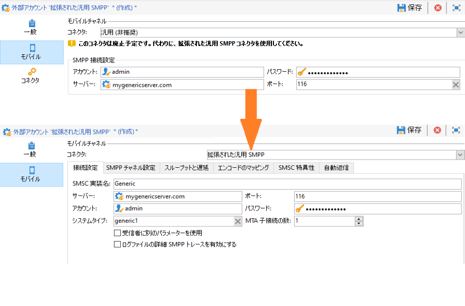
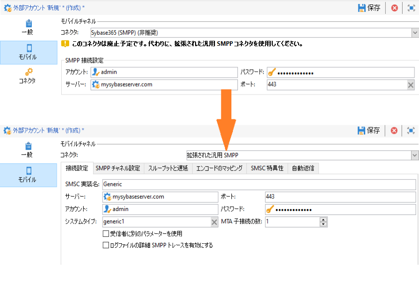
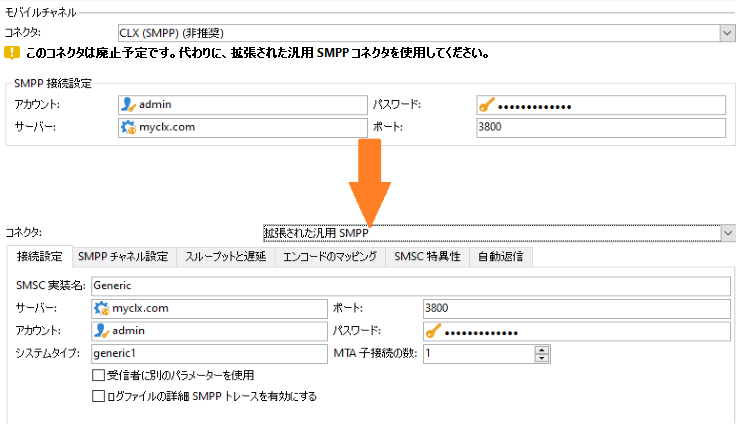
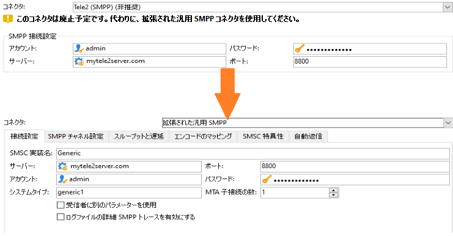
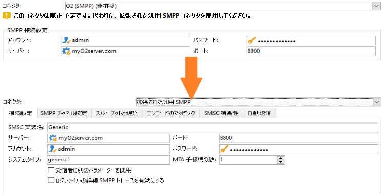

# サポートされていないSMSコネクタを拡張汎用SMPPコネクタ{#unsupported-connector-migration}に移行

リリース20.2以降、レガシーコネクタは非推奨となります。 このドキュメントは、古いシステムでまだ実行中のコネクタを推奨のSMPPコネクタに移行する際に役立ちます。

>[!CAUTION]
>
>この移行は必須ではありませんが、Adobeが推奨しているので、サポートされている最新バージョンのソフトウェアを確実に実行できます。

## SMSコネクタについて{#about-sms-connectors}

次のコネクタは、リリース20.2で非推奨となりました。

* **[!UICONTROL 汎用SMPP]** （バイナリモードをサポートするSMPPバージョン3.4）
* **[!UICONTROL Sybase365]** (SAP SMS 365)
* **[!UICONTROL CLX Communications]**
* **[!UICONTROL Tele2]**
* **[!UICONTROL O2]**
* **[!UICONTROL iOS]**

非推奨の機能は引き続き使用可能でサポートされますが、それ以上強化されることはありません。 **[!UICONTROL 拡張された汎用 SMPP]** コネクタの使用をお勧めします。

廃止/削除された機能の詳細については、[ページ](../../rn/using/deprecated-features.md)を参照してください。

古いSMSコネクタは、WebプロセスをオーバーロードするJava SMSコネクタを使用しています。 新しい&#x200B;**[!UICONTROL 拡張汎用SMPP]**&#x200B;コネクタに移行すると、この負荷はMTAに移動し、MTAがサポートするようになります。

## 拡張汎用SMPPコネクタ{#migrating-extended-generic-smpp}への移行

>[!CAUTION]
>
>パラメーターを転送できる場合でも、**[!UICONTROL 拡張汎用SMPP]**&#x200B;コネクターを設定するには、他のパラメーターの入力に必要な情報を提供するプロバイダーとの対話が必要です。 詳しくは、この[ページ](../../delivery/using/sms-protocol.md)を参照してください。

最初に、新しい&#x200B;**[!UICONTROL 拡張汎用SMPP]**&#x200B;外部アカウントを作成し、その後一部のパラメータを転置できるようにする必要があります。 詳細な手順は、[ページ](../../delivery/using/sms-channel.md#creating-an-smpp-external-account)に記載されています。

これで、新しく作成した&#x200B;**[!UICONTROL 拡張汎用SMPP]**&#x200B;外部アカウントの&#x200B;**[!UICONTROL モバイル]**&#x200B;タブから、以前のコネクタに応じてパラメータを入力する必要があります。

### 汎用コネクタ{#from-generic-connector}から

**[!UICONTROL 汎用]**&#x200B;コネクタを選択する場合は、各状況に対応するカスタムJavaScriptコネクタが必要です。

このコネクタが既にSMPPプロトコルを使用していることがわかっている場合は、**[!UICONTROL 拡張汎用SMPP]**&#x200B;コネクタに移行できます。 SMPPプロトコルがサポートされていない場合は、プロバイダに問い合わせて、コンサルタントの助けを借りて新しいコネクタをセットアップします。

**[!UICONTROL 汎用]**&#x200B;コネクタから、新しく作成した&#x200B;**[!UICONTROL 拡張SMPP]**&#x200B;アカウントに転送できます。

**[!UICONTROL 「Connection Settings]**」タブで、次の操作を行います。

* **[!UICONTROL アカウント]**
* **[!UICONTROL パスワード]**
* **[!UICONTROL サーバー]**
* **[!UICONTROL ポート]**

### 汎用SMPPコネクタ{#from-generic-smpp-connector}から

**[!UICONTROL 汎用SMPP]**&#x200B;コネクタから、新しく作成した&#x200B;**[!UICONTROL 拡張SMPP]**&#x200B;アカウントに転送できます。

**[!UICONTROL 「Connection Settings]**」タブで、次の操作を行います。

* **[!UICONTROL アカウント]**
* **[!UICONTROL パスワード]**
* **[!UICONTROL サーバー]**
* **[!UICONTROL ポート]**
* **[!UICONTROL システムタイプ]**

**[!UICONTROL SMPPチャネル設定]**&#x200B;タブで、次の操作を行います。

* **[!UICONTROL ソース番号]**
* **[!UICONTROL ソース NPI]**
* **[!UICONTROL 宛先の NPI]**
* **[!UICONTROL ソース TON]**
* **[!UICONTROL 送信先 TON]**

**[!UICONTROL 「Mapping of Encoding]**」タブで、次の操作を行います。

* **[!UICONTROL アウントバウンド SMS のコーディング]**

**[!UICONTROL SMSC specificities]**&#x200B;タブで、次の操作を行います。

* **[!UICONTROL MT確認で]** の **[!UICONTROL ID形式に対応する送信時のコーディング]**
* **[!UICONTROL 受信時のコーディング]** がSRの **[!UICONTROL ID形式に対応]**

### Sybase365コネクタ{#from-sybase}から

**[!UICONTROL Sybase365]**&#x200B;コネクタから、新しく作成した&#x200B;**[!UICONTROL 拡張SMPP]**&#x200B;アカウントに転送できます。

**[!UICONTROL 「Connection Settings]**」タブで、次の操作を行います。

* **[!UICONTROL アカウント]**
* **[!UICONTROL パスワード]**
* **[!UICONTROL サーバー]**
* **[!UICONTROL ポート]**
* **[!UICONTROL システムタイプ]**

### CLXコネクタから{#from-clx}

**[!UICONTROL CLX]**&#x200B;コネクタから、新しく作成した&#x200B;**[!UICONTROL 拡張SMPP]**&#x200B;アカウントに転送できます。

**[!UICONTROL 「Connection Settings]**」タブで、次の操作を行います。

* **[!UICONTROL アカウント]**
* **[!UICONTROL パスワード]**
* **[!UICONTROL サーバー]**
* **[!UICONTROL ポート]**
* **[!UICONTROL システムタイプ]**

**[!UICONTROL SMPPチャネル設定]**&#x200B;タブで、次の操作を行います。

* **[!UICONTROL ソース番号]**

**[!UICONTROL SMSC specificities]**&#x200B;タブで、次の操作を行います。

* **[!UICONTROL MT確認で]** の **[!UICONTROL ID形式に対応する送信時のコーディング]**
* **[!UICONTROL 受信時のコーディング]** がSRの **[!UICONTROL ID形式に対応]**

### Tele2コネクタから{#from-tele2}

**[!UICONTROL Tele2]**&#x200B;コネクタから、新しく作成した&#x200B;**[!UICONTROL 拡張SMPP]**&#x200B;アカウントに転送できます。

**[!UICONTROL 「Connection Settings]**」タブで、次の操作を行います。

* **[!UICONTROL アカウント]**
* **[!UICONTROL パスワード]**
* **[!UICONTROL サーバー]**
* **[!UICONTROL ポート]**
* **[!UICONTROL システムタイプ]**

**[!UICONTROL SMPPチャネル設定]**&#x200B;タブで、次の操作を行います。

* **[!UICONTROL ソース番号]**
* **[!UICONTROL ソース NPI]**
* **[!UICONTROL 宛先の NPI]**
* **[!UICONTROL ソース TON]**

**[!UICONTROL 「Mapping of Encoding]**」タブで、次の操作を行います。

* **[!UICONTROL アウントバウンド SMS のコーディング]**

### O2コネクタから{#from-O2}

**[!UICONTROL O2]**&#x200B;コネクタから、新しく作成した&#x200B;**[!UICONTROL 拡張SMPP]**&#x200B;アカウントに転送できます。

**[!UICONTROL 「Connection Settings]**」タブで、次の操作を行います。

* **[!UICONTROL アカウント]**
* **[!UICONTROL パスワード]**
* **[!UICONTROL サーバー]**
* **[!UICONTROL ポート]**
* **[!UICONTROL システムタイプ]**

**[!UICONTROL SMPPチャネル設定]**&#x200B;タブで、次の操作を行います。

* **[!UICONTROL ソース番号]**
* **[!UICONTROL ソース NPI]**
* **[!UICONTROL 宛先の NPI]**
* **[!UICONTROL ソース TON]**
* **[!UICONTROL 送信先 TON]**