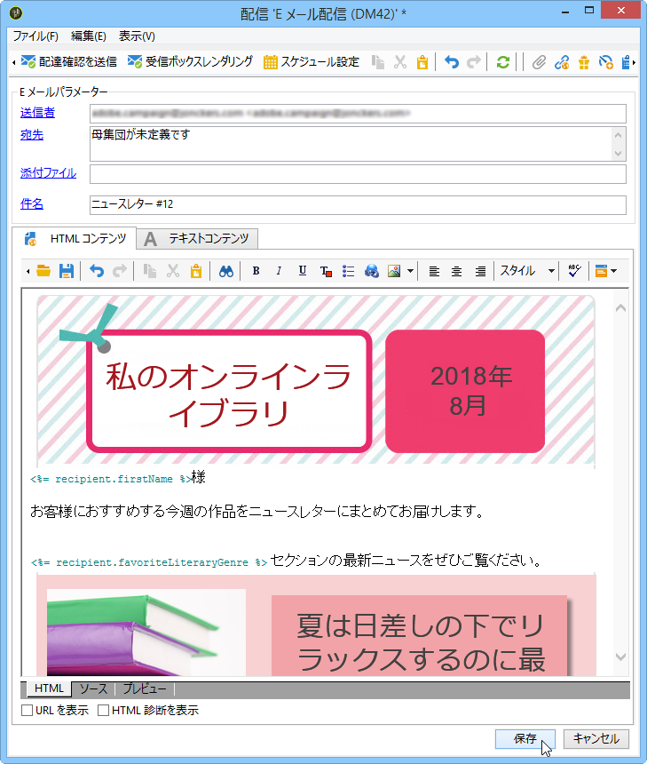
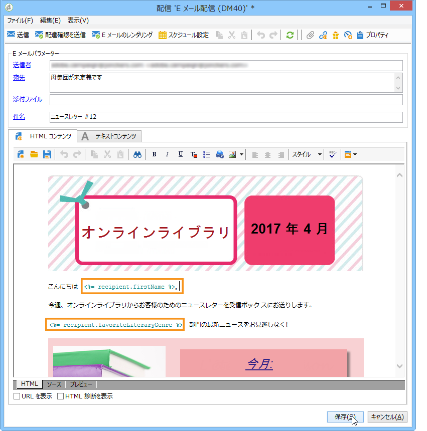
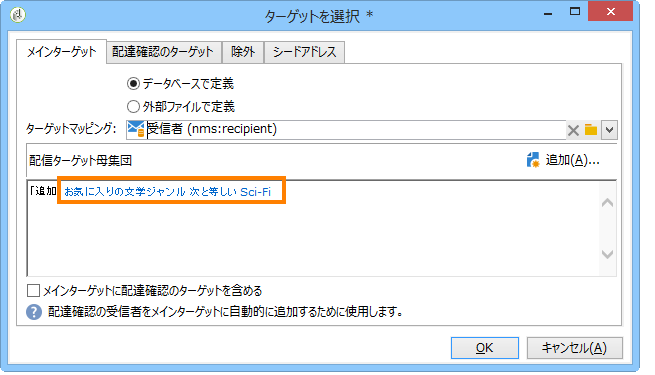
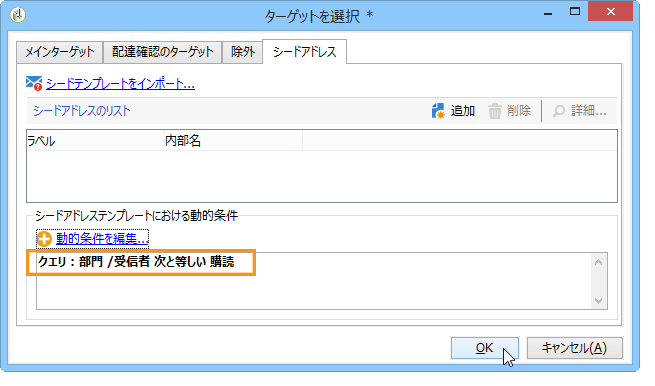
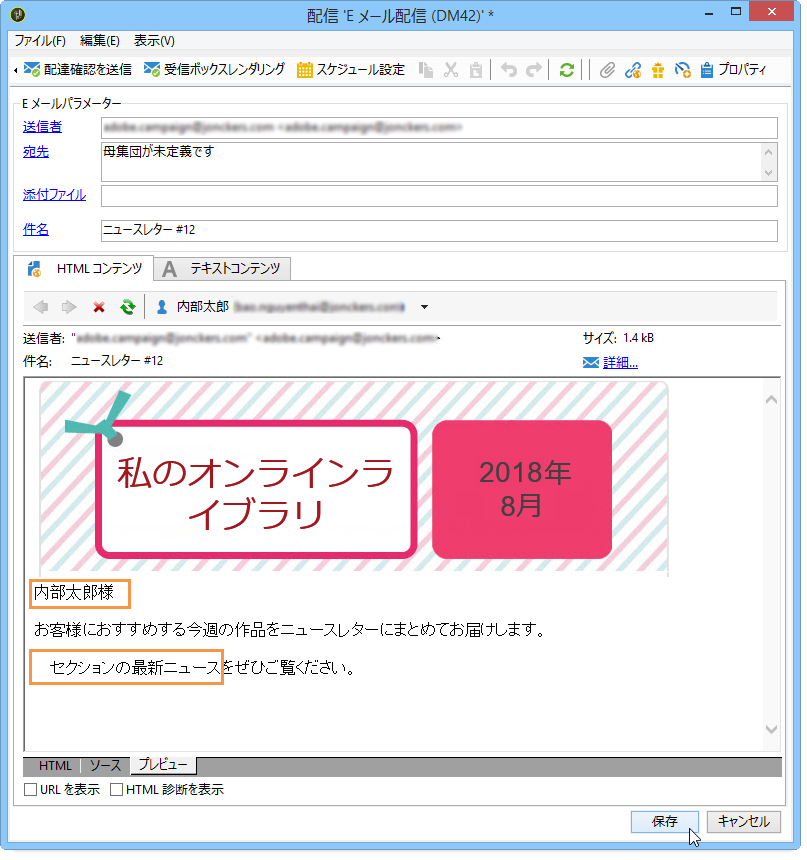
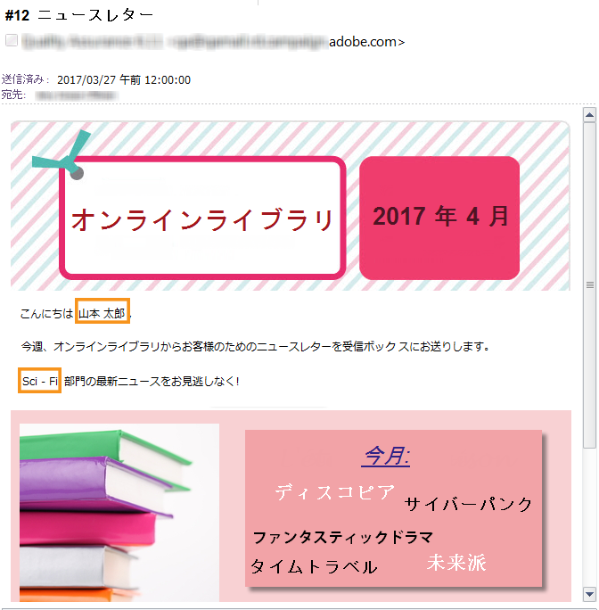

# ユースケース：フィールド置換の設定{#use-case-configuring-the-field-substitution}


ランダムなフィールド置換は、配信時に、シードアドレスの未入力部分に当てはめる値（例えば、名前、市区町村など）を受信者リストから取得して使用する機能です。

この置換機能を使用すると、配信を作成する際、配信のターゲット受信者リストからランダムに取得してシードアドレスに適用できるので、望ましい値をシードアドレスに手動入力する手間が省けます。

## コンテキスト {#context}

このユースケースでは、**My online library** というサイトで、顧客が好きな読み物のジャンルに応じた割引販売の情報を送付するとします。

配信管理者は、好みのジャンルとリンクされたパーソナライゼーションフィールドを顧客のメールと統合しました。目的は、いくつかのシードアドレスを使用することです。これらのシードアドレスのテーブルにはパーソナライゼーションフィールドがありますが、そこには値が保存されていません。

ランダムなフィールド置換を使用するには、次の条件が揃っている必要があります。

* 1 つまたは複数のパーソナライゼーションフィールドを使用する配信であること
* 配信に使用するパーソナライゼーションフィールドに合わせて&#x200B;**データスキーマ**&#x200B;に変更を加えたシードアドレスがあること

## 配信の作成 {#step-1---creating-a-delivery}

配信の作成手順について詳しくは、[メール配信の作成](creating-an-email-delivery.md)の節で説明しています。

以下は、配信責任者がニュースレターを作成した例です。



## シードアドレスのデータスキーマの編集 {#editing-the-seed-addresses-data-schema}

データスキーマの変更方法については、の節で説明しています。

この例では、次のように、受信者のデータスキーマから値を 1 つ取得してシードアドレスのデータスキーマに追加するものとします。

```
 <attribute label="Favorite literary genre" length="80" name="favoriteLiteraryGenre"
               type="string" userEnum="favoriteLiteraryGenre"/>
```

この列挙は、顧客が好む読み物のジャンルを指定するためのものです。

データスキーマに加えたこの変更がシードアドレスの&#x200B;**入力フォーム**&#x200B;に表示されるようにするには、入力フォームを更新する必要があります。[入力フォームの更新](use-case--selecting-seed-addresses-on-criteria.md#updating-the-input-form)の節を参照してください。

## パーソナライゼーションの設定 {#configuring-personalization}

1. 配信を開きます。

   この例では、配信には 2 つのパーソナライゼーションフィールドがあります（受信者の「**名**」と「**好きな読み物のジャンル**」）。

   

1. 配信リストとシードアドレスを設定します。[ターゲット母集団の特定](steps-defining-the-target-population.md)を参照してください。

   この例では、**SF ジャンルを好んで読む**&#x200B;顧客をメインターゲット母集団にします。

   

   シードアドレスを配信に追加します。

   

   >[!NOTE]
   >
   >**[!UICONTROL 動的条件を編集...]**&#x200B;リンクについて詳しくは、[ユースケース：条件によるシードアドレスの選択](use-case--selecting-seed-addresses-on-criteria.md)を参照してください。

1. 「**[!UICONTROL プレビュー]**」タブをクリックし、いずれかのシードアドレスを選択して、パーソナライゼーションをテストします。

   

   パーソナライゼーションフィールドの 1 つが空になっていることがわかります。このフィールドに入るデータがシードアドレスに含まれていないので、HTML コンテンツプレビュー機能で値が表示されません。

   フィールドのランダムな置換は、**配信時**&#x200B;に実行されます。

1. 「**[!UICONTROL 送信]**」ボタンをクリックします。
1. 配信を分析し、**配信を確定**&#x200B;します。

   シードアドレスに含まれるユーザーの受信ボックスに配信が届きます。

   フィールドのパーソナライゼーションが機能しています。

   
