# ユースケース：コンテンツ管理の作成{#use-case-creating-content-management}

Adobe Campaign でコンテンツ管理を作成するには、次の手順が必要です。

* [手順 1 - 作成するコンテンツの分析](#step-1---analyzing-the-content-to-be-produced),
* [手順 2 - データスキーマの作成](#step-2---creating-the-data-schema),
* [手順 3 - 入力フォームの作成](#step-3---creating-the-input-form),
* [手順 4 - 構成テンプレートの作成](#step-4---creating-the-construction-template),
* [手順 5 - パブリッシュテンプレートの作成](#step-5---creating-the-publication-template),
* [手順 6 - コンテンツの作成](#step-6---creating-contents).

## 手順 1 - 作成するコンテンツの分析 {#step-1---analyzing-the-content-to-be-produced}

まず、作成するコンテンツを正確に分析する必要があります。表示する要素を識別し、その要素に関連付けられている制約を調べ、各要素のタイプを定義するなどです。静的要素と可変要素を識別する必要もあります。

例えば、次のタイプのコンテンツを含むニュースレターを HTML で作成するとします。

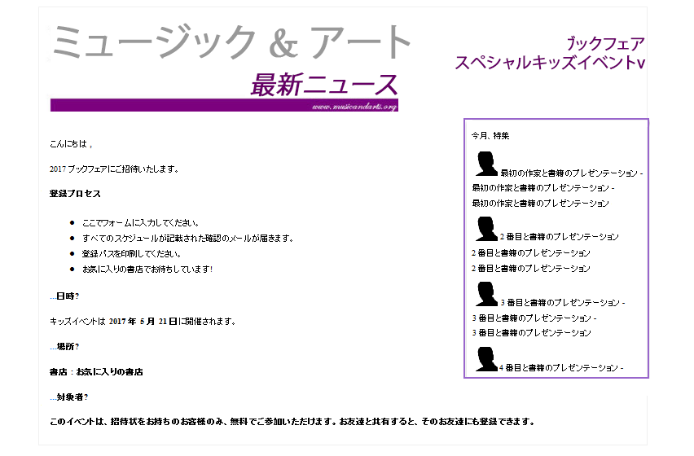

このニュースレターには、3 種類の要素が含まれています。

1. 配信作成時にユーザーが入力フォームからコンテンツを入力または選択する可変要素。

   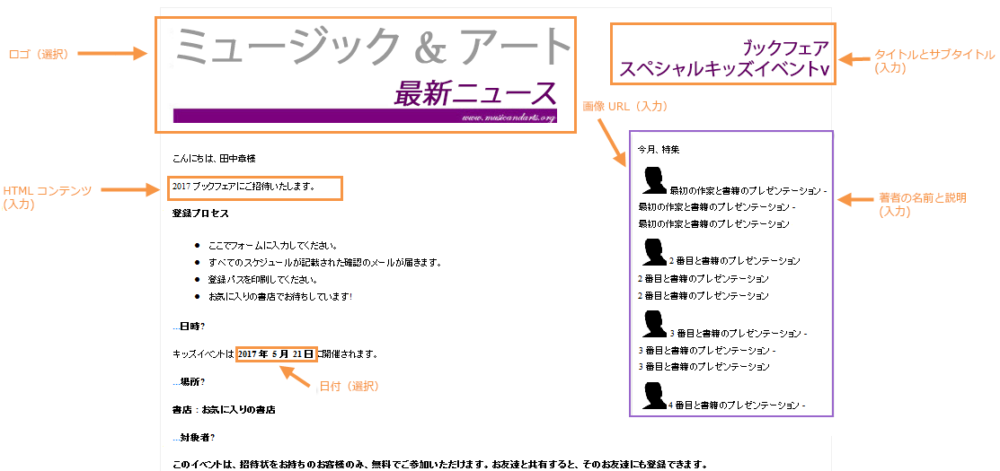

1. データベースに保存されている情報（この場合は受信者の姓名）に基づいて動的に入力されるパーソナライゼーションフィールド。

   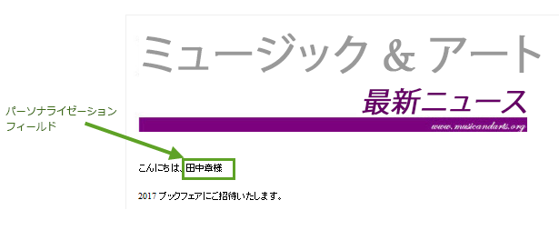

1. すべてのニュースレターで同一の静的要素。

   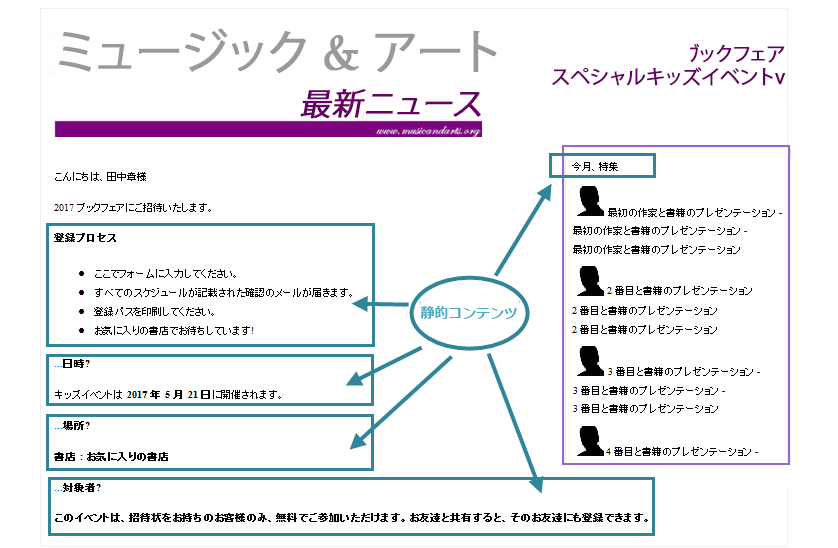

ニュースレターのこれらの要素は、JavaScript テンプレートで定義されているルールに基づいて組み立てられます。このテンプレートは、挿入されるすべての要素を参照し、かつそのレイアウトを概念化します。

これらの要素は、専用スキーマから作成されます。専用スキーマは、名前、ラベル、タイプ、サイズおよび Adobe Campaign での処理に関連するその他の情報などの要素をコンテンツごとに指定します。

## 手順 2 - データスキーマの作成 {#step-2---creating-the-data-schema}

データスキーマは、コンテンツに関連付けられた XML ドキュメントです。このコンテンツ内のデータの XML 構造が記述されます。

>[!NOTE]
>
>Adobe Campaign でのデータスキーマの作成と設定について詳しくは、[この節](../../configuration/using/about-schema-edition.md)を参照してください。
>
>Configuration elements specific to content management are detailed in [Data schemas](../../delivery/using/data-schemas.md).

データスキーマを作成するには、次の手順に従います。

1. Open the Adobe Campaign Explorer and select the **[!UICONTROL Administration > Configuration > Data schemas]** node.

   Click the **[!UICONTROL New]** icon located above the list of data schemas.

1. コンテンツ管 **[!UICONTROL Create a schema]** 理のオプションを選択し、をクリックしま **[!UICONTROL Next]**&#x200B;す。

   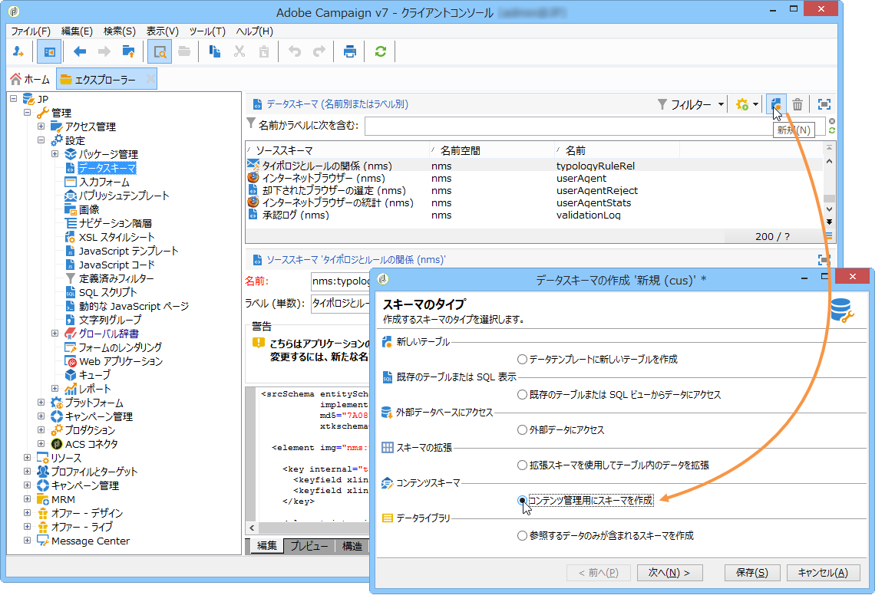

1. 適切なフィールドにスキーマの名前とラベルを入力します。必要に応じて、説明を追加したり、特定の画像をリンクしたりすることもできます。

   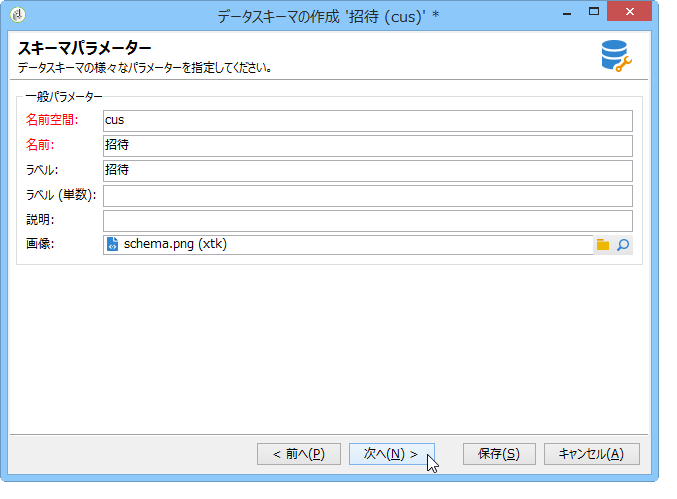

   Click **[!UICONTROL Next]** to validate.

1. Enter the content of the schema in the **[!UICONTROL Edit schema]** window.

   Use the **[!UICONTROL Insert]** button to create the schema content.

   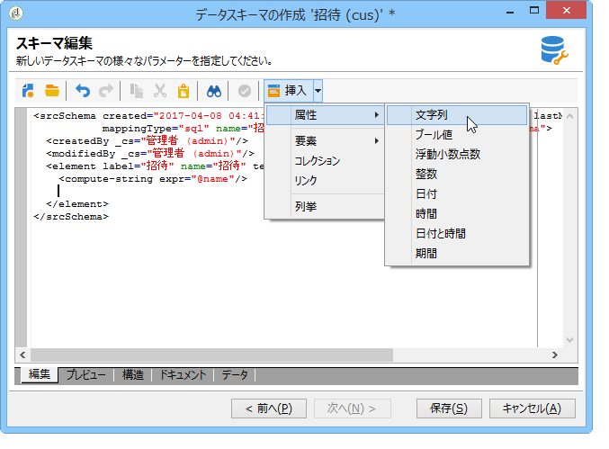

   For more on this, refer to [Editing schemas](../../delivery/using/data-schemas.md#editing-schemas).

   コンテンツ内で参照されている要素ごとに、対応するタイプを選択する必要があります。

   今回の例では、識別されているコンテンツ、そのフォーマットとタイプは次のようになります。

<table> 
 <thead> 
  <tr> 
   <th> <strong>コンテンツ</strong><br /> </th> 
   <th> <strong>形式</strong><br /> </th> 
   <th> <strong>タイプ</strong><br /> </th> 
   <th> <strong>ラベル</strong><br /> </th> 
  </tr> 
 </thead> 
 <tbody> 
  <tr> 
   <td> タイトル<br /> </td> 
   <td> 属性<br /> </td> 
   <td> 文字列<br /> </td> 
   <td> タイトル<br /> </td> 
  </tr> 
  <tr> 
   <td> サブタイトル<br /> </td> 
   <td> 属性<br /> </td> 
   <td> 文字列<br /> </td> 
   <td> 名前<br /> </td> 
  </tr> 
  <tr> 
   <td> イベントの日付<br /> </td> 
   <td> 属性<br /> </td> 
   <td> 日付<br /> </td> 
   <td> 日付<br /> </td> 
  </tr> 
  <tr> 
   <td> 導入部の段落<br /> </td> 
   <td> 要素<br /> </td> 
   <td> HTML<br /> </td> 
   <td> 概要<br /> </td> 
  </tr> 
  <tr> 
   <td> 作成者の写真<br /> </td> 
   <td> 属性<br /> </td> 
   <td> 文字列<br /> </td> 
   <td> URL<br /> </td> 
  </tr> 
  <tr> 
   <td> 作成者<br /> </td> 
   <td> 要素<br /> </td> 
   <td> メモ<br /> </td> 
   <td> 作成者<br /> </td> 
  </tr> 
  <tr> 
   <td> ヘッダーロゴ（Adobe Campaign のパブリックリソースに保存）<br /> </td> 
   <td> 属性<br /> </td> 
   <td> リンク<br /> </td> 
   <td> 画像<br /> </td> 
  </tr> 
 </tbody> 
</table>

スキーマには次の情報が含まれます。

```
<element label="Invitation" name="invitation" template="ncm:content" xmlChildren="true">
    <compute-string expr="@name"/>
    <attribute label="Title" length="40" name="title" type="string"/>
    <element label="Presentation" name="presentation" type="html"/>
    <attribute label="Date" name="date" type="date"/>
    <attribute label="Name" length="10" name="name" type="string"/>
    <attribute label="URL" name="url" type="string"/>
    <element label="Author" name="author" type="memo"/>
    <element label="Image" name="image" target="xtk:fileRes" type="link"/>
  </element>
```

1. Click **[!UICONTROL Save]** to create the data schema.

## 手順 3 - 入力フォームの作成 {#step-3---creating-the-input-form}

入力フォームを使用すると、Adobe Campaign のクライアントコンソールから入力インターフェイスを使用してコンテンツインスタンスを編集できます。

フォームは、「xtk:form」形式のスキーマの文法に従って、構造化された XML ドキュメントとして記述します。

>[!NOTE]
>
>Adobe Campaign でのフォームの作成と設定について詳しくは、[この節](../../configuration/using/identifying-a-form.md)を参照してください。
>
>Configuration elements specific to content management are detailed in [Input forms](../../delivery/using/input-forms.md).

コンテンツ管理用の入力フォームを作成するには、次の手順に従います。

1. Open the Adobe Campaign Explorer and select the **[!UICONTROL Administration > Configuration > Input forms]** node.

   Click the **[!UICONTROL New]** icon above the list of forms.

1. Enter the name of the form and the label linked to the form, then select the **[!UICONTROL Content management]** type.

   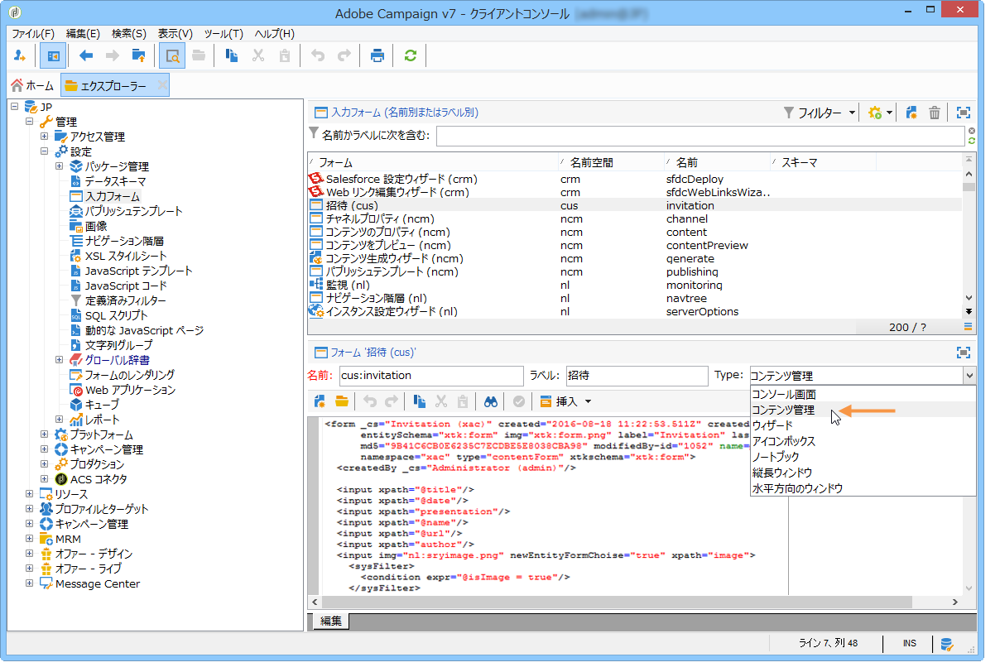

   >[!NOTE]
   >
   >両方の要素が自動的に一致するように、リンクされているデータスキーマと同じ名前を使用することをお勧めします。Use the **[!UICONTROL Insert]** button above the input zone to add fields from the schema linked to the form.

   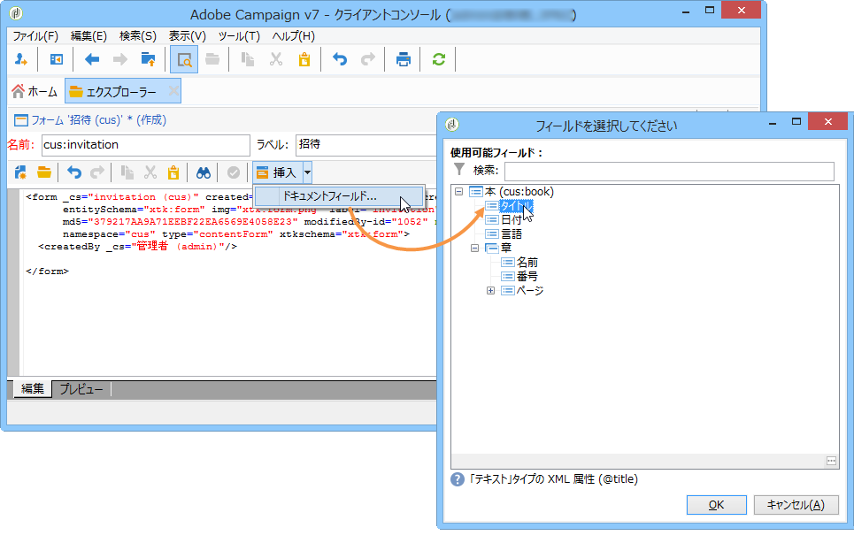

1. エディターの中央のセクションで、入力フォームに表示したいフィールドを指定します。

   今回の例では、次のようなタイプの情報を指定します。

   ```
    <input xpath="@title"/>
     <input xpath="@date"/>
     <input xpath="presentation"/>
     <input xpath="@name"/>
     <input xpath="@url"/>
     <input xpath="author"/>
     <input img="nl:sryimage.png" newEntityFormChoice="true" xpath="image">
       <sysFilter>
         <condition expr="@isImage = true"/>
       </sysFilter>
     </input>
   ```

   The **[!UICONTROL Preview]** tab lets you check the rendering of the form while you are editing it:

   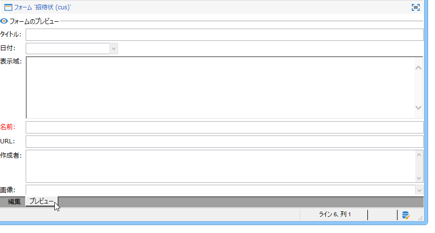

1. Click **[!UICONTROL Save]** to create the input form.

## 手順 4 - 構成テンプレートの作成 {#step-4---creating-the-construction-template}

XSLT 言語を使用して、XML ドキュメントを別の出力ドキュメントに変換できます。この変換は、スタイルシートというドキュメントに XML で記述します。

今回の例では、JavaScript テンプレートを使用して、生成されるドキュメント内にデータの構成とレイアウトモードを定義します。

>[!NOTE]
>
>Constraints linked to document building (JavaScript or XSL template) are detailed in [Formatting](../../delivery/using/formatting.md).

Adobe Campaign で JavaScript テンプレートを使用するには、次の手順に従います。

1. Open the Adobe Campaign Explorer and select the **[!UICONTROL Administration > Configuration > JavaScript Templates]** node.

   Click the **[!UICONTROL New]** icon above the list of templates.

1. テンプレート名を入力し、コンテンツ管理用に作成したスキーマを選択します。
1. メッセージに表示したいセットコンテンツをインポートします。

   Add the variable elements while respecting the syntax detailed in [JavaScript templates](../../delivery/using/formatting.md#javascript-templates).

   今回の例のコンテンツを表示するには、JavaScript テンプレートに次の要素を含める必要があります。

   ```
   <html>
   <% eval(xtk.javascript.load("xac:perso").data); %>
   <head>
     <title>Invitation to an exceptional dedication session</title>
   </head>
   <body link="#0E59AE" vlink="#0E59AE" alink="#0E59AE" style="background-color:white;">
       <table width="546" border="0" align="center" cellpadding="0" cellspacing="0" style="border-left: solid 1px gray;border-top: solid 1px gray;border-right: solid 1px gray;">
         <tr>
           <td colspan="3">
             <%= generateImgTag(content.@["image-id"]) %>
           </td>
         </tr>
       </table>
       <table width="546" border="0" align="center" cellpadding="0" cellspacing="0" style="border-left: solid 1px gray;border-right: solid 1px gray;">
         <tr>
           <td>
             <table border="0" cellspacing="0" cellpadding="5">
               <tr>
                 <td width="10"> </td>
                 <td style="padding-top:2em; padding-bottom:2em;" width="730" align="middle">
                   <b>
                     <font style="font-family:Verdana, Arial, Helvetica, sans-serif; font-size:14px; color:#800080;">
                       <span style="FONT-VARIANT: small-caps"><%= content.@title %> - <%= content.@name %></span>
                     </font>
                   </b>
                 </td>
                 <td width="10"> </td>
               </tr>
               <tr>
                 <td width="10"> </td>
                 <td style="padding-top:1em; padding-bottom:1em;" width="730">
                   <font style="font-family:Verdana, Arial, Helvetica, sans-serif; font-size:11px; color:#666666;">
                     Hello <%= perso('recipient.firstName') %> <%= perso('recipient.lastName') %>,
                     <p>
                       <%= content.presentation %>
                     </p>               
                     <center>
                       <b><%= formatDate(content.@date, "%2D %Bl %4Y") %></b> come to our Book Fair and meet our favorite authors and illustrators.<br>
                       <br>
                       <a href="https://www.site.web.com/registration" target="_blank"><b>REGISTER</b></a>
                     </center>
                   </font>
                 </td>
                 <td width="10"> </td>
               </tr>
               <tr>
                 <td width="10"> </td>
                 <td style="padding-top:1em; padding-bottom:1em;" width="730">
                   <font style="font-family:Verdana, Arial, Helvetica, sans-serif; font-size:11px; color:#666666;">
                    " width="70" height="70">
                     <b><%= content.author %></b>, will be signing their book between 2
   and 5:30PM.
                   </font>
                 </td>
                 <td width="10"> </td>
               </tr>            
                   <tr>
                 <td width="10"> </td>
                 <td width="730">
                   <font style="font-family:Verdana, Arial, Helvetica, sans-serif; font-size:11px; color:#666666;">                  
                 </td>
                 <td width="10"> </td>
               </tr>           
               <tr>
                 <td width="10"> </td>
                 <td>
                   <font style="font-family:Verdana, Arial, Helvetica, sans-serif; font-size:11px; color:#666666;">
                     <center>
                       <p>
                         <a href="https://www.site.web.com/program" target="_blank"><span style="FONT-VARIANT: small-caps"><b>Program</b></span></a>
                          | 
                         <a href="https://www.site.web.com/information" target="_blank"><span style="FONT-VARIANT: small-caps"><b>Useful information</b></span></a>
                          | 
                       <a href="https://www.site.web.com/registration" target="_blank"><span style="FONT-VARIANT: small-caps"><b>Register</b></span></a></p>
                       </center>
                     </font>
                   </td>
                   <td width="10"> </td>
                 </tr>
               </table>
               <br>
             </td>
           </tr>
         </table>
   </body>
   </html>
   ```

   テンプレートの冒頭で関数を呼び出すことによって、Adobe Campaign データベースからパーソナライゼーションデータを取得する呼び出し（この場合は recipient.firstName と recipient.lastName）を設定でき、配信時にも利用できます。For more on this, refer to [Including a JavaScript template](../../delivery/using/formatting.md#including-a-javascript-template).

   今回の例では、次のようなコードが関数に含まれます。

   ```
   function perso(strPerso)
   {
     var strStart = '<' + '%' + '=';
     var strEnd = '%' + '>';
     return strStart + strPerso + strEnd;
   }
     function bloc(strPerso)
   {
     var strStart = '<' + '%' + '@ include view="';
     var strEnd = '" %' + '>';
     return strStart + strPerso + strEnd;
   }
   ```

   In order for the JavaScript template to be valid, this function must be created beforehand from the **[!UICONTROL JavaScript codes]** node in the tree structure, as below:

   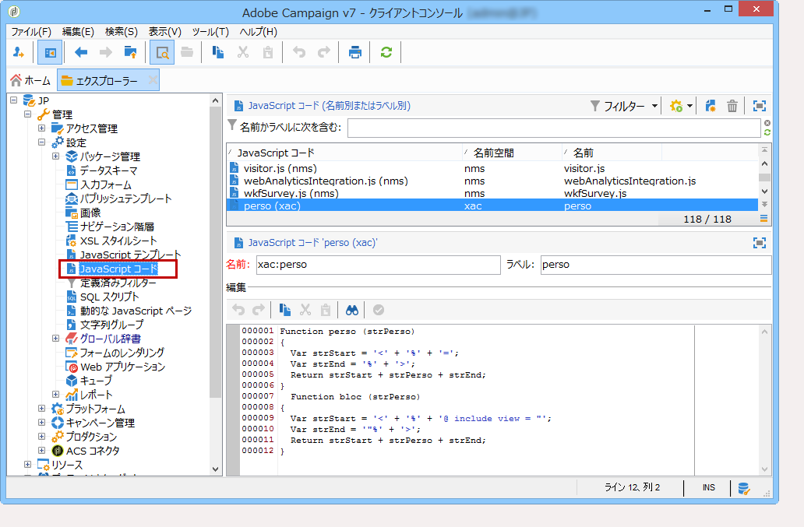

## 手順 5 - パブリッシュテンプレートの作成 {#step-5---creating-the-publication-template}

次の手順では、スキーマ、フォームおよびコンテンツ構成テンプレートをリンクするためのコンテンツパブリッシュテンプレートを作成します。このパブリッシュテンプレートは、複数の出力フォーマットを持つことができます。

>[!NOTE]
>
>For more on content publication templates, refer to [Publication templates](../../delivery/using/publication-templates.md).

手順は次のとおりです。

1. ノードを使用して新しいパブリケーションテンプレートを作 **[!UICONTROL Administration > Configuration > Publication templates]** 成します。
1. 名前とラベルを入力し、使用するスキーマとフォームを選択します。
1. テンプレートの名前を入力し、適用するレンダリングモードを選択します。ここでは、上記で作成したテンプレートに基づいて、「**[!UICONTROL JavaScript]**」タイプのレンダリングを選択します。

   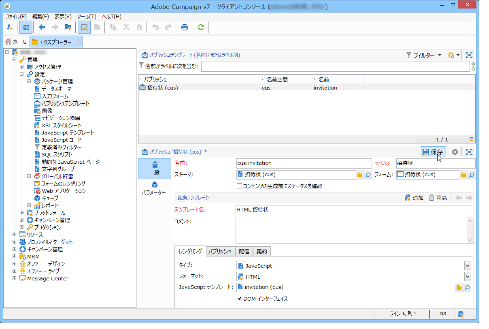

   >[!NOTE]
   >
   >The **[!UICONTROL DOM interface]** option is checked by default and this means that this document will not be accessible if you use the E4X syntax. このオプションがオンになっている場合は DOM インターフェイスを使用する必要があり、これが推奨される構文です。
   >
   >これまでどおりに E4X 構文を使用することもできます。その場合は、このオプションをオフにしてください。

   Use the **[!UICONTROL Add]** button to create other transformation templates.

1. Click **[!UICONTROL Save]** to create the publication template.

## 手順 6 - コンテンツの作成 {#step-6---creating-contents}

このパブリッシュテンプレートをベースとして、コンテンツを作成します。

>[!NOTE]
>
>コンテンツの作成について詳しくは、「コンテンツテンプレ [ートの使用」を参照してくださ](../../delivery/using/using-a-content-template.md)い。

### 配信ウィザードでのコンテンツの作成 {#creating-content-in-the-delivery-wizard}

配信内で直接コンテンツを作成するには、次の手順に従います。

1. Start by referencing the publication template via the **[!UICONTROL Advanced]** tab of the delivery properties.

   

   コンテンツ管理フォームを使用してコンテンツを定義するためのタブが、配信ウィザードに追加されます。

1. ニュースレターの可変情報を入力します。

   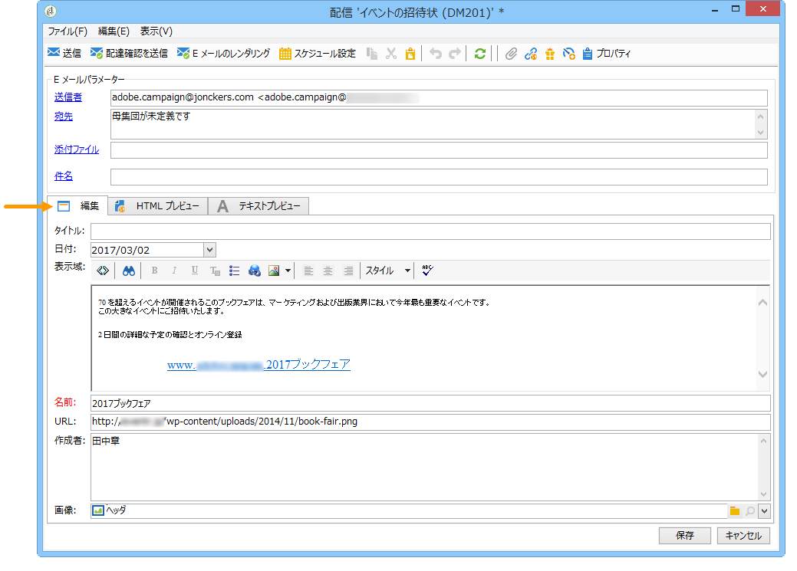

1. Click the **[!UICONTROL HTML preview]** tab to view the rendering. パーソナライゼーションをテストするには、受信者を選択する必要があります。

   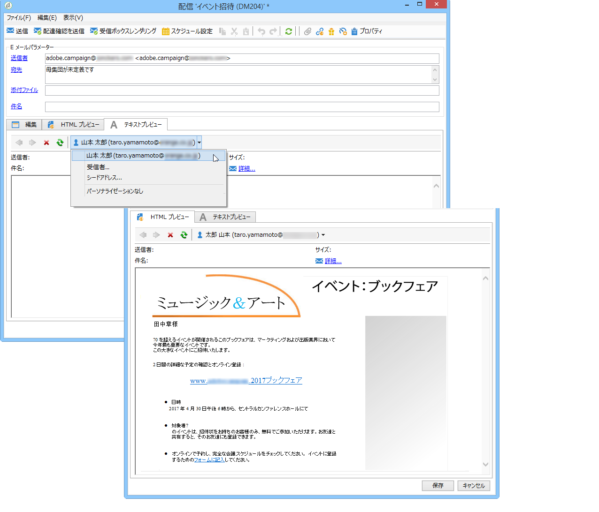
