# 使用例：条件によるシードアドレスの選択{#use-case-selecting-seed-addresses-on-criteria}

配信またはキャンペーンのフレームワーク内で、「**[!UICONTROL 動的条件を編集]**」リンクをクリックすると、特定の選択条件に基づいてシードアドレスを指定できます。

この使用例では、**My online library** というサイトが、顧客の読み物の好みに応じてニュースレターのコンテンツをパーソナライズするとします。

配信責任者は、警察を題材とする小説を購入した会員向けのニュースレターを、購買部門と共同で作成しました。

配信責任者は、完成したニュースレターを購買部門の協力者にも読んでもらえるよう、シードアドレスとして購買部門のメンバーを配信先に追加することにしました。このような場合、動的条件を使用すると、アドレスの設定や更新作業の手間を省くことができます。

動的条件を使用するには、次の条件が揃っている必要があります。

* 配信の送信準備ができていること。
* 使用するシードアドレスが、共通の値を持っていること。その値は、Adobe Campaign にあらかじめ存在するフィールドの値でかまいません。この例では、すべてのシードアドレスの「部門」フィールドに「購買」という値が含まれるものとします。これは、Adobe Campaign にデフォルトで用意されているフィールドではありません。

## 手順 1 - 配信の作成 {#step-1---creating-a-delivery}

配信の作成手順について詳しくは、[E メール配信の作成](../../delivery/using/creating-an-email-delivery.md)の節で説明しています。

この例では、配信責任者がニュースレターを作成し、受信者を選択します。

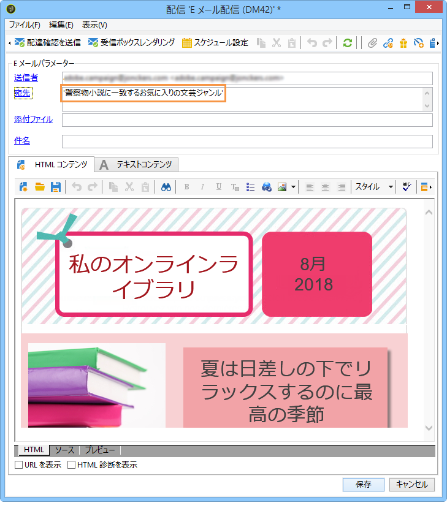

## 手順 2 - 共通値の作成 {#step-2---creating-a-common-value}

シードアドレス間に共通する値（この例では「部門」フィールドの「購買」）を作成するには、まず、使用するシードアドレスの&#x200B;**データスキーマ**&#x200B;を拡張し、スキーマに関連付けられた入力フォームを編集する必要があります。

### データスキーマの拡張 {#extending-the-data-schema}

スキーマの拡張について詳しくは、[設定ガイド](../../configuration/using/data-schemas.md)を参照してください。

1. **[!UICONTROL 管理／設定／データスキーマ]**&#x200B;ノードで、**[!UICONTROL 新規]**&#x200B;アイコンをクリックします。
1. **[!UICONTROL データスキーマの作成]**&#x200B;ウィンドウで、「**[!UICONTROL スキーマの拡張]**」オプションを選択し、「**[!UICONTROL 次へ]**」をクリックします。

   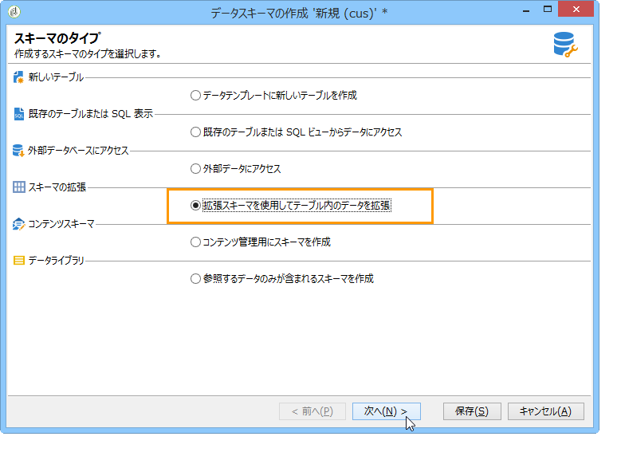

1. 「**[!UICONTROL シードアドレス]**」ソーススキーマを選択し、「**[!UICONTROL 名前空間]**」に「**doc**」と入力して、「**[!UICONTROL OK]**」をクリックします。

   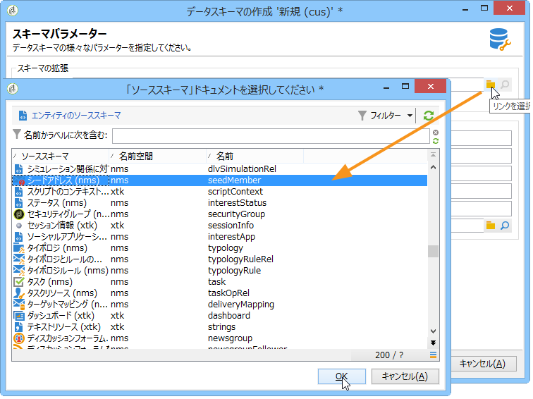

1. 「**[!UICONTROL 保存]**」をクリックします。
1. 次に示すコードをコピーし、スキーマ編集ウィンドウで、下のスクリーンショットの場所に貼り付けます。

   ```
     <element name="common">
       <element label="Recipient" name="custom_nms_recipient">
         <attribute label="Department" length="80" name="workField" template="nms:recipient:recipient/@company"
                    type="string" userEnum="workField"/>
       </element>
     </element>
   ```

   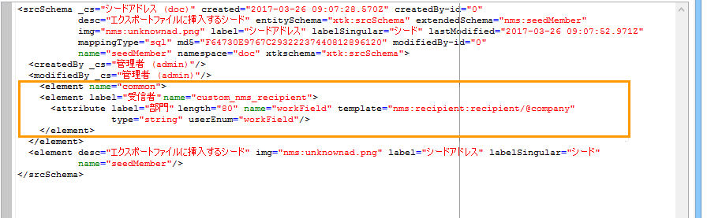

   さらに、次のコードをコピーし、「**[!UICONTROL エクスポートファイルに挿入するシード]**」の要素の下に貼り付けます。

   ```
       <element aggregate="doc:seedMember:common">
     </element>
   ```

   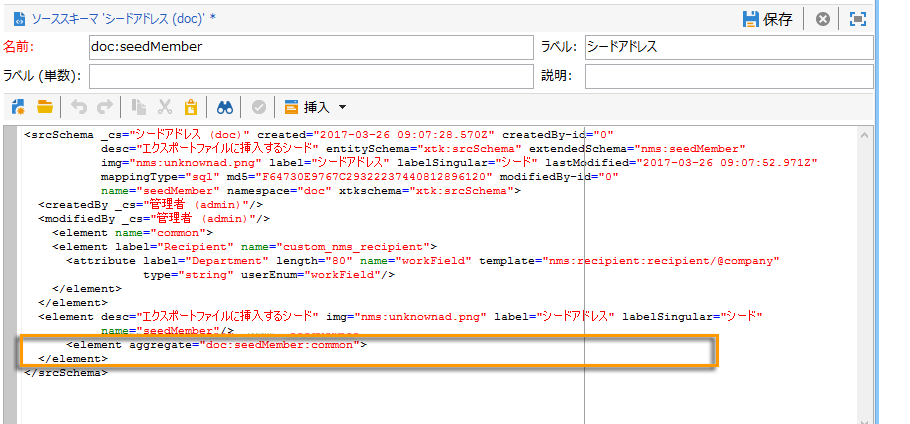

   これは、シードアドレステーブル内に「**[!UICONTROL 部門]**」という新しい列挙を作成したことと、その列挙が標準の **[!UICONTROL @company]** 列挙テンプレート（シードアドレスフォーム内の「**会社**」という名前の下にラベルがあります）に基づくものであることを示すための変更です。

1. 「**[!UICONTROL 保存]**」をクリックします。
1. **[!UICONTROL ツール／詳細設定]**&#x200B;メニューで、「**[!UICONTROL データベース構造を更新]**」オプションを選択します。

   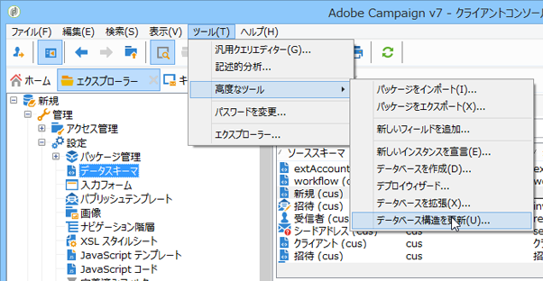

1. 更新ウィザードが表示されたら、「**[!UICONTROL 次へ]**」ボタンをクリックし、テーブルを編集ウィンドウにアクセスします。シードアドレスのデータスキーマに加えた変更に合わせて、構造を更新する必要があります。

   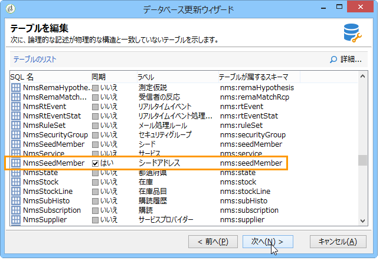

1. ウィザードの指示に従って、更新を実行するページが表示されるまで操作を進めます。「**[!UICONTROL 開始]**」ボタンをクリックします。

   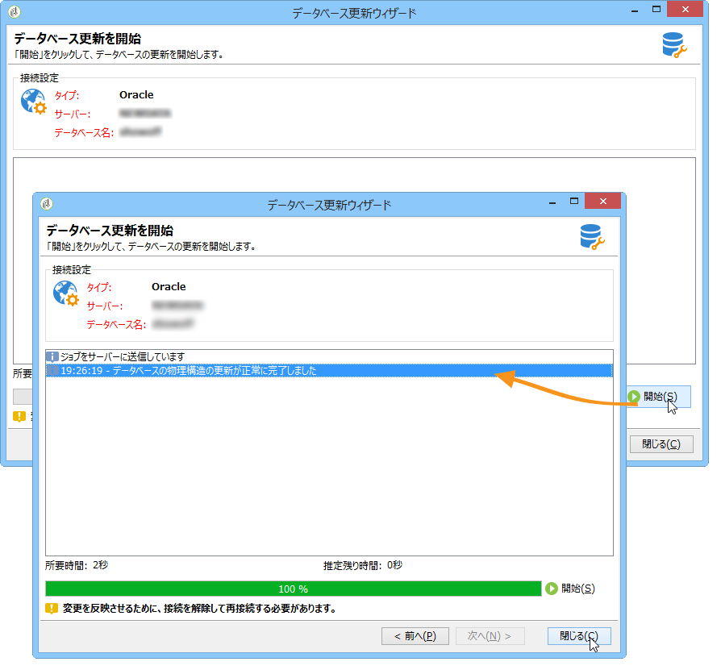

   更新が完了したら、ウィザードを閉じます。

1. Adobe Campaign との接続を一旦切断し、再接続します。これで、シードアドレスのデータスキーマに加えた変更が有効になります。ただし、変更をシードアドレス画面の表示にも反映させるには、スキーマに対応する&#x200B;**[!UICONTROL 入力フォーム]**&#x200B;を更新する必要があります。[入力フォームの更新](#updating-the-input-form)の節を参照してください。

#### リンクされたテーブルに基づくデータスキーマの拡張 {#extending-the-data-schema-from-a-linked-table}

シードアドレスのデータスキーマでは、受信者データスキーマ「受信者」（nms）にリンクされたテーブル内の値を使用できます。

例えば、受信者スキーマにリンクされている「**[!UICONTROL 国]**」テーブル内の「**[!UICONTROL インターネット拡張]**」を統合する必要があるとします。

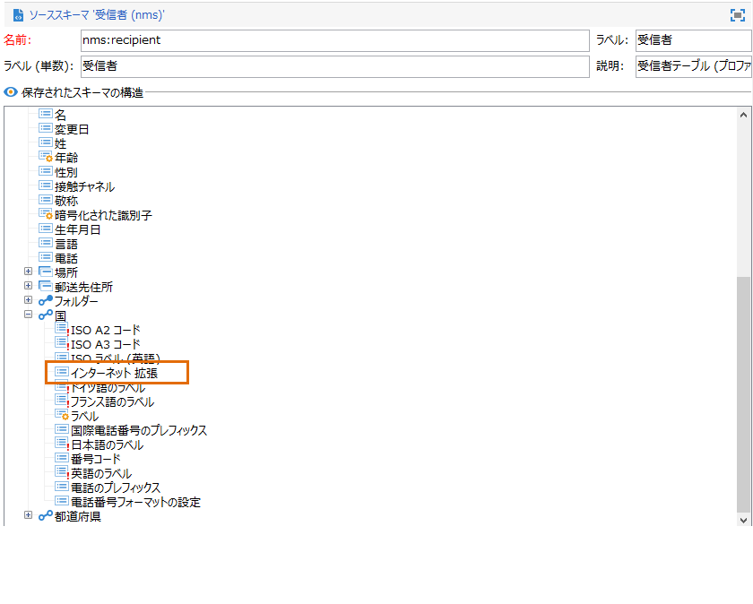

その場合、の節で説明されている方法で、シードアドレスのデータスキーマを拡張する必要があります。ただし、**手順 4** では次のコードを組み込みます。

```
<element name="country">
      <attribute label="Internet Extension" length="2" name="iana" type="string"/>
      <attribute label="Country ISO" length="2" name="countryIsoA2" type="string"/>
    </element>
```

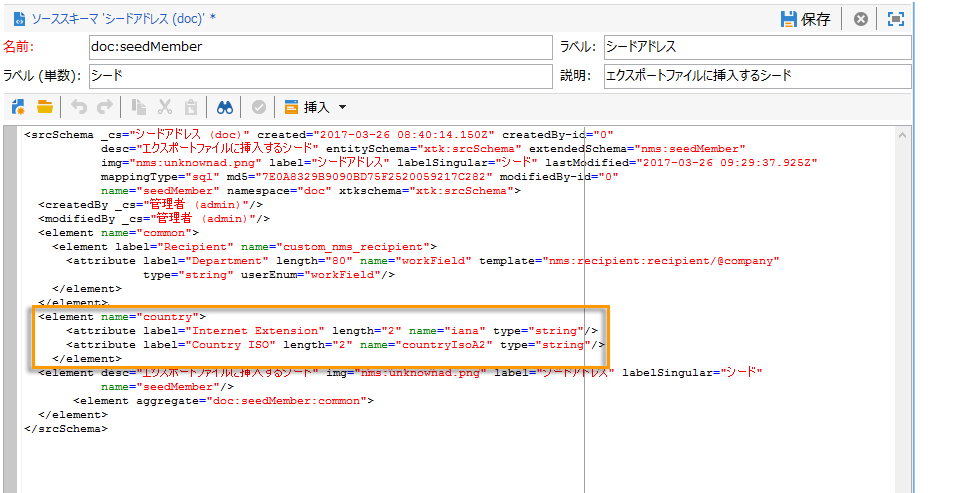

この記述は次のことを示しています。

* 「**[!UICONTROL インターネット拡張]**」という新しい要素を作成しようとしている
* この要素は「**[!UICONTROL 国]**」テーブルから取得される

>[!CAUTION]
>
>リンクされたテーブル名には、そのリンク先テーブルの **xpath-dst** を指定する必要があります。
>
>これは受信者テーブルの「**[!UICONTROL 国]**」要素に含まれています。

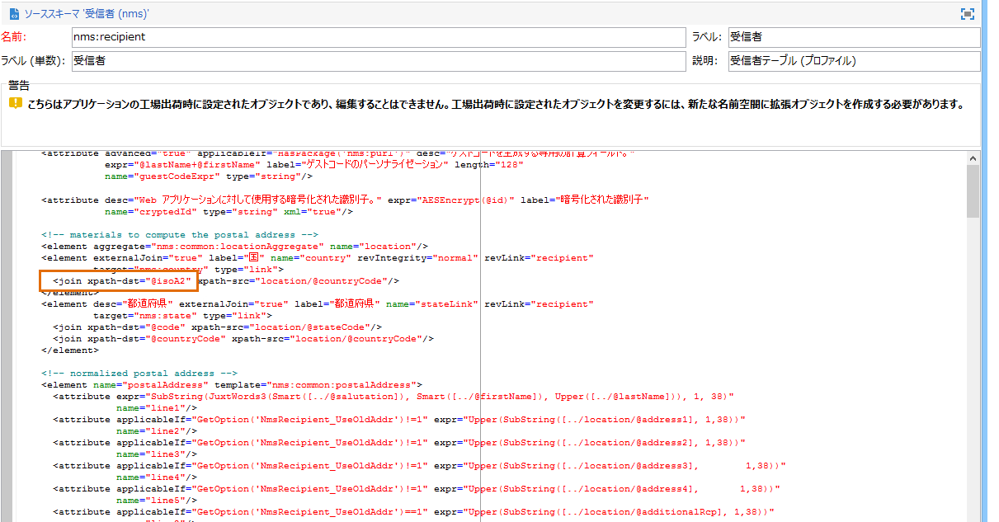

次に、**手順 5** に従ってシードアドレスの&#x200B;**[!UICONTROL 入力フォーム]**&#x200B;を更新します。

[入力フォームの更新](#updating-the-input-form)の節を参照してください。

#### 入力フォームの更新 {#updating-the-input-form}

1. **[!UICONTROL 管理／設定／入力フォーム]**&#x200B;ノードで、シードアドレスの入力フォームを見つけます。

   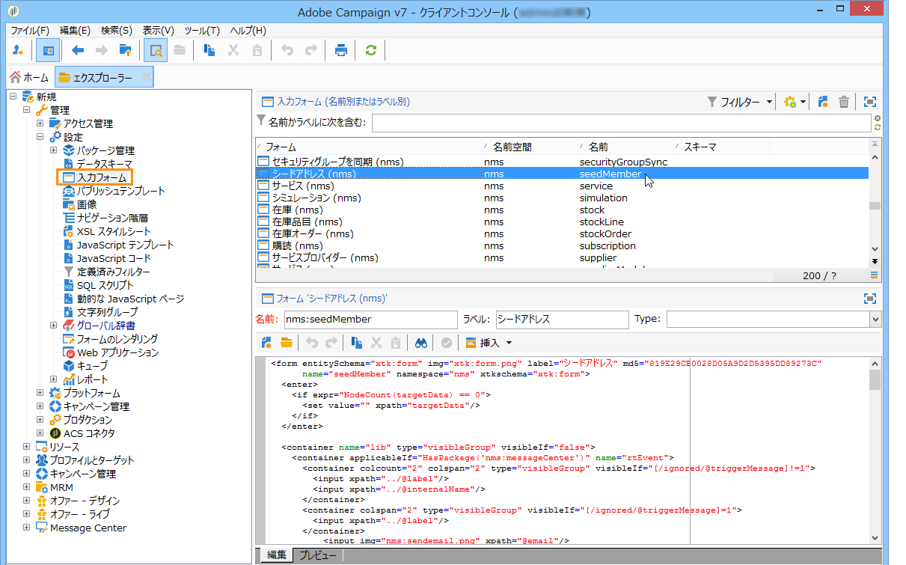

1. フォームを編集し、「**[!UICONTROL 受信者]**」コンテナ内に次の行を挿入します。

   ```
   <input xpath="@workField"/>
   ```

   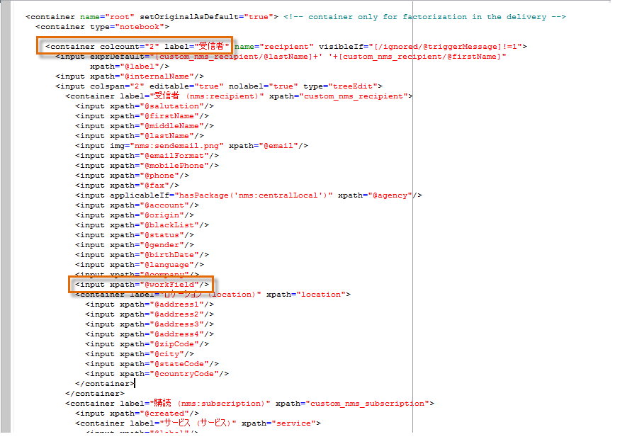

1. 変更を保存します。
1. いずれかのシードアドレスを開きます。「**[!UICONTROL 受信者]**」テーブル内に、「**[!UICONTROL 部門]**」フィールドが表示されます。

   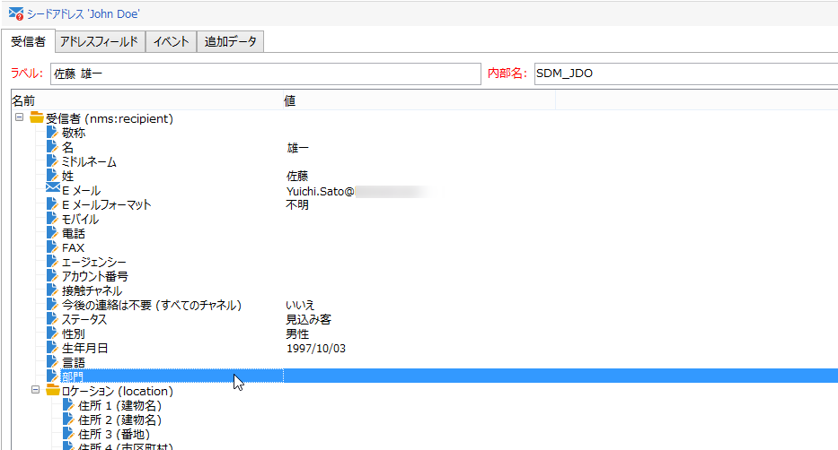

1. 配信に使用するシードアドレスを編集し、「**[!UICONTROL 部門]**」フィールドの値として「**購買**」を入力します。

## 手順 3 - 条件の定義 {#step-3---defining-the-condition}

配信のシードアドレスに動的条件を指定できます。手順は次のとおりです。

1. 配信を開きます。

   

1. 「**[!UICONTROL 宛先]**」リンク、「**[!UICONTROL シードアドレス]**」タブの順にクリックし、「**[!UICONTROL 動的条件を編集]**」リンクにアクセスします。

   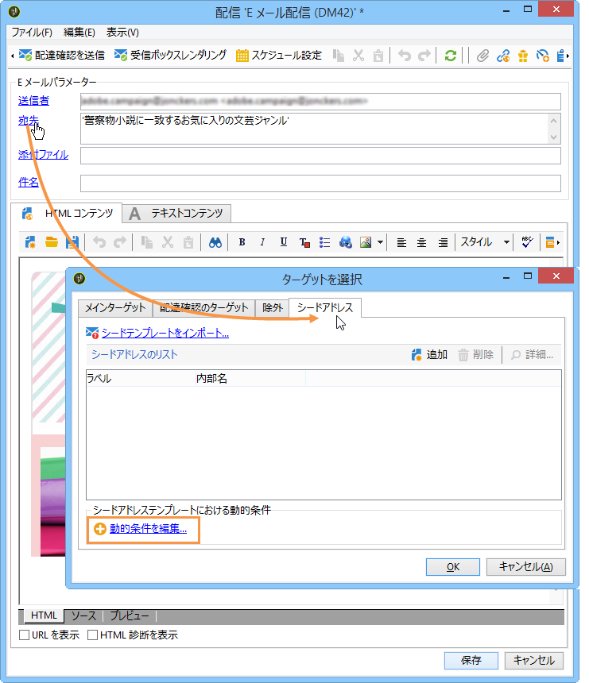

1. 目的に合ったシードアドレスを抽出するための式を選択します。この例では、「**[!UICONTROL 部門（@workField）]**」式を選択します。

   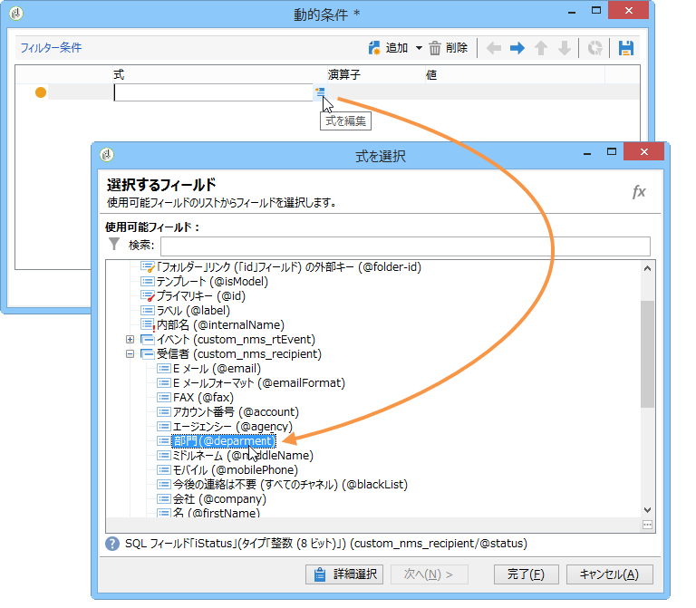

1. 使用する値を選択します。この例の場合は、ドロップダウンリストから「**購買**」という部門名を選択します。

   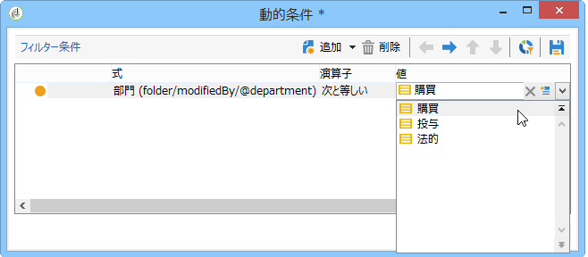

   >[!NOTE]
   >
   >先ほど作成したスキーマ拡張は&#x200B;**受信者**&#x200B;スキーマに基づいており、上図の画面に表示されている値は、**受信者**&#x200B;スキーマの列挙値に基づくものです。

1. 「**[!UICONTROL OK]**」をクリックします。

   **[!UICONTROL ターゲットを選択]**&#x200B;ウィンドウにクエリが表示されます。

   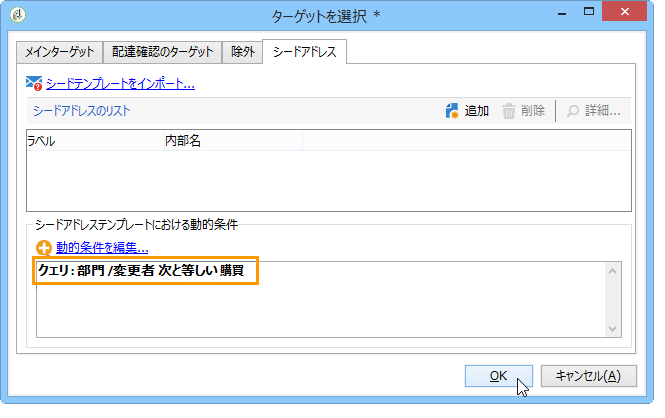

1. 「**[!UICONTROL OK]**」をクリックして、クエリを承認します。
1. 配信を分析し、「**[!UICONTROL 配信]**」タブをクリックして配信ログを表示します。

   購買部門のシードアドレスは、受信者や他のシードアドレスと同じように、配信待ちとして表示されます。

   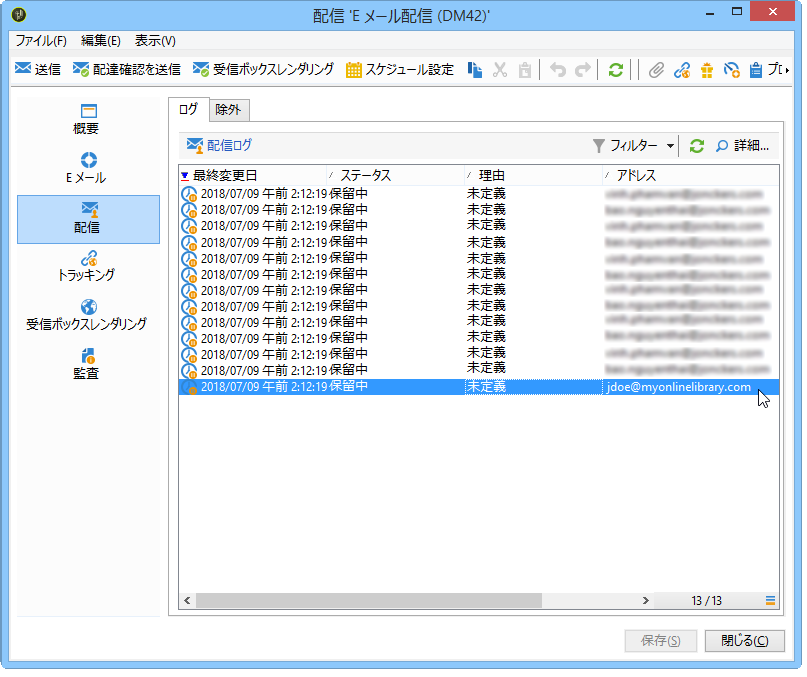

1. 「**[!UICONTROL 送信]**」ボタンをクリックして配信を開始します。

   購買部門のメンバーはこの配信のシードアドレスに含まれているので、購買部門の各メンバーの E メール受信ボックスにも配信が届きます。

   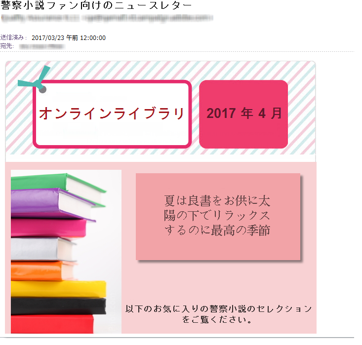
