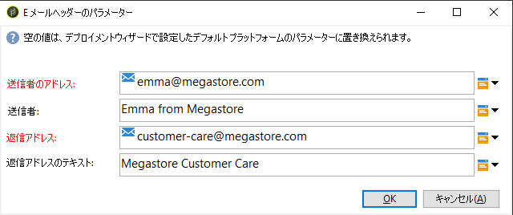

# テンプレートの使用 {#use-templates}

配信テンプレートは、一般的なアクティビティについての既製のシナリオを提供し、作業の効率化に役立ちます。配信テンプレートを使用すれば、最小限のカスタマイズをおこなうだけで、より迅速に新しいキャンペーンをデプロイできます。

配信テンプレートの詳細については、 [この節を参照してください](../../delivery/using/creating-a-delivery-template.md)。

## 配信テンプレートを使い始める {#gs-templates}

[配信テンプレートを使用すると](../../delivery/using/creating-a-delivery-template.md) 、ニーズに合った技術的な特性と機能的な特性を一度定義すれば、将来の配信で再利用できます。 その後、必要に応じて時間を節約し、配信を標準化できます。

Adobe Campaign で複数のブランドを管理する場合は、ブランドごとに 1 つのサブドメインを使用することをお勧めします。例えば銀行ならば、個々の支店に対応する複数のサブドメインを所有できます。銀行のドメインが bluebank.com の場合、サブドメインは、@ny.bluebank.com、@ma.bluebank.com、@ca.bluebank.com などになります。サブドメインごとに 1 つの配信テンプレートを用意すれば、それぞれのブランドに合わせて事前に設定されたパラメーターをいつでも使用でき、エラーの回避や時間の節約につながります。

**ヒント**: Campaign Standardでの設定エラーを回避するには、新しいテンプレートを作成するのではなく、ネイティブのテンプレートを重複し、そのプロパティを変更することをお勧めします。

## アドレスの設定

* 送信者のアドレスは、E メールを送信するための必須情報です。

* ISP（インターネットサービスプロバイダー）によっては、メッセージを許可する前に、送信者アドレスの有効性をチェックする場合があります。

* 正しくない形式のアドレスは、受信サーバーによって拒否される可能性があります。正しいアドレスが指定されていることを確認する必要があります。

* アドレスは、送信者を明示的に識別する必要があります。ドメインは、送信者によって所有され、登録されている必要があります。

* 配信アドレスと返信アドレスの E メールアカウントを作成することをお勧めします。詳しくは、自社のシステム管理者にご相談ください。

キャンペーンインターフェイスでアドレスを設定するには、次の手順に従います。

1. [配信テンプレートで](../../delivery/using/creating-a-delivery-template.md)、「 **[!UICONTROL 開始]** 」リンクをクリックします。 **[!UICONTROL E メールヘッダーのパラメーター]**&#x200B;ウィンドウで、次のフィールドに入力します。

   

1. 「 **[!UICONTROL Sender address]** 」フィールドで、アドレスドメインがAdobeに委任したサブドメインと同じであることを確認します。 「@」より前の部分は変更できますが、ドメインアドレスは変更できません。

1. 「 **[!UICONTROL 送信者]** 」フィールドで、ブランド名など、受信者が簡単に識別できる名前を使用して、配信の開放率を高めます。 受信者のエクスペリエンスの質を高めるために、「Megastore（担当：田中）」のように個人名を追加する方法もあります。

1. [ **[!UICONTROL 返信アドレス]** ]テキストフィールドでは、送信者のアドレスが既定で返信に使用されます。 カスタマーサポートの代表アドレスなど、実際にある既存のアドレスを使用することをお勧めします。そうすれば、受信者から返信が来た場合に、カスタマーサポートが対応することができます。

### コントロール母集団の設定

配信が送信されたら、除外された受信者の行動と、配信を受信した受信者の行動を比較します。その後、キャンペーンの効率性を測定できます。 コントロール母集団の詳細につ [いては、この節を参照してください](../../campaign/using/marketing-campaign-deliveries.md#defining-a-control-group)。

コントロール母集団を設定するには、「 **[!UICONTROL 宛先]** 」リンクをクリックします。 **[!UICONTROL ターゲットを選択]**&#x200B;ウィンドウで「**[!UICONTROL コントロール母集団]**」タブを選択します。ターゲットの一部を抽出できます。例えば、ランダムサンプリングとしてターゲットの 5％を抽出します。

## フィルターまたは制御ルールを適用するためのタイポロジの使用

タイポロジには、メッセージを送信する前の分析フェーズで適用されるチェックルールが含まれています。

テンプレートのプロパティの「**[!UICONTROL タイポロジ]**」タブで、必要に応じて、デフォルトのタイポロジを変更します。

例えば、アウトバウンドトラフィックの制御を強化するために、使用可能な IP アドレスを定義するには、サブドメインごとに 1 つのアフィニティを定義し、アフィニティごとに 1 つのタイポロジを作成します。アフィニティは、インスタンスの設定ファイルで定義されます。 Adobe Campaign管理者に問い合わせてください。

For more on typologies, refer to [this section](../../campaign/using/about-campaign-typologies.md).
