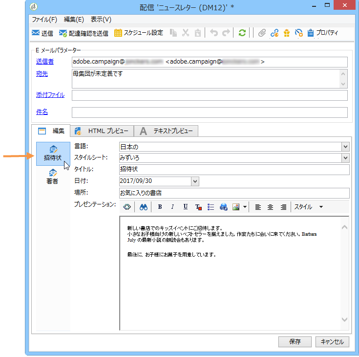
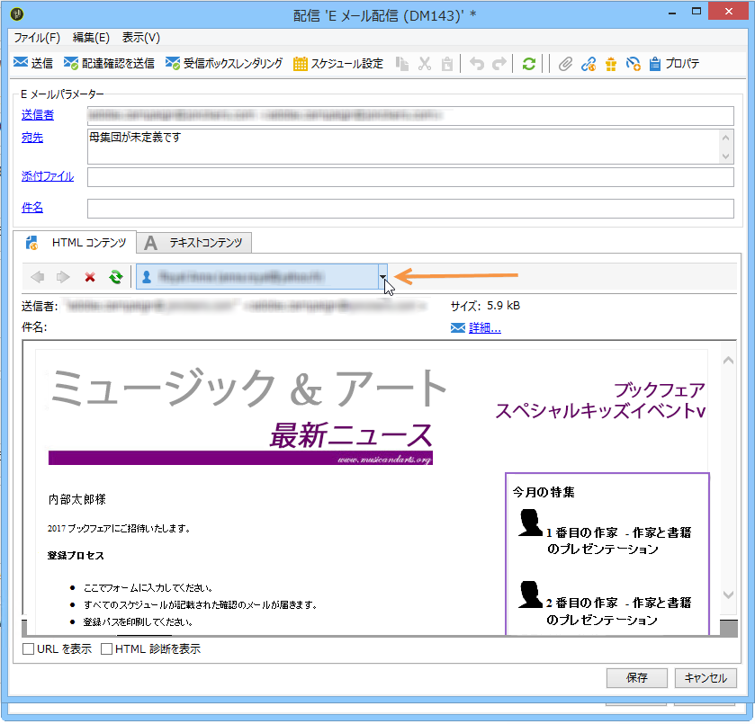
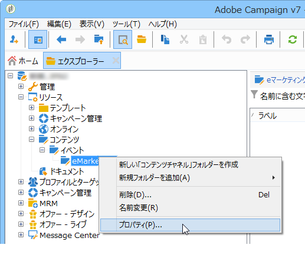
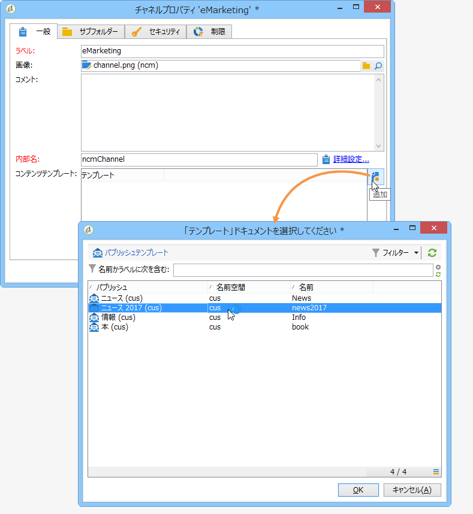
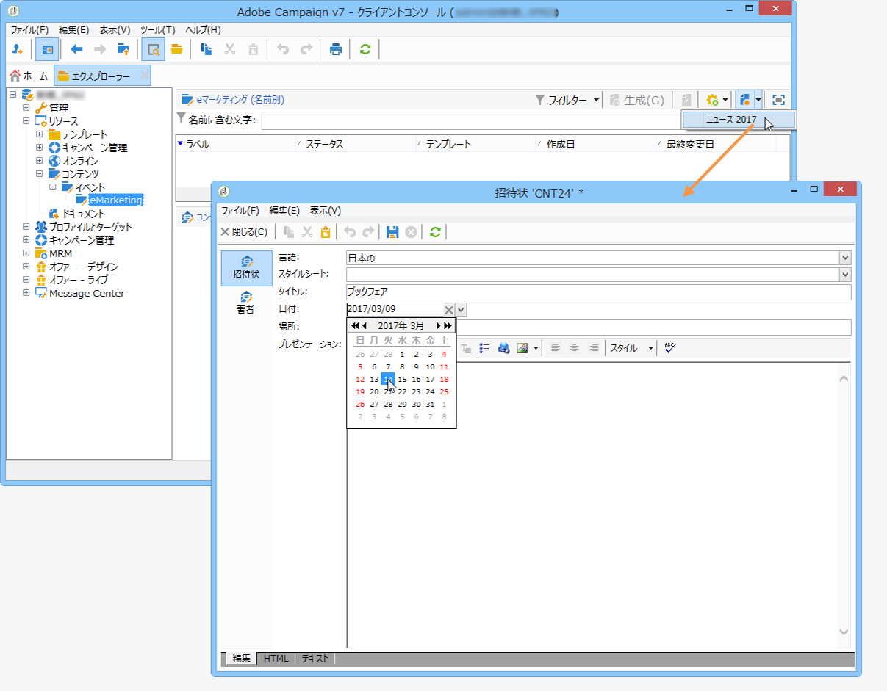
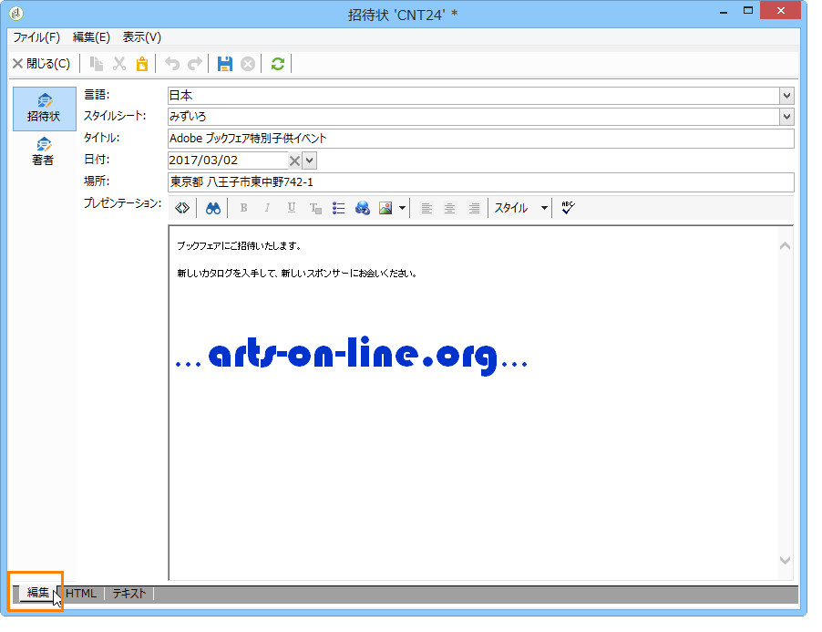
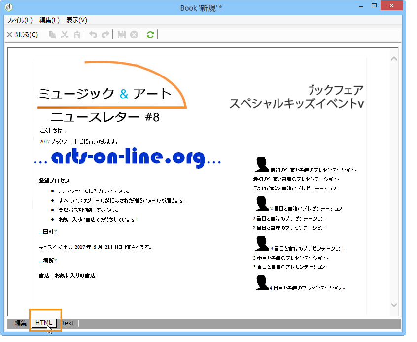
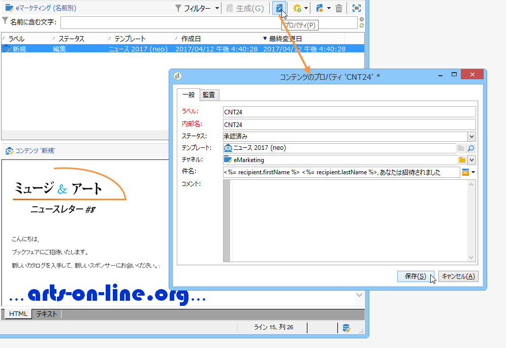
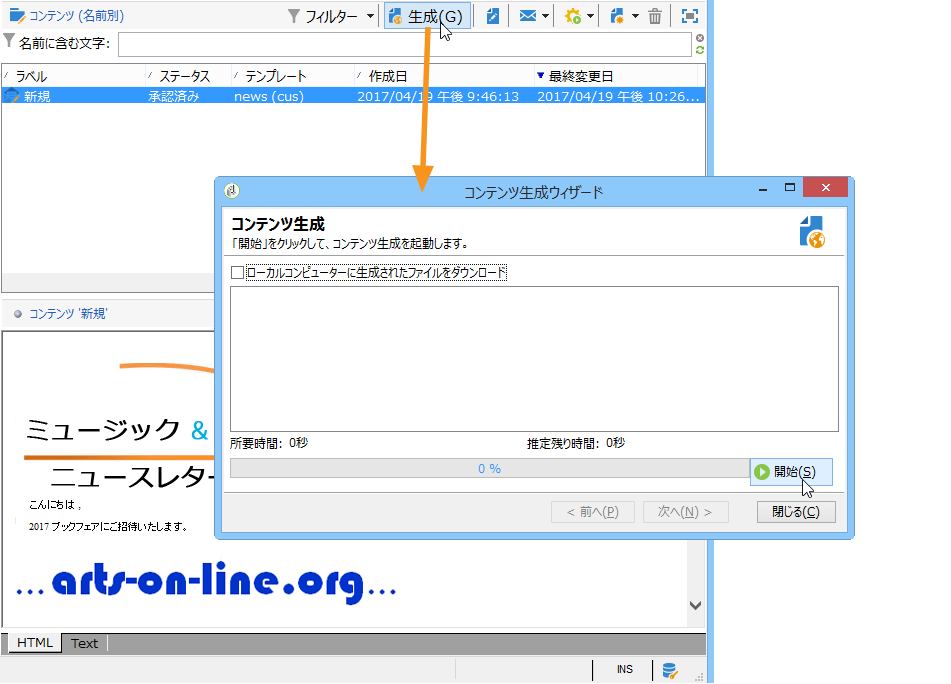
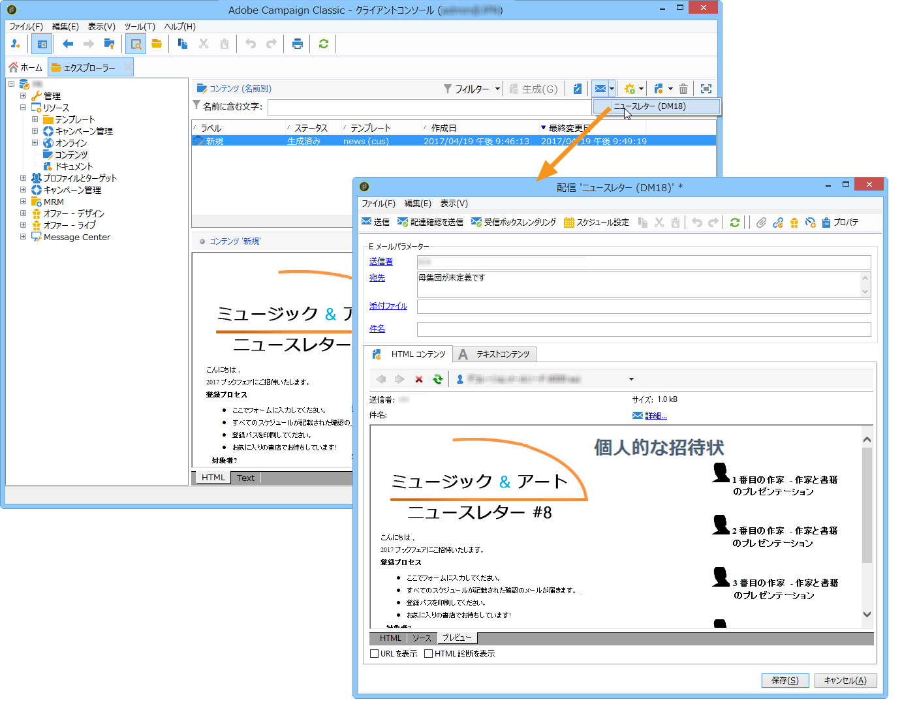

# コンテンツテンプレートの使用{#using-a-content-template}

## コンテンツテンプレートについて {#about-content-templates}

コンテンツテンプレートは、配信内で直接参照および使用できます。[コンテンツ管理からの配信の作成](#creating-a-delivery-via-content-management)を参照してください。

コンテンツインスタンスの作成にも使用できます。コンテンツインスタンスを作成したら、いつでも配信（[コンテンツインスタンスの配信](#delivering-a-content-instance)を参照）またはエクスポート（[コンテンツインスタンスの作成](#creating-a-content-instance)を参照）できます。

## コンテンツ管理からの配信の作成 {#creating-a-delivery-via-content-management}

配信内のコンテンツテンプレートの入力フィールドを使用してコンテンツを作成することができます。配信コンテンツを定義するためのタブが配信ウィザードに追加されます。

選択済みの設定に基づいて、レイアウトが自動的に適用されます。レイアウトを確認するには、「**[!UICONTROL HTML プレビュー]**」（または「**[!UICONTROL テキストプレビュー]**」）をクリックし、パーソナライゼーション要素をテストする受信者を選択します。

詳しくは、完全な実装例、[配信ウィザードでのコンテンツの作成](../../delivery/using/use-case--creating-content-management.md#creating-content-in-the-delivery-wizard)を参照してください。

## コンテンツインスタンスの作成 {#creating-a-content-instance}

Adobe Campaign のツリー内で直接コンテンツを作成して、ワークフローで使用したり、エクスポートしたり、新しい配信に含めたりできます。

次の手順に従います。

1. ツリーの&#x200B;**[!UICONTROL リソース／コンテンツ]**&#x200B;ノードを選択し、右クリックして「**[!UICONTROL プロパティ]**」を選択します。

   

1. このフォルダーに対して有効にするパブリッシュテンプレートを選択します。

   

1. コンテンツリストの上の&#x200B;**[!UICONTROL 新規]**&#x200B;ボタンを使用して、新しいコンテンツを作成します。

   

1. フォーム内のフィールドに入力します。

   

1. 「**[!UICONTROL HTML プレビュー]**」タブをクリックして、レンダリングを確認します。ここでは、データベースから取得するパーソナライゼーションフィールドは入力されていません。

   

1. 作成されたコンテンツは、使用可能なコンテンツのリストに追加されます。コンテンツのラベルやステータスを変更したり、履歴を確認したりするには、**[!UICONTROL プロパティ]**&#x200B;リンクをクリックします。

   

1. コンテンツが承認されたら、必要に応じて、ツールバーの適切なボタンを使用してコンテンツを生成できます。

   

   >[!NOTE]
   >
   >未承認コンテンツの生成を可能にする設定ができます。そのためには、パブリッシュテンプレートの関連オプションを変更します。詳しくは、[パブリッシュテンプレートの作成と設定](../../delivery/using/publication-templates.md#creating-and-configuring-the-template)を参照してください。

   デフォルトでは、HTML コンテンツとテキストコンテンツは、Adobe Campaign インスタンスの&#x200B;**パブリッシュ**&#x200B;フォルダーに生成されます。パブリッシュフォルダーは、**NcmPublishingDir** オプションを使用して変更できます。

## コンテンツインスタンスの配信 {#delivering-a-content-instance}

コンテンツインスタンスを作成して配信するためには、配信テンプレートをこのコンテンツの生成に使用するパブリッシュテンプレートにリンクする必要があります。詳しくは、[配信](../../delivery/using/publication-templates.md#delivery)を参照してください。

さらに、コンテンツストレージフォルダーは、このパブリッシュテンプレートから取得するコンテンツの専用フォルダーにする必要があります（1 つのコンテンツフォルダーで複数のタイプのコンテンツを生成できるようにすると、配信を自動的に生成できません）。

選択したコンテンツに基づいて配信を自動的に作成するには、**[!UICONTROL 配信]**&#x200B;アイコンをクリックして、テンプレートを選択します。

テキストコンテンツと HTML コンテンツが自動的に入力されます。
