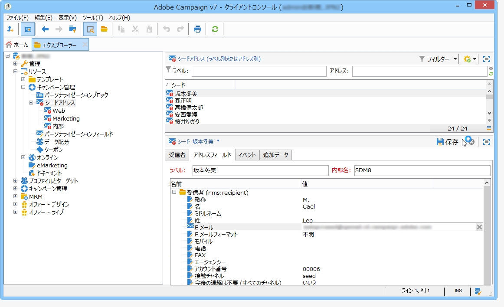
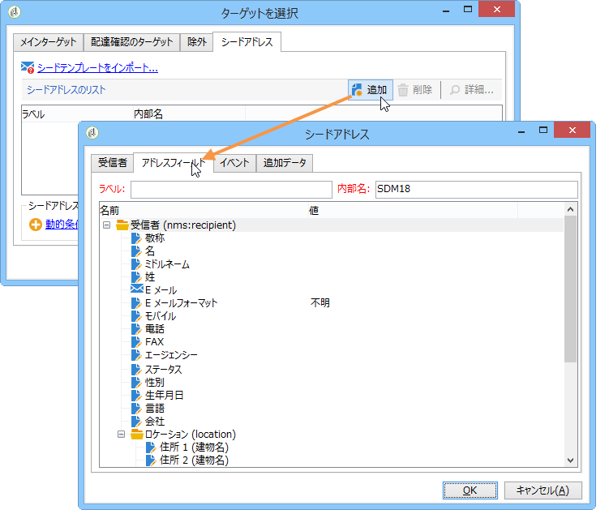

# 外部の送信者テーブルの使用{#using-an-external-recipient-table}

配信テーブルが外部のテーブルの場合は、追加設定が必要です。The **[!UICONTROL nms:seedmember]** schema must be extended. 次のように、適切なフィールドを定義するためのタブがシードアドレスに追加されます。

この場合、配信にシードアドレスを追加するには、適切なタブで各種の適切なフィールドを入力するか、アドレステンプレートをインポートします。

**nms:seedMember** スキーマ拡張については、[この節](../../configuration/using/seed-addresses.md)で説明しています。
