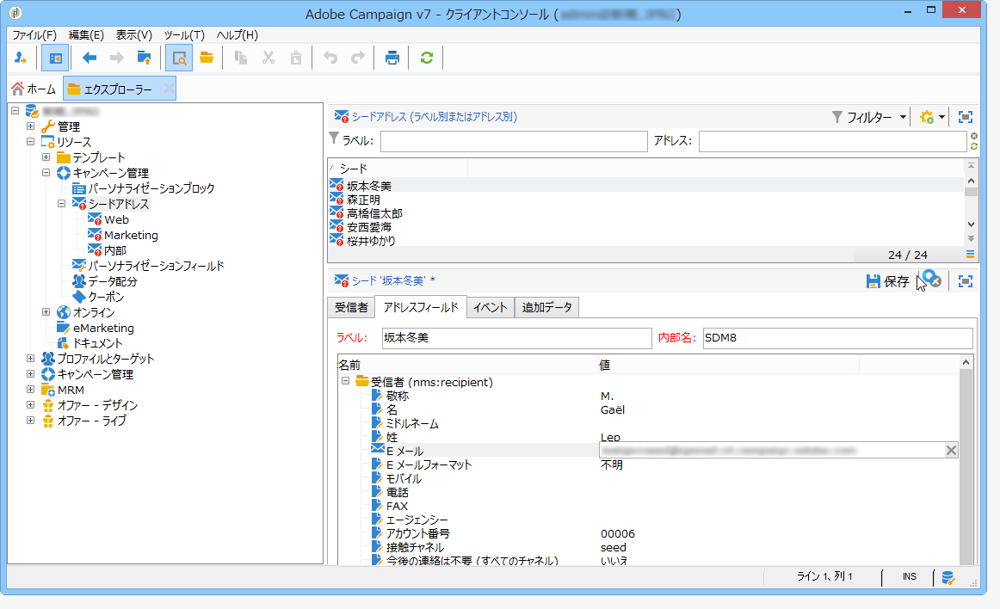
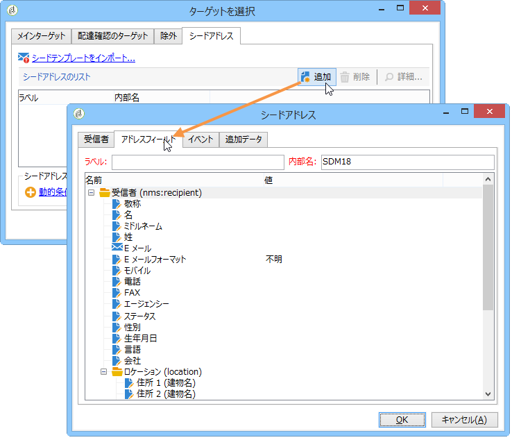

# 外部受信者テーブルの使用{#using-an-external-recipient-table}

配信テーブルが外部のテーブルの場合は、追加設定が必要です。 **[!UICONTROL nms:seedmember]** スキーマを拡張する必要があります。 次のように、適切なフィールドを定義するためのタブがシードアドレスに追加されます。

この場合、配信にシードアドレスを追加するには、適切なタブで各種の適切なフィールドを入力するか、アドレステンプレートをインポートします。

**nms:seedMember** スキーマの拡張機能は[このセクション &#x200B;](../../configuration/using/seed-addresses.md)です。
