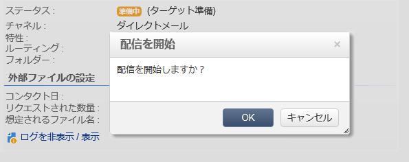

# 検証{#validating}

配信を検証する際のグローバル概念については、[この節](../../delivery/using/steps-validating-the-delivery.md)で説明しています。

ダイレクトメール配信の出力ファイルは、配信分析中に生成されます。ファイルの内容は、選択した出力列によって異なります（[抽出ファイル](../../delivery/using/defining-the-direct-mail-content.md#extraction-file)を参照）。

>[!NOTE]
>
>分析フェーズについて詳しくは、[配信の分析](../../delivery/using/steps-validating-the-delivery.md#analyzing-the-delivery)で説明しています。

分析フェーズではファイルが生成されますが、受信者に関する情報（配信ログなど）は更新されません。したがって、このジョブをキャンセルしても問題は発生しません。

分析の結果と、出力ファイルのコンテンツをチェックしてから、「**[!UICONTROL 配信を確定]**」をクリックします。配信の開始を確認するメッセージが表示されます。

送信を確認すると、指定したファイルへのデータ抽出が開始されます。

その後、ウィザードを閉じて、配信の詳細情報から「**[!UICONTROL 配信]**」タブを開くと、配信ログを参照できます。

配信ログの取得モードは、配信プロパティの「**[!UICONTROL 分析]**」タブで設定できます。

取得モードには次の 2 種類があります。

* **[!UICONTROL メッセージは検証後に送信されたものとみなされます]**（デフォルトのモード）：この機能モードでは、オペレーターが送信を確認すると、すべてのブロードログが更新され（ステータスが「配信待ち」から「送信済み」に変化します）、配信は自動的に「**[!UICONTROL 完了]**」に設定されます。
* **[!UICONTROL 結果ファイルに、送信されたメッセージやエラーメッセージが記述されています]**：このモードでは、サービスプロバイダーから送信された外部ファイルを使用してブロードログを更新できます。その場合、ブロードログのステータスを更新するには、この情報を処理するためのワークフローが必要です。

   >[!NOTE]
   >
   >また、ブロードログが更新されしだい、ユーザーが配信のステータスを「**[!UICONTROL 完了]**」に変更する必要もあります。
