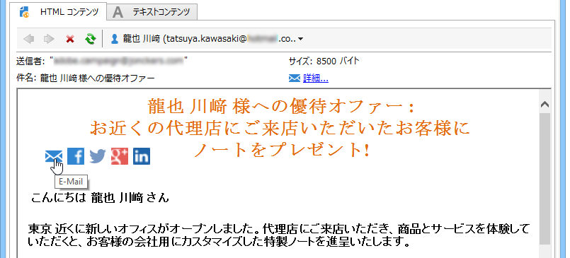

# バイラルおよびソーシャルマーケティング{#viral-and-social-marketing}

## バイラルマーケティングについて {#about-viral-marketing}

Adobe Campaign では、バイラルマーケティングを促進するツールを設定できます。

これにより、配信の受信者や Web サイトの訪問者が自分の Facebook プロファイルや Twitter プロファイルにリンクを追加したり、友人にメッセージを送信するなどの方法で、知人や友人と情報を共有できるようになります。

>[!CAUTION]
>
>追加されるリンクを正しく機能させるには、対応するミラーページを使用可能にする必要があります。そのためには、配信にミラーページへのリンクを含めます。

## ソーシャルネットワーク：リンクの共有 {#social-networks--sharing-a-link}

配信の受信者がソーシャルネットワークのメンバーとメッセージのコンテンツを共有できるようにするには、対応するパーソナライゼーションブロックを含める必要があります。

>[!NOTE]
>
>デフォルトでは、このリンクはブロックリストに表示されません。このリンクにアクセスするには、「**[!UICONTROL その他]**」をクリックし、「**[!UICONTROL ソーシャルネットワーク共有リンク]**」ブロックを選択します。

レンダリングは次のようになります。

表示されているいずれかのソーシャルネットワークのアイコンを受信者がクリックすると、受信者のアカウントに自動的にリダイレクトされ、リンクを介してメッセージコンテンツを共有できます。これにより、ソーシャルネットワークのメンバーがそのコンテンツにアクセスできるようになります。

>[!NOTE]
>
>このパーソナライゼーションブロックには、メッセージの送信やソーシャルネットワークでの共有をおこなうためのリンクが含まれます。ブロックの内容はニーズに合わせて変更できます。ただし、設定できるのは上級ユーザーに限られます。対応するパーソナライゼーションブロックを編集するには、Adobe Campaign ツリーの&#x200B;**[!UICONTROL リソース／キャンペーン管理／パーソナライゼーションブロック]**&#x200B;ノードに移動します。

## バイラルマーケティング：友人への転送 {#viral-marketing--forward-to-a-friend}

バイラルサービスによって、紹介タイプのアクションが可能になります。これは、友人にメッセージを転送できるようにするアクションです。転送を受ける側（被転送者）のプロファイルはデータベース（専用テーブル）に一時的に保存されます。転送されるメッセージには、被転送者に購読登録を勧めるリンクが含まれています。被転送者が購読登録すると、被転送者の情報が Adobe Campaign データベースに追加されます。

メッセージの転送は、ソーシャルネットワークリンクと同じ原理に基づいています。

次のような流れになります。

1. メッセージの本文に「**[!UICONTROL ソーシャルネットワーク共有リンク]**」パーソナライゼーションブロックを追加します。
1. メッセージの受信者は、**[!UICONTROL E メール]**&#x200B;アイコンをクリックして、このメッセージを 1 人以上の友人に送信できます。

   

   紹介フォームを使用して、被転送者の E メールアドレスを入力できます。

   

   メッセージの受信者が「**[!UICONTROL 次へ]**」ボタンをクリックすると、メッセージが送信されます。

   >[!NOTE]
   >
   >このメッセージのコンテンツは、ニーズに合わせてパーソナライズできます。このメッセージは、**[!UICONTROL 元のメッセージを転送]**&#x200B;テンプレートをベースとして作成されます。このテンプレートは、**[!UICONTROL 管理／キャンペーン管理／テクニカル配信テンプレート]**&#x200B;ノードに保存されています。
   >
   >メッセージ転送フォームを変更して、被転送者が使用できるようにすることも可能です。そのためには、**[!UICONTROL リソース／オンライン／Web アプリケーション]**&#x200B;ノードに保存されている&#x200B;**共有用のフォーム** Web アプリケーションを変更する必要があります。

1. 転送されたメッセージ内には、被転送者が自分のプロファイルをデータベースに保存できるリンクが含まれており、そのためのフォームが表示されます。

   

   >[!NOTE]
   >
   >この設定はカスタマイズできます。そのためには、**[!UICONTROL リソース／オンライン／Web アプリケーション]**&#x200B;ノードに保存されている&#x200B;**受信者を登録** Web アプリケーションを変更する必要があります。
   >
   >Web アプリケーションについて詳しくは、[この節](../../web/using/about-web-applications.md)を参照してください。

   被転送者が承認すると、確認メッセージが送信されます。確認メッセージ内のリンクを有効化すると、被転送者の情報が登録されます。このメッセージは、**[!UICONTROL 登録の確認]**&#x200B;テンプレートをベースとして作成されます。このテンプレートは、**[!UICONTROL 管理／キャンペーン管理／テクニカル配信テンプレート]**&#x200B;ノードに保存されています。

   被転送者がデータベースの&#x200B;**受信者**&#x200B;フォルダーに追加され、（デフォルトでは）**ニュースレター**&#x200B;情報サービスに購読登録されます。

## ソーシャルネットワーク共有のトラッキング {#tracking-social-network-sharing}

共有と、共有された情報へのアクセスがトラッキングされます。Adobe Campaign が収集するこの情報には、次の 2 つの場所でアクセスできます。

* （個別または受信者ごとの）配信の「**[!UICONTROL トラッキング]**」タブ

   

* 専用の&#x200B;**[!UICONTROL ソーシャルネットワークへの共有アクティビティ]**&#x200B;レポート

   

