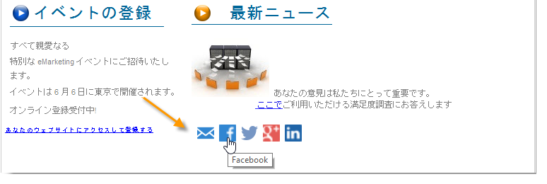
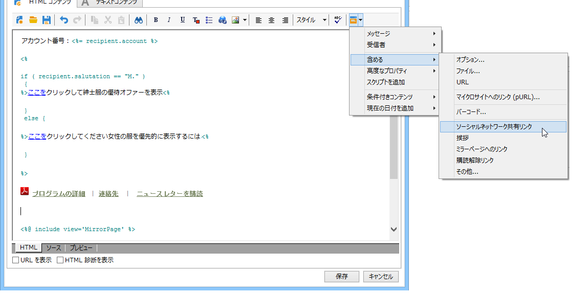
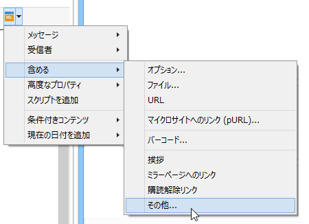
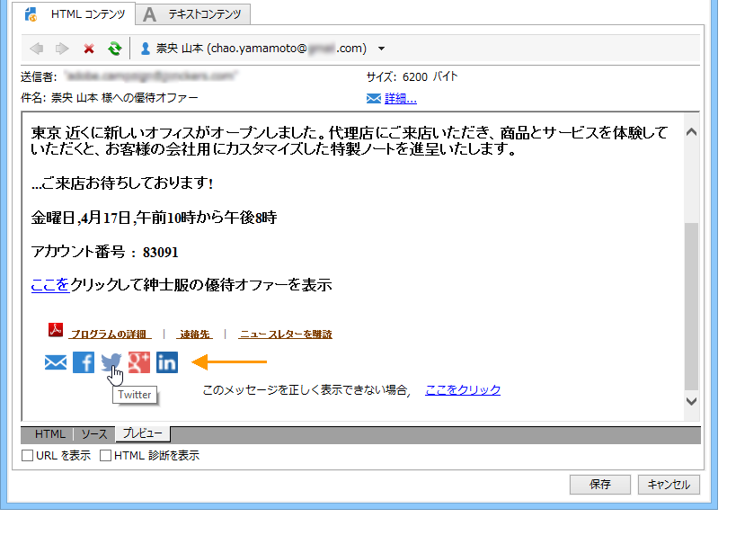
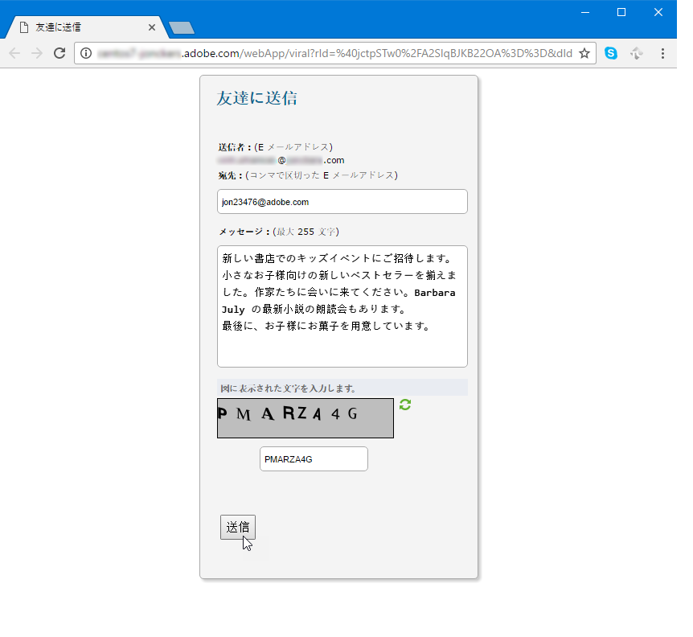
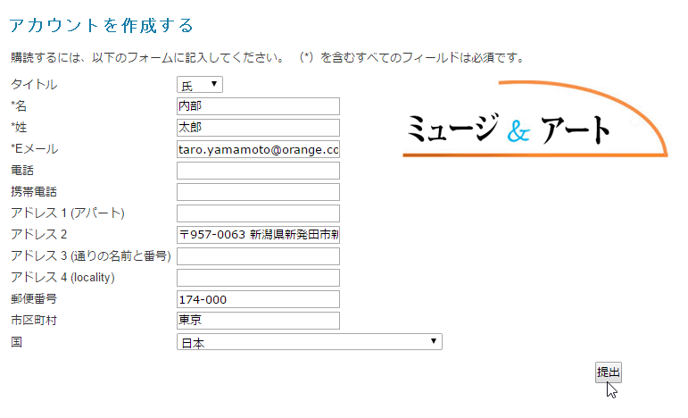
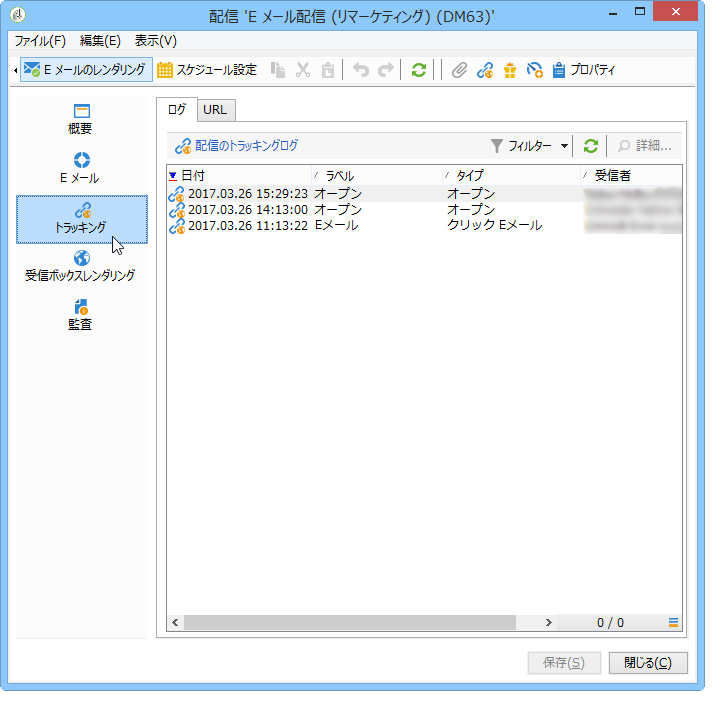
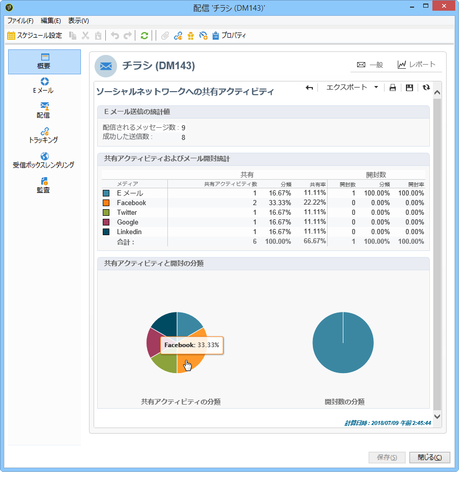

# バイラルおよびソーシャルマーケティング{#viral-and-social-marketing}

## バイラルマーケティングについて {#about-viral-marketing}

Adobe Campaign では、バイラルマーケティングを促進するツールを設定できます。

これにより、配信の受信者や Web サイトの訪問者が自分の Facebook プロファイルや Twitter プロファイルにリンクを追加したり、友人にメッセージを送信するなどの方法で、知人や友人と情報を共有できるようになります。

>[!CAUTION]
>
>追加されるリンクを正しく機能させるには、対応するミラーページを使用可能にする必要があります。そのためには、配信にミラーページへのリンクを含めます。

## ソーシャルネットワーク：リンクの共有 {#social-networks--sharing-a-link}

配信の受信者がソーシャルネットワークのメンバーとメッセージのコンテンツを共有できるようにするには、対応するパーソナライゼーションブロックを含める必要があります。

>[!NOTE]
>
>デフォルトでは、このリンクはブロックリストに表示されません。これにアクセスするには、をクリック **[!UICONTROL Other...]**&#x200B;し、ブロックを選択 **[!UICONTROL Social network sharing links]** します。

レンダリングは次のようになります。

表示されているいずれかのソーシャルネットワークのアイコンを受信者がクリックすると、受信者のアカウントに自動的にリダイレクトされ、リンクを介してメッセージコンテンツを共有できます。これにより、ソーシャルネットワークのメンバーがそのコンテンツにアクセスできるようになります。

>[!NOTE]
>
>このパーソナライゼーションブロックには、メッセージの送信やソーシャルネットワークでの共有をおこなうためのリンクが含まれます。ブロックの内容はニーズに合わせて変更できます。ただし、設定できるのは上級ユーザーに限られます。一致するパーソナライゼーションブロックを編集するには、Adobe Campaign **[!UICONTROL Resources > Campaign management > Personalization blocks]** ツリーのノードに移動します。

## バイラルマーケティング：友人への転送 {#viral-marketing--forward-to-a-friend}

バイラルサービスによって、紹介タイプのアクションが可能になります。これは、友人にメッセージを転送できるようにするアクションです。転送を受ける側（被転送者）のプロファイルはデータベース（専用テーブル）に一時的に保存されます。転送されるメッセージには、被転送者に購読登録を勧めるリンクが含まれています。被転送者が購読登録すると、被転送者の情報が Adobe Campaign データベースに追加されます。

メッセージの転送は、ソーシャルネットワークリンクと同じ原理に基づいています。

次のような流れになります。

1. オリジナルメ **[!UICONTROL Social network sharing links]** ッセージの本文にパーソナライゼーションブロックを追加します。
1. The message recipient can click the **[!UICONTROL Email]** icon to send this message to one or more friends.

   

   紹介フォームを使用して、被転送者の E メールアドレスを入力できます。

   

   The message is sent to them when the main recipient clicks the **[!UICONTROL Next]** button.

   >[!NOTE]
   >
   >このメッセージのコンテンツは、ニーズに合わせてパーソナライズできます。このテンプレートは、ノードに保 **[!UICONTROL Transfer of original message]** 存されているテンプレートに基づいて作成さ **[!UICONTROL Administration > Campaign management > Technical delivery templates]** れます。
   >
   >It is also possible to change the message forward form made available to the referrer To do this, you need to change the **Viral form** Web application stored in the **[!UICONTROL Resources > Online > Web applications]** node.

1. 転送されたメッセージ内には、被転送者が自分のプロファイルをデータベースに保存できるリンクが含まれており、そのためのフォームが表示されます。

   

   >[!NOTE]
   >
   >この設定はカスタマイズできます。To do this, you need to modify the **Recipient subscription** Web application stored in the **[!UICONTROL Resources > Online > Web applications]** node.
   >
   >Web アプリケーションについて詳しくは、[この節](../../web/using/about-web-applications.md)を参照してください。

   被転送者が承認すると、確認メッセージが送信されます。確認メッセージ内のリンクを有効化すると、被転送者の情報が登録されます。このメッセージは、ノードに保存され **[!UICONTROL Registration confirmation]** ているテンプレートに基づいて作成さ **[!UICONTROL Administration > Campaign management > Technical delivery templates]** れます。

   被転送者がデータベースの&#x200B;**受信者**&#x200B;フォルダーに追加され、（デフォルトでは）**ニュースレター**&#x200B;情報サービスに購読登録されます。

## ソーシャルネットワーク共有のトラッキング {#tracking-social-network-sharing}

共有と、共有された情報へのアクセスがトラッキングされます。Adobe Campaign が収集するこの情報には、次の 2 つの場所でアクセスできます。

* in the **[!UICONTROL Tracking]** tab of the delivery (or individually for each recipient):

   

* 専用のレポート **[!UICONTROL Sharing to social networks]** では：

   

