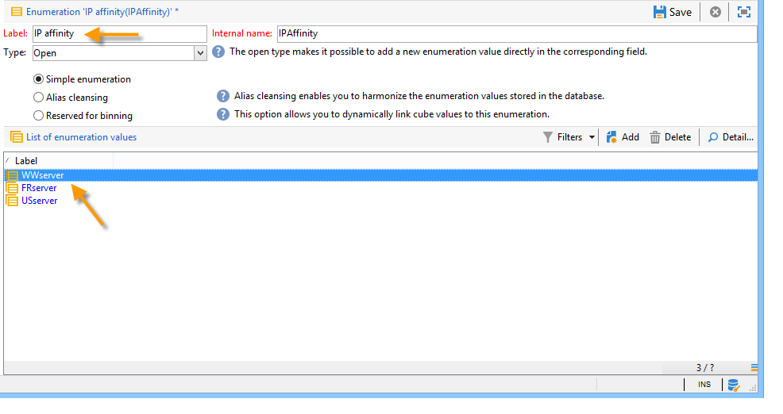
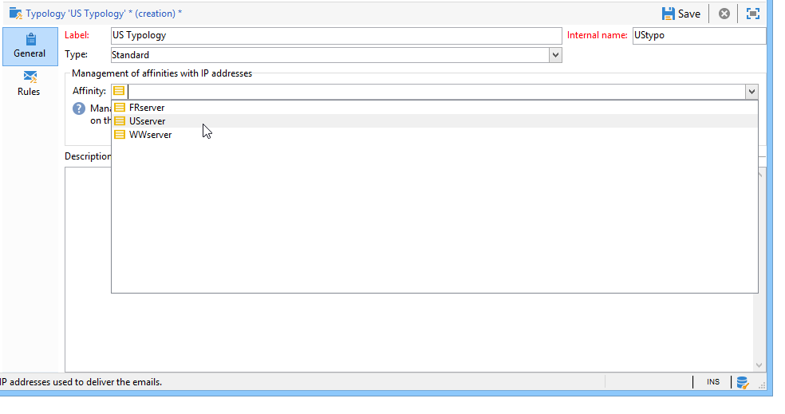

# 配信設定の指定 {#delivery-settings}


配信パラメーターは、**serverConf.xml** フォルダーで設定する必要があります。

* **DNS構成**: **`<dnsconfig>`**&#x200B;以降にMTA モジュールによって行われたMX タイプ DNS クエリに応答するために使用されるDNS サーバーの配信ドメインとIP アドレス（またはホスト）を指定します。

  >[!NOTE]
  >
  >**nameServers** パラメーターは、Windowsでのインストールに不可欠です。 Linuxでインストールする場合は、空のままにする必要があります。

  ```
  <dnsConfig localDomain="domain.com" nameServers="192.0.0.1,192.0.0.2"/>
  ```

ニーズと設定に応じて、次の設定を実行することもできます。[SMTP リレー](#smtp-relay)を設定し、[MTA子プロセス &#x200B;](#mta-child-processes)の数を調整し、[送信SMTP トラフィックを管理](#managing-outbound-smtp-traffic-with-affinities)。

## SMTP リレー {#smtp-relay}

MTA モジュールは、SMTP ブロードキャスト（ポート 25）用のネイティブ メール転送エージェントとして機能します。

ただし、セキュリティポリシーで必要な場合は、中継サーバーに置き換えることはできます。 この場合、グローバルスループットはリレースループットになります（ただし、リレーサーバースループットがAdobe Campaignスループットよりも劣っている場合）。

この場合、これらのパラメーターは、**`<relay>`** セクションでSMTP サーバーを設定することによって設定されます。 メールの転送に使用するSMTP サーバーのIP アドレス（またはホスト）と関連するポート（デフォルトでは25）を指定する必要があります。

```
<relay address="192.0.0.3" port="25"/>
```

>[!IMPORTANT]
>
>この動作モードは、リレーサーバー固有のパフォーマンス（待ち時間、帯域幅など）によりスループットを大幅に削減できるため、配信に重大な制限が生じる可能性があります。 また、同期配信エラー（SMTP トラフィックの分析により検出）を認定する能力が制限され、中継サーバーが利用できない場合は送信できません。

## MTA子プロセス {#mta-child-processes}

子プロセスの数（デフォルトではmaxSpareServers 2）を制御して、サーバのCPU電力と利用可能なネットワークリソースに応じてブロードキャストのパフォーマンスを最適化できます。 この設定は、個々のコンピューターのMTA設定の&#x200B;**`<master>`** セクションで行います。

```
<master dataBasePoolPeriodSec="30" dataBaseRetryDelaySec="60" maxSpareServers="2" minSpareServers="0" startSpareServers="0">
```

[&#x200B; メール送信の最適化](../../installation/using/email-deliverability.md#email-sending-optimization)も参照してください。

## アフィニティを使用したアウトバウンド SMTP トラフィックの管理 {#managing-outbound-smtp-traffic-with-affinities}

>[!IMPORTANT]
>
>アフィニティ設定は、あるサーバーから別のサーバーに一貫性を持たせる必要があります。 設定の変更は、MTAを実行しているすべてのアプリケーションサーバーにレプリケートする必要があるため、Adobeにアフィニティ設定を依頼することをお勧めします。

IP アドレスとのアフィニティを通じて、アウトバウンド SMTP トラフィックを改善できます。

それには、次の手順に従います。

1. **serverConf.xml** ファイルの&#x200B;**`<ipaffinity>`** セクションにアフィニティを入力します。

   1つの親和性に複数の異なる名前を付けることができます。これらの名前を分けるには、**;**&#x200B;文字を使用します。

   例：

   ```
    IPAffinity name="mid.Server;WWserver;local.Server">
             <IP address="XX.XXX.XX.XX" heloHost="myserver.us.campaign.net" publicId="123" excludeDomains="neo.*" weight="5"/
   ```

   関連するパラメーターを表示するには、**serverConf.xml** ファイルを参照してください。

1. ドロップダウンリストでアフィニティ選択を有効にするには、**IPAffinity**&#x200B;列挙にアフィニティ名を追加する必要があります。

   

   >[!NOTE]
   >
   >**定義済みリストの操作**&#x200B;方法について詳しくは、[Adobe Campaign v8 （コンソール）ドキュメント](https://experienceleague.adobe.com/ja/docs/campaign/campaign-v8/config/settings/enumerations){target=_blank}を参照してください。


   次に、タイポロジについて次に示すように、使用する親和性を選択できます。

   

   >[!NOTE]
   >
   >[配信サーバー設定](../../installation/using/email-deliverability.md#delivery-server-configuration)も参照できます。

**関連トピック**
* [技術的なメール設定](email-deliverability.md)
* [Campaign での MX サーバーの使用](using-mx-servers.md)
* [メール BCC の設定](email-archiving.md)
