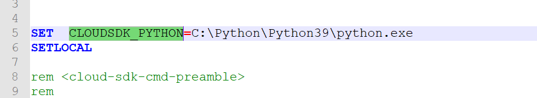
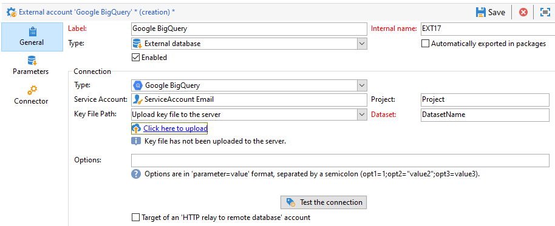

# Google BigQueryへのアクセスを設定する {#configure-fda-google-big-query}


Adobe Campaign Classic **Federated Data Access** （FDA） オプションを使用して、外部データベースに保存されている情報を処理します。 [!DNL Google BigQuery]へのアクセスを設定するには、次の手順に従います。

1. [Windows](#google-windows)または[Linux](#google-linux)で[!DNL Google BigQuery]を設定します
1. Adobe Campaign Classicで[!DNL Google BigQuery] [外部アカウント ](#google-external)を設定します
1. [Windows](#bulk-load-windows)または[Linux](#bulk-load-linux)で[!DNL Google BigQuery] コネクタの一括読み込みを設定

>[!NOTE]
>
> [!DNL Google BigQuery] コネクタは、ホスト型、ハイブリッド型、オンプレミス型のデプロイメントに使用できます。 詳しくは、[このページ](../../installation/using/capability-matrix.md)を参照してください。


## Windows上のGoogle BigQuery {#google-windows}

### Windowsでのドライバのセットアップ {#driver-window}

1. [Windows 用の ODBC ドライバー](https://cloud.google.com/bigquery/docs/reference/odbc-jdbc-drivers)をダウンロードします。

1. WindowsでODBC ドライバを設定します。 詳しくは、[このページ](https://storage.googleapis.com/simba-bq-release/jdbc/Simba%20JDBC%20Driver%20for%20Google%20BigQuery%20Install%20and%20Configuration%20Guide.pdf)を参照してください。

1. [!DNL Google BigQuery] コネクタを機能させるには、Adobe Campaign Classicに接続する次のパラメーターが必要です。

   * **[!UICONTROL プロジェクト]**：既存のプロジェクトを作成または使用します。

     詳しくは、[このページ](https://cloud.google.com/resource-manager/docs/creating-managing-projects)を参照してください。

   * **[!UICONTROL サービスアカウント]**: サービスアカウントを作成します。

     詳しくは、[このページ](https://cloud.google.com/iam/docs/creating-managing-service-accounts)を参照してください。

   * **[!UICONTROL キーファイルパス]**: **[!UICONTROL サービスアカウント]**&#x200B;には、ODBCを介した[!DNL Google BigQuery]接続に&#x200B;**[!UICONTROL キーファイル]**&#x200B;が必要です。

     詳しくは、[このページ](https://cloud.google.com/iam/docs/creating-managing-service-account-keys)を参照してください。

   * **[!UICONTROL データセット]**: **[!UICONTROL データセット]**&#x200B;は、ODBC接続ではオプションです。 すべてのクエリでは、テーブルが配置されているデータセットを指定する必要があるため、**[!UICONTROL データセット]**&#x200B;を指定することは、Adobe Campaign Classicの[!DNL Google BigQuery]FDA コネクタに必須です。

     詳しくは、[このページ](https://cloud.google.com/bigquery/docs/datasets)を参照してください。

1. 次に、Adobe Campaign Classicで[!DNL Google BigQuery]外部アカウントを設定できます。 外部アカウントの設定方法について詳しくは、[この節](#google-external)を参照してください。

### Windowsでの一括読み込みの設定 {#bulk-load-window}

>[!NOTE]
>
>Google Cloud SDKを使用するには、Pythonがインストールされている必要があります。
>
>Python3を使用することをお勧めします。この[ ページ ](https://www.python.org/downloads/)を参照してください。

一括読み込みユーティリティを使用すると、Google Cloud SDKを介してより高速な転送が可能になります。

1. この[ ページ ](https://cloud.google.com/sdk/docs/downloads-versioned-archives)からWindows 64 ビット （x86_64） アーカイブをダウンロードし、対応するディレクトリに展開します。

1. `google-cloud-sdk\install.sh` スクリプトを実行します。 パス変数の設定を受け入れる必要があります。

1. インストール後、パス変数`...\google-cloud-sdk\bin`が設定されていることを確認します。 そうでない場合は、手動で追加します。

1. `..\google-cloud-sdk\bin\bq.cmd` ファイルで、`CLOUDSDK_PYTHON` ローカル変数を追加します。この変数は、Python インストールの場所にリダイレクトされます。

   例：

   

1. Adobe Campaign Classicを再起動して、変更内容を考慮します。

## Linux版Google BigQuery {#google-linux}

### Linuxでのドライバのセットアップ {#driver-linux}

ドライバーを設定する前に、スクリプトとコマンドはルートユーザーが実行する必要があることに注意してください。 スクリプトの実行中にGoogle DNS 8.8.8.8を使用することをお勧めします。

Linuxで[!DNL Google BigQuery]を設定するには、次の手順に従います。

1. ODBC インストールの前に、Linux ディストリビューションに次のパッケージがインストールされていることを確認します。

   * Red Hat/CentOS:

     ```
     yum update
     yum upgrade
     yum install -y grep sed tar wget perl curl
     ```

   * Debianの場合：

     ```
     apt-get update
     apt-get upgrade
     apt-get install -y grep sed tar wget perl curl
     ```

1. インストール前にシステムを更新します。

   * Red Hat/CentOS:

     ```
     # install unixODBC driver manager
     yum install -y unixODBC
     ```

   * Debianの場合：

     ```
     # install unixODBC driver manager
     apt-get install -y odbcinst1debian2 libodbc1 odbcinst unixodbc
     ```

1. スクリプトを実行する前に、—help引数を指定して詳細情報を取得できます。

   ```
   cd /usr/local/neolane/nl6/bin/fda-setup-scripts
   ./bigquery_odbc-setup.sh --help
   ```

1. スクリプトが存在するディレクトリにアクセスし、ルートユーザーとして次のスクリプトを実行します。

   ```
   cd /usr/local/neolane/nl6/bin/fda-setup-scripts
   ./bigquery_odbc-setup.sh
   ```

### Linuxでの一括読み込みの設定 {#bulk-load-linux}

>[!NOTE]
>
>Google Cloud SDKを使用するには、Pythonがインストールされている必要があります。
>
>Python3を使用することをお勧めします。この[ ページ ](https://www.python.org/downloads/)を参照してください。

一括読み込みユーティリティを使用すると、Google Cloud SDKを介してより高速な転送が可能になります。

1. ODBC インストールの前に、Linux ディストリビューションに次のパッケージがインストールされていることを確認します。

   * Red Hat/CentOS:

     ```
     yum update
     yum upgrade
     yum install -y python3
     ```

   * Debianの場合：

     ```
     apt-get update
     apt-get upgrade
     apt-get install -y python3
     ```

1. スクリプトが存在するディレクトリにアクセスし、次のスクリプトを実行します。

   ```
   cd /usr/local/neolane/nl6/bin/fda-setup-scripts
   ./bigquery_sdk-setup.sh
   ```

## Google BigQuery外部アカウント {#google-external}

Adobe Campaign Classic インスタンスを[!DNL Google BigQuery]外部データベースに接続するには、[!DNL Google BigQuery]外部アカウントを作成する必要があります。

1. Adobe Campaign Classic **[!UICONTROL Explorer]**&#x200B;から、**[!UICONTROL 管理]** &#39;>&#39; **[!UICONTROL Platform]** &#39;>&#39; **[!UICONTROL 外部アカウント]**&#x200B;をクリックします。

1. 「**[!UICONTROL 新規]**」をクリックします。

1. 外部アカウント&#x200B;**[!UICONTROL タイプ]**&#x200B;として、「**[!UICONTROL 外部データベース]**」を選択します。

1. [!DNL Google BigQuery] 外部アカウントを設定するには、次を指定する必要があります。

   * **[!UICONTROL タイプ]**：[!DNL Google BigQuery]

   * **[!UICONTROL サービスアカウント]**: **[!UICONTROL サービスアカウント]**&#x200B;の電子メール。 詳しくは、[Google Cloud ドキュメント ](https://cloud.google.com/iam/docs/creating-managing-service-accounts)を参照してください。

   * **[!UICONTROL プロジェクト]**: **[!UICONTROL プロジェクト]**&#x200B;の名前。 詳しくは、[Google Cloud ドキュメント ](https://cloud.google.com/resource-manager/docs/creating-managing-projects)を参照してください。

   * **[!UICONTROL キーファイルのパス]**:
      * **[!UICONTROL キーファイルをサーバーにアップロード]**:「**[!UICONTROL ここをクリックしてアップロード]**」を選択すると、Adobe Campaign Classicからキーをアップロードできます。

      * **[!UICONTROL キーファイルパスを手動で入力]**：既存のキーを使用する場合は、このフィールドに絶対パスをコピーまたは貼り付けます。

   * **[!UICONTROL データセット]**: **[!UICONTROL データセット]**&#x200B;の名前。 詳しくは、[Google Cloud ドキュメント ](https://cloud.google.com/bigquery/docs/datasets-intro)を参照してください。

   

コネクタは、次のオプションをサポートしています。

| オプション | 説明 |
|:-:|:-:|
| ProxyType | ODBCおよびSDK コネクタを介してBigQueryに接続するために使用されるプロキシのタイプ。 </br>HTTP （デフォルト）、http_no_tunnel、socks4およびsocks5は現在サポートされています。 |
| ProxyHost | プロキシに到達できるホスト名またはIP アドレス。 |
| ProxyPort | プロキシが実行中のポート番号（例：8080） |
| ProxyUid | 認証済みプロキシに使用されるユーザー名 |
| ProxyPwd | ProxyUid パスワード |
| bqpath | これは、一括読み込みツール （Cloud SDK）にのみ適用されます。</br> PATH変数を使用しない場合や、google-cloud-sdk ディレクトリを別の場所に移動する必要がある場合は、このオプションでサーバー上のcloud sdk bin ディレクトリへの正確なパスを指定できます。 |
| GCloudConfigName | これは、リリース 7.3.4 リリース以降および一括読み込みツール（Cloud SDK）にのみ適用されます。</br> Google Cloud SDKでは、設定を使用してBigQuery テーブルにデータを読み込みます。 `accfda`という名前の設定には、データを読み込むためのパラメーターが格納されます。 ただし、このオプションを使用すると、ユーザーは設定に別の名前を指定できます。 |
| GCloudDefaultConfigName | これは、リリース 7.3.4 リリース以降および一括読み込みツール（Cloud SDK）にのみ適用されます。</br> アクティブなGoogle Cloud SDK設定を削除するには、まずアクティブなタグを新しい設定に転送する必要があります。 この一時的な設定は、データを読み込むためのメイン設定を再作成するために必要です。 一時的な設定の既定の名前は`default`です。必要に応じて変更できます。 |
| GCloudRecreateConfig | これは、リリース 7.3.4 リリース以降および一括読み込みツール（Cloud SDK）にのみ適用されます。</br> `false`に設定すると、一括読み込みメカニズムは、Google Cloud SDK設定の再作成、削除、変更を試みるのを妨げます。 代わりに、マシン上の既存の設定を使用してデータの読み込みを続行します。 この機能は、他の操作がGoogle Cloud SDK設定に依存している場合に役立ちます。</br> ユーザーが適切な設定なしでこのエンジンオプションを有効にすると、一括読み込みメカニズムは警告メッセージを発行します：`No active configuration found. Please either create it manually or remove the GCloudRecreateConfig option`。 それ以上のエラーを防ぐには、デフォルトのODBC Array Insert一括読み込みメカニズムの使用に戻ります。 |

