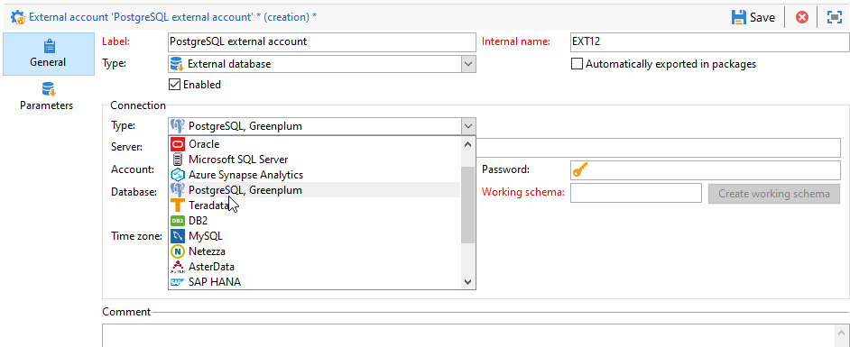

# PostgreSQL へのアクセスの設定 {#configure-fda-postgresql}

Campaign **Federated Data Access** （FDA）オプションを使用して、外部の PostgreSQL データベースに保存された情報を処理します。

## PostgreSQL 設定 {#postgresql-configuration}

最初に Libpq をインストールする必要があります。 Libpq を使用すると、クライアントプログラムは PostgreSQL バックエンドサーバに問い合わせを送信し、その問い合わせの結果を受け取ることができます。

[!DNL PostgreSQL] へのアクセスを設定するには、次の手順に従います。

* CentOS の場合、次のコマンド `sudo apt-get -y install libpq-dev` を実行します。

* Linux の場合は、次のコマンド `yum install postgresql-devel` を実行します。

* Windows の場合、Libpq はAdobe Campaignのインストールに含まれる `libpq.dll` を通じて実装されます。

Adobe Campaignで、[!DNL PostgreSQL] 外部アカウントを設定できます。 外部アカウントの設定方法について詳しくは、[&#x200B; この節 &#x200B;](#postgresql-external) を参照してください。

## PostgreSQL 外部アカウント {#postgresql-external}

>[!NOTE]
>
> PostgreSQL は CentOS 7 および 6 で使用できます。

Campaign インスタンスを [!DNL PostgreSQL] 外部データベースに接続するには、[!DNL PostgreSQL] 外部アカウントを作成する必要があります。

1. Campaign **[!UICONTROL エクスプローラー]** で、「**[!UICONTROL 管理]** 「>」 **[!UICONTROL プラットフォーム]** 「>」 **[!UICONTROL 外部アカウント]** をクリックします。

1. 「**[!UICONTROL 新規]**」をクリックします。

1. 外部アカウント&#x200B;**[!UICONTROL タイプ]**&#x200B;として、「**[!UICONTROL 外部データベース]**」を選択します。

1. **[!UICONTROL 設定]** で、「**[!UICONTROL タイプ]**」ドロップダウンから「[!DNL PostgreSQL, Greenplum]」を選択します。

   

1. **[!UICONTROL PostgreSQL]** 外部アカウント認証を設定します。

   * **[!UICONTROL サーバー]**:[!DNL PostgreSQL] サーバーの URL。

   * **[!UICONTROL アカウント]**：ユーザーの名前です。

   * **[!UICONTROL パスワード]**：ユーザーアカウントのパスワード。

   * **[!UICONTROL データベース]**：データベースの名前（オプション）。

   * **[!UICONTROL 作業スキーマ]**：作業スキーマの名前。 [詳細情報](https://www.postgresql.org/docs/current/ddl-schemas.html)

   * **[!UICONTROL タイムゾーン]**:[!DNL PostgreSQL] で設定されたタイムゾーン。 [詳細情報](https://www.postgresql.org/docs/7.2/timezones.html)

1. 「**[!UICONTROL パラメーター]**」タブをクリックし、「**[!UICONTROL 機能をデプロイ]**」ボタンをクリックして機能を作成します。

   >[!NOTE]
   >
   >すべての関数を使用するには、リモートデータベースにAdobe Campaign SQL 関数を作成する必要があります。 詳しくは、[このページ](../../configuration/using/adding-additional-sql-functions.md)を参照してください。

1. 設定が完了したら、「**[!UICONTROL 保存]**」をクリックします。

コネクタは、次のオプションをサポートしています。

| オプション | 説明 |
|:-:|:-:|
| PGSQL_CONNECT_TIMEOUT | 接続の最大待機時間（秒単位）。   詳しくは、[PostgreSQL のドキュメント &#x200B;](https://www.postgresql.org/docs/12/libpq-connect.html#LIBPQ-CONNECT-CONNECT-TIMEOUT) を参照してください。 |
| PGSQL_KEEPALIVES_IDLE | TCP がキープアライブ メッセージをサーバーに送信するまでの非アクティブな時間（秒）。   詳しくは、[PostgreSQL のドキュメント &#x200B;](https://www.postgresql.org/docs/12/libpq-connect.html#LIBPQ-KEEPALIVES-IDLE) を参照してください。 |
| PGSQL_KEEPALIVES_INTVL | サーバーによって確認されなかった TCP キープアライブ メッセージが再送信されるまでの秒数です。    詳しくは、[PostgreSQL のドキュメント &#x200B;](https://www.postgresql.org/docs/12/libpq-connect.html#LIBPQ-KEEPALIVES-INTERVAL) を参照してください。 |
| PGSQL_KEEPALIVES_CNT | クライアントのサーバーへの接続が停止していると見なされるまで失われる可能性がある TCP キープアライブの数。   詳しくは、[PostgreSQL のドキュメント &#x200B;](https://www.postgresql.org/docs/12/libpq-connect.html#LIBPQ-KEEPALIVES-COUNT) を参照してください。 |
