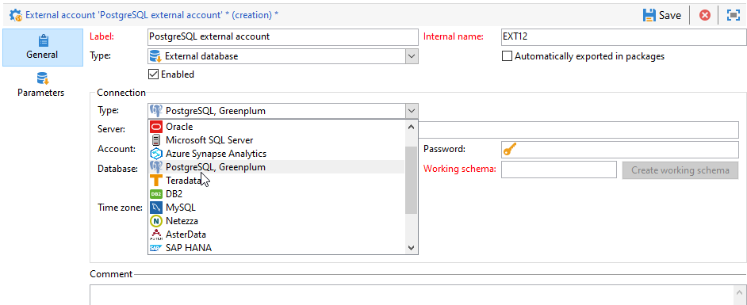

# PostgreSQLへのアクセス権の設定 {#configure-fda-postgresql}

外部PostgreSQL データベースに保存されている情報を処理するには、Campaign **Federated Data Access** （FDA）オプションを使用します。

## PostgreSQL設定 {#postgresql-configuration}

最初にLibpqをインストールする必要があります。 Libpqでは、クライアントプログラムがPostgreSQL バックエンドサーバーにクエリを送信し、これらのクエリの結果を受け取ることができます。

[!DNL PostgreSQL]へのアクセスを設定するには、次の手順に従います。

* CentOSの場合は、次のコマンド `sudo apt-get -y install libpq-dev`を実行します。

* Linuxの場合は、次のコマンド `yum install postgresql-devel`を実行します。

* Windowsの場合、Libpqは`libpq.dll`を通じて実装され、これはAdobe Campaign インストールに含まれています。

次に、Adobe Campaignで[!DNL PostgreSQL]外部アカウントを設定できます。 外部アカウントの設定方法について詳しくは、[この節](#postgresql-external)を参照してください。

## PostgreSQL外部アカウント {#postgresql-external}

>[!NOTE]
>
> PostgreSQLは、CentOS 7および6で利用できます。

Campaign インスタンスを[!DNL PostgreSQL]外部データベースに接続するには、[!DNL PostgreSQL]外部アカウントを作成する必要があります。

1. キャンペーン **[!UICONTROL エクスプローラー]**&#x200B;から、**[!UICONTROL 管理]** &#39;>&#39; **[!UICONTROL プラットフォーム]** &#39;>&#39; **[!UICONTROL 外部アカウント]**&#x200B;をクリックします。

1. 「**[!UICONTROL 新規]**」をクリックします。

1. 外部アカウント&#x200B;**[!UICONTROL タイプ]**&#x200B;として、「**[!UICONTROL 外部データベース]**」を選択します。

1. **[!UICONTROL 設定]**&#x200B;で、**[!UICONTROL タイプ]** ドロップダウンから[!DNL PostgreSQL, Greenplum]を選択します。

   

1. **[!UICONTROL PostgreSQL]**&#x200B;外部アカウント認証を設定します。

   * **[!UICONTROL サーバー]**: [!DNL PostgreSQL] サーバーのURL。

   * **[!UICONTROL アカウント]**: ユーザーの名前。

   * **[!UICONTROL パスワード]**: ユーザーアカウントのパスワード。

   * **[!UICONTROL データベース]**: データベースの名前（オプション）。

   * **[!UICONTROL 作業中のスキーマ]**：作業中のスキーマの名前。 [詳細情報](https://www.postgresql.org/docs/current/ddl-schemas.html)

   * **[!UICONTROL タイムゾーン]**: タイムゾーンが[!DNL PostgreSQL]に設定されました。 [詳細情報](https://www.postgresql.org/docs/7.2/timezones.html)

1. 「**[!UICONTROL パラメーター]**」タブをクリックし、「**[!UICONTROL 機能をデプロイ]**」ボタンをクリックして機能を作成します。

   >[!NOTE]
   >
   >すべての関数を使用できるようにするには、リモートデータベースにAdobe Campaign SQL関数を作成する必要があります。 詳しくは、[このページ](../../configuration/using/adding-additional-sql-functions.md)を参照してください。

1. 設定が完了したら、**[!UICONTROL 保存]**&#x200B;をクリックします。

コネクタは、次のオプションをサポートしています。

| オプション | 説明 |
|:-:|:-:|
| PGSQL_CONNECT_TIMEOUT | 接続の最大待機時間（秒）。  詳細については、[PostgreSQL ドキュメント &#x200B;](https://www.postgresql.org/docs/12/libpq-connect.html#LIBPQ-CONNECT-CONNECT-TIMEOUT)を参照してください。 |
| PGSQL_KEEPALIVES_IDLE | TCPがキープアライブ メッセージをサーバーに送信するまでの非アクティブな秒数。  詳細については、[PostgreSQL ドキュメント &#x200B;](https://www.postgresql.org/docs/12/libpq-connect.html#LIBPQ-KEEPALIVES-IDLE)を参照してください。 |
| PGSQL_KEEPALIVES_INTVL | サーバーがTCP キープアライブ メッセージを再送信するまでの秒数。   詳細については、[PostgreSQL ドキュメント &#x200B;](https://www.postgresql.org/docs/12/libpq-connect.html#LIBPQ-KEEPALIVES-INTERVAL)を参照してください。 |
| PGSQL_KEEPALIVES_CNT | クライアントのサーバーへの接続が停止したと見なされる前に失われる可能性のあるTCP キープアライブの数。  詳細については、[PostgreSQL ドキュメント &#x200B;](https://www.postgresql.org/docs/12/libpq-connect.html#LIBPQ-KEEPALIVES-COUNT)を参照してください。 |
