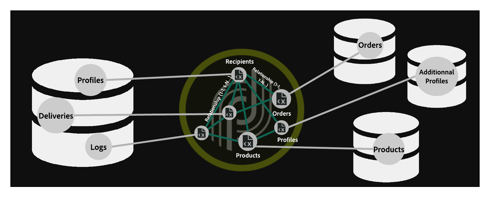
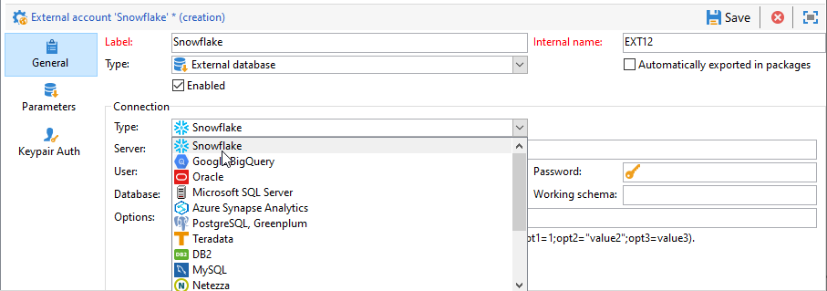
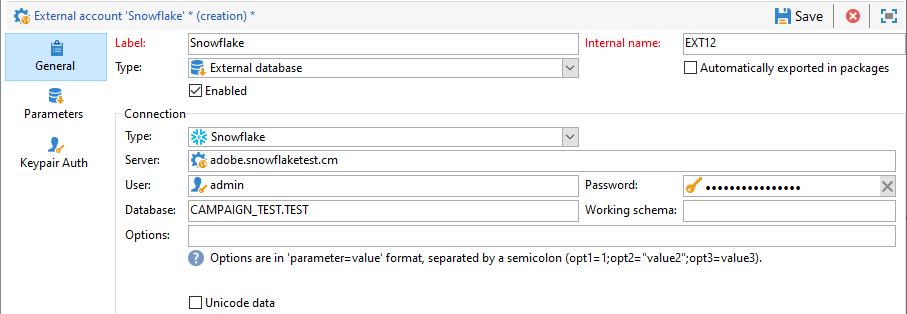
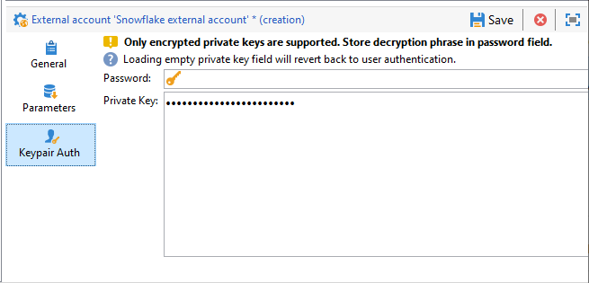
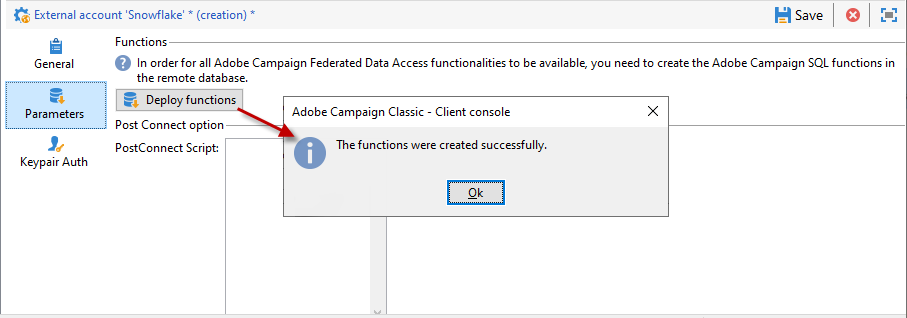

# Snowflakeへのアクセス権の設定 {#configure-access-to-snowflake}

外部データベースに保存されている情報を処理するには、Campaign **Federated Data Access** （FDA）オプションを使用します。 [!DNL Snowflake]へのアクセスを設定するには、次の手順に従います。

1. [Linux](#snowflake-linux)で[!DNL Snowflake]を設定します。
1. Campaignで[!DNL Snowflake] [外部アカウント ](#snowflake-external)を設定します

>[!CAUTION]
>
>* [!DNL Snowflake] コネクタは、ホスト型およびオンプレミス型のデプロイメントで使用できます。 詳しくは、[このページ](../../installation/using/capability-matrix.md)を参照してください。
>
>* サポートされている最小バージョンの[!DNL Snowflake] ODBC ドライバーは&#x200B;**2.24.4**&#x200B;です。
>



## Linux版Snowflake {#snowflake-linux}

Linuxで[!DNL Snowflake]を設定するには、次の手順に従います。

1. ODBC インストールの前に、Linux ディストリビューションに次のパッケージがインストールされていることを確認します。

   * Red Hat/CentOS:

     ```
     yum update
     yum upgrade
     yum install -y grep sed tar wget perl curl
     ```

   * Debianの場合：

     ```
     apt-get update
     apt-get upgrade
     apt-get install -y grep sed tar wget perl curl
     ```

1. スクリプトを実行する前に、`--help` オプションを使用して詳細情報にアクセスできます。

   ```
   cd /usr/local/neolane/nl6/bin/fda-setup-scripts/
   ./snowflake_odbc-setup.sh --help
   ```

1. スクリプトが配置されているディレクトリにアクセスし、ルートユーザーとして次のスクリプトを実行します。

   ```
   cd /usr/local/neolane/nl6/bin/fda-setup-scripts
   ./snowflake_odbc-setup.sh
   ```

1. ODBC ドライバーをインストールしたら、Campaign Classicを再起動する必要があります。 これをおこなうには、次のコマンドを実行します。

   ```
   systemctl stop nlserver.service
   systemctl start nlserver.service
   ```

1. Campaignで、[!DNL Snowflake]外部アカウントを設定できます。 外部アカウントの設定方法について詳しくは、[この節](#snowflake-external)を参照してください。

## Snowflake外部アカウント {#snowflake-external}

Campaign インスタンスを[!DNL Snowflake]外部データベースに接続するには、[!DNL Snowflake]外部アカウントを作成する必要があります。

1. キャンペーン **[!UICONTROL エクスプローラー]**&#x200B;から、**[!UICONTROL 管理]** &#39;>&#39; **[!UICONTROL プラットフォーム]** &#39;>&#39; **[!UICONTROL 外部アカウント]**&#x200B;をクリックします。

1. 「**[!UICONTROL 新規]**」をクリックします。

1. 外部アカウント&#x200B;**[!UICONTROL タイプ]**&#x200B;として、「**[!UICONTROL 外部データベース]**」を選択します。

1. **[!UICONTROL 設定]**&#x200B;で、**[!UICONTROL タイプ]** ドロップダウンから[!DNL Snowflake]を選択します。

   

1. **[!UICONTROL サーバー]** URLと&#x200B;**[!UICONTROL データベース]**&#x200B;を追加します。

1. **[!UICONTROL Snowflake]**&#x200B;外部アカウント認証を設定します。

   * アカウント/パスワード認証の場合は、次を指定する必要があります。

      * **[!UICONTROL アカウント]**：ユーザーの名前

      * **[!UICONTROL パスワード]**: ユーザーアカウントのパスワード。

     

   * Keypair認証の場合は、「**[!UICONTROL Keypair Auth]**」タブをクリックして、**[!UICONTROL 秘密鍵]**&#x200B;を使用し、**[!UICONTROL 秘密鍵]**&#x200B;を認証してコピー&amp;ペーストします。

     

1. 「**[!UICONTROL パラメーター]**」タブをクリックし、「**[!UICONTROL 機能をデプロイ]**」ボタンをクリックして機能を作成します。

   >[!NOTE]
   >
   >すべての関数を使用できるようにするには、リモートデータベースにAdobe Campaign SQL関数を作成する必要があります。 詳しくは、[このページ](../../configuration/using/adding-additional-sql-functions.md)を参照してください。

   

1. 設定が完了したら、**[!UICONTROL 保存]**&#x200B;をクリックします。

コネクタは、次のオプションをサポートしています。

| オプション | 説明 |
|---|---|
| workschema | ワークテーブルに使用するデータベーススキーマ |
| warehouse | 使用するデフォルトのウェアハウスの名前。 ユーザーのデフォルト値より優先されます。 |
| TimeZoneName | デフォルトでは空で、Campaign Classic アプリケーションサーバーのシステムのタイムゾーンが使用されます。 このオプションは、TIMEZONE セッションパラメーターを強制的に指定するために使用できます。 <br>詳しくは、[このページ](https://docs.snowflake.net/manuals/sql-reference/parameters.html#timezone)を参照してください。 |
| WeekStart | WEEK_START セッションパラメーター。 デフォルトでは 0 に設定されています。 <br>詳しくは、[このページ](https://docs.snowflake.com/en/sql-reference/parameters.html#week-start)を参照してください。 |
| UseCachedResult | USE_CACHED_RESULTS セッションパラメーター。 デフォルトでは TRUE に設定されています。 このオプションを使用すると、Snowflakeのキャッシュ結果を無効にできます。 <br>詳しくは、[このページ](https://docs.snowflake.net/manuals/user-guide/querying-persisted-results.html)を参照してください。 |
| bulkThreads | Snowflakeのバルクローダで使用するスレッド数が多いほど、大きなバルクローダのパフォーマンスが向上します。 デフォルトでは 1 に設定されています。 マシンのスレッド数に応じて数を調整できます。 |
| chunkSize | バルクローダーチャンクのファイルサイズを指定します。 デフォルトでは128MBに設定されています。 bulkThreadsで使用する場合は、より最適なパフォーマンスを得るために変更できます。 同時にアクティブなスレッドが多いほど、パフォーマンスが向上します。 <br>詳しくは、[Snowflake ドキュメント ](https://docs.snowflake.net/manuals/sql-reference/sql/put.html)を参照してください。 |
| StageName | 事前にプロビジョニングされた内部ステージの名前。 新しい一時的ステージを作成する代わりに、一括読み込みで使用されます。 |
