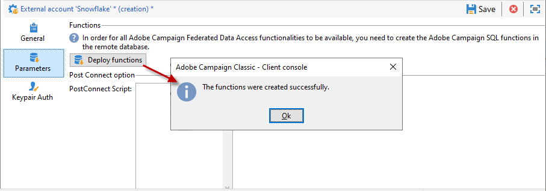

# Snowflake へのアクセスの設定 {#configure-access-to-snowflake}

キャンペーン&#x200B;**Federated Data Access** (FDA)オプションを使用して、外部データベースに保存された情報を処理します。 次の手順に従って[!DNL Snowflake]へのアクセスを設定します。

1. [CentOS](#snowflake-centos)、[Windows](#snowflake-windows)、または[Debian](#snowflake-debian)に[!DNL Snowflake]を設定します。
1. キャンペーンで[!DNL Snowflake] [外部アカウント](#snowflake-external)を設定


>[!NOTE]
>
>[!DNL Snowflake] コネクタは、ホスト型およびオンプレミス型のデプロイメントで使用できます。詳しくは、[このページ](../../installation/using/capability-matrix.md)を参照してください。


## CentOS での Snowflake {#snowflake-centos}

CentOSで[!DNL Snowflake]を設定するには、次の手順に従います。

1. [!DNL Snowflake] 用の ODBC ドライバーをダウンロードします。ダウンロードを開始するには、[ここをクリック](https://sfc-repo.snowflakecomputing.com/odbc/linux/latest/snowflake-odbc-2.20.2.x86_64.rpm)します。
1. 次のコマンドを使用して、CentOs に ODBC ドライバーをインストールする必要があります。

   ```
   rpm -Uvh unixodbc
   rpm -Uvh snowflake-odbc-2.20.2.x86_64.rpm
   ```

1. ODBC ドライバーをダウンロードしてインストールした後、Campaign Classic を再起動する必要があります。これをおこなうには、次のコマンドを実行します。

   ```
   /etc/init.d/nlserver6 stop
   /etc/init.d/nlserver6 start
   ```

1. キャンペーンでは、[!DNL Snowflake]外部アカウントを設定できます。 外部アカウントの構成方法について詳しくは、[この](#snowflake-external)を参照してください。

## Windows での Snowflake。{#snowflake-windows}

1. [Windows 用の ODBC ドライバー](https://docs.snowflake.net/manuals/user-guide/odbc-download.html)をダウンロードします。ドライバーをインストールするには、管理者レベルの権限が必要です。詳しくは、[このページ](https://docs.snowflake.net/manuals/user-guide/admin-user-management.html)を参照してください。

1. ODBC ドライバーを設定します。詳しくは、[このページ](https://docs.snowflake.net/manuals/user-guide/odbc-windows.html#step-2-configure-the-odbc-driver)を参照してください。

1. キャンペーンでは、[!DNL Snowflake]外部アカウントを設定できます。 外部アカウントの構成方法について詳しくは、[この](#snowflake-external)を参照してください。

## Debian での Snowflake{#snowflake-debian}

1. [!DNL Snowflake] 用の ODBC ドライバーをダウンロードします。[ここをクリック](https://sfc-repo.snowflakecomputing.com/odbc/linux/latest/index.html)して、ダウンロードを開始します。

1. 次のコマンドを使用して、Debian に ODBC ドライバーをインストールする必要があります。

   ```
   apt-get install unixodbc
   apt-get install snowflake-odbc-x.xx.x.x86_64.deb
   ```

1. ODBC ドライバーをダウンロードしてインストールした後、Campaign Classic を再起動する必要があります。これをおこなうには、次のコマンドを実行します。

   ```
   systemctl stop nlserver.service
   systemctl start nlserver.service
   ```

1. キャンペーンでは、[!DNL Snowflake]外部アカウントを設定できます。 外部アカウントの構成方法について詳しくは、[この](#snowflake-external)を参照してください。

## Snowflake 外部アカウント{#snowflake-external}

[!DNL Snowflake]外部アカウントを作成して、キャンペーンインスタンスを[!DNL Snowflake]外部データベースに接続する必要があります。

1. キャンペーン&#x200B;**[!UICONTROL エクスプローラー]**&#x200B;から、**[!UICONTROL 管理]** &#39;>&#39; **[!UICONTROL プラットフォーム]** &#39;>&#39; **[!UICONTROL 外部アカウント]**&#x200B;をクリックします。

1. 「**[!UICONTROL 新規]**」をクリックします。

1. 外部アカウント&#x200B;**[!UICONTROL タイプ]**&#x200B;として、「**[!UICONTROL 外部データベース]**」を選択します。

1. **[!UICONTROL Snowflake]** 外部アカウントを設定するには、次を指定する必要があります。

   * **[!UICONTROL タイプ]**：[!DNL Snowflake]

   * **[!UICONTROL サーバー]**：[!DNL Snowflake] サーバーの URL

   * **[!UICONTROL アカウント]**：ユーザーの名前

   * **[!UICONTROL パスワード]**：ユーザーアカウントのパスワード

   * **[!UICONTROL データベース]**：データベースの名前

   

1. 「**[!UICONTROL パラメーター]**」タブをクリックし、「**[!UICONTROL 機能をデプロイ]**」ボタンをクリックして機能を作成します。

   

コネクタは、次のオプションをサポートしています。

| オプション | 説明 |
|---|---|
| workschema | 作業用テーブルに使用するデータベーススキーマ |
| warehouse | 使用するデフォルトのウェアハウスの名前。ユーザーのデフォルト値より優先されます。 |
| TimeZoneName | デフォルトでは空で、Campaign Classic アプリケーションサーバーのシステムのタイムゾーンが使用されます。このオプションは、TIMEZONE セッションパラメーターを強制的に指定するために使用できます。<br>詳しくは、[このページ](https://docs.snowflake.net/manuals/sql-reference/parameters.html#timezone)を参照してください。 |
| WeekStart | WEEK_START セッションパラメーター。デフォルトでは 0 に設定されています。<br>詳しくは、[このページ](https://docs.snowflake.com/en/sql-reference/parameters.html#week-start)を参照してください。 |
| UseCachedResult | USE_CACHED_RESULTS セッションパラメーター。デフォルトでは TRUE に設定されています。このオプションは、Snowflake でキャッシュされた結果を無効にするために使用できます。<br>詳しくは、[このページ](https://docs.snowflake.net/manuals/user-guide/querying-persisted-results.html)を参照してください。 |
