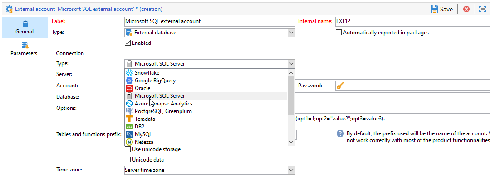

# Microsoft SQL Serverへのアクセス権の設定 {#configure-fda-sql}


外部のMicrosoft SQL Server データベースに保存されている情報を処理するには、Campaign **Federated Data Access** （FDA） オプションを使用します。 [!DNL Microsoft SQL Server]へのアクセスを設定するには、次の手順に従います。

1. [CentOS](#sql-centos)で[!DNL Microsoft SQL Server]を設定します。
1. [Linux](#sql-linux)で[!DNL Microsoft SQL Server]を設定します。
1. [Windows](#sql-windows)で[!DNL Microsoft SQL Server]を設定します。
1. Campaignで[!DNL Microsoft SQL Server] [外部アカウント ](#sql-external)を設定します

## CentOS上のMicrosoft SQL Server {#sql-centos}

>[!NOTE]
>
> [!DNL Microsoft SQL Server]はCentOS 7および6で利用できます。

CentOSで[!DNL Microsoft SQL Server]を設定するには、次の手順に従います。

1. 次のコマンドを使用して、SQL ODBC ドライバーをダウンロードしてインストールします。

   ```
   sudo su
   curl https://packages.microsoft.com/config/rhel/7/prod.repo > /etc/yum.repos.d/mssql-release.repo
   exit
   sudo yum remove unixODBC-utf16 unixODBC-utf16-devel #to avoid conflicts
   sudo ACCEPT_EULA=Y yum install msodbcsql
   ```

1. 次に、Adobe Campaignで[!DNL Microsoft SQL Server]外部アカウントを設定できます。 外部アカウントの設定方法について詳しくは、[この節](#sql-external)を参照してください。

## Linux上のMicrosoft SQL Server {#sql-linux}

>[!NOTE]
>
> 古いバージョンのAdobe Campaign（7.2.1より前）を使用している場合は、`unix ODBC drivers`をインストールする必要があります。

1. MS ODBC ドライバーを[このページ ](https://packages.microsoft.com/ubuntu/16.04/prod/pool/main/m/msodbcsql17/)からダウンロードします。

1. 次のコマンドをルートユーザーとして実行します。

   ```
   # install the mssql odbc that was downloaded
   dpkg -i msodbcsql17_17.7.1.1-1_amd64.deb
   # accept the license terms
   ```

1. 次に、Adobe Campaignで[!DNL Microsoft SQL Server]外部アカウントを設定できます。 外部アカウントの設定方法について詳しくは、[この節](#sql-external)を参照してください。

## Windows上のMicrosoft SQL Server {#sql-windows}

Windowsで[!DNL Microsoft SQL Server]を設定するには：

1. Windowsで、**[!UICONTROL Campaign コントロールパネル]** &#39;>&#39; **[!UICONTROL システムとセキュリティ]** &#39;>&#39; **[!UICONTROL 管理ツール]**&#39;>&#39; **[!UICONTROL ODBC データソース （64 ビット）]**&#x200B;をクリックします。

1. **[!UICONTROL ODBC データソース （64 ビット）]**&#x200B;の新しいウィンドウで、**[!UICONTROL 追加…]**&#x200B;をクリックします。

1. SQL Server Native Client v11が&#x200B;**[!UICONTROL Create New Data Source]** ウィンドウに表示されているかどうかを確認します。

1. SQL Server Native Clientがリストにない場合は、[このページ ](https://www.microsoft.com/en-my/download/details.aspx?id=36434)からダウンロードできます。

1. 次に、Adobe Campaignで[!DNL Microsoft SQL Server]外部アカウントを設定できます。 外部アカウントの設定方法について詳しくは、[この節](#sql-external)を参照してください。

## Microsoft SQL Server外部アカウント {#sql-external}

Campaign インスタンスを[!DNL Microsoft SQL Server]外部データベースに接続するには、[!DNL Microsoft SQL Server]外部アカウントを作成する必要があります。

1. キャンペーン **[!UICONTROL エクスプローラー]**&#x200B;から、**[!UICONTROL 管理]** &#39;>&#39; **[!UICONTROL プラットフォーム]** &#39;>&#39; **[!UICONTROL 外部アカウント]**&#x200B;をクリックします。

1. 「**[!UICONTROL 新規]**」をクリックします。

1. 外部アカウント&#x200B;**[!UICONTROL タイプ]**&#x200B;として、「**[!UICONTROL 外部データベース]**」を選択します。

1. **[!UICONTROL 設定]**&#x200B;で、**[!UICONTROL タイプ]** ドロップダウンから[!DNL Microsoft SQL Server]を選択します。

   

1. **[!UICONTROL Microsoft SQL Server]**&#x200B;外部アカウント認証を設定します。

   * **[!UICONTROL サーバー]**: [!DNL Microsoft SQL Server] サーバーのURL。

   * **[!UICONTROL アカウント]**: ユーザーの名前。

   * **[!UICONTROL パスワード]**: ユーザーアカウントのパスワード。

   * **[!UICONTROL データベース]**: データベースの名前（オプション）。

   * **[!UICONTROL タイムゾーン]**: タイムゾーンが[!DNL Microsoft SQL Server]に設定されました。 [詳細情報](https://docs.microsoft.com/en-us/sql/t-sql/functions/current-timezone-transact-sql?view=sql-server-ver15)

1. 「**[!UICONTROL パラメーター]**」タブをクリックし、「**[!UICONTROL 機能をデプロイ]**」ボタンをクリックして機能を作成します。

   >[!NOTE]
   >
   >すべての関数を使用できるようにするには、リモートデータベースにAdobe Campaign SQL関数を作成する必要があります。 詳しくは、[このページ](../../configuration/using/adding-additional-sql-functions.md)を参照してください。

1. 設定が完了したら、**[!UICONTROL 保存]**&#x200B;をクリックします。

コネクタは、次のオプションをサポートしています。

| オプション | 説明 |
|---|---|
| 認証 | コネクタでサポートされている認証の種類。 現在サポートされている値：ActiveDirectoryMSI。<br> 詳しくは、[Microsoft ドキュメント ](https://docs.microsoft.com/en-us/sql/connect/odbc/using-azure-active-directory?view=sql-server-ver15#example-connection-strings)の例8を参照してください。 |
| 暗号化 | 接続がネットワーク経由でTLS暗号化を使用するかどうかを指定します。 使用可能な値は、**yes/mandatory （18.0以降）**、**no/optional （18.0以降）**、および&#x200B;**strict （18.0以降）**&#x200B;です。 デフォルト値は、バージョン 18.0以降では&#x200B;**yes**、以前のバージョンでは&#x200B;**no**&#x200B;に設定されています。 <br>詳しくは、[Microsoft ドキュメント ](https://docs.microsoft.com/en-us/sql/connect/odbc/dsn-connection-string-attribute?view=azure-sqldw-latest#encrypt)を参照してください。 |
| TrustServerCertificate | **Encrypt**&#x200B;で使用する場合、自己署名サーバー証明書を使用して暗号化を有効にします。 <br>許容される値：**yes**&#x200B;または&#x200B;**no** （デフォルト値。サーバー証明書が検証されます）。 |
