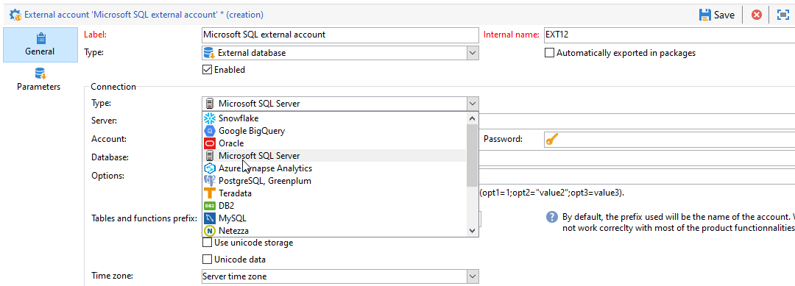

# Microsoft SQL Server へのアクセスの設定 {#configure-fda-sql}


Campaign **Federated Data Access** （FDA）オプションを使用すると、外部のMicrosoft SQL Server データベースに保存された情報を処理できます。 [!DNL Microsoft SQL Server] へのアクセスを設定するには、次の手順に従います。

1. [CentOS](#sql-centos) で [!DNL Microsoft SQL Server] を設定します。
1. [Linux](#sql-linux) で [!DNL Microsoft SQL Server] を設定します。
1. [Windows](#sql-windows) で [!DNL Microsoft SQL Server] を設定します。
1. Campaign での [!DNL Microsoft SQL Server][ 外部アカウント ](#sql-external) の設定

## CentOS のMicrosoft SQL Server {#sql-centos}

>[!NOTE]
>
> [!DNL Microsoft SQL Server] は CentOS 7 および 6 で利用できます。

CentOS で [!DNL Microsoft SQL Server] を設定するには、次の手順に従います。

1. 次のコマンドを使用して、SQL ODBC ドライバをダウンロードしてインストールします。

   ```
   sudo su
   curl https://packages.microsoft.com/config/rhel/7/prod.repo > /etc/yum.repos.d/mssql-release.repo
   exit
   sudo yum remove unixODBC-utf16 unixODBC-utf16-devel #to avoid conflicts
   sudo ACCEPT_EULA=Y yum install msodbcsql
   ```

1. Adobe Campaignで、[!DNL Microsoft SQL Server] 外部アカウントを設定できます。 外部アカウントの設定方法について詳しくは、[ この節 ](#sql-external) を参照してください。

## Microsoft SQL Server on Linux {#sql-linux}

>[!NOTE]
>
> 古いバージョンのAdobe Campaign（7.2.1 以前）を使用している場合は、`unix ODBC drivers` をインストールする必要があります。

1. [ このページ ](https://packages.microsoft.com/ubuntu/16.04/prod/pool/main/m/msodbcsql17/) から MS ODBC ドライバをダウンロードします。

1. root ユーザーとして、次のコマンドを実行します。

   ```
   # install the mssql odbc that was downloaded
   dpkg -i msodbcsql17_17.7.1.1-1_amd64.deb
   # accept the license terms
   ```

1. Adobe Campaignで、[!DNL Microsoft SQL Server] 外部アカウントを設定できます。 外部アカウントの設定方法について詳しくは、[ この節 ](#sql-external) を参照してください。

## Windows でのMicrosoft SQL Server {#sql-windows}

Windows で [!DNL Microsoft SQL Server] を設定するには：

1. Windows で、[**[!UICONTROL Campaign コントロールパネル]**&#39;>&#39; **[!UICONTROL システムとセキュリティ]**&#39;>&#39; **[!UICONTROL 管理ツール]**&#39;>&#39; **[!UICONTROL ODBC データ ソース （64 ビット）]**] をクリックします。

1. **[!UICONTROL ODBC データ・ソース（64 ビット）]** 新規ウィンドウから **[!UICONTROL 追加…]** をクリックします。

1. SQL Server Native Client v11 が [**[!UICONTROL Create New Data Source]**] ウィンドウに表示されているかどうかを確認します。

1. SQL Server Native Client が一覧にない場合は、[ このページ ](https://www.microsoft.com/en-my/download/details.aspx?id=36434) からダウンロードできます。

1. Adobe Campaignで、[!DNL Microsoft SQL Server] 外部アカウントを設定できます。 外部アカウントの設定方法について詳しくは、[ この節 ](#sql-external) を参照してください。

## Microsoft SQL Server 外部アカウント {#sql-external}

Campaign インスタンスを [!DNL Microsoft SQL Server] 外部データベースに接続するには、[!DNL Microsoft SQL Server] 外部アカウントを作成する必要があります。

1. Campaign **[!UICONTROL エクスプローラー]** で、「**[!UICONTROL 管理]** 「>」 **[!UICONTROL プラットフォーム]** 「>」 **[!UICONTROL 外部アカウント]** をクリックします。

1. 「**[!UICONTROL 新規]**」をクリックします。

1. 外部アカウント&#x200B;**[!UICONTROL タイプ]**&#x200B;として、「**[!UICONTROL 外部データベース]**」を選択します。

1. **[!UICONTROL 設定]** で、「**[!UICONTROL タイプ]**」ドロップダウンから「[!DNL Microsoft SQL Server]」を選択します。

   

1. **[!UICONTROL Microsoft SQL Server]** 外部アカウント認証を構成します。

   * **[!UICONTROL サーバー]**:[!DNL Microsoft SQL Server] サーバーの URL。

   * **[!UICONTROL アカウント]**：ユーザーの名前です。

   * **[!UICONTROL パスワード]**：ユーザーアカウントのパスワード。

   * **[!UICONTROL データベース]**：データベースの名前（オプション）。

   * **[!UICONTROL タイムゾーン]**:[!DNL Microsoft SQL Server] で設定されたタイムゾーン。 [詳細情報](https://docs.microsoft.com/en-us/sql/t-sql/functions/current-timezone-transact-sql?view=sql-server-ver15)

1. 「**[!UICONTROL パラメーター]**」タブをクリックし、「**[!UICONTROL 機能をデプロイ]**」ボタンをクリックして機能を作成します。

   >[!NOTE]
   >
   >すべての関数を使用するには、リモートデータベースにAdobe Campaign SQL 関数を作成する必要があります。 詳しくは、[このページ](../../configuration/using/adding-additional-sql-functions.md)を参照してください。

1. 設定が完了したら、「**[!UICONTROL 保存]**」をクリックします。

コネクタは、次のオプションをサポートしています。

| オプション | 説明 |
|---|---|
| 認証 | コネクターでサポートされている認証のタイプ。 現在サポートされている値：ActiveDirectoryMSI。 <br> 詳しくは、[Microsoft ドキュメント ](https://docs.microsoft.com/en-us/sql/connect/odbc/using-azure-active-directory?view=sql-server-ver15#example-connection-strings) の例 8 を参照してください。 |
| 暗号化 | 接続でネットワーク経由の TLS 暗号化を使用するかどうかを指定します。 使用可能な値は、**はい/必須（18.0 以降）**、**いいえ/オプション（18.0 以降）**、**厳密（18.0 以降）** です。 バージョン 18.0 以降ではデフォルト値は **はい** に、以前のバージョンでは **いいえ** に設定されています。 <br> 詳しくは、[Microsoft ドキュメントを参照してください ](https://docs.microsoft.com/en-us/sql/connect/odbc/dsn-connection-string-attribute?view=azure-sqldw-latest#encrypt)。 |
| TrustServerCertificate | **暗号化** と共に使用される場合に、自己署名サーバー証明書を使用した暗号化を有効にします。 <br> 使用できる値：**yes** または **no** （デフォルト値。サーバー証明書が検証されることを意味します）。 |
