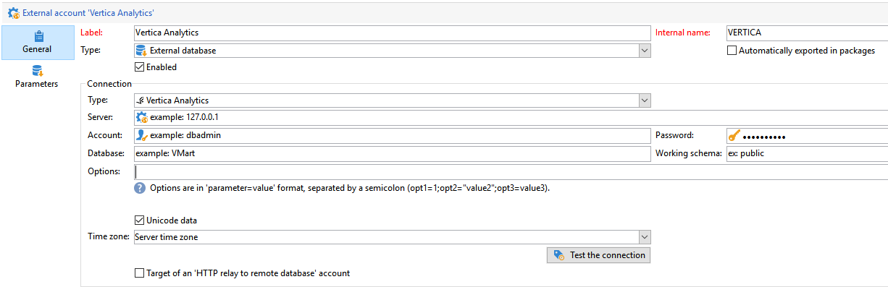

# [!DNL Vertica Analytics]へのアクセスを設定 {#configure-fda-vertica}


外部データベースに保存されている情報を処理するには、Campaign **Federated Data Access** （FDA）オプションを使用します。 [!DNL Vertica Analytics]へのアクセスを設定するには、次の手順に従います。

1. [CentOS](#vertica-centos)、[Windows](#vertica-windows)または[Debian](#vertica-debian)で[!DNL Vertica Analytics]を設定します
1. Campaignで[!DNL Vertica Analytics] [外部アカウント &#x200B;](#vertica-external)を設定します


## CentOSの[!DNL Vertica Analytics] {#vertica-centos}

CentOSで[!DNL Vertica Analytics]を設定するには、次の手順に従います。

1. [!DNL Vertica Analytics] 用の ODBC ドライバーをダウンロードします。 [ここをクリック &#x200B;](https://www.vertica.com/download/vertica/client-drivers/)して、最新のLinux RPMをダウンロードしてください。

1. 次に、次のコマンドでunixODBCをインストールする必要があります。

   ```
   yum search unixODBC
   yum install unixODBC.x86_64
   ```

1. 以前に[!DNL Vertica Analytics] サーバーをインストールしたことがある場合は、ODBC ドライバーが既にインストールされています。 この場合は、次のようにドライブを更新します。

   ```
   #Switch to root
   sudo su
   
   #Install the package (add --force to update it)
   rpm -Uvh vertica-client-x.x.x-x.x86_64.rpm [--force]
   
   #Open odbcinst.ini
   vi /etc/odbcinst.ini
   
   #Add a section for Vertica Analytics and save
   [VerVertica Analyticstica]
   Description = Vertica Analytics ODBC Driver
   Driver = /opt/vertica/lib64/libverticaodbc.so
   
   #Open odbc.ini
   vi /etc/odbc.ini
   
   #Add your DSN in ODBC Data Sources section, for example:
   [ODBC Data Sources]
   VMart = "VMart database on Vertica Analytics"
   
   #Add a DSN definition section below, for example:
   [VMart]
   Description = Vmart Database
   Driver = Vertica Analytics
   Database = VMart
   Servername = # The name of the server where Vertica Analytics is installed. Use localhost if Vertica Analytics is installed on the same machine.
   UID = dbadmin
   PWD = <password>
   Port = 5433
   
   #Cleanup
   #Remove the ODBC package
   rm vertica-client-x.x.x-x.x86_64.rpm
   ```

1. 次に、Adobe Campaignで[!DNL Vertica Analytics]外部アカウントを設定できます。 外部アカウントの設定方法について詳しくは、[この節](#vertica-external)を参照してください。

## Windows上の[!DNL Vertica Analytics] {#vertica-windows}

1. [Windows 用の ODBC ドライバー](https://www.vertica.com/download/vertica/client-drivers/)をダウンロードします。 Windows用のドライバーをインストールするには、.NET Framework 3.5を有効にする必要があります。または、インストールアシスタントが自動的に有効にしてダウンロードしようとします。

1. WindowsでODBC ドライバを設定します。 詳しくは、[このページ](https://www.vertica.com/docs/9.2.x/HTML/Content/Authoring/ConnectingToVertica/ClientODBC/SettingUpADSN.htm)を参照してください。

1. 次に、Adobe Campaignで[!DNL Vertica Analytics]外部アカウントを設定できます。 外部アカウントの設定方法について詳しくは、[この節](#vertical-external)を参照してください。

## Debian上の[!DNL Vertica Analytics] {#vertica-debian}

1. [!DNL Vertica Analytics] 用の ODBC ドライバーをダウンロードします。 [ここをクリック](https://sfc-repo.snowflakecomputing.com/odbc/linux/latest/index.html)して、ダウンロードを開始します。

1. 次に、次のコマンドでunixODBCをインストールする必要があります。

   ```
   apt-get install unixODBC
   ```

1. 以前に[!DNL Vertica Analytics] サーバーをインストールしたことがある場合は、ODBC ドライバーが既にインストールされています。 この場合は、次のようにドライブを更新します。

   ```
   #Switch to root
   sudo su
   
   #Move or copy the downloaded file and change to /root
   mv vertica_9.3..xx_odbc_x86_64_linux.tar.gz /
   cd /
   
   #Uncompress the file you downloaded
   tar vzxf vertica_9.3..xx_odbc_x86_64_linux.tar.gz
   
   #Remove the tar.gz since it is not needed anymore
   rm vertica_9.3..xx_odbc_x86_64_linux.tar.gz
   
   #Open odbcinst.ini
   vi /etc/odbcinst.ini
   
   #Add a section for Vertica Analytics and save
   [Vertica Analytics]
   Description = Vertica Analytics ODBC Driver
   Driver = /opt/vertica/lib64/libverticaodbc.so
   
   #Open odbc.ini
   vi /etc/odbc.ini
   
   #Add your DSN in ODBC Data Sources section, for example:
   [ODBC Data Sources]
   VMart = "VMart database on Vertica Analytics"
   
   #Add a DSN definition section below, for example:
   [VMart]
   Description = Vmart Database
   Driver = Vertica Analytics
   Database = VMart
   Servername = # The name of the server where Vertica Analytics is installed. Use localhost if Vertica Analytics is installed on the same machine.
   UID = dbadmin
   PWD = <password>
   Port = 5433
   ```

1. 次に、Adobe Campaignで[!DNL Vertica Analytics]外部アカウントを設定できます。 外部アカウントの設定方法について詳しくは、[この節](#vertica-external)を参照してください。

## [!DNL Vertica Analytics]外部アカウント {#vertica-external}

Campaign インスタンスを[!DNL Vertica Analytics]外部データベースに接続するには、[!DNL Vertica Analytics]外部アカウントを作成する必要があります。

1. キャンペーン **[!UICONTROL エクスプローラー]**&#x200B;から、**[!UICONTROL 管理]** &#39;>&#39; **[!UICONTROL プラットフォーム]** &#39;>&#39; **[!UICONTROL 外部アカウント]**&#x200B;をクリックします。

1. 「**[!UICONTROL 新規]**」をクリックします。

1. 外部アカウント&#x200B;**[!UICONTROL タイプ]**&#x200B;として、「**[!UICONTROL 外部データベース]**」を選択します。

1. **[!UICONTROL Vertica Analytics]**&#x200B;外部アカウントを設定します。次を指定する必要があります。

   * **[!UICONTROL タイプ]**：[!DNL Vertica Analytics]

   * **[!UICONTROL サーバー]**：[!DNL Vertica Analytics] サーバーの URL

   * **[!UICONTROL アカウント]**：ユーザーの名前

   * **[!UICONTROL パスワード]**：ユーザーアカウントのパスワード

   * **[!UICONTROL データベース]**：データベースの名前

   

コネクタは、次のオプションをサポートしています。

| オプション | 説明 |
|---|---|
| TimeZoneName | デフォルトでは空で、Campaign Classic アプリケーションサーバーのシステムのタイムゾーンが使用されます。 このオプションは、TIMEZONE セッションパラメーターを強制的に指定するために使用できます。 |

