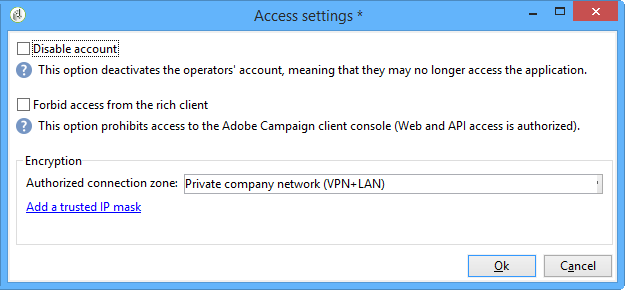

# Campaign サーバーの設定{#configuring-campaign-server}

以下の節では、お客様のニーズとお客様の環境の特定に合わせて実行できるサーバ側の設定について詳しく説明します。

>[!IMPORTANT]
>
>これらの設定は、管理者およびオンプレミスのホスティ **ングモデルの** みが実行する必要があります。
>
>ホストさ **れたデプロイメントの場合** 、サーバー側の設定はアドビのみが設定できます。 ただし、一部の設定はコントロールパネル内で設定できます（IPホワイトリストやURL権限など）。

詳しくは、次の節を参照してください。

* [コントロールパネルのドキュメント](https://docs.adobe.com/content/help/en/control-panel/using/control-panel-home.html)
* [モデルのホスト](../../installation/using/hosting-models.md)
* [Campaign Classicオンプレミスおよびホスト機能のマトリックス](https://helpx.adobe.com/campaign/kb/acc-on-prem-vs-hosted.html)
* [ハイブリッドモデルとホストモデルの設定手順](https://docs.campaign.adobe.com/doc/AC/en/INS_Hybrid_and_Hosted_models_About_hybrid_and_hosted_models.html)

Campaign Classic設定ファイルは、Adobe Campaignのインスト **ールフォルダー** confフォルダーに保存されます。 設定は2つのファイルに分散されます。

* **serverConf.xml**:すべてのインスタンスの一般設定。 このファイルは、Adobe Campaignサーバーの技術パラメーターを組み合わせたものです。これらはすべてのインスタンスで共有されます。 これらのパラメーターの一部の説明を以下に示します。 この節に示す様々なノードとパラメータ [ー](../../installation/using/the-server-configuration-file.md)。
* **config-`<instance>`.xml** ( **instanceはインスタ** ンスの名前):インスタンスの特定の設定。 サーバーを複数のインスタンス間で共有する場合は、各インスタンスに固有のパラメーターを関連ファイルに入力してください。

## セキュリティゾーンの定義 {#defining-security-zones}

### セキュリティゾーンについて {#about-security-zones}

インスタンスにログオンするには、各演算子をゾーンにリンクする必要があります。また、セキュリティゾーンで定義されたアドレスまたはアドレスセットに演算子IPを含める必要があります。 セキュリティゾーンの設定は、Adobe Campaignサーバーの設定ファイルで行われます。

演算子は、コンソール（ノード）内のプロファイルからセキュリティゾーンにリ **[!UICONTROL Administration > Access management > Operators]** ンクされます。 この節では、Campaignの演算子にゾーンをリンクする方法につ [いて説明します](#linking-a-security-zone-to-an-operator)。

### セキュリティゾーンの作成 {#creating-security-zones}

ゾーンは次の方法で定義します。

* 1つ以上のIPアドレスの範囲（IPv4およびIPv6）
* IPアドレスの各範囲にリンクされた技術的な名前

セキュリティゾーンはインターロックされています。つまり、別のゾーン内に新しいゾーンを定義すると、ログオンできるオペレータの数が減り、各オペレータに割り当てられる権限が増えます。

ゾーンは、サーバーの設定時に、 **serverConf.xmlファイルで定義する必要があります** 。 この節では、 **serverConf.xmlで使用できるすべてのパラメー** ターについて [、一覧を示](../../installation/using/the-server-configuration-file.md)します。

各ゾーンは、次のような権限を定義します。

* HTTPSではなくHTTP接続
* エラー表示（Javaエラー、JavaScript、C++など）
* レポートとWebAppのプレビュー
* ログイン/パスワードによる認証
* 非セキュア接続モード

>[!NOTE]
>
>**各演算子はゾーンにリンクする必要があります**。 演算子のIPアドレスがゾーンで定義された範囲に属する場合、演算子はインスタンスにログオンできます。\
>オペレータのIPアドレスは、複数のゾーンで定義できます。 この場合、オペレータは各ゾー **ンの** 使用可能な権限のセットを受け取る。

標準搭載の **serverConf.xmlファイルには、次の3つのゾーンが含まれています** 。パブ **リック、VPN、LAN**。

>[!NOTE]
>
>**そのまま使用できる設定は安全です**。 ただし、以前のバージョンのAdobe Campaignから移行する前に、新しいルールを移行し承認するために、セキュリティを一時的に低減する必要がある場合があります。

serverConf.xmlファイルでゾーンを定義する **方法の例** :

```
<securityZone allowDebug="false" allowHTTP="false" label="Public Network" name="public">
<subNetwork label="All addresses" mask="*" name="all"/>

<securityZone allowDebug="true" allowHTTP="false" label="Private Network (VPN)"
              name="vpn" showErrors="true">

  <securityZone allowDebug="true" allowEmptyPassword="true" allowHTTP="true"
                allowUserPassword="false" label="Private Network (LAN)" name="lan"
                sessionTokenOnly="true" showErrors="true">
    <subNetwork label="Lan 1" mask="192.168.0.0/16" name="lan1"/>
    <subNetwork label="Lan 2" mask="172.16.0.0/12" name="lan2"/>
    <subNetwork label="Lan 3" mask="10.0.0.0/8" name="lan3"/>
    <subNetwork label="Localhost" mask="127.0.0.1/16" name="locahost"/>
    <subNetwork label="Lan (IPv6)" mask="fc00::/7" name="lan6"/>
    <subNetwork label="Localhost (IPv6)" mask="::1/128" name="localhost6"/>
  </securityZone>

</securityZone>
</securityZone>
```

ゾーンを定義するすべての権限は次のとおりです。

* **allowDebug**:webAppを「デバッグ」モードで実行できるようにします。
* **allowEmptyPassword**:パスワードなしでインスタンスへの接続を許可します
* **allowHTTP**:セッションは、HTTPSプロトコルを使用せずに作成できます
* **allowUserPassword**:セッショントークンは、次の形式の「`<login>/<password>`」を持つ
* **sessionTokenOnly**:接続URLにセキュリティトークンは必要ありません
* **showErrors**:サーバー側のエラーが転送され、表示されます。

>[!IMPORTANT]
>
>ゾーン定義では、 **true値を持つ各属性は** 、セキュリティを低減します。

Message Centerを使用する場合、複数の実行インスタンスがある場合は、 **sessionTokenOnly** 属性を **** true（必要なIPアドレスのみを追加）として追加のセキュリティゾーンを作成する必要があります。 インスタンスの設定の詳細については、このドキュメントを参 [照してくださ](../../message-center/using/creating-a-shared-connection.md)い。

### セキュリティゾーンのベストプラクティス {#best-practices-for-security-zones}

LANセキュリティゾーンの定 **義では** 、技術的なアクセスを定義するIPアドレスマスクを追加できます。 この追加により、サーバーでホストされているすべてのインスタンスにアクセスできます。

```
<securityZone allowDebug="true" allowEmptyPassword="false" allowHTTP="true"
                    allowUserPassword="false" label="Private Network (LAN)" name="lan"
                    sessionTokenOnly="true" showErrors="true">
        <subNetwork label="Lan 1" mask="192.168.0.0/16" name="lan1"/>
        <subNetwork label="Lan 2" mask="172.16.0.0/12" name="lan2"/>
        <subNetwork label="Lan 3" mask="10.0.0.0/8" name="lan3"/>
        <subNetwork label="Localhost" mask="127.0.0.1/16" name="locahost"/>
        <subNetwork label="Lan (IPv6)" mask="fc00::/7" name="lan6"/>
        <subNetwork label="Localhost (IPv6)" mask="::1/128" name="localhost6"/>
  
        <!-- Customer internal IPs -->
        <subNetwork id="internalNetwork" mask="a.b.c.d/xx"/>

      </securityZone>
```

特定のインスタンスにのみアクセスする演算子の場合は、インスタンス専用の設定ファイルでIPアドレス範囲を直接定義することをお勧めします。

ファイル内 **`config-<instance>.xml`** :

```
  <securityZone name="public">
   ...
    <securityZone name="vpn">
      <subNetwork id="cus1" mask="a.b.c.d/xx"/>
```

### セキュリティゾーンのサブネットワークとプロキシ {#sub-networks-and-proxies-in-a-security-zone}

プロキ **シパラメータは** 、セキュリティゾーンでのプ **ロキシ使用を指定するためにsubNetwork** 要素で使用できます。

プロキシが参照され、接続がこのプロキシを介して（HTTP X-Forwarded-Forヘッダを介して）入る場合、検証されるゾーンはプロキシのクライアントのゾーンであり、プロキシのクライアントのゾーンではありません。

>[!IMPORTANT]
>
>プロキシが設定され、それを上書きできる場合（または存在しない場合）、テスト対象のIPアドレスは偽造できます。
>
>さらに、リレーがプロキシのように生成されるようになりました。 したがって、IPアドレス127.0.0.1を、セキュリティゾーン設定のプロキシのリストに追加できます。
>
>For example: &quot; `<subnetwork label="Lan 1" mask="192.168.0.0/16" name="lan1" proxy="127.0.0.1,10.100.2.135" />`&quot;.

次のような状況が発生します。

* サブネットワークはセキュリティゾーンで直接参照され、プロキシは設定されません。サブネットワークのユーザーは、Adobe Campaignサーバーに直接接続できます。

   

* セキュリティゾーンのサブネットワークに対してプロキシが指定されています：このサブネットワークのユーザーは、このプロキシを介してAdobe Campaignサーバーにアクセスできます。

   

* プロキシは、セキュリティゾーンのサブネットワークに含まれます。このプロキシを通じてアクセス権を持つユーザーは、元のユーザーに関係なく、Adobe Campaignサーバーにアクセスできます。

   

Adobe Campaignサーバーにアクセスする可能性の高いプロキシのIPアドレスは、該当するサブネットワークと第1レベルのサブネッ **`<subnetwork>`** トワークの両方に入力する必要がありま **`<subnetwork name="all"/>`**&#x200B;す。 例えば、IPアドレスが10.131.146.102のプロキシの場合、次のようになります。

```
<securityZone allowDebug="false" allowHTTP="false" label="Public Network" 
                      name="public">
    <subNetwork label="All addresses" mask="*" name="all"
                      proxy="10.131.146.102,127.0.0.1, ::1"/>

    <securityZone allowDebug="true" allowHTTP="false" label="Private Network (VPN)" 
                      name="vpn" showErrors="true">
        <securityZone allowDebug="true" allowEmptyPassword="false" allowHTTP="true" 
                      allowUserPassword="false" label="Private Network (LAN)" 
                      name="lan" sessionTokenOnly="true" showErrors="true">
            <subNetwork label="Lan proxy" mask="10.131.193.182" name="lan3" 
                      proxy="10.131.146.102,127.0.0.1, ::1"/>
            <subNetwork label="Lan 1" mask="192.168.0.0/16" name="lan1" 
                      proxy="127.0.0.1, ::1"/>

        </securityZone>
    </securityZone>
</securityZone>
```

### セキュリティゾーンとオペレーターとのリンク {#linking-a-security-zone-to-an-operator}

ゾーンを定義したら、各演算子をインスタンスにログオンできるように、演算子の1つにリンクする必要があります。また、演算子のIPアドレスは、ゾーン内で参照されるアドレスまたはアドレスの範囲に含まれる必要があります。

ゾーンの技術的な設定は、Campaign Serverの設定ファイルで行います。 **serverConf.xml**。

この前に、あらかじめ用意されている列挙を設定し、ラベルを **[!UICONTROL Security zone]** serverConf.xmlファイルで定義されたゾーンの内部名にリンクする必要があ **ります** 。

この設定は、キャンペーンエクスプローラーで行います。

1. ノードをクリッ **[!UICONTROL Administration > Platform > Enumerations]** クします。
1. システムの一覧 **[!UICONTROL Security zone (securityZone)]** を選択します。

   

1. サーバーの設定ファイルで定義された各セキュリティゾーンに対して、ボタンをクリック **[!UICONTROL Add]** します。
1. フィールド **[!UICONTROL Internal name]** に、 **serverConf.xmlファイルで定義されているゾーンの名前を入力します** 。 要素の **@name** 属性に対応し `<securityzone>` ます。 内部名にリンクされたラベルを「ラベル」フィールドに入 ****&#x200B;力します。

   

1. 「OK」をクリックし、変更を保存します。

ゾーンを定義し、列挙を設定し **[!UICONTROL Security zone]** たら、各演算子をセキュリティゾーンにリンクする必要があります。

1. ノードをクリッ **[!UICONTROL Administration > Access management > Operators]** クします。
1. セキュリティ・ゾーンをリンクするオペレータを選択し、タブをクリック **[!UICONTROL Edit]** します。
1. タブに移動し、 **[!UICONTROL Access rights]** リンクをクリック **[!UICONTROL Edit access parameters...]** します。

   

1. ドロップダウンリストからゾ **[!UICONTROL Authorized connection zone]** ーンを選択します。

   

1. をクリック **[!UICONTROL OK]** し、変更を保存して、これらの変更を適用します。

## Tomcatの設定 {#configuring-tomcat}

### Tomcatのデフォルトポート {#default-port-for-tomcat}

Tomcatサーバーの8080リスニングポートが、設定に必要な別のアプリケーションで既にビジー状態になっている場合は、8080ポートを空きポート（8090など）に置き換える必要があります。 変更するには、Adobe Campaignインストールフォルダーの **/tomcat-7** /confディレクトリに保存された **** server.xmlファイルを編集します。

次に、JSPリレーページのポートを変更します。 これを行うには、Adobe Campaignインスト **ールディレクトリの** /confディレクトリに保存されている **** serverConf.xmlファイルを変更します。 この節では、 **serverConf.xmlで使用できるすべてのパラメー** ターについて [、一覧を示](../../installation/using/the-server-configuration-file.md)します。

```
<serverConf>
   ...
   <web controlPort="8005" httpPort="8090"...
   <url ... targetUrl="http://localhost:8090"...
```

### Tomcatでのフォルダのマッピング {#mapping-a-folder-in-tomcat}

顧客固有の設定を定義するには、 **user_contexts.xmlファイルを** /tomcat-7/conf **(** contexts.xmlファイルも含む)フォルダに作成します **** 。

このファイルには、次の種類の情報が含まれます。

```
 <Context path='/foo' docBase='../customers/foo'   crossContext='true' debug='0' reloadable='true' trusted='false'/>
```

必要に応じて、この操作をサーバー側で再生できます。

## 配信パラメータのパーソナライズ {#personalizing-delivery-parameters}

配信パラメーターは、 **serverConf.xml設定ファイルで定義します** 。 この節では、 **serverConf.xmlで使用できるすべてのパラメー** ターについて [、一覧を示](../../installation/using/the-server-configuration-file.md)します。

一般的なサーバ設定とコマンドについては、 [Campaignサーバの設定で詳しく説明しま](../../installation/using/campaign-server-configuration.md)す。

また、ニーズや設定に応じて、次の設定を行うこともできます。

### SMTPリレー {#smtp-relay}

MTAモジュールは、SMTPブロードキャスト（ポート25）用のネイティブメール転送エージェントとして機能する。

ただし、セキュリティポリシーで必要な場合は、中継サーバーで置き換えることができます。 この場合、グローバルスループットは中継スループットになります（ただし、中継サーバーのスループットがAdobe Campaignのスループットより低い場合）。

この場合、これらのパラメーターは、セクションでSMTPサーバーを設定することで設定さ **`<relay>`** れます。 メールの転送に使用するSMTPサーバーのIPアドレス（またはホスト）と、それに関連するポート（デフォルトでは25）を指定する必要があります。

```
<relay address="192.0.0.3" port="25"/>
```

>[!IMPORTANT]
>
>この動作モードは、中継サーバ固有のパフォーマンス（待ち時間、帯域幅など）が原因でスループットが大幅に低下する可能性があるので、配信に重大な制限を与えます。 また、（SMTPトラフィックの分析によって検出される）同期配信エラーを認定する容量も制限され、中継サーバが使用できない場合は送信はできません。

### MTA子プロセス {#mta-child-processes}

サーバのCPU電力と使用可能なネットワークリソースに従ってブロードキャストのパフォーマンスを最適化するために、子プロセス（デフォルトではmaxSpareServers）の母集団を制御できます。 この設定は、個々のコンピューターのMTA **`<master>`** 設定のセクションで行います。

```
<master dataBasePoolPeriodSec="30" dataBaseRetryDelaySec="60" maxSpareServers="2" minSpareServers="0" startSpareServers="0">
```

「電子メール送信の最 [適化」も参照してくださ](../../installation/using/email-deliverability.md#email-sending-optimization)い。

### 親和性を持つ送信SMTPトラフィックの管理 {#managing-outbound-smtp-traffic-with-affinities}

>[!IMPORTANT]
>
>親和性の設定は、サーバー間で一貫性を持たせる必要があります。 MTAを実行するすべてのアプリケーションサーバーで設定の変更を複製する必要があるので、アドビに連絡して親和性の設定を依頼することをお勧めします。

IPアドレスとの親和性を通じて、送信SMTPトラフィックを改善できます。

それには、次の手順に従います。

1. serverConf.xmlファイルのセク **`<ipaffinity>`** ションに親和性 **を入力します** 。

   1つの親和性には、複数の異なる名前を付けることができます。区切るには、次を使用しま **す。** 文字を使用します。

   例：

   ```
    IPAffinity name="mid.Server;WWserver;local.Server">
             <IP address="XX.XXX.XX.XX" heloHost="myserver.us.campaign.net" publicId="123" excludeDomains="neo.*" weight="5"/
   ```

   関連するパラメーターを表示するには、 **serverConf.xmlファイルを参照します** 。

1. ドロップダウンリストで親和性の選択を有効にするには、IPAffinity列挙に親和性の名前を追加する必要があ **ります** 。

   

   >[!NOTE]
   >
   >列挙の詳細は、このドキュメ [ントで説明しま](../../platform/using/managing-enumerations.md)す。

   その後、以下に示すように、使用する親和性を選択できます。

   

   >[!NOTE]
   >
   >また、配信サーバーの設定 [も参照できます](../../installation/using/email-deliverability.md#delivery-server-configuration)。

## URL へのアクセス権限 {#url-permissions}

Campaign Classic インスタンスの JavaScript コード（ワークフローなど）で呼び出すことができる URL のデフォルトリストは、制限されています。リストに記載されている URL を使用すれば、インスタンスは正常に機能します。

デフォルトでは、インスタンスは外部の URL にアクセスできないようになっています。ただし、承認されたURLのリストに外部のURLを追加して、インスタンスがそれらのURLに接続できるようにすることが可能です。 これにより、Campaign インスタンスを SFTP サーバーや Web サイトなどの外部システムと接続して、ファイルやデータの転送が可能になります。

URL を追加すると、該当するインスタンスの設定ファイル（serverConf.xml）で参照されます。

URL権限を管理する方法は、ホスティングモデルによって異なります。

* **ハイブリッド** 、ま **たはオンプレミス**:許可するURLを **serverConf.xmlファイルに追加します**。 詳細は以下の節を参照してください。
* **ホスト**:コントロールパネルで許可するURL **を追加します**。 詳しくは、[該当するドキュメント](https://docs.adobe.com/content/help/en/control-panel/using/instances-settings/url-permissions.html)を参照してください。

ハイブ **リッド** およ **びオンプレミスのホスティングモデルを使用する場合は** 、serverConf.xml管理者ファイルで新しいurlPermission ******** を参照する必要があります。 この節では、 **serverConf.xmlで使用できるすべてのパラメー** ターについて [、一覧を示](../../installation/using/the-server-configuration-file.md)します。

3 つの接続保護モードがあります。

* **ブロック**：ホワイトリストに登録されていない URL をすべてブロックし、エラーメッセージを表示します。これは、ポストアップグレード後のデフォルトのモードです。
* **許可**：ホワイトリストに登録されていない URL をすべて許可します。
* **警告**：ホワイトリストに登録されていない URL をすべて許可しますが、警告を表示します。管理者はこの警告を収集できます。このモードでは JST-310027 警告メッセージが追加されます。

```
<urlPermission action="warn" debugTrace="true">
  <url dnsSuffix="abc.company1.com" urlRegEx=".*" />
  <url dnsSuffix="def.partnerA_company1.com" urlRegEx=".*" />
  <url dnsSuffix="xyz.partnerB_company1.com" urlRegEx=".*" />
</urlPermission>
```

>[!IMPORTANT]
>
>デフォルトでは、新規顧客のクライアントはブロックモード **を使用します**。 新しいURLを許可する必要がある場合は、管理者に問い合わせてホワイトリストに登録する必要があります。
>
>Existing customers coming from a migration can use the **warning mode** for a while. 一方、URLを認証する前に、送信トラフィックを分析する必要があります。 認証済みURLのリストを定義したら、管理者に問い合わせて、URLをホワイトリストに登録し、ブロックモードを有効にする **必要がありま**&#x200B;す。

## 動的なページセキュリティと中継 {#dynamic-page-security-and-relays}

By default, all dynamic pages are automatically related to the **local** Tomcat server of the machine whose Web module has started. この設定は、 **`<url>`** ServerConf.xmlファイルのクエリリ **レー設定のセクションに入** 力します。 この節では、 **serverConf.xmlで使用できるすべてのパラメー** ターについて [、一覧を示](../../installation/using/the-server-configuration-file.md)します。

リモートサーバ上で動的ページの実行を中継 **する** 。（Webモジュールがコンピューター上でアクティブ化されていない場合）。 これを行うには、 **localhostをJSPおよびJSSP、Webアプリケーション** 、レポートおよび文字列のリモートコンピューターの名前に置き換える必要があります。

使用可能な様々なパラメーターの詳細については、 **serverConf.xml設定ファイルを参照してください** 。

JSPページのデフォルト設定は次のとおりです。

```
<url relayHost="true" relayPath="true" targetUrl="http://localhost:8080" urlPath="*.jsp"/>
```

Adobe Campaignでは、次のJSPページを使用します。

* /nl/jsp/**soaprouter.jsp**:クライアントコンソールとWebサービス接続(SOAP API)、
* /nl/jsp/**m.jsp**:ミラーページ、
* /nl/jsp/**logon.jsp**:レポートへのWebベースのアクセスと、クライアントコンソールの導入、
* /nl/jsp/**s.jsp** :クチコミマーケティング（スポンサーおよびソーシャルネットワーク）の使用。

モバイルアプリチャネルで使用されるJSSPは次のとおりです。

* nms/mobile/1/registerIOS.jssp
* nms/mobile/1/registerAndroid.jssp

**例：**

外部からのクライアントマシン接続を防ぐことが可能です。 これを行うには、 **soaprouter.jspの実行を制限し、ミラーページ、クチコミリンク** 、Webフォーム、パブリックリソースの実行のみを許可します。

パラメータは次のとおりです。

```
<url IPMask="<IP_addresses>" deny=""     hostMask="" relayHost="true"  relayPath="true"  targetUrl="http://localhost:8080" timeout="" urlPath="*.jsp"/>
<url IPMask="<IP_addresses>" deny=""     hostMask="" relayHost="true"  relayPath="true"  targetUrl="http://localhost:8080" timeout="" urlPath="*.jssp"/> 
<url IPMask=""               deny=""     hostMask="" relayHost="true" relayPath="true" targetUrl="http://localhost:8080" timeout="" urlPath="m.jsp"/>
<url IPMask=""               deny=""     hostMask="" relayHost="true" relayPath="true" targetUrl="http://localhost:8080" timeout="" urlPath="s.jsp"/>
<url IPMask=""               deny=""     hostMask="" relayHost="true" relayPath="true" targetUrl="http://localhost:8080" timeout="" urlPath="webForm.jsp"/>
<url IPMask=""               deny=""     hostMask="" relayHost="true"  relayPath="true"  targetUrl="http://localhost:8080" timeout="" urlPath="/webApp/pub*"/>
<url IPMask=""               deny=""     hostMask="" relayHost="true"  relayPath="true"  targetUrl="http://localhost:8080" timeout="" urlPath="/jssp/pub*"/>
<url IPMask=""               deny=""     hostMask="" relayHost="true"  relayPath="true"  targetUrl="http://localhost:8080" timeout="" urlPath="/strings/pub*"/>
<url IPMask=""               deny=""     hostMask="" relayHost="true"  relayPath="true"  targetUrl="http://localhost:8080" timeout="" urlPath="/interaction/pub*"/>
<url IPMask=""               deny="true" hostMask="" relayHost="false" relayPath="false" targetUrl="http://localhost:8080" timeout="" urlPath="*.jsp"/>
<url IPMask=""               deny="true" hostMask="" relayHost="false" relayPath="false" targetUrl="http://localhost:8080" timeout="" urlPath="*.jssp"/>
```

この例では、この値は、 **`<IP_addresses>`** このマスクにリレーモジュールを使用する権限を持つIPアドレスのリスト（コンマで区切られる）と一致します。

>[!NOTE]
>
>値は、お客様の設定とネットワークの制約に従って適合されます。特に、お客様のインストール用に特定の設定が開発されている場合には、そのようになります。

## 許可された外部コマンドの制限 {#restricting-authorized-external-commands}

>[!NOTE]
>
>次の設定は、オンプレミスでのインストールにのみ必要です。

技術管理者は、ビルド8780から、Adobe Campaignで使用できる認証済みの外部コマンドのリストを制限できます。

これを行うには、次のように、使用を禁止するコマンドのリストを含むテキストファイルを作成する必要があります。

```
ln
dd
openssl
curl
wget
python
python3
perl
ruby
sh
```

>[!IMPORTANT]
>
>このリストは完全なものではありません。

サーバ **設定ファイルの** execノードで、前に作成したファイルをblacklistFile属性で参照する必要が **あります** 。

**Linuxのみ**:サーバ設定ファイルで、セキュリティ設定を強化するために、外部コマンドの実行専用のユーザを指定するように再指定します。 このユーザは、設定ファイ **ルの** execノードに設定されます。 この節では、 **serverConf.xmlで使用できるすべてのパラメー** ターについて [、一覧を示](../../installation/using/the-server-configuration-file.md)します。

>[!NOTE]
>
>ユーザーが指定されていない場合、すべてのコマンドはAdobe Campaignインスタンスのユーザーコンテキストで実行されます。 ユーザーは、Adobe Campaignを実行しているユーザーとは異なる必要があります。

例：

```
<serverConf>
 <exec user="theUnixUser" blacklistFile="/pathtothefile/blacklist"/>
</serverConf>
```

このユーザーは、「neolane」Adobe Campaignオペレーターのユーザーリストに追加する必要があります。

>[!IMPORTANT]
>
>カスタムのsudoを使用しないでください。 標準のsudoをシステムにインストールする必要があります。

## HTTPヘッダーの管理 {#managing-http-headers}

デフォルトでは、すべてのHTTPヘッダーは中継されません。 リレーから送信される返信に特定のヘッダーを追加できます。 手順は次のとおりです。

1. serverConf.xmlファ **イルに移動します** 。 この節では、 **serverConf.xmlで使用できるすべてのパラメー** ターについて [、一覧を示](../../installation/using/the-server-configuration-file.md)します。
1. ノード **`<relay>`** で、中継されるHTTPヘッダーのリストに移動します。
1. 次の属性を **`<responseheader>`** 持つ要素を追加します。

   * **name**:ヘッダー名
   * **value**:値の名前。
   例：

   ```
   <responseHeader name="Strict-Transport-Security" value="max-age=16070400; includeSubDomains"/>
   ```

## 重複した追跡 {#redundant-tracking}

リダイレクトに複数のサーバーを使用する場合、リダイレクトするURLからの情報を共有するには、SOAP呼び出しを介して相互に通信できる必要があります。 配信の開始時に、すべてのリダイレクトサーバーが使用できるとは限りません。したがって、同じレベルの情報を持っていない可能性があります。

>[!NOTE]
>
>標準またはエンタープライズアーキテクチャを使用する場合、メインのアプリケーションサーバーは、各コンピューター上で追跡情報をアップロードする権限を持っている必要があります。

冗長サーバーのURLは、リダイレクト設定で **serverConf.xmlファイルを使用して指定する必要があります** 。 この節では、 **serverConf.xmlで使用できるすべてのパラメー** ターについて [、一覧を示](../../installation/using/the-server-configuration-file.md)します。

**例：**

```
<spareserver enabledIf="$(hostname)!='front_srv1'" id="1" url="http://front_srv1:8080" />
<spareserver enabledIf="$(hostname)!='front_srv2'" id="2" url="http://front_srv2:8080" />
```

enableIfプ **ロパティはオプションで** （デフォルトでは空）、結果がtrueの場合にのみ接続を有効にできます。これにより、すべてのリダイレクトサーバーで同じ設定を取得できます。

コンピューターのホスト名を取得するには、次のコマンドを実行します。 **hostname -s**.

## パブリックリソースの管理 {#managing-public-resources}

「パブリックリソースの管理」に、パブリッ [クリソースが表示されま](../../installation/using/deploying-an-instance.md#managing-public-resources)す。

Adobe Campaignのインストールディレクトリの **/var/res/instance** ディレクトリに保存されます。

一致するURLは次のとおりです。 **http://server/res/instance** ( **instanceは** 、トラッキングインスタンスの名前)。

別のディレクトリを指定するには、 **conf-`<instance>`.xmlファイルにノードを追加し** 、サーバー上のストレージを設定します。 これは、次の行を追加することを意味します。

```
<serverconf>
  <shared>
    <dataStore hosts="media*" lang="fra">
      <virtualDir name="images" path="/var/www/images"/>
     <virtualDir name="publicFileRes" path="$(XTK_INSTALL_DIR)/var/res/$(INSTANCE_NAME)/"/>
    </dataStore>
  </shared>
</serverconf>
```

この場合、展開ウィザードのウィンドウの上部に表示されるパブリックリソースの新しいURLは、このフォルダーを指す必要があります。

## 高可用性のワークフローと親和性 {#high-availability-workflows-and-affinities}

複数のワークフローサーバー(wfserver)を設定し、2台以上のマシンに配布できます。 このタイプのアーキテクチャを選択する場合は、Adobe Campaignのアクセスに従ってロードバランサーの接続モードを設定します。

Webからのアクセスの場合は、ロードバランサー **モードを選択し** 、接続時間を制限します。

Adobe Campaignコンソールからアクセスする場合は、ハッシュ **または共** 通IP **モードを選択し** ます。 これにより、リッチクライアントとサーバー間の接続を維持し、インポートやエクスポート操作中にユーザーセッションが中断されるのを防ぐことができます。

特定のマシン上でワークフローまたはワークフローアクティビティを強制的に実行するように選択できます。 これを行うには、関連するワークフローまたはアクティビティの1つ以上の親和性を定義する必要があります。

1. フィールドに入力して、ワークフローまたはアクティビティの親和性を作成 **[!UICONTROL Affinity]** します。

   親和性名は自由に選択できます。 ただし、スペースや句読点は使用しないでください。 異なるサーバーを使用する場合は、異なる名前を指定します。

   

   

   ドロップダウンリストには、以前に使用した親和性が含まれています。 時間の経過と共に、異なる入力値を使用して完了します。

1. nl6/conf **/config-`<instance>.xml`**fileを開きます。
1. 次のように、モジュールに一致する行 **[!UICONTROL wfserver]** を変更します。

   ```
   <wfserver autoStart="true" affinity="XXX,"/>
   ```

   複数の親和性を定義する場合は、コンマで区切ってスペースを入れないでください。

   ```
   <wfserver autoStart="true" affinity="XXX,YYY,"/>
   ```

   親和性が定義されていないワークフローを実行するには、親和性の名前の後のコンマが必要です。

   親和性が定義されたワークフローのみを実行する場合は、親和性のリストの最後にコンマを追加しないでください。 例えば、次のように行を変更します。

   ```
   <wfserver autoStart="true" affinity="XXX"/>
   ```

## 自動プロセス再開 {#automatic-process-restart}

デフォルトでは、異なるAdobe Campaignプロセスは毎日午前6時（サーバー時間）に自動的に再開されます。

ただし、この設定は変更できます。

これを行うには、インスト **ールの** conf **** リポジトリにあるserverConf.xmlファイルに移動します。 この節では、 **serverConf.xmlで使用できるすべてのパラメー** ターについて [、一覧を示](../../installation/using/the-server-configuration-file.md)します。

このファイルで設定された各プロセスには、processRestartTime属性 **がありま** す。 この属性の値を変更して、各プロセスの再開時間をニーズに合わせて調整できます。

>[!IMPORTANT]
>
>この属性は削除しないでください。 すべてのプロセスは毎日再起動する必要があります。

## アップロード可能ファイルの制限 {#limiting-uploadable-files}

新しい属性 **uploadWhiteListを使用すると** 、Adobe Campaignサーバーでのアップロードに使用できるファイルタイプを制限できます。

この属性は、 **serverConf** .xmlファイルのdataStore要素 **内で使用できます** 。 この節では、 **serverConf.xmlで使用できるすべてのパラメー** ターについて [、一覧を示](../../installation/using/the-server-configuration-file.md)します。

この属性のデフォルト値はです **。+を押す** と、任意のファイルタイプをアップロードできます。

使用できる形式を制限するには、有効なJava正規表現で属性値を置き換える必要があります。 複数の値をコンマで区切って入力できます。

例：uploadWhiteList=&quot; **に置き換えます。*.png、.*.jpg」を指定すると** 、PNGおよびJPG形式をサーバーにアップロードできます。 その他の形式は使用できません。

>[!IMPORTANT]
>
>Internet Explorerでは、完全なファイルパスを正規表現で検証する必要があります。

## プロキシ接続の設定 {#proxy-connection-configuration}

（例えば、ファイル転送ワークフローアクティビティを使用して）プロキシ経由でCampaignサーバーを外部に接続する必要がある場合は、コマンドを使用して、serverConfのproxyConfigセクションを設定する必要があります。 次のプロキシ接続が可能です。HTTP、HTTPS、FTP、SFTP。 この節では、 **serverConf.xmlで使用できるすべてのパラメー** ターについて [、一覧を示](../../installation/using/the-server-configuration-file.md)します。

>[!NOTE]
>
>SOCKSプロキシはサポートされていません。

次のコマンドを使用します。

```
nlserver config -setproxy:[protocol]/[serverIP]:[port]/[login][:‘https’|'http’]
```

プロトコルのパラメータは、「http」、「https」、「ftp」のいずれかです。

HTTP/HTTPSトラフィックと同じポートにFTPを設定する場合は、次を使用できます。

```
nlserver config -setproxy:http/198.51.100.0:8080/user
```

「http」および「https」オプションは、プロトコルパラメーターが「ftp」の場合にのみ使用され、指定したポートでのトンネリングがHTTPSまたはHTTPのどちらで実行されるかを示します。

FTP/SFTPとHTTP/HTTPSのトラフィックに別のポートをプロキシサーバー経由で使用する場合は、「ftp」プロトコルパラメーターを設定する必要があります。


例：

```
nlserver config -setproxy:ftp/198.51.100.0:8080/user:’http’
```

次に、パスワードを入力します。

HTTP接続は、proxyHTTPパラメーターで定義されます。

```
<proxyConfig enabled=“1” override=“localhost*” useSingleProxy=“0”>
<proxyHTTP address=“198.51.100.0" login=“user” password=“*******” port=“8080”/>
</proxyConfig>
```

HTTPS接続は、proxyHTTPSパラメーターで定義されます。

```
<proxyConfig enabled=“1" override=“localhost*” useSingleProxy=“0">
<proxyHTTPS address=“198.51.100.0” login=“user” password=“******” port=“8080"/>
</proxyConfig>
```

FTP/FTPS接続は、proxyFTPパラメーターで次のように定義されます。

```
<proxyConfig enabled=“1" override=“localhost*” useSingleProxy=“0">
<proxyFTP address=“198.51.100.0” login=“user” password=“******” port=“5555" https=”true”/>
</proxyConfig>
```

複数の接続タイプで同じプロキシを使用する場合、useSingleProxyが「1」または「true」に設定されているproxyHTTPのみが定義されます。

内部接続がプロキシを通る必要がある場合は、overrideパラメーターに追加します。

プロキシ接続を一時的に無効にする場合は、有効なパラメータを「false」または「0」に設定します。
