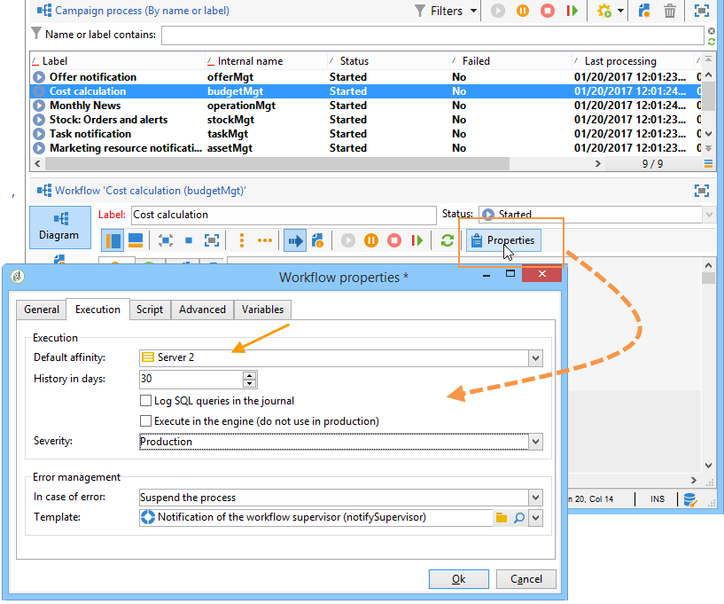
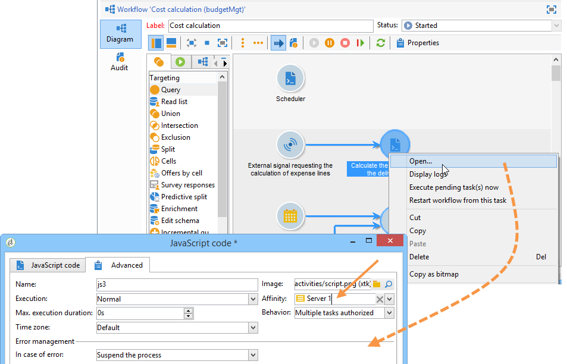

# Campaign サーバー設定の基本を学ぶ{#gs-campaign-server-config}


この章では、ニーズと環境の詳細に合わせて実行できるサーバーサイド設定について説明します。

## 制限

これらの手順は、**オンプレミス**/**ハイブリッド**&#x200B;のデプロイメントに制限されており、管理者権限が必要です。

**hosted**&#x200B;のデプロイメントの場合、サーバーサイド設定はAdobeでのみ設定できます。 ただし、IPCampaign コントロールパネル管理やURL権限など、[Campaign管理](https://experienceleague.adobe.com/docs/control-panel/using/discover-control-panel/key-features.html?lang=ja)内で設定できる設定もあります。 [詳細情報](https://experienceleague.adobe.com/docs/control-panel/using/instances-settings/ip-allow-listing-instance-access.html?lang=ja)。

詳しくは、次の節を参照してください。

* [Campaign コントロールパネルドキュメント](https://experienceleague.adobe.com/docs/control-panel/using/control-panel-home.html?lang=ja)
* [ホスティングモデル](../../installation/using/hosting-models.md)
* [Campaign Classic オンプレミスおよびホスティング機能のマトリックス](../../installation/using/capability-matrix.md)

## 設定ファイル

Campaign Classic設定ファイルは、Adobe Campaign インストールフォルダーの&#x200B;**conf** フォルダーに保存されます。 設定は、次の2つのファイルに分散されます。

* **serverConf.xml**：すべてのインスタンスの一般的な設定。 このファイルは、Adobe Campaign サーバーの技術的なパラメーターを組み合わせたものです。これらはすべて、すべてのインスタンスで共有されます。 これらのパラメータの一部の説明は以下のとおりです。 様々なノードとパラメーター。この[&#x200B; セクション &#x200B;](../../installation/using/the-server-configuration-file.md)に記載されています。
* **config-`<instance>`.xml** （**instance**&#x200B;はインスタンスの名前）: インスタンスの特定の設定。 複数のインスタンス間でサーバーを共有する場合は、各インスタンスに固有のパラメーターを関連ファイルに入力してください。

## 設定範囲

ニーズや設定に応じて、Campaign サーバーを設定または調整します。 以下を行うことができます。

* [内部識別子](#internal-identifier)を保護します
* [&#x200B; キャンペーンプロセス &#x200B;](#enabling-processes)を有効にする
* [URL権限](url-permissions.md)の設定
* [&#x200B; セキュリティゾーン &#x200B;](security-zones.md)を定義
* [Tomcat設定](configure-tomcat.md)の設定
* [配信パラメーター](configure-delivery-settings.md)のカスタマイズ
* [動的なページセキュリティとリレー](#dynamic-page-security-and-relays)を定義
* [許可されている外部コマンド &#x200B;](#restricting-authorized-external-commands)のリストを制限
* [冗長トラッキング &#x200B;](#redundant-tracking)を設定
* [高可用性とワークフローの親和性の管理](#high-availability-workflows-and-affinities)
* ファイル管理の設定 – [詳細情報](file-res-management.md)
   * アップロードファイル形式の制限
   * 公開リソースへのアクセスを有効にする
   * プロキシ接続の設定
* [自動プロセス再起動](#automatic-process-restart)


## 内部識別子 {#internal-identifier}

**internal**&#x200B;識別子は、インストール、管理、およびメンテナンスの目的で使用する技術ログインです。 このログインはインスタンスに関連付けられていません。

このログインを使用して接続されたオペレーターは、すべてのインスタンスに対するすべての権限を持ちます。 新しいインストールの場合、このログインにはパスワードは使用されません。 このパスワードを手動で定義する必要があります。

次のコマンドを使用します。

```sql
nlserver config -internalpassword
```

次の情報が表示されます。 パスワードを入力して確認します。

```sql
17:33:57 >   Application server for Adobe Campaign Classic (7.X YY.R build XXX@SHA1) of DD/MM/YYYY
Enter the current password.
Password:
Enter the new password.
Password: XXXX
Confirmation: XXXX
17:34:02 >   Password successfully changed for account 'internal' (authentication mode 'nl')
```

## プロセスを有効にする {#enabling-processes}

サーバー上のAdobe Campaign プロセスは、**config-default.xml**&#x200B;および&#x200B;**`config-<instance>.xml`** ファイルを使用して有効（および無効）になります。

これらのファイルに変更を適用するには、Adobe Campaign サービスが開始されている場合は、**nlserver config -reload** コマンドを実行する必要があります。

プロセスには、マルチインスタンスとシングルインスタンスの2種類があります。

* **マルチインスタンス**：すべてのインスタンスに対して1つの単一プロセスが開始されます。 これは、**web**、**syslogd**、**trackinglogd** プロセスの場合です。

  有効化は、**config-default.xml** ファイルから設定できます。

  クライアントコンソールにアクセスし、リダイレクト（トラッキング）を行うためのAdobe Campaign サーバーの宣言：

  ```
  vi nl6/conf/config-default.xml
  <web args="-tomcat" autoStart="true"/>  
  <!-- to start if the machine is also a redirection server -->  
  <trackinglogd autoStart="true"/>
  ```

  この例では、ファイルはLinuxで&#x200B;**vi** コマンドを使用して編集されます。 任意の&#x200B;**.txt**&#x200B;または&#x200B;**.xml** エディターを使用して編集できます。

* **mono-instance**：各インスタンスに対して1つのプロセスが開始されます（モジュール：**mta**、**wfserver**、**inMail**、**sms**&#x200B;および&#x200B;**stat**）。

  イネーブルメントは、インスタンスの設定ファイルを使用して設定できます。

  ```
  config-<instance>.xml
  ```

  配信のためのサーバーの宣言、ワークフローインスタンスの実行、バウンスメールの回復：

  ```
  <mta autoStart="true" statServerAddress="localhost"/>
  <wfserver autoStart="true"/>  
  <inMail autoStart="true"/>
  <stat autoStart="true"/>
  ```

**キャンペーンデータストレージ**

Adobe Campaign データ （ログ、ダウンロード、リダイレクトなど）のストレージ ディレクトリ （**var** ディレクトリ）を設定できます。 これを行うには、**XTK_VAR_DIR** システム変数を使用します。

* Windowsでは、**XTK_VAR_DIR** システム変数に次の値を指定します

  ```
  D:\log\AdobeCampaign
  ```

* Linuxでは、**customer.sh** ファイルに移動し、**export XTK_VAR_DIR=/app/log/AdobeCampaign**&#x200B;と示します。

  詳しくは、[&#x200B; パラメーターのパーソナライズ &#x200B;](../../installation/using/installing-packages-with-linux.md#personalizing-parameters)を参照してください。


## 動的なページセキュリティとリレー {#dynamic-page-security-and-relays}

デフォルトでは、すべての動的ページは、Web モジュールが開始されたマシンの&#x200B;**ローカル** Tomcat サーバーに自動的に関連付けられます。 この設定は、**ServerConf.xml** ファイルのクエリリレー設定の&#x200B;**`<url>`** セクションに入力されます。

Web モジュールがコンピューターでアクティブ化されていない場合は、**リモート** サーバーで動的ページの実行を中継できます。 これを行うには、**localhost**&#x200B;をJSPおよびJSSP、Web アプリケーション、レポート、および文字列のリモート コンピューターの名前に置き換える必要があります。

使用可能な様々なパラメーターについて詳しくは、**serverConf.xml**&#x200B;設定ファイルを参照してください。

JSP ページの場合、デフォルト設定は次のとおりです。

```
<url relayHost="true" relayPath="true" targetUrl="http://localhost:8080" urlPath="*.jsp"/>
```

Adobe Campaignでは、次のJSP ページを使用します。

* /nl/jsp/**soaprouter.jsp**：クライアントコンソールとWeb サービス接続（SOAP API）、
* /nl/jsp/**m.jsp**：ミラーページ、
* /nl/jsp/**logon.jsp**: レポートへのweb ベースのアクセスとクライアントコンソールのデプロイメント
* /nl/jsp/**s.jsp**：バイラルマーケティング（スポンサーおよびソーシャルネットワーク）の使用。

モバイルアプリチャネルに使用されるJSSPは次のとおりです。

* nms/mobile/1/registerIOS.jssp
* nms/mobile/1/registerAndroid.jssp

**例：**

クライアントマシンの接続を外部から防ぐことができます。 これを行うには、**soaprouter.jsp**&#x200B;の実行を制限し、ミラーページ、バイラルリンク、web フォーム、およびパブリックリソースの実行のみを許可します。

パラメーターは次のとおりです。

```
<url IPMask="<IP_addresses>" deny=""     hostMask="" relayHost="true"  relayPath="true"  targetUrl="http://localhost:8080" timeout="" urlPath="*.jsp"/>
<url IPMask="<IP_addresses>" deny=""     hostMask="" relayHost="true"  relayPath="true"  targetUrl="http://localhost:8080" timeout="" urlPath="*.jssp"/> 
<url IPMask=""               deny=""     hostMask="" relayHost="true" relayPath="true" targetUrl="http://localhost:8080" timeout="" urlPath="m.jsp"/>
<url IPMask=""               deny=""     hostMask="" relayHost="true" relayPath="true" targetUrl="http://localhost:8080" timeout="" urlPath="s.jsp"/>
<url IPMask=""               deny=""     hostMask="" relayHost="true" relayPath="true" targetUrl="http://localhost:8080" timeout="" urlPath="webForm.jsp"/>
<url IPMask=""               deny=""     hostMask="" relayHost="true"  relayPath="true"  targetUrl="http://localhost:8080" timeout="" urlPath="/webApp/pub*"/>
<url IPMask=""               deny=""     hostMask="" relayHost="true"  relayPath="true"  targetUrl="http://localhost:8080" timeout="" urlPath="/jssp/pub*"/>
<url IPMask=""               deny=""     hostMask="" relayHost="true"  relayPath="true"  targetUrl="http://localhost:8080" timeout="" urlPath="/strings/pub*"/>
<url IPMask=""               deny=""     hostMask="" relayHost="true"  relayPath="true"  targetUrl="http://localhost:8080" timeout="" urlPath="/interaction/pub*"/>
<url IPMask=""               deny="true" hostMask="" relayHost="false" relayPath="false" targetUrl="http://localhost:8080" timeout="" urlPath="*.jsp"/>
<url IPMask=""               deny="true" hostMask="" relayHost="false" relayPath="false" targetUrl="http://localhost:8080" timeout="" urlPath="*.jssp"/>
```

この例では、**`<IP_addresses>`**&#x200B;の値は、このマスクにリレーモジュールを使用することを許可されたIP アドレスのリスト（コンマで区切られた）と一致しています。

>[!NOTE]
>
>値は、お客様の設定とネットワークの制約に応じて調整する必要があります。特に、お客様のインストール用に特定の設定が開発されている場合はなおさらです。

### HTTP ヘッダーの管理 {#managing-http-headers}

デフォルトでは、すべてのHTTP ヘッダーはリレーされません。 リレーで送信される返信に特定のヘッダーを追加できます。 手順は次のとおりです。

1. **serverConf.xml** ファイルに移動します。
1. **`<relay>`** ノードで、中継されたHTTP ヘッダーのリストに移動します。
1. 次の属性を持つ&#x200B;**`<responseheader>`**&#x200B;要素を追加します。

   * **name**: ヘッダー名
   * **value**：値の名前。

   例：

   ```
   <responseHeader name="Strict-Transport-Security" value="max-age=16070400; includeSubDomains"/>
   ```

## 許可された外部コマンドの制限 {#restricting-authorized-external-commands}

ビルド 8780以降、技術管理者は、Adobe Campaignで使用できる承認済み外部コマンドのリストを制限できます。

これを行うには、使用しないコマンドのリストを含むテキストファイルを作成する必要があります。例：

```
ln
dd
openssl
curl
wget
python
python3
perl
ruby
sh
```

>[!IMPORTANT]
>
>このリストは網羅的ではありません。

サーバー設定ファイルの&#x200B;**exec** ノードで、**blacklistFile**&#x200B;属性で以前に作成したファイルを参照する必要があります。

**Linuxの場合のみ**: サーバー設定ファイルでは、セキュリティ設定を強化するために、外部コマンドの実行に専用のユーザーを指定することをお勧めします。 このユーザーは、設定ファイルの&#x200B;**exec** ノードで設定されます。 **serverConf.xml**&#x200B;で使用可能なすべてのパラメーターは、この[&#x200B; セクション &#x200B;](../../installation/using/the-server-configuration-file.md)に一覧表示されます。

>[!NOTE]
>
>ユーザーが指定されていない場合、すべてのコマンドはAdobe Campaign インスタンスのユーザーコンテキストで実行されます。 ユーザーは、Adobe Campaignを実行しているユーザーとは異なる必要があります。

例：

```
<serverConf>
 <exec user="theUnixUser" blacklistFile="/pathtothefile/blacklist"/>
</serverConf>
```

このユーザーは、「neolane」Adobe Campaign演算子のsudoer リストに追加する必要があります。

>[!IMPORTANT]
>
>カスタム SUDOを使用しないでください。 標準のsudoをシステムにインストールする必要があります。


## 冗長トラッキング {#redundant-tracking}

複数のサーバーをリダイレクトに使用する場合、リダイレクトするURLからの情報を共有するために、SOAP呼び出しを介して相互に通信できる必要があります。 配信の開始時には、すべてのリダイレクトサーバーが使用できるわけではないため、同じレベルの情報を持っていない可能性があります。

>[!NOTE]
>
>標準またはエンタープライズアーキテクチャを使用する場合は、メインアプリケーションサーバーが各コンピューターに追跡情報をアップロードすることを許可する必要があります。

冗長サーバーのURLは、**serverConf.xml** ファイルを使用して、リダイレクト設定で指定する必要があります。

**例：**

```
<spareserver enabledIf="$(hostname)!='front_srv1'" id="1" url="http://front_srv1:8080" />
<spareserver enabledIf="$(hostname)!='front_srv2'" id="2" url="http://front_srv2:8080" />
```

**enableIf** プロパティはオプション（デフォルトでは空）であり、結果がtrueの場合にのみ接続を有効にすることができます。 これにより、すべてのリダイレクトサーバーで同じ設定を取得できます。

コンピューターのホスト名を取得するには、次のコマンドを実行します：**hostname -s**。


## 可用性の高いワークフローと親和性 {#high-availability-workflows-and-affinities}

複数のワークフローサーバー（wfserver）を設定し、2台以上のマシンに配布できます。 この種類のアーキテクチャを選択した場合は、Adobe Campaign アクセスに応じてロードバランサーの接続モードを設定します。

Webからアクセスするには、**ロードバランサー** モードを選択して、接続時間を制限します。

Adobe Campaign コンソールからアクセスする場合は、**hash**&#x200B;または&#x200B;**sticky ip** モードを選択します。 これにより、リッチクライアントとサーバー間の接続を維持し、例えばインポートまたはエクスポート操作中にユーザーセッションが中断されるのを防ぐことができます。

特定のマシンに対して、ワークフローまたはワークフローアクティビティを強制的に実行するように選択できます。 これを行うには、関連するワークフローまたはアクティビティに対して1つ以上の親和性を定義する必要があります。

1. ワークフローまたはアクティビティの親和性を作成するには、**[!UICONTROL 親和性]** フィールドに入力します。

   任意のアフィニティ名を選択できますが、スペースや句読点は使用しないでください。 異なるサーバーを使用する場合は、異なる名前を指定します。

   

   

   ドロップダウンリストには、以前に使用したアフィニティが含まれます。 入力された値が異なれば、時間の経過とともに完了します。

1. **nl6/conf/config-`<instance>.xml`** ファイルを開きます。
1. **[!UICONTROL wfserver]** モジュールに一致する行を次のように変更します。

   ```
   <wfserver autoStart="true" affinity="XXX,"/>
   ```

   複数のアフィニティを定義する場合は、スペースなしでコンマで区切る必要があります。

   ```
   <wfserver autoStart="true" affinity="XXX,YYY,"/>
   ```

   アフィニティが定義されていないワークフローを実行するには、アフィニティの名前の後にコンマを付ける必要があります。

   アフィニティが定義されているワークフローのみを実行する場合は、アフィニティリストの最後にコンマを追加しないでください。 例えば、次のように行を変更します。

   ```
   <wfserver autoStart="true" affinity="XXX"/>
   ```

## 自動再起動 {#automatic-process-restart}

デフォルトでは、さまざまなAdobe Campaign プロセスが毎日6時（サーバー時間）に自動的に再起動されます。

ただし、この設定は変更できます。

これを行うには、インストールの&#x200B;**conf** リポジトリにある&#x200B;**serverConf.xml** ファイルに移動します。

このファイルで設定された各プロセスには、**processRestartTime**&#x200B;属性があります。 この属性の値を変更すると、各プロセスの再起動時間を必要に応じて調整できます。

>[!IMPORTANT]
>
>この属性は削除しないでください。 すべてのプロセスを毎日再起動する必要があります。
