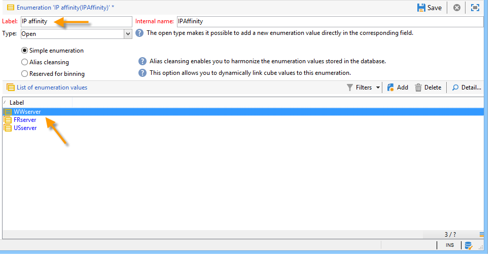

# Campaign サーバーの設定{#configuring-campaign-server}

以下の節では、お客様のニーズと環境の担当者に合わせて実行できるサーバー側の設定について詳しく説明します。

>[!IMPORTANT]
>
>これらの設定は、管理者が実行する必要があります。また、 **オンプレミス** ホスティングモデルに対してのみ実行する必要があります。
>
>**ホストされたデプロイメントの場合** 、サーバー側の設定はアドビのみが設定できます。 ただし、コントロールパネル内で設定できる設定(IP許可リストの管理やURLの権限など)もあります。

詳しくは、次の節を参照してください。

* [コントロールパネルのドキュメント](https://docs.adobe.com/content/help/ja-JP/control-panel/using/control-panel-home.html)
* [モデルのホスティング](../../installation/using/hosting-models.md)
* [Campaign Classicオンプレミスおよびホステッド機能マトリックス](https://helpx.adobe.com/jp/campaign/kb/acc-on-prem-vs-hosted.html)
* [ハイブリッドモデルとホストモデルの設定手順](https://docs.campaign.adobe.com/doc/AC/en/INS_Hybrid_and_Hosted_models_About_hybrid_and_hosted_models.html)

Campaign Classic設定ファイルは、Adobe Campaignのインストールフォルダーの **conf** フォルダーに保存されます。 設定は2つのファイルに分かれています。

* **serverConf.xml**: すべてのインスタンスの一般設定。 このファイルは、Adobe Campaignサーバーの技術的なパラメーターを組み合わせたものです。 これらはすべてのインスタンスで共有されます。 これらのパラメーターの一部については、以下で詳しく説明します。 この [節に示す様々なノードとパラメーター](../../installation/using/the-server-configuration-file.md)。
* **config-`<instance>`.xml** ( **instance** はインスタンスの名前): インスタンスの特定の設定。 サーバを複数のインスタンス間で共有する場合は、各インスタンスに固有のパラメータを関連ファイルに入力してください。

## セキュリティゾーンの定義 {#defining-security-zones}

### セキュリティゾーンについて {#about-security-zones}

各オペレーターは、インスタンスにログオンするためにゾーンにリンクされている必要があります。また、セキュリティゾーンに定義されているアドレスまたはアドレスセットに、オペレーターIPを含める必要があります。 セキュリティゾーンの設定は、Adobe Campaignサーバーの設定ファイルで行われます。

演算子は、コンソールのプロファイル( **[!UICONTROL 管理/アクセス管理/演算子]** ノード)からセキュリティゾーンにリンクされます。 この節では、ゾーンをキャンペーン演算子にリンクする方法 [について説明します](#linking-a-security-zone-to-an-operator)。

### セキュリティゾーンの作成 {#creating-security-zones}

ゾーンは次の方法で定義します。

* 1つ以上のIPアドレスの範囲（IPv4およびIPv6）
* IPアドレスの各範囲にリンクされた技術名

セキュリティゾーンは相互にロックされています。つまり、別のゾーンに新しいゾーンを定義すると、各オペレータに割り当てられる権限を増やしながら、そのゾーンにログオンできるオペレータの数が減ります。

ゾーンは、サーバーの構成時に、 **serverConf.xml** ファイルで定義する必要があります。 serverConf.xmlで使用可能なすべてのパラメ **ーターをこの** 節に示します [](../../installation/using/the-server-configuration-file.md)。

各ゾーンは、次のような権限を定義します。

* HTTPSではなくHTTP接続
* エラー表示（Javaエラー、JavaScript、C++など）
* レポートとWebAppのプレビュー
* ログイン/パスワードによる認証
* 非セキュア接続モード

>[!NOTE]
>
>**各演算子はゾーンにリンクする必要があります**。 演算子のIPアドレスがゾーンで定義された範囲に属する場合、演算子はインスタンスにログオンできます。\
>オペレータのIPアドレスは、複数のゾーンで定義できます。 この場合、オペレータは各ゾーンに対する **一連の利用可能な権限を受け取る** 。

標準搭載の **serverConf.xmlファイルには、次の3つのゾーンが含まれています** 。 **public、VPN、およびLAN**。

>[!NOTE]
>
>**そのまま使用できる設定は安全です**。 ただし、以前のバージョンのAdobe Campaignから移行する前に、新しいルールを移行して承認するために、セキュリティを一時的に低減する必要がある場合があります。

serverConf.xml **ファイルでゾーンを定義する方法の例を次に示します** 。

```
<securityZone allowDebug="false" allowHTTP="false" label="Public Network" name="public">
<subNetwork label="All addresses" mask="*" name="all"/>

<securityZone allowDebug="true" allowHTTP="false" label="Private Network (VPN)"
              name="vpn" showErrors="true">

  <securityZone allowDebug="true" allowEmptyPassword="true" allowHTTP="true"
                allowUserPassword="false" label="Private Network (LAN)" name="lan"
                sessionTokenOnly="true" showErrors="true">
    <subNetwork label="Lan 1" mask="192.168.0.0/16" name="lan1"/>
    <subNetwork label="Lan 2" mask="172.16.0.0/12" name="lan2"/>
    <subNetwork label="Lan 3" mask="10.0.0.0/8" name="lan3"/>
    <subNetwork label="Localhost" mask="127.0.0.1/16" name="locahost"/>
    <subNetwork label="Lan (IPv6)" mask="fc00::/7" name="lan6"/>
    <subNetwork label="Localhost (IPv6)" mask="::1/128" name="localhost6"/>
  </securityZone>

</securityZone>
</securityZone>
```

ゾーンを定義するすべての権限は次のとおりです。

* **allowDebug**: webAppを「debug」モードで実行できるようにします。
* **allowEmptyPassword**: パスワードを使用しないでインスタンスへの接続を許可します
* **allowHTTP**: HTTPSプロトコルを使用せずにセッションを作成できる
* **allowUserPassword**: セッショントークンは、次の形式を持つことができます。「`<login>/<password>`」
* **sessionTokenOnly**: 接続URLにセキュリティトークンは不要です
* **showErrors**: サーバー側のエラーが転送され、表示されます

>[!IMPORTANT]
>
>ゾーン定義では、 **true** 値を持つ各属性によってセキュリティが低下します。

Message Centerを使用する場合、複数の実行インスタンスが存在する場合は、 **sessionTokenOnly** 属性を **** trueに定義して追加のセキュリティゾーンを作成する必要があります。ここでは、必要なIPアドレスのみを追加します。 インスタンスの設定の詳細については、 [このドキュメントを参照してください](../../message-center/using/creating-a-shared-connection.md)。

### セキュリティゾーンのベストプラクティス {#best-practices-for-security-zones}

LAN **** セキュリティゾーンの定義では、技術アクセスを定義するIPアドレスマスクを追加できます。 この追加により、サーバーでホストされているすべてのインスタンスにアクセスできます。

```
<securityZone allowDebug="true" allowEmptyPassword="false" allowHTTP="true"
                    allowUserPassword="false" label="Private Network (LAN)" name="lan"
                    sessionTokenOnly="true" showErrors="true">
        <subNetwork label="Lan 1" mask="192.168.0.0/16" name="lan1"/>
        <subNetwork label="Lan 2" mask="172.16.0.0/12" name="lan2"/>
        <subNetwork label="Lan 3" mask="10.0.0.0/8" name="lan3"/>
        <subNetwork label="Localhost" mask="127.0.0.1/16" name="locahost"/>
        <subNetwork label="Lan (IPv6)" mask="fc00::/7" name="lan6"/>
        <subNetwork label="Localhost (IPv6)" mask="::1/128" name="localhost6"/>
  
        <!-- Customer internal IPs -->
        <subNetwork id="internalNetwork" mask="a.b.c.d/xx"/>

      </securityZone>
```

IPアドレスの範囲は、特定のインスタンスにのみアクセスする演算子のインスタンス専用の設定ファイルに直接定義することをお勧めします。

フ **`config-<instance>.xml`** ァイル内：

```
  <securityZone name="public">
   ...
    <securityZone name="vpn">
      <subNetwork id="cus1" mask="a.b.c.d/xx"/>
```

### セキュリティゾーンのサブネットワークとプロキシ {#sub-networks-and-proxies-in-a-security-zone}

この **proxy** パラメーターは、 **subNetwork** 要素で使用して、セキュリティゾーンでのプロキシの使用を指定できます。

プロキシが参照され、接続がこのプロキシ経由で入る場合（HTTP X-Forwarded-Forヘッダー経由で表示される）、有効なゾーンはプロキシのクライアントのものであり、プロキシのものではありません。

>[!IMPORTANT]
>
>プロキシが設定されていて、そのプロキシを上書きできる場合（または存在しない場合）、テスト対象のIPアドレスは改ざんできます。
>
>さらに、リレーはプロキシと同じように生成されます。 したがって、IPアドレス127.0.0.1は、セキュリティゾーン構成のプロキシのリストに追加できます。
>
>For example: &quot; `<subnetwork label="Lan 1" mask="192.168.0.0/16" name="lan1" proxy="127.0.0.1,10.100.2.135" />`&quot;.

様々なケースが発生します。

* サブネットワークはセキュリティゾーンで直接参照され、プロキシは構成されません。 サブネットワークのユーザは、Adobe Campaignサーバに直接接続できます。

   

* セキュリティゾーンのサブネットワークに対してプロキシが指定されています： このサブネットワークのユーザは、このプロキシを介してAdobe Campaignサーバにアクセスできます。

   

* プロキシは、セキュリティゾーンのサブネットワークに含まれます。 接触チャネルに関係なく、このプロキシ経由でアクセスできるユーザーは、Adobe Campaignサーバーにアクセスできます。

   

Adobe Campaignサーバーにアクセスする可能性が高いプロキシのIPアドレスは、関連するサブネットワークと第1レベルのサブネットワークの両方に入力する必要 **`<subnetwork>`** があり **`<subnetwork name="all"/>`**&#x200B;ます。 例えば、IPアドレスが10.131.146.102のプロキシの場合、次のようになります。

```
<securityZone allowDebug="false" allowHTTP="false" label="Public Network" 
                      name="public">
    <subNetwork label="All addresses" mask="*" name="all"
                      proxy="10.131.146.102,127.0.0.1, ::1"/>

    <securityZone allowDebug="true" allowHTTP="false" label="Private Network (VPN)" 
                      name="vpn" showErrors="true">
        <securityZone allowDebug="true" allowEmptyPassword="false" allowHTTP="true" 
                      allowUserPassword="false" label="Private Network (LAN)" 
                      name="lan" sessionTokenOnly="true" showErrors="true">
            <subNetwork label="Lan proxy" mask="10.131.193.182" name="lan3" 
                      proxy="10.131.146.102,127.0.0.1, ::1"/>
            <subNetwork label="Lan 1" mask="192.168.0.0/16" name="lan1" 
                      proxy="127.0.0.1, ::1"/>

        </securityZone>
    </securityZone>
</securityZone>
```

### セキュリティゾーンとオペレーターとのリンク {#linking-a-security-zone-to-an-operator}

ゾーンを定義したら、各演算子を1つのインスタンスにログオンできるように、いずれかの演算子にリンクする必要があります。また、演算子のIPアドレスを、ゾーンで参照されるアドレスまたはアドレスの範囲に含める必要があります。

ゾーンの技術的な構成は、キャンペーンサーバーの構成ファイルで行います。 **serverConf.xml**.

この操作を行う前に、標準搭載された **[!UICONTROL Security zone]** 定義済みリストを設定して、ラベルを **** serverConf.xmlファイルで定義されたゾーンの内部名にリンクするように開始する必要があります。

この設定は、キャンペーンエクスプローラーで行います。

1. **[!UICONTROL 管理/Platform/定義済みリスト]** ノードをクリックします。
1. 「 **[!UICONTROL Security zone (securityZone)]** 」システム定義済みリストを選択します。

   

1. サーバーの構成ファイルで定義されているセキュリティゾーンごとに、 **** 追加ボタンをクリックします。
1. 「 **[!UICONTROL Internal name]** 」フィールドに、 **** serverConf.xmlファイルで定義されているゾーンの名前を入力します。 これは、 **要素の@name**`<securityzone>` 属性に対応します。 内部名にリンクされたラベルを「ラベル」 ****&#x200B;フィールドに入力します。

   

1. 「OK」をクリックし、変更を保存します。

ゾーンを定義し、 **[!UICONTROL Security zone]** 定義済みリストを構成したら、各オペレータをセキュリティ・ゾーンにリンクする必要があります。

1. [ **[!UICONTROL 管理] > [アクセス管理] > [演算子]** ]ノードをクリックします。
1. セキュリティ・ゾーンをリンクするオペレータを選択し、「 **[!UICONTROL 編集]** 」タブをクリックします。
1. 「 **[!UICONTROL アクセス権]** 」タブに移動し、「アクセスパラメータを **[!UICONTROL 編集…]** 」リンクをクリックします。

   

1. 「 **[!UICONTROL Authorized connection zone]** 」ドロップダウン・リストからゾーンを選択します。

   

1. 「 **[!UICONTROL OK]** 」をクリックし、変更を保存してこれらの変更を適用します。

## Tomcatの設定 {#configuring-tomcat}

### Tomcatのデフォルトポート {#default-port-for-tomcat}

Tomcatサーバの8080リスニングポートが、設定に必要な別のアプリケーションで既にビジー状態になっている場合は、8080ポートを空きポート（8090など）に置き換える必要があります。 このファイルを変更するには、 **Adobe Campaignのインストールフォルダーの** /tomcat-7/conf **** ディレクトリに保存されているserver.xmlファイルを編集します。

次に、JSPリレーページのポートを変更します。 これを行うには、 **Adobe Campaignのインストールディレクトリの** /conf **** ディレクトリに保存されているserverConf.xmlファイルを変更します。 serverConf.xmlで使用可能なすべてのパラメ **ーターをこの** 節に示します [](../../installation/using/the-server-configuration-file.md)。

```
<serverConf>
   ...
   <web controlPort="8005" httpPort="8090"...
   <url ... targetUrl="http://localhost:8090"...
```

### Tomcatでのフォルダのマッピング {#mapping-a-folder-in-tomcat}

お客様固有の設定を定義するには、/tomcat-7/conf **コンテキストーに** user_folders.xmlファイルを作成します。このファイルには **コンテキスト.xml****** ファイルも含まれます。

このファイルには、次の種類の情報が含まれます。

```
 <Context path='/foo' docBase='../customers/foo'   crossContext='true' debug='0' reloadable='true' trusted='false'/>
```

必要に応じて、この操作をサーバー側で再生できます。

## 配信パラメーターの個人設定 {#personalizing-delivery-parameters}

配信パラメーターは、 **serverConf.xml設定ファイルで定義され** ます。 serverConf.xmlで使用可能なすべてのパラメ **ーターをこの** 節に示します [](../../installation/using/the-server-configuration-file.md)。

一般的なサーバ設定とコマンドは、 [キャンペーンサーバの設定で詳しく説明します](../../installation/using/campaign-server-configuration.md)。

必要に応じて、次の設定を行うこともできます。

### SMTPリレー {#smtp-relay}

MTAモジュールは、SMTPブロードキャスト用のネイティブメール転送エージェント（ポート25）として機能する。

ただし、セキュリティポリシーで必要な場合は、リレーサーバーで置き換えることができます。 その場合、グローバルスループットは、中継サーバのスループットがAdobe Campaignのスループットより低い場合に限り、中継サーバのスループットとなります。

この場合、これらのパラメーターは、 **`<relay>`** セクションでSMTPサーバーを設定することで設定されます。 メールの転送に使用するSMTPサーバーのIPアドレス（またはホスト）と、それに関連付けられたポート（デフォルトで25）を指定する必要があります。

```
<relay address="192.0.0.3" port="25"/>
```

>[!IMPORTANT]
>
>この動作モードは、中継サーバ固有の性能（待ち時間、帯域など）が原因でスループットが大幅に低下する可能性があるので、配信に対する重大な制限を意味します。 また、（SMTPトラフィックの分析で検出される）同期配信エラーを認定する能力も限られ、中継サーバが使用できない場合は送信はできません。

### MTA子プロセス {#mta-child-processes}

サーバのCPU電力と使用可能なネットワークリソースに応じてブロードキャストパフォーマンスを最適化するために、子プロセス（デフォルトではmaxSpareServers）の母集団を制御できます。 この設定は、個々のコンピューターのMTA設定の **`<master>`** セクションで行います。

```
<master dataBasePoolPeriodSec="30" dataBaseRetryDelaySec="60" maxSpareServers="2" minSpareServers="0" startSpareServers="0">
```

「 [電子メール送信の最適化](../../installation/using/email-deliverability.md#email-sending-optimization)」も参照してください。

### アフィニティを使用した送信SMTPトラフィックの管理 {#managing-outbound-smtp-traffic-with-affinities}

>[!IMPORTANT]
>
>アフィニティの設定は、サーバ間で一貫している必要があります。 設定の変更はMTAを実行するすべてのアフィニティサーバーに複製される必要があるので、アドビにお問い合わせの上、アプリケーション設定を行うことをお勧めします。

IPアドレスを持つアフィニティを介した送信SMTPトラフィックを改善できます。

それには、次の手順に従います。

1. serverConf.xml **`<ipaffinity>`** ファイルの **** セクションにアフィニティを入力します。

   1つのアフィニティには、複数の異なる名前を付けることができます。 これらを分けるには、次の構文を使用し **ます。** 文字。

   例：

   ```
    IPAffinity name="mid.Server;WWserver;local.Server">
             <IP address="XX.XXX.XX.XX" heloHost="myserver.us.campaign.net" publicId="123" excludeDomains="neo.*" weight="5"/
   ```

   関連するパラメーターを表示するには、 **serverConf.xml** ファイルを参照してください。

1. ドロップダウンリストでアフィニティの選択を有効にするには、IPAffinity **** 定義済みリストにアフィニティ名を追加する必要があります。

   

   >[!NOTE]
   >
   >定義済みリストの詳細は [このドキュメント](../../platform/using/managing-enumerations.md)。

   次に示すように、タイポロジに使用するアフィニティを選択できます。

   

   >[!NOTE]
   >
   >また、 [配信サーバの設定を参照することもできます](../../installation/using/email-deliverability.md#delivery-server-configuration)。

## URL へのアクセス権限 {#url-permissions}

Campaign Classic インスタンスの JavaScript コード（ワークフローなど）で呼び出すことができる URL のデフォルトリストは、制限されています。リストに記載されている URL を使用すれば、インスタンスは正常に機能します。

デフォルトでは、インスタンスは外部の URL にアクセスできないようになっています。ただし、許可されたURLのリストに外部URLを追加して、それらのURLにインスタンスを接続することは可能です。 これにより、Campaign インスタンスを SFTP サーバーや Web サイトなどの外部システムと接続して、ファイルやデータの転送が可能になります。

URL を追加すると、該当するインスタンスの設定ファイル（serverConf.xml）で参照されます。

URL権限を管理する方法は、ホスティングモデルに応じて異なります。

* **ハイブリッド** または **オンプレミス**: 許可するURLを **serverConf.xmlファイルに追加し**&#x200B;ます。 詳細は以下の節に記載されています。
* **ホスト**: コント **ロールパネルで許可するURLを追加します**。 詳しくは、[該当するドキュメント](https://docs.adobe.com/content/help/ja-JP/control-panel/using/instances-settings/url-permissions.html)を参照してください。

**ハイブリッド** および **オンプレミスのホスティングモデルを使用する場合は、管理者は、** serverConf.xml **xmlファイルで新しいurlPermission****** を参照する必要があります。 serverConf.xmlで使用可能なすべてのパラメ **ーターをこの** 節に示します [](../../installation/using/the-server-configuration-file.md)。

3 つの接続保護モードがあります。

* **ブロック**: 許可リストに属していないURLはすべてブロックされ、エラーメッセージが表示されます。 これは、ポストアップグレード後のデフォルトのモードです。
* **権限設定**: 許可リストに属していないURLはすべて許可されます。
* **警告**: 許可リストに属さないURLはすべて許可されますが、JSインタプリタは警告を出すので、管理者がそれらを収集できます。 このモードでは JST-310027 警告メッセージが追加されます。

```
<urlPermission action="warn" debugTrace="true">
  <url dnsSuffix="abc.company1.com" urlRegEx=".*" />
  <url dnsSuffix="def.partnerA_company1.com" urlRegEx=".*" />
  <url dnsSuffix="xyz.partnerB_company1.com" urlRegEx=".*" />
</urlPermission>
```

>[!IMPORTANT]
>
>デフォルトでは、新規顧客のクライアントは **ブロッキングモードを使用します**。 新しいURLを許可する必要がある場合は、管理者に問い合わせて許可リストにURLを追加する必要があります。
>
>Existing customers coming from a migration can use the **warning mode** for a while. 一方、URLを承認する前に、送信トラフィックを分析する必要があります。 認証済みURLのリストが定義されたら、管理者に連絡して、URLを許可リストに追加し、 **ブロッキングモードをアクティブにする必要があります**。

## 動的なページセキュリティと中継 {#dynamic-page-security-and-relays}

By default, all dynamic pages are automatically related to the **local** Tomcat server of the machine whose Web module has started. この設定は、ServerConf.xmlフ **`<url>`** ァイルのクエリリレー設定の **** 節に入力します。 serverConf.xmlで使用可能なすべてのパラメ **ーターをこの** 節に示します [](../../installation/using/the-server-configuration-file.md)。

動的ページの実行を **リモート** ・サーバ上で中継する。 を返します。 これを行うには、 **localhost** をJSPおよびJSSP、Web アプリケーション、レポート、文字列用のリモートコンピューターの名前に置き換える必要があります。

使用できる様々なパラメーターについて詳しくは、 **serverConf.xml設定ファイルを参照してください** 。

JSPページの場合、デフォルト設定は次のとおりです。

```
<url relayHost="true" relayPath="true" targetUrl="http://localhost:8080" urlPath="*.jsp"/>
```

Adobe Campaignでは、次のJSPページを使用します。

* /nl/jsp/**soaprouter.jsp**: クライアントコンソールとWebサービス接続(SOAP API)、
* /nl/jsp/**m.jsp**: ミラーページ、
* /nl/jsp/**logon.jsp**: レポートへのWebベースのアクセスとクライアントコンソールのデプロイメント、
* /nl/jsp/**s.jsp** : クチコミマーケティング（スポンサーおよびソーシャルネットワーク）の使用を参照してください。

Mobile Appチャネルで使用されるJSSPは次のとおりです。

* nms/mobile/1/registerIOS.jssp
* nms/mobile/1/registerAndroid.jssp

**例：**

外部からのクライアントマシン接続を防ぐことができます。 これを行うには、 **soprouter.jspの実行を制限し** 、ミラーページ、クチコミリンク、Webフォームおよびパブリックリソースの実行を許可するだけです。

パラメーターは次のとおりです。

```
<url IPMask="<IP_addresses>" deny=""     hostMask="" relayHost="true"  relayPath="true"  targetUrl="http://localhost:8080" timeout="" urlPath="*.jsp"/>
<url IPMask="<IP_addresses>" deny=""     hostMask="" relayHost="true"  relayPath="true"  targetUrl="http://localhost:8080" timeout="" urlPath="*.jssp"/> 
<url IPMask=""               deny=""     hostMask="" relayHost="true" relayPath="true" targetUrl="http://localhost:8080" timeout="" urlPath="m.jsp"/>
<url IPMask=""               deny=""     hostMask="" relayHost="true" relayPath="true" targetUrl="http://localhost:8080" timeout="" urlPath="s.jsp"/>
<url IPMask=""               deny=""     hostMask="" relayHost="true" relayPath="true" targetUrl="http://localhost:8080" timeout="" urlPath="webForm.jsp"/>
<url IPMask=""               deny=""     hostMask="" relayHost="true"  relayPath="true"  targetUrl="http://localhost:8080" timeout="" urlPath="/webApp/pub*"/>
<url IPMask=""               deny=""     hostMask="" relayHost="true"  relayPath="true"  targetUrl="http://localhost:8080" timeout="" urlPath="/jssp/pub*"/>
<url IPMask=""               deny=""     hostMask="" relayHost="true"  relayPath="true"  targetUrl="http://localhost:8080" timeout="" urlPath="/strings/pub*"/>
<url IPMask=""               deny=""     hostMask="" relayHost="true"  relayPath="true"  targetUrl="http://localhost:8080" timeout="" urlPath="/interaction/pub*"/>
<url IPMask=""               deny="true" hostMask="" relayHost="false" relayPath="false" targetUrl="http://localhost:8080" timeout="" urlPath="*.jsp"/>
<url IPMask=""               deny="true" hostMask="" relayHost="false" relayPath="false" targetUrl="http://localhost:8080" timeout="" urlPath="*.jssp"/>
```

この例では、この **`<IP_addresses>`** 値は、このマスクに中継モジュールを使用する権限を持つIPアドレス（comasで区切られた）のリストと一致します。

>[!NOTE]
>
>値は、設定とネットワークの制約に従って適合する必要があります。特に、お客様の設置に対して特定の設定が開発されている場合には、その設定が必要です。

## 許可された外部コマンドの制限 {#restricting-authorized-external-commands}

>[!NOTE]
>
>次の設定は、オンプレミスでのインストールにのみ必要です。

ビルド8780から、技術管理者は、Adobe Campaignで使用できる認証済みの外部コマンドのリストを制限できます。

そのためには、次のように、使用を禁止するコマンドのリストを含むテキストファイルを作成する必要があります。

```
ln
dd
openssl
curl
wget
python
python3
perl
ruby
sh
```

>[!IMPORTANT]
>
>このリストは完全なものではありません。

サーバ設定ファイルの **exec** ノードで、blocklistFile **** 属性で、以前に作成したファイルを参照する必要があります。

**Linuxの場合のみ**: サーバー構成ファイルで、セキュリティ構成を強化するために、外部コマンドの実行専用のユーザーを指定するように再コマンドします。 このユーザは、設定ファイルの **exec** ノードで設定されます。 serverConf.xmlで使用可能なすべてのパラメ **ーターをこの** 節に示します [](../../installation/using/the-server-configuration-file.md)。

>[!NOTE]
>
>ユーザーを指定しない場合、すべてのコマンドはAdobe Campaignインスタンスのユーザーコンテキストで実行されます。 ユーザーは、Adobe Campaignを実行しているユーザーとは異なる必要があります。

次に例を示します。

```
<serverConf>
 <exec user="theUnixUser" blocklistFile="/pathtothefile/blocklist"/>
</serverConf>
```

このユーザーは、「neolane」Adobe Campaign演算子のsudoerリストに追加する必要があります。

>[!IMPORTANT]
>
>カスタムsudoは使用しないでください。 標準のsudoをシステムにインストールする必要があります。

## HTTPヘッダーの管理 {#managing-http-headers}

デフォルトでは、すべてのHTTPヘッダーは再生されません。 リレーから送信される返信に、特定のヘッダーを追加できます。 手順は次のとおりです。

1. serverConf.xml **ファイルに移動します** 。 serverConf.xmlで使用可能なすべてのパラメ **ーターをこの** 節に示します [](../../installation/using/the-server-configuration-file.md)。
1. ノードで、中継されるHTTPヘッダーのリストに移動します。 **`<relay>`**
1. 次の追加属性を持つ **`<responseheader>`** 要素：

   * **name**: header name
   * **value**: 値の名前。

   次に例を示します。

   ```
   <responseHeader name="Strict-Transport-Security" value="max-age=16070400; includeSubDomains"/>
   ```

## 重複した追跡 {#redundant-tracking}

リダイレクトに複数のサーバーを使用する場合、リダイレクトするURLからの情報を共有するには、SOAP呼び出しを介して相互に通信できる必要があります。 配信の開始アップ時に、すべてのリダイレクトサーバーが利用できるとは限りません。 したがって、同じレベルの情報を持つことはないかもしれません。

>[!NOTE]
>
>標準アーキテクチャまたはエンタープライズアーキテクチャを使用する場合、メインアプリケーションサーバーは、各コンピューター上で追跡情報をアップロードする権限を持っている必要があります。

冗長サーバーのURLは、リダイレクト構成で、 **serverConf.xml** ファイルを介して指定する必要があります。 serverConf.xmlで使用可能なすべてのパラメ **ーターをこの** 節に示します [](../../installation/using/the-server-configuration-file.md)。

**例：**

```
<spareserver enabledIf="$(hostname)!='front_srv1'" id="1" url="http://front_srv1:8080" />
<spareserver enabledIf="$(hostname)!='front_srv2'" id="2" url="http://front_srv2:8080" />
```

enableIf **** プロパティはオプションです（デフォルトでは空）。結果がtrueの場合にのみ接続を有効にできます。 これにより、すべてのリダイレクトサーバーで同じ構成を取得できます。

コンピューターのホスト名を取得するには、次のコマンドを実行します。 **hostname -s**.

## パブリックリソースの管理 {#managing-public-resources}

パブリックリソースは、パブリックリソースの [管理に表示されます](../../installation/using/deploying-an-instance.md#managing-public-resources)。

これらは、Adobe Campaignのインストールディレクトリの **/var/res/instance** ディレクトリに保存されます。

一致するURLは次のとおりです。 **http://server/res/instance** ( **instance** は、トラッキングインスタンスの名前)

別のディレクトリを指定するには、 **conf-`<instance>`.xml** ファイルにノードを追加して、サーバー上のストレージを設定します。 これは、次の行を追加することを意味します。

```
<serverconf>
  <shared>
    <dataStore hosts="media*" lang="fra">
      <virtualDir name="images" path="/var/www/images"/>
     <virtualDir name="publicFileRes" path="$(XTK_INSTALL_DIR)/var/res/$(INSTANCE_NAME)/"/>
    </dataStore>
  </shared>
</serverconf>
```

この場合、デプロイメントウィザードのウィンドウ上部に表示されるパブリックリソースの新しいURLは、このフォルダーを指す必要があります。

## 高可用性ワークフローとアフィニティ {#high-availability-workflows-and-affinities}

複数のワークフローサーバー(wfserver)を設定し、2台以上のマシンに配布できます。 この種のアーキテクチャを選択する場合は、Adobe Campaignアクセスに応じてロードバランサーの接続モードを設定します。

Webからのアクセスの場合は、 **ロードバランサー** ・モードを選択して接続時間を制限します。

Adobe Campaignコンソールからアクセスする場合は、 **ハッシュ** (Hash **)またはスティッキーip** (Sticky)モードを選択します。 これにより、リッチクライアントとサーバー間の接続を維持し、例えばインポート操作やエクスポート操作中にユーザーセッションが中断されるのを防ぐことができます。

特定のマシン上でワークフローまたはワークフローアクティビティを強制的に実行するよう選択できます。 これを行うには、関連するワークフローまたはアクティビティに対して1つ以上のアフィニティを定義する必要があります。

1. ワークフローまたはアクティビティのアフィニティを作成するには、「 **[!UICONTROL アフィニティ]** 」フィールドにワークフローまたはワークフローを入力します。

   アフィニティ名は自由に選択できます。 ただし、スペースや句読点は使用しないでください。 別のサーバーを使用する場合は、別の名前を指定します。

   

   

   ドロップダウンリストには、以前に使用したアフィニティが含まれています。 時間の経過と共に異なる入力値で完了します。

1. nl6/conf/config- **`<instance>.xml`**ファイルを開きます。
1. 次のように、 **[!UICONTROL wfserver]** モジュールと一致する行を変更します。

   ```
   <wfserver autoStart="true" affinity="XXX,"/>
   ```

   複数のアフィニティを定義する場合は、コンマで区切ってスペースを入れないでください。

   ```
   <wfserver autoStart="true" affinity="XXX,YYY,"/>
   ```

   アフィニティが定義されていないワークフローを実行するには、アフィニティ名の後のカンマが必要です。

   アフィニティが定義されているワークフローのみを実行する場合は、アフィニティのリストの最後にカンマを追加しないでください。 例えば、次のように行を変更します。

   ```
   <wfserver autoStart="true" affinity="XXX"/>
   ```

## 自動プロセス再開 {#automatic-process-restart}

デフォルトでは、異なるAdobe Campaignプロセスは、毎日午前6時（サーバー時間）に自動的に再起動します。

ただし、この設定は変更できます。

これを行うには、インストールの **conf****** リポジトリにあるserverConf.xmlファイルに移動します。 serverConf.xmlで使用可能なすべてのパラメ **ーターをこの** 節に示します [](../../installation/using/the-server-configuration-file.md)。

このファイルに設定された各プロセスには、processRestartTime **** 属性があります。 この属性の値を変更して、各プロセスの再開時間をニーズに合わせて調整できます。

>[!IMPORTANT]
>
>この属性は削除しないでください。 すべてのプロセスは毎日再起動する必要があります。

## アップロード可能ファイルの制限 {#limiting-uploadable-files}

新しい属性 **uploadAllowList** を使用すると、Adobe Campaignサーバでアップロードできるファイルタイプを制限できます。

この属性は、 **serverConf.xml** ファイルの **dataStore** 要素内で使用できます。 serverConf.xmlで使用可能なすべてのパラメ **ーターをこの** 節に示します [](../../installation/using/the-server-configuration-file.md)。

この属性のデフォルト値はで **す。+** を押すと、任意の種類のファイルをアップロードできます。

使用可能な形式を制限するには、有効なJava正規式で属性値を置き換える必要があります。 複数の値をコンマで区切って入力できます。

次に例を示します。 **uploadAllowList=&quot;.*.png,.*.jpg** 」を指定すると、PNG形式とJPG形式をサーバーにアップロードできます。 その他の形式は使用できません。

>[!IMPORTANT]
>
>Internet Explorerでは、完全なファイルパスを正規式で検証する必要があります。

## プロキシ接続の設定 {#proxy-connection-configuration}

プロキシ経由でキャンペーンサーバーを外部に接続する必要がある場合(例えば、ファイル転送ワークフローアクティビティを使用する場合)、コマンドを使用してserverConfのproxyConfigセクションを設定する必要があります。 次のプロキシ接続が可能です。 HTTP、HTTPS、FTP、SFTP。 serverConf.xmlで使用可能なすべてのパラメ **ーターをこの** 節に示します [](../../installation/using/the-server-configuration-file.md)。

>[!NOTE]
>
>20.2以降、HTTPおよびHTTPSプロトコルのパラメーターは使用できなくなりました。 次の情報は、9032を含む以前のビルドで引き続き使用可能なパラメーターについて説明しています。
>
>SOCKSプロキシはサポートされていません。

次のコマンドを使用します。

```
nlserver config -setproxy:[protocol]/[serverIP]:[port]/[login][:‘https’|'http’]
```

プロトコルのパラメータには、「http」、「https」、「ftp」のいずれかを使用できます。

HTTP/HTTPSトラフィックと同じポートにFTPを設定する場合は、次を使用できます。

```
nlserver config -setproxy:http/198.51.100.0:8080/user
```

「http」および「https」オプションは、プロトコルパラメータが「ftp」の場合にのみ使用され、指定したポートでのトンネリングがHTTPSまたはHTTPを使用して実行されるかどうかを示します。

プロキシサーバー経由のFTP/SFTPとHTTP/HTTPSトラフィックに異なるポートを使用する場合は、「ftp」プロトコルパラメーターを設定する必要があります。


次に例を示します。

```
nlserver config -setproxy:ftp/198.51.100.0:8080/user:’http’
```

次に、パスワードを入力します。

HTTP接続は、proxyHTTPパラメーターで定義します。

```
<proxyConfig enabled=“1” override=“localhost*” useSingleProxy=“0”>
<proxyHTTP address=“198.51.100.0" login=“user” password=“*******” port=“8080”/>
</proxyConfig>
```

HTTPS接続は、proxyHTTPSパラメーターで定義されます。

```
<proxyConfig enabled=“1" override=“localhost*” useSingleProxy=“0">
<proxyHTTPS address=“198.51.100.0” login=“user” password=“******” port=“8080"/>
</proxyConfig>
```

FTP/FTPS接続は、proxyFTPパラメーターで定義されます。

```
<proxyConfig enabled=“1" override=“localhost*” useSingleProxy=“0">
<proxyFTP address=“198.51.100.0” login=“user” password=“******” port=“5555" https=”true”/>
</proxyConfig>
```

複数の接続タイプで同じプロキシを使用する場合、proxyHTTPのみがuseSingleProxyを&quot;1&quot;または&quot;true&quot;に設定して定義されます。

プロキシを経由する必要がある内部接続がある場合は、それらをoverrideパラメーターに追加します。

プロキシ接続を一時的に無効にする場合は、有効なパラメーターを「false」または「0」に設定します。
