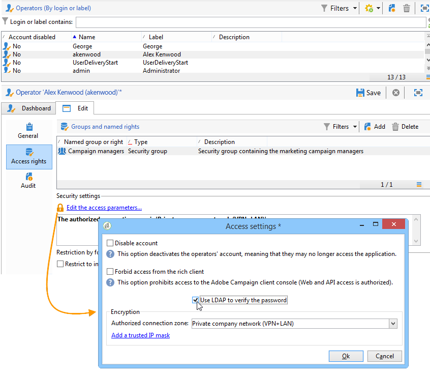

# LDAPを使用した接続{#connecting-through-ldap}

## キャンペーンとLDAPの設定 {#configuring-campaign-and-ldap}

>[!NOTE]
>
>LDAP設定は、オンプレミスまたはハイブリッドインストールでのみ可能です。

LDAP設定は、デプロイメントウィザードで実行されます。 このオ **[!UICONTROL LDAP integration]** プションは、最初の設定手順で選択する必要があります。 デプロイメントウ [ィザードを参照](../../installation/using/deploying-an-instance.md#deployment-wizard)。

このウィンドウでは、指定したLDAPディレクトリを介したAdobe CampaignユーザーのIDを設定できます。

* Specify the address of the LDAP server in the **[!UICONTROL LDAP server]** field. ポート番号を追加できます。 デフォルトでは、使用されるポートは389です。
* ドロップダウンリストで、ユーザーの認証方法を選択します。

   * Encrypted password (**md5**)

      デフォルトモード。

   * プレーンテキストパスワード+ SSL(**TLS**)

      認証手順（パスワードを含む）全体が暗号化されます。 セキュアポート636は、次のモードでは使用できません。Adobe Campaignは自動的にセキュアモードに切り替わります。

      この認証モードを使用する場合、Linuxでは、証明書はopenLDAPクライアントライブラリによって検証されます。 認証手順を暗号化するために、有効なSSL証明書を使用することをお勧めします。 それ以外の場合は、情報はプレーンテキストで表示されます。

      証明書はWindowsでも検証されます。

   * Windows NT LAN Manager (**NTLM**)

      独自のWindows認証。 はドメ **[!UICONTROL Unique identifier]** イン名にのみ使用されます。

   * DPA(分散パスワ&#x200B;**ード認証**)

      独自のWindows認証。 はド **[!UICONTROL Unique identifier]** メイン名(domain.com)にのみ使用されます。

   * プレーンテキストのパスワード

      暗号化なし（テスト段階でのみ使用）。

* ユーザー認証モードを選択します。 **[!UICONTROL Automatically compute the unique user identifier]** (手順の識別名 [の計算を参照](#distinguished-name-calculation))または **[!UICONTROL Search the unique user identifier in the directory]** (手順の識 [別子の検索を参照](#searching-for-identifiers))。

## 互換性 {#compatibility}

互換性のあるシステムは、選択した認証メカニズムによって異なります。 次に、オペレーティングシステムとLDAPサーバーの互換性マトリックスを示します。

<table> 
 <thead> 
  <tr> 
   <th> </th> 
   <th> OpenLDAP  </th> 
   <th> Active Directory  </th> 
  </tr> 
 </thead> 
 <tbody> 
  <tr> 
   <td> md5  </td> 
   <td> Windows、Linux  </td> 
   <td> Linux  </td> 
  </tr> 
  <tr> 
   <td> TLS  </td> 
   <td> Linux  </td> 
   <td> Windows、Linux  </td> 
  </tr> 
  <tr> 
   <td> NTLMおよびDPA  </td> 
   <td> </td> 
   <td> Windows  </td> 
  </tr> 
  <tr> 
   <td> plain text  </td> 
   <td> Windows、Linux  </td> 
   <td> Windows、Linux  </td> 
  </tr> 
 </tbody> 
</table>

## 識別名の計算 {#distinguished-name-calculation}

識別名(DN)識別子を計算する場合は、デプロイメントウィザードの次の手順で計算モードを設定できます。

* フィールド内のディレクトリ（識別名 — DN）内のユーザーの一意の識別子を指定し **[!UICONTROL Distinguished Name]** ます。

   **[!UICONTROL (login)]** は、Adobe Campaign演算子の識別子に置き換えられます。

   >[!CAUTION]
   >
   >この設 **[!UICONTROL dc]** 定は小文字にする必要があります。

* LDAPディレクトリ内のグ **[!UICONTROL Enable synchronization of user rights from authorizations and groups in the directory]** ループとユーザーの関連付け、およびAdobe Campaign内のグループとユーザーの関連付けを同期するには、このオプションを選択します。

   このオプションを選択すると、とが有 **[!UICONTROL Application level DN used for the search]** 効に **[!UICONTROL Password of the application login]** なります。

   この2つのフィールドに値を入力すると、Adobe Campaignは独自のログイン名とパスワードを使用してLDAPサーバーに接続します。 空の場合、Adobe Campaignは匿名でサーバーに接続します。

## 識別子の検索 {#searching-for-identifiers}

識別子を検索する場合は、デプロイメントウィザードで検索を設定できます。

* 「」フィールド **[!UICONTROL Application level DN used for the search]** に、識 **[!UICONTROL Password of the application login]** 別子の検索に使用するAdobe Campaignの識別子とパスワードを入力します。 空の場合、Adobe Campaignは匿名でサーバーに接続します。
* 検索を開始 **[!UICONTROL Base identifier]** するLDAP **[!UICONTROL Search scope]** ディレクトリのサブセットを決定するには、フィールドとフィールドを指定します。

   ドロップダウンリストで、必要なモードを選択します。

   

   1. **[!UICONTROL Recursive (default mode)]**&#x200B;を参照してください。

      LDAPディレクトリは、指定したレベルから始まり、完全に検索されます。

   1. **[!UICONTROL Limited to the base]**&#x200B;を参照してください。

      すべての属性が検索に含まれます。

   1. **[!UICONTROL Limited to the first sub-level of the base]**&#x200B;を参照してください。

      検索は、ディレクトリのすべての属性に対して実行され、属性の最初のレベルから開始されます。

* このフ **[!UICONTROL Filter]** ィールドでは、検索範囲を絞り込むための要素を指定できます。

## LDAP承認の設定 {#configuring-ldap-authorizations}

このウィンドウは、このオプションを選択すると表示さ **[!UICONTROL Enable synchronization of user rights from authorizations and groups in the directory]** れます。

ユーザーが属するグループとそれに対応する権限を見つけるには、次のように複数のパラメーターを指定する必要があります。

* 野 **[!UICONTROL Database identifier]** 原だ
* 野 **[!UICONTROL Search scope]** 原だ

   >[!NOTE]
   >
   >DNの検索を選択した場合は、前の画面でDNと検索範囲に対して選択した値を **[!UICONTROL Reuse the DN search parameters]** 引き継ぐように選択できます。

* ログ **[!UICONTROL Rights search filter]** インとユーザーの識別名に基づくフィールド、
* ユー **[!UICONTROL Attribute containing the group or authorization name]** ザーに関するフィールド、
* adobe Campaign **[!UICONTROL Association mask]** でグループ名と関連付けられた権限を抽出できるフィールド。 正規表現を使用して名前を検索できます。
* ユーザー **[!UICONTROL Enable the connection of users declared in the LDAP directory if the operator is not declared in Adobe Campaign]** に接続時のアクセス権が自動的に付与されるように選択します。

をクリック **[!UICONTROL Save]** して、インスタンスの設定を終了します。

## 演算子の管理 {#managing-operators}

設定を確認したら、LDAPディレクトリを介して管理するAdobe Campaign演算子を定義する必要があります。

LDAPディレクトリを使用して演算子を認証するには、対応するプロファイルを編集し、リンクをクリック **[!UICONTROL Edit the access parameters]** します。 次のオプションを選 **[!UICONTROL Use LDAP for authentication]** 択します。この演 **[!UICONTROL Password]** 算子のフィールドは灰色表示になっています。

## 使用例 {#use-cases}

ここでは、ニーズに基づいて最も適切な設定を達成するのに役立つ、いくつかの簡単な使用例を示します。

1. ユーザーがLDAPディレクトリに作成されたが、Adobe Campaignには作成されていない。

   ユーザーがLDAP認証を使用してプラットフォームにアクセスするようにAdobe Campaignを設定できます。 Adobe Campaignでオペレーターをオンザフライで作成できるように、LDAPディレクトリ内のIDとパスワードの組み合わせの有効性をAdobe Campaignで制御できる必要があります。 これを行うには、オプションをオンに **[!UICONTROL Enable the connection of users declared in the LDAP directory if the operator is not declared in Adobe Campaign]** します。 この場合、グループ同期も設定する必要があります。このオ **[!UICONTROL Enable synchronization of user rights from authorizations and groups in the directory]** プションを選択する必要があります。

1. ユーザーがAdobe Campaignで作成されたが、LDAPディレクトリには存在しない。

   ユーザーはAdobe Campaignにログオンできません。

1. LDAPディレクトリに、Adobe Campaignに存在しないグループがあります。

   このグループはAdobe Campaignでは作成されません。 オプションを使用してマッチアップを有効にするには、グループを作成し、グループを同期する必要があ **[!UICONTROL Enable synchronization of user rights from authorizations and groups in the directory]** ります。

1. グループはAdobe Campaignに存在し、イベント後にLDAPディレクトリがアクティブ化されます。adobe Campaignのユーザーグループは、LDAPグループのコンテンツに自動的に置き換えられません。 同様に、Adobe Campaignにグループが存在するだけの場合は、そのグループがLDAPで作成および同期されるまで、LDAPユーザーを追加できません。

   グループは、Adobe CampaignによってもLDAPによっても、その場で作成されることはありません。 Adobe CampaignとLDAPディレクトリの両方で、個別に作成する必要があります。

   LDAPディレクトリ内のグループの名前は、Adobe Campaignグループの名前と一致する必要があります。 関連付けマスクは、配置ウィザードの最後の設定段階で定義します。Adobe Campaign_(.*)など。

