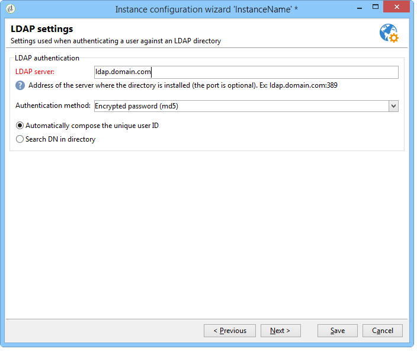
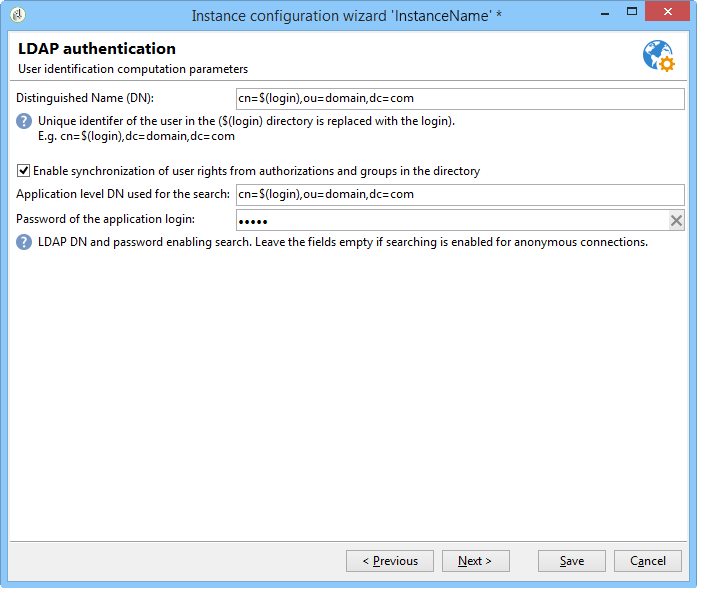
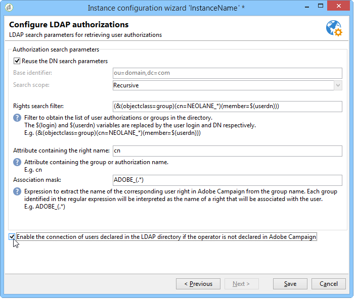
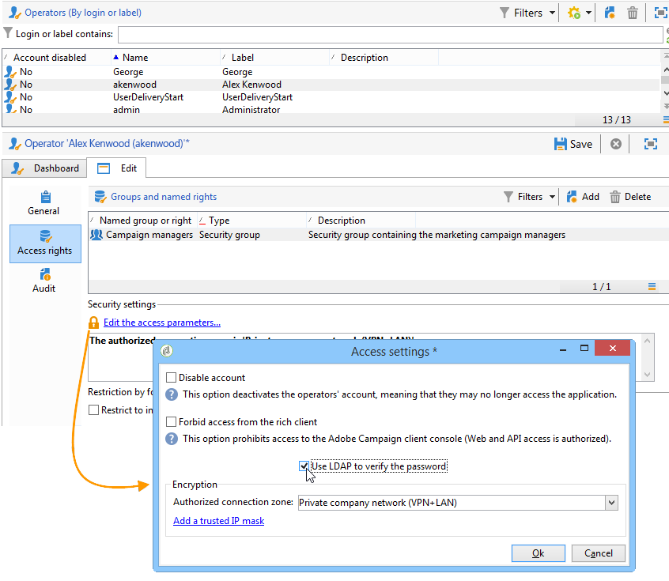

# LDAPを介した接続 {#connecting-through-ldap}

## CampaignとLDAPの設定 {#configuring-campaign-and-ldap}

>[!NOTE]
>
>* LDAP設定は、オンプレミスまたはハイブリッドインストールでのみ可能です。
>
>* システムとopenssl バージョンが[互換性マトリックス ](../../rn/using/compatibility-matrix.md)でCampaignと互換性があることを確認してください。 古いバージョンは、LDAP認証に影響を与える可能性があります。
>

LDAP設定は、デプロイメントウィザードで実行されます。 **[!UICONTROL LDAP統合]** オプションは、最初の設定手順で選択する必要があります。 [ デプロイメントウィザード ](../../installation/using/deploying-an-instance.md#deployment-assistant)を参照してください。

このウィンドウでは、指定したLDAP ディレクトリを介したAdobe Campaign ユーザーの識別を設定できます。

* **[!UICONTROL LDAP サーバー]** フィールドにLDAP サーバーのアドレスを指定します。 ポート番号を追加できます。 デフォルトでは、使用されるポートは389です。
* ドロップダウンリストで、ユーザーの認証方法を選択します。

   * 暗号化されたパスワード （**md5**） – デフォルト モード。

   * プレーンテキストのパスワード + SSL （**TLS**） – 認証手順（パスワードを含む）全体が暗号化されます。 このモードでは、セキュアポート 636を使用しないでください。Adobe Campaignは自動的にセキュアモードに切り替わります。

     この認証モードを使用する場合、Linuxでは、証明書はopenLDAP クライアントライブラリによって検証されます。 認証手順が暗号化されるように、有効なSSL証明書を使用することをお勧めします。 それ以外の場合、情報はプレーンテキストになります。

     証明書はWindowsでも検証されます。

   * Windows NT LAN Manager （**NTLM**） – 独自のWindows認証。 **[!UICONTROL 一意の識別子]**&#x200B;は、ドメイン名にのみ使用されます。

   * 分散パスワード認証（**DPA**） – 独自のWindows認証。 **[!UICONTROL 一意の識別子]**&#x200B;は、ドメイン名にのみ使用されます（domain.com）。

   * プレーンテキストのパスワード – 暗号化なし（テストフェーズでのみ使用）。

* ユーザー認証モードを選択します。**[!UICONTROL 一意のユーザーIDを自動的に計算します（[識別名の計算](#distinguished-name-calculation)を参照）。または**[!UICONTROL  ディレクトリ ]**で一意のユーザーIDを検索します（[識別子の検索](#searching-for-identifiers)を参照）。]**

## 互換性 {#compatibility}

互換性のあるシステムは、選択した認証メカニズムによって異なります。 次に、オペレーティングシステムとLDAP サーバーの互換性マトリックスを示します。

<table> 
 <thead> 
  <tr> 
   <th> </th> 
   <th> OpenLDAP  </th> 
   <th> Active Directory  </th> 
  </tr> 
 </thead> 
 <tbody> 
  <tr> 
   <td> md5  </td> 
   <td> Windows、Linux  </td> 
   <td> Linux  </td> 
  </tr> 
  <tr> 
   <td> TLS  </td> 
   <td> Linux  </td> 
   <td> Windows、Linux  </td> 
  </tr> 
  <tr> 
   <td> NTLMとDPA  </td> 
   <td> </td> 
   <td> Windows  </td> 
  </tr> 
  <tr> 
   <td> プレーンテキスト   </td> 
   <td> Windows、Linux  </td> 
   <td> Windows、Linux  </td> 
  </tr> 
 </tbody> 
</table>

## 識別名の計算 {#distinguished-name-calculation}

識別名（DN）識別子を計算する場合は、デプロイメントウィザードの次の手順で計算モードを設定できます。

* 「**[!UICONTROL 識別名]**」フィールドのディレクトリ（識別名 – DN）で、ユーザーの一意の識別子を指定します。

  **[!UICONTROL （login）]**&#x200B;は、Adobe Campaign演算子のIDに置き換えられます。

  >[!CAUTION]
  >
  >**[!UICONTROL dc]**&#x200B;設定は小文字にする必要があります。

* LDAP ディレクトリのグループとユーザーの関連付けと、Adobe Campaignのグループとユーザーの関連付けを同期するには、「**[!UICONTROL ディレクトリの認証とグループからのユーザー権限の同期を有効にする」オプションを選択します。]**

  このオプションを選択すると、アプリケーション ログイン ]**の検索]**&#x200B;および&#x200B;**[!UICONTROL パスワードに使用される**[!UICONTROL  アプリケーション レベル DNが有効になります。

  これらの2つのフィールドに入力すると、Adobe Campaignは独自のログインとパスワードを使用してLDAP サーバーに接続します。 空の場合、Adobe Campaignは匿名でサーバーに接続します。

## IDの検索 {#searching-for-identifiers}

識別子の検索を選択した場合、デプロイメントウィザードで検索を設定できます。

* アプリケーションログイン ]**フィールドの検索]**&#x200B;および&#x200B;**[!UICONTROL パスワードに使用される**[!UICONTROL  アプリケーションレベル DNで、Adobe Campaignが識別子の検索に接続する識別子とパスワードを指定します。 空の場合、Adobe Campaignは匿名でサーバーに接続します。
* 検索を開始するLDAP ディレクトリのサブセットを決定するには、**[!UICONTROL ベース ID]**&#x200B;および&#x200B;**[!UICONTROL 検索スコープ]** フィールドを指定します。

  ドロップダウンリストで必要なモードを選択します。

  

   1. **[!UICONTROL 再帰的（既定のモード）]**。

      LDAP ディレクトリは、特定のレベルから始めて、完全に検索されます。

   1. **[!UICONTROL 基本]**&#x200B;に制限されています。

      すべての属性が検索に含まれます。

   1. **[!UICONTROL ベースの最初のサブレベルに制限]**。

      検索は、ディレクトリのすべての属性に対して実行され、属性の最初のレベルから開始されます。

* **[!UICONTROL フィルター]** フィールドを使用すると、検索の範囲を絞り込む要素を指定できます。

## LDAP認証の設定 {#configuring-ldap-authorizations}

このウィンドウは、「**[!UICONTROL ディレクトリ内の権限とグループからのユーザー権限の同期を有効にする]**」オプションを選択すると表示されます。

ユーザーが属するグループまたはグループ、およびそれに対応する権限を見つけるには、いくつかのパラメーターを指定する必要があります。例：

* **[!UICONTROL データベース識別子]** フィールド，
* **[!UICONTROL 検索範囲]** フィールド，

  >[!NOTE]
  >
  >DNの検索を選択した場合は、**[!UICONTROL DN検索パラメーターを再利用]**&#x200B;して、DNと検索範囲に対して選択した値を前の画面から引き継ぐことができます。

* ログインとユーザーの識別名に基づく&#x200B;**[!UICONTROL 権限検索フィルター]** フィールド。
* ユーザーに関するグループまたは認証名&#x200B;]**フィールドを含む**[!UICONTROL &#x200B;属性。
* Adobe Campaign内のグループ名とそれに関連する権限の抽出を有効にする&#x200B;**[!UICONTROL 関連マスク]** フィールド。 正規表現を使用して、名前を検索できます。
* Adobe Campaign ]**でオペレーターが宣言されていない場合は、**[!UICONTROL  LDAP ディレクトリで宣言されたユーザーの接続を有効にして、ユーザーに接続に対するアクセス権を自動的に付与します。

「**[!UICONTROL 保存]**」をクリックして、インスタンスの設定を完了します。

## 演算子の管理 {#managing-operators}

設定を確定したら、どのAdobe Campaign演算子をLDAP ディレクトリ経由で管理するかを定義する必要があります。

LDAP ディレクトリを使用してオペレーターを認証するには、対応するプロファイルを編集し、**[!UICONTROL アクセスパラメーターの編集]** リンクをクリックします。 「**[!UICONTROL 認証にLDAPを使用]**」オプションを選択します。**[!UICONTROL パスワード]** フィールドは、このオペレーターに対してグレー表示されます。

## ユースケース {#use-cases}

このセクションでは、ニーズに基づいて最適な設定を行うための簡単なユースケースをいくつか紹介します。

1. LDAP ディレクトリにユーザーが作成されましたが、Adobe Campaignには作成されていません。

   Adobe Campaignは、ユーザーがLDAP認証を介してプラットフォームにアクセスするように設定できます。 Adobe Campaignでは、Adobe Campaignでオペレーターをオンザフライで作成できるように、LDAP ディレクトリ内のIDとパスワードの組み合わせの有効性を制御できる必要があります。 これを行うには、「**[!UICONTROL 演算子がAdobe Campaign]** オプションで宣言されていない場合は、LDAP ディレクトリで宣言されたユーザーの接続を有効にする」をオンにします。 この場合、グループの同期も設定する必要があります。「**[!UICONTROL ディレクトリ内の権限とグループからのユーザー権限の同期を有効にする]**」オプションを選択する必要があります。

1. ユーザーはAdobe Campaignで作成されましたが、LDAP ディレクトリでは作成されていません。

   Adobe Campaignにログインできなくなります。

1. LDAP ディレクトリに、Adobe Campaignに存在しないグループがあります。

   このグループはAdobe Campaignでは作成されません。 グループを作成し、グループを同期して、**[!UICONTROL ディレクトリ内の権限とグループからのユーザー権限の同期を有効にする]** オプションを使用して照合を有効にする必要があります。

1. グループはAdobe Campaignに存在し、イベントの後にLDAP ディレクトリがアクティブ化されます。Adobe Campaignのユーザーグループは、自動的にLDAP グループの内容に置き換えられません。 同様に、グループがAdobe Campaignにのみ存在する場合、グループが作成され、LDAPで同期されるまで、LDAP ユーザーはグループに追加されません。

   Adobe CampaignでもLDAPでも、グループは即座に作成されません。 Adobe CampaignとLDAP ディレクトリの両方で、個別に作成する必要があります。

   LDAP ディレクトリ内のグループの名前は、Adobe Campaign グループの名前と一致させる必要があります。 関連付けマスクは、デプロイメントウィザードの最後のコンフィギュレーションステージ（例：Adobe Campaign_（。&#42;）で定義されます。
