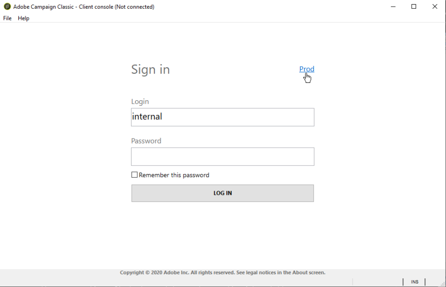

# インスタンスの作成とログオン{#creating-an-instance-and-logging-on}

新しいインスタンスとAdobe Campaignデータベースを作成するには、次のプロセスを適用します。

1. 接続を作成します。
1. ログオンして、関連するインスタンスを作成します。
1. データベースを作成し、設定します。

>[!NOTE]
>
>これらの操 **作を実行できるのは** 、内部識別子のみです。 For more on this, refer to [Internal identifier](../../installation/using/campaign-server-configuration.md#internal-identifier).

Adobe Campaignコンソールを起動すると、ログインページにアクセスします。

新しいインスタンスを作成するには、次の手順に従います。

1. 秘密鍵証明書フィールドの右上隅にあるリンクをクリックして、接続設定ウィンドウにアクセスします。 このリンクは、または既存のイ **[!UICONTROL New...]** ンスタンス名にすることができます。

   

1. をクリ **[!UICONTROL Add > Connection]** ックし、Adobe CampaignアプリケーションサーバーのラベルとURLを入力します。

   

1. URLを使用したAdobe Campaignアプリケーションサーバーへの接続を指定します。 マシンのDNS、エイリアス、またはIPアドレスを使用します。

   例えば、タイプURLを使用で [`https://<machine>.<domain>.com`](https://machine) きます。

   >[!CAUTION]
   >
   >接続URLには、次の文字のみを使用します。 `[a-z]`、 `[A-Z]`ダッシュ `[0-9]` (-)またはフルストップ

1. クリックし **[!UICONTROL Ok]** て設定を確認します。これで、インスタンス作成プロセスから開始できます。
1. ウィンドウで **[!UICONTROL Connection settings]** 、Adobe Campaignアプリケー **ション** ・サーバーに接続するための内部ログインとパスワードを入力します。 接続したら、インスタンス作成ウィザードにアクセスし、新しいインスタンスを宣言します
1. フィールド **[!UICONTROL Name]** にインスタンス名を **入力します**。 この名前は設定ファイルの生成に使用され、 **config-`<instance>`.xml** (config-.xml)はコマンドラインパラメーターでインスタンスを識別するために使用されるので、特殊文字を含まない短い名前を選択してください。 例： **eMarketing**。

   

   ドメイン名に追加するインスタンスの名前は40文字以内にする必要があります。 これにより、「Message-ID」ヘッダーのサイズを制限し、特にSpamAssicinなどのツールによって、メッセージがスパムと見なされるのを防ぐことができます。

1. フィールド **[!UICONTROL DNS masks]** に、インスタン **スをアタッチするDNS** マスクのリストを入力します。 Adobe Campaignサーバーは、HTTPリクエストに表示されるホスト名を使用して、到達するインスタンスを決定します。

   ホスト名は、文字列https:// **とサーバーアドレスの** 先頭のスラッシュ **/** との間に含まれます。

   値のリストはコンマで区切って定義できます。

   ? と*をワイルドカードとして使用し、1つまたは様々な文字（DNS、ポートなど）を置き換えることができます。 例えば、 **demo*値は「https://demo** 」で機能します。「https://demo:8080」や「https://demo2」でも機能します。

   使用する名前はDNSで定義する必要があります。 また、 **c:/windows/system32/drivers/etc/hosts****** (Windows)ファイルとLinuxの/etc/hosts(Linux)ファイル内のDNS名とIPアドレスの対応関係を通知することもできます。 したがって、選択したインスタンスに接続するには、このDNS名を使用するように接続設定を変更する必要があります。

   サーバーは、特に電子メールで画像をアップロードする場合、この名前で識別する必要があります。

   さらに、サーバーはこの名前で自身に接続でき、可能であればループバックアドレス127.0.0.1で接続できる必要があります。特に、PDF形式でのレポートの書き出しを許可する必要があります。

1. ドロップダウ **[!UICONTROL Language]** ンリストで、インスタンスの言語を **選択します**。英語（米国）、英語（英国）、フランス語または日本語。

   本節では、米国英語と英国英語の違いにつ [いて説明する](../../platform/using/adobe-campaign-workspace.md#date-and-time)。

   >[!CAUTION]
   >
   >この手順の後は、インスタンス言語を変更できません。 Adobe Campaignインスタンスが多言語ではありません。インターフェイスを言語から別の言語に切り替えることはできません。

1. クリックし **[!UICONTROL Ok]** て、インスタンスの宣言を確定します。 ログオフしてから再度ログオンし、データベースを宣言します。

   >[!NOTE]
   >
   >インスタンスは、コマンドラインから作成できます。 For more on this, refer to [Command lines](../../installation/using/command-lines.md).

