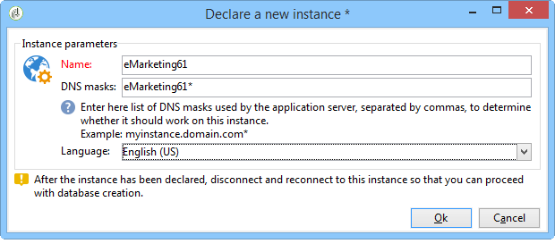

# インスタンスの作成とログオン{#creating-an-instance-and-logging-on}

新しいインスタンスとAdobe Campaign データベースを作成するには、次のプロセスを適用します。

1. 接続を作成します。
1. ログオンして、関連するインスタンスを作成します。
1. データベースを作成して設定します。

>[!NOTE]
>
>これらの操作を実行できるのは、**internal**&#x200B;識別子のみです。 詳しくは、[この節](../../installation/using/configuring-campaign-server.md#internal-identifier)を参照してください。

Adobe Campaign コンソールを起動すると、ログインページにアクセスします。

新しいインスタンスを作成するには、次の手順に従います。

1. 資格情報フィールドの右上隅にあるリンクをクリックして、接続設定ウィンドウにアクセスします。 このリンクは、**[!UICONTROL 新規…]**&#x200B;または既存のインスタンス名のいずれかです。

   

1. **[!UICONTROL 追加／接続]**&#x200B;をクリックし、Adobe Campaign アプリケーションサーバーのラベルと URL を入力します。

   

1. URL 経由で Adobe Campaign アプリケーションサーバーへの接続を指定します。 DNS、マシンのエイリアス、または IP アドレスを使用します。

   例えば、`https://<machine>.<domain>.com` タイプの URL を使用できます。

   >[!CAUTION]
   >
   >接続URLには、次の文字のみを使用します：`[a-z]`、`[A-Z]`、`[0-9]`、およびダッシュ（ – ）またはフルストップ。

1. 「**[!UICONTROL OK]**」をクリックして設定を確定します。これで、インスタンス作成プロセスを開始できます。
1. **[!UICONTROL Connection settings]** ウィンドウで、**internal** ログインとそのパスワードを入力して、Adobe Campaign アプリケーションサーバーに接続します。 接続したら、インスタンス作成アシスタントにアクセスして、新しいインスタンスを宣言します
1. **[!UICONTROL 名前]** フィールドに、**インスタンス名**&#x200B;を入力します。 この名前は、設定ファイル **config-`<instance>`.xml**&#x200B;の生成に使用され、コマンドラインパラメーターでインスタンスを識別するために使用されるので、特殊文字を含まない短い名前を必ず選択してください。 例：**eMarketing**。

   

   ドメイン名に追加するインスタンスの名前は、40文字を超えてはなりません。 これにより、「Message-ID」ヘッダーのサイズを制限し、特にSpamAssassinなどのツールによってメッセージがスパムと見なされるのを防ぐことができます。

1. 「**[!UICONTROL DNS マスク]**」フィールドに、インスタンスをアタッチするDNS マスクの&#x200B;**リスト**&#x200B;を入力します。 Adobe Campaign サーバーは、HTTP リクエストに表示されるホスト名を使用して、到達するインスタンスを決定します。

   ホスト名は、文字列&#x200B;**https://**&#x200B;とサーバーアドレスの最初のスラッシュ文字&#x200B;**/**&#x200B;の間に含まれています。

   値のリストは、コンマで区切って定義できます。

   ? および&#42;文字は、1つまたは複数の文字（DNS、ポートなど）を置き換えるワイルドカードとして使用できます。 例えば、**demo&#42;**&#x200B;の値は、「https://demo」でも「https://demo:8080」でも「https://demo2」でも機能します。

   使用する名前は、DNSで定義する必要があります。 また、Windowsの&#x200B;**c:/windows/system32/drivers/etc/hosts** ファイルおよびLinuxの&#x200B;**/etc/hosts** ファイルで、DNS名とIP アドレスの対応を通知することもできます。 したがって、選択したインスタンスに接続するために、このDNS名を使用するように接続設定を変更する必要があります。

   特にメールに画像をアップロードする場合は、サーバーをこの名前で識別する必要があります。

   さらに、サーバーはこの名前で自分自身に接続できる必要があり、可能であればループバックアドレス 127.0.0.1 – を使用して、特にレポートをPDF形式で書き出せるようにする必要があります。

1. 「**[!UICONTROL 言語]**」ドロップダウンリストで、**インスタンス言語** （英語（米国）、英語（英国）、フランス語、または日本語）を選択します。

   米国英語と英国英語の違いは、[Campaign v8 （コンソール）ドキュメント &#x200B;](https://experienceleague.adobe.com/ja/docs/campaign/campaign-v8/new/campaign-ui)に記載されています。

   >[!CAUTION]
   >
   >この手順の後でインスタンス言語を変更することはできません。 Adobe Campaign インスタンスは多言語ではありません。インターフェイスを言語から別の言語に切り替えることはできません。

1. 「**[!UICONTROL Ok]**」をクリックして、インスタンスの宣言を確認します。 ログオフして再度ログオンし、データベースを宣言します。

   >[!NOTE]
   >
   >インスタンスはコマンドラインから作成できます。 詳しくは、[&#x200B; コマンドライン &#x200B;](../../installation/using/command-lines.md)を参照してください。
