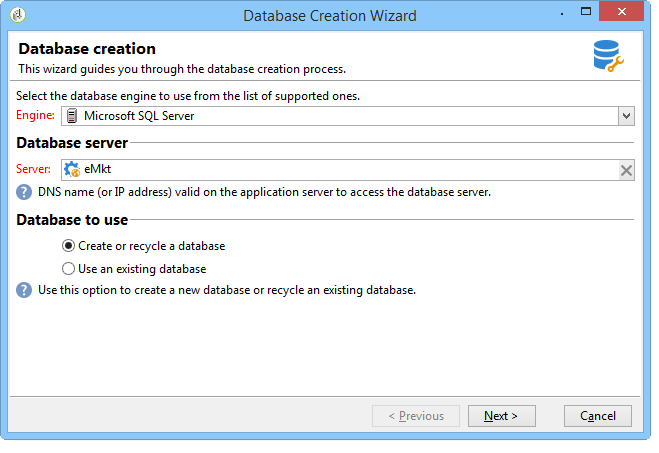
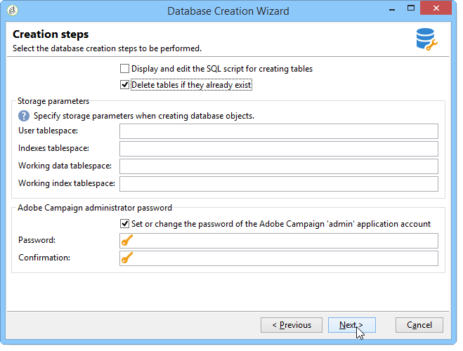

# Creating and configuring the database{#creating-and-configuring-the-database}

データベースを作成する場合、Adobe Campaignには次の2つのオプションが用意されています。

1. データベースの作成またはリサイクル：新しいデータベースを作成する場合や、既存のデータベースを再利用する場合は、このオプションを選択します。 事例1 [を参照。データベースの作成/リサイクル](#case-1--creating-recycling-a-database)。
1. 既存のデータベースの使用：空のデータベースが既に管理者によって作成されており、それを使用する場合は、このオプションを選択します。または既存のデータベースの構造を拡張する場合に使用します。 事例2 [を参照。既存のデータベースの使用](#case-2--using-an-existing-database)。

設定手順については、以下で説明します。

>[!CAUTION]
>
>データベース、ユーザー、スキーマの名前の先頭に数字を使用したり、特殊文字を含めたりすることはできません。
>
>これらの操 **作を実行できるのは** 、内部識別子のみです。 For more on this, refer to [Internal identifier](../../installation/using/campaign-server-configuration.md#internal-identifier).

##  ケース1:データベースの作成/リサイクル {#case-1--creating-recycling-a-database}

データベースの作成または既存のベースのリサイクルの手順を以下に示します。 一部の設定は、使用するデータベースエンジンに依存します。

次の手順が関係します。

* [手順1 — データベースエンジンの選択](#step-1---selecting-the-database-engine)、
* [手順2 — サーバーへの接続](#step-2---connecting-to-the-server)、
* [手順3 — データベースの接続と特性](#step-3---connection-and-characteristics-of-the-database)、
* [手順4 — インストールするパッケージ](#step-4---packages-to-install)、
* [手順5 — 作成手順](#step-5---creation-steps)、
* [手順6 — データベースの作成](#step-6---creating-the-database)。

### 手順1 — データベースエンジンの選択 {#step-1---selecting-the-database-engine}

ドロップダウンリスト内のデータベースエンジンの中から選択します。


サポートされるデータベースは、互換性マトリックスの節 [に記載されていま](https://helpx.adobe.com/campaign/kb/compatibility-matrix.html)す。

サーバーを識別し、実行する操作のタイプを選択します。 この場合は、 **[!UICONTROL Create or recycle a database]**.


選択したデータベースエンジンによって、サーバ識別情報が異なる場合があります。

* **Oracle** エンジンの場合は、アプリケーシ **ョンサーバーに対して定義された** TNS名を入力します。
* PostgreSQL **または** DB2 **** エンジンの場合は、データベースサーバーにアクセスするために、アプリケーションサーバーで定義されたDNS名（またはIPアドレス）を指定する必要があります。
* **Microsoft SQL serverエンジンの場合** 、次の項目を定義する必要があります。

   1. データベースサーバーにアクセスするためにアプリケーションサーバー上で定義されているDNS名（またはIPアドレス）。 **DNS** または **DNS\ `<instance>`**（インスタンスモード）、
   1. microsoft SQL serverへのアクセスに使用する認証方法：ま **[!UICONTROL SQL Server authentication]** た **[!UICONTROL Windows NT authentication]**&#x200B;は

      

### 手順2 — サーバーへの接続 {#step-2---connecting-to-the-server}

ウィンドウで、 **[!UICONTROL Server access]** データベース・サーバのアクセスを定義します。


これを行うには、データベースにアクセスする権限を持つ **管理システム** ・アカウントの名前とパスワードを入力します。例：

* **システム** （Oracleデータベース用）、
* **sa** for a Microsoft SQL Server database,
* **postgres** for a PostgreSQL database,
* **db2inst1** （DB2データベース用）

### 手順3 — データベースの接続と特性 {#step-3---connection-and-characteristics-of-the-database}

次の手順では、データベースにログオンするための設定を指定します。


次の設定を定義する必要があります。

* 作成するデータベースの名前を指定します。

   >[!NOTE]
   >
   >DB2データベースの場合、データベース名は8文字以下にする必要があります。

* このデータベースにリンクされているアカウントのパスワードを入力します。
* データベースがUnicodeである必要があるかどうかを示します。

   このオ **[!UICONTROL Unicode database]** プションを使用すると、言語に関係なく、すべての文字タイプをUnicodeで保存できます。

   >[!NOTE]
   >
   >Oracleデータベースでは、このオプショ **[!UICONTROL Unicode storage]** ンを使用して、 **NCLOBと** NVARCHAR **型のフィールドを使用できます** 。
   > 
   >このオプションを選択しない場合、Oracleデータベースの文字セット(charset)は、すべての言語でデータの保存を有効にする必要があります（AL32UTF8を推奨）。

* データベースのタイムゾーンを選択し、UTC（可能な場合）にするかどうかを指定します。

   詳しくは、タイムゾーンの管理を参 [照してください](../../installation/using/time-zone-management.md)。

### 手順4 — インストールするパッケージ {#step-4---packages-to-install}

インストールするパッケージを選択します。

使用許諾契約書を参照して、「インタラクション」や「ソーシャルマーケティング」など、インストールの権利があるソリューションとオプションを確認します。


### 手順5 — 作成手順 {#step-5---creation-steps}

このウ **[!UICONTROL Creation steps]** ィンドウでは、テーブルの作成に使用するSQLスクリプトを表示および編集できます。



* Oracle、Microsoft SQL serverまたはPostgreSQLデータベースの場合、管理者は、データベースオブジェクトの作成時に使用す **る記憶パラメータ** を定義することもできます。

   これらのパラメータは、正確なテーブルスペース名を受け取ります(警告：大文字と小文字を区別)。 これらは、それぞれ次のオプション **[!UICONTROL Administration > Platform > Options]** でノードに保存されます。

   * **WdbcOptions_TableSpaceUser**:スキーマに基づくユーザー・テーブル
   * **WdbcOptions_TableSpaceIndex**:スキーマに基づくユーザー・テーブルのインデックス
   * **WdbcOptions_TableSpaceWork**:スキーマのない作業テーブル
   * **WdbcOptions_TableSpaceWorkIndex**:スキーマのない作業テーブルのインデックス

* Oracleデータベースの場合、Adobe Campaignユーザーは、通常は **oinstall** グループのメンバーとしてOracleライブラリにアクセスできる必要があります。
* このオ **[!UICONTROL Set or change the administrator password]** プションを使用すると、Adobe Campaignオペレーターにリンクされているパスワードを管理者権限で入力できます。

   セキュリティを確保するために、Adobe Campaignアカウント管理者パスワードを定義することをお勧めします。

### 手順6 — データベースの作成 {#step-6---creating-the-database}

ウィザードの最後の段階では、データベースを作成できます。 Click **[!UICONTROL Start]** to confirm.


データベースが作成されたら、再接続してインスタンス設定を完了できます。

ここで、インスタンスの設定を完了するには、配置ウィザードを起動する必要があります。 デプロイメントウ [ィザードを参照](../../installation/using/deploying-an-instance.md#deployment-wizard)。

インスタンスにリンクされたデータベースの接続設定は、Adobe Campaignのインストールディレクトリ **`/conf/config-<instance>.xml`** にあるファイルに保存されます。

base61データベース上のMicrosoft SQL server設定の例で、暗号化されたパスワードを使用して「campaign」アカウントにリンクされています。

```
<dbcnx encrypted="1" login="campaign:myBase" password="myPassword" provider="DB" server="dbServer"/>
```

##  ケース2:既存のデータベースの使用 {#case-2--using-an-existing-database}

データベースとユーザーは、データベース管理者によって作成され、アクセス権が正しく設定されている必要があります。

たとえば、Oracleデータベースの場合、必要な最小限の権限は次のとおりです。接続、リソース、および無制限のテーブルスペースを許可します。

既存のデータベースを使用する場合の設定手順は次のとおりです。

* [手順1 — データベースエンジンの選択](#step-1---choosing-the-database-engine)、
* [手順2 — データベース接続の設定](#step-2---database-connection-settings)、
* [手順3 — インストールするパッケージ](#step-3---packages-to-install)、
* [手順4 — 作成手順](#step-4---creation-steps)、
* [手順5 — データベースの作成](#step-5---creating-the-database)。

### 手順1 — データベースエンジンの選択 {#step-1---choosing-the-database-engine}

ドロップダウンリストからデータベースエンジンを選択します。


サーバーを識別し、実行する操作のタイプを選択します。 この場合は、 **[!UICONTROL Use an existing database]**.


選択したデータベースエンジンによって、サーバ識別情報が異なる場合があります。

* **Oracle** エンジンの場合は、アプリケーシ **ョンサーバーに対して定義された** TNS名を入力します。
* PostgreSQL **または** DB2 **** エンジンの場合は、データベースサーバーにアクセスするために、アプリケーションサーバーで定義されたDNS名（またはIPアドレス）を指定する必要があります。
* **Microsoft SQL serverエンジンの場合** 、次の項目を定義する必要があります。

   1. データベースサーバーにアクセスするためにアプリケーションサーバー上で定義されているDNS名（またはIPアドレス）、
   1. microsoft SQL serverへのアクセスに使用するセキュリティメソッド：ま **[!UICONTROL SQL Server authentication]** た **[!UICONTROL Windows NT authentication]**&#x200B;は

      

### 手順2 — データベース接続の設定 {#step-2---database-connection-settings}

ウィンドウ **[!UICONTROL Database]** で、データベース接続設定を定義します。


次の設定を定義する必要があります。

* 使用するデータベースの名前を入力します。
* このデータベースに関連付けられているアカウントの名前とパスワードを入力します。

   >[!NOTE]
   >
   >Oracleデータベースの場合は、アカウント名を入力する必要はありません。

* データベースをUnicodeにするかどうかを指定します。

### 手順3 — インストールするパッケージ {#step-3---packages-to-install}

インストールするパッケージを選択します。

使用許諾契約書を参照して、「インタラクション」や「リード」など、インストールの権利があるソリューションとオプションを確認します。


### 手順4 — 作成手順 {#step-4---creation-steps}

このウ **[!UICONTROL Creation steps]** ィンドウでは、テーブルの作成に使用するSQLスクリプトを表示および編集できます。


* Oracle、Microsoft SQL serverまたはPostgreSQLデータベースの場合、管理者は、データベースオブジェクトの作成時に **使用する記憶域** ・パラメータを定義できます。
* Oracleデータベースの場合、Adobe Campaignユーザーは、通常は **oinstall** グループのメンバーとしてOracleライブラリにアクセスできる必要があります。
* このオ **[!UICONTROL Set or change the administrator password]** プションを使用すると、Adobe Campaignオペレーターにリンクされているパスワードを管理者権限で入力できます。

   セキュリティを確保するために、Adobe Campaignアカウント管理者パスワードを定義することをお勧めします。

### 手順5 — データベースの作成 {#step-5---creating-the-database}

ウィザードの最後の段階では、データベースを作成できます。 Click **[!UICONTROL Start]** to confirm.


データベースの作成が完了したら、再接続してインスタンス設定を完了できます。

ここで、インスタンスの設定を完了するには、配置ウィザードを起動する必要があります。 デプロイメントウ [ィザードを参照](../../installation/using/deploying-an-instance.md#deployment-wizard)。

インスタンスにリンクされたデータベースの接続設定は、Adobe Campaignのインストールディレクトリ **`/conf/config-<instance>.xml`** にあるファイルに保存されます。

base61データベース上のMicrosoft SQL server設定の例で、暗号化されたパスワードを使用して「campaign」アカウントにリンクされています。

```
<dbcnx encrypted="1" login="campaign:myBase" password="myPassword" provider="DB" server="dbServer"/>
```

