# データベースの作成と設定{#creating-and-configuring-the-database}

データベースを作成する場合、Adobe Campaignには次の2つの異なるオプションがあります。

1. データベースの作成またはリサイクル：新しいデータベースを作成するか、既存のデータベースを再利用する場合は、このオプションを選択します。 [ ケース 1: データベースの作成/リサイクル ](#case-1--creating-recycling-a-database)を参照してください。
1. 既存のデータベースを使用する：空のデータベースが管理者によって既に作成されていて、それを使用する場合、または既存のデータベースの構造を拡張する場合は、このオプションを選択します。 [ ケース 2：既存のデータベースの使用](#case-2--using-an-existing-database)を参照してください。

設定手順について詳しくは後ほど説明します。

>[!CAUTION]
>
>データベース、ユーザー、スキーマの名前は、数字で始めたり、特殊文字を含めたりしてはなりません。
>
>これらの操作を実行できるのは、**internal**&#x200B;識別子のみです。 詳しくは、[この節](../../installation/using/configuring-campaign-server.md#internal-identifier)を参照してください。

## ケース 1：データベースの作成/リサイクル {#case-1--creating-recycling-a-database}

データベースの作成または既存のベースのリサイクルの手順を以下に示します。 一部の設定は、使用するデータベースエンジンによって異なります。

次の手順を実行します。

* [手順1 - データベースエンジンの選択](#step-1---selecting-the-database-engine),
* [手順2 - サーバーへの接続](#step-2---connecting-to-the-server),
* [手順3 - データベースの接続と特性](#step-3---connection-and-characteristics-of-the-database),
* [手順4 - インストールするパッケージ ](#step-4---packages-to-install),
* [手順5 – 作成手順](#step-5---creation-steps),
* [手順6 - データベースの作成](#step-6---creating-the-database)。

### 手順1 - データベースエンジンの選択 {#step-1---selecting-the-database-engine}

ドロップダウンリストからデータベースエンジンを選択します。

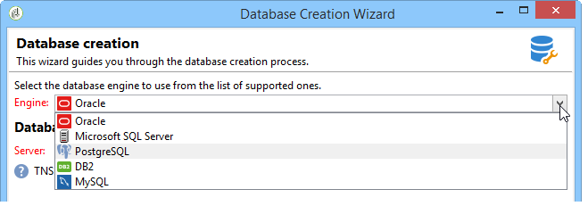

サポートされているデータベースは、キャンペーン [互換性マトリックス ](../../rn/using/compatibility-matrix.md)に一覧表示されます。

サーバーを特定し、実行する操作の種類を選択します。 この場合、**[!UICONTROL データベースを作成またはリサイクル]**&#x200B;します。

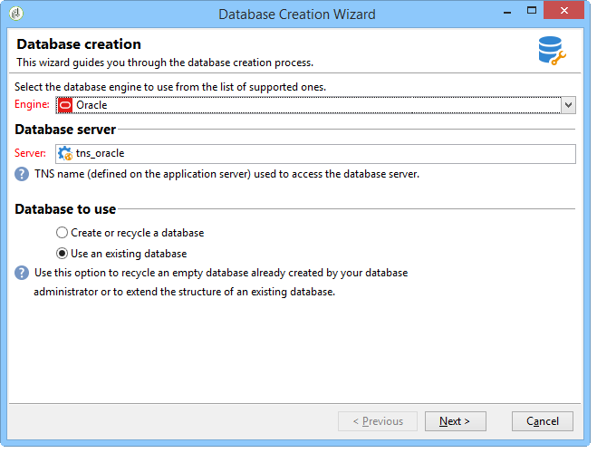

選択したデータベースエンジンによって、サーバー識別情報が異なる場合があります。

* **Oracle** エンジンの場合は、アプリケーションサーバーに定義されている&#x200B;**TNS名**&#x200B;を入力します。
* **PostgreSQL** エンジンの場合、データベースサーバーにアクセスするには、アプリケーションサーバーで定義されたDNS名（またはIP アドレス）を指定する必要があります。
* **Microsoft SQL Server** エンジンの場合、次のように定義する必要があります。データベース サーバーにアクセスするためにアプリケーション サーバーで定義されたDNS名（またはIP アドレス）: **DNS**&#x200B;または&#x200B;**DNS`\<instance>`** （インスタンス モード）、

  >[!CAUTION]
  >
  > 20.3以降、Windows NT認証は廃止されました。 **[!UICONTROL SQL Server認証]**&#x200B;は、Microsoft SQL Serverで使用できる唯一の認証モードです。 [詳細情報](../../rn/using/deprecated-features.md)

  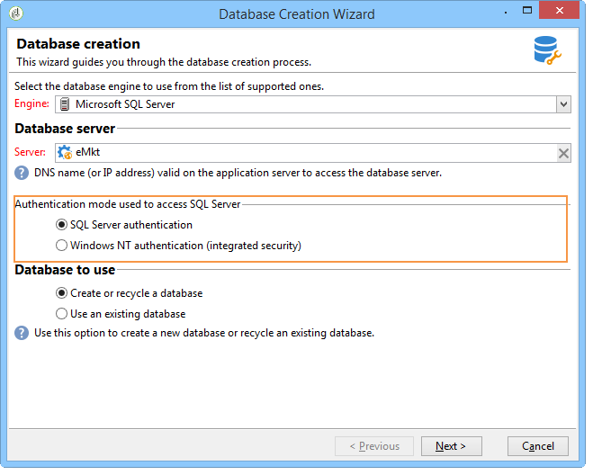

### 手順2 - サーバーへの接続 {#step-2---connecting-to-the-server}

**[!UICONTROL サーバーアクセス]** ウィンドウで、データベース サーバーアクセスを定義します。

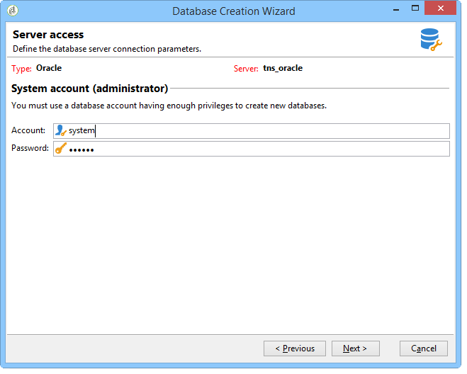

これを行うには、データベースにアクセスする権限を持つ&#x200B;**管理システム アカウント**&#x200B;の名前とパスワードを入力します。例：

* Oracle データベースの&#x200B;**system**
* Microsoft SQL Server データベースの&#x200B;**sa**
* PostgreSQL データベースの&#x200B;**postgres**、

### ステップ 3 - データベースの接続と特性 {#step-3---connection-and-characteristics-of-the-database}

次の手順では、データベースにログオンするための設定を設定できます。

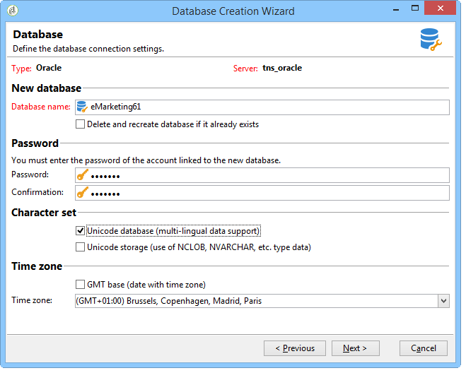

次の設定を定義する必要があります。

* 作成するデータベースの名前を指定します。
* このデータベースにリンクされているアカウントのパスワードを入力します。
* データベースをUnicodeにする必要があるかどうかを示します。

  **[!UICONTROL Unicode データベース]** オプションを使用すると、言語に関係なく、すべての文字タイプをUnicodeに保存できます。

  >[!NOTE]
  >
  >Oracle データベースでは、**[!UICONTROL Unicode ストレージ]** オプションを使用すると、**NCLOB**&#x200B;および&#x200B;**NVARCHAR**&#x200B;の種類のフィールドを使用できます。
  > 
  >このオプションを選択しない場合は、Oracle データベースの文字セット（文字セット）がすべての言語でデータストレージを有効にする必要があります（AL32UTF8をお勧めします）。

* データベースのタイムゾーンを選択し、UTC （使用可能な場合）にするかどうかを指定します。

  詳しくは、[ タイムゾーン管理](../../installation/using/time-zone-management.md)を参照してください。

### 手順4 - インストールするパッケージ {#step-4---packages-to-install}

インストールするパッケージを選択します。

ライセンス契約を参照して、「インタラクション」や「ソーシャルマーケティング」など、インストールできるソリューションやオプションを確認してください。

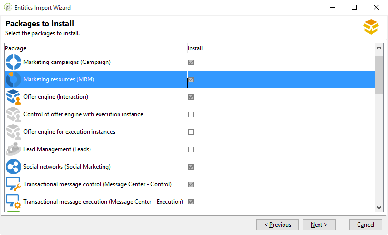

### ステップ 5 – 作成ステップ {#step-5---creation-steps}

**[!UICONTROL 作成手順]** ウィンドウでは、テーブルの作成に使用したSQL スクリプトを表示および編集できます。

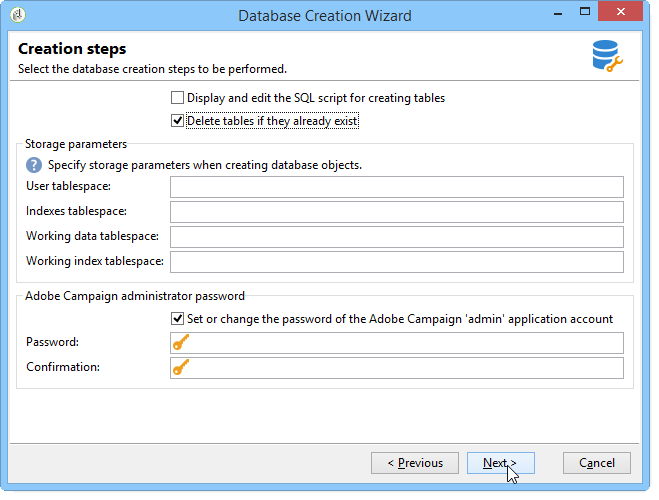

* Oracle、Microsoft SQL ServerまたはPostgreSQL データベースの場合、データベースオブジェクトの作成時に使用する&#x200B;**ストレージパラメーター**&#x200B;を定義することもできます。

  これらのパラメーターは、正確な表領域名を受け取ります（警告：大文字と小文字を区別します）。 これらは、それぞれ次のオプションの&#x200B;**[!UICONTROL 管理/ プラットフォーム / オプション]** ノードに保存されます（[このセクション ](../../installation/using/configuring-campaign-options.md#database)を参照）。

   * **WdbcOptions_TableSpaceUser**: スキーマに基づくユーザーテーブル
   * **WdbcOptions_TableSpaceIndex**: スキーマに基づくユーザーテーブルのインデックス
   * **WdbcOptions_TableSpaceWork**: スキーマのない作業テーブル
   * **WdbcOptions_TableSpaceWorkIndex**: スキーマのない作業テーブルのインデックス

* Oracle データベースの場合、Adobe Campaign ユーザーは、通常、**oinstall** グループのメンバーとして、Oracle ライブラリにアクセスできる必要があります。
* 「**[!UICONTROL 管理者パスワードの設定または変更]**」オプションを使用すると、Adobe Campaign オペレーターにリンクされているパスワードを管理者権限で入力できます。

  セキュリティ目的でAdobe Campaign アカウント管理者パスワードを定義することをお勧めします。

### 手順6 - データベースの作成 {#step-6---creating-the-database}

アシスタントの最終段階では、データベースを作成できます。 「**[!UICONTROL 開始]**」をクリックして確定します。

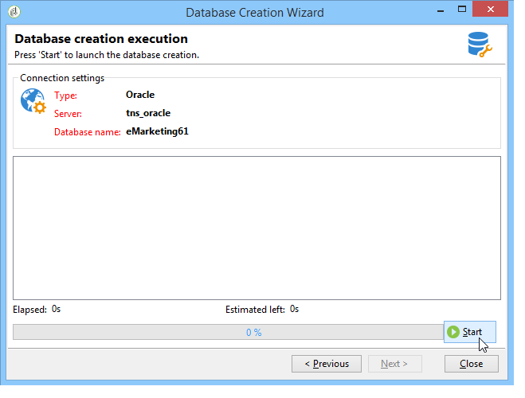

データベースを作成したら、再接続してインスタンス設定を確定できます。

これで、デプロイメントウィザードを起動して、インスタンスの設定を完了する必要があります。 [ デプロイメントウィザード ](../../installation/using/deploying-an-instance.md#deployment-assistant)を参照してください。

インスタンスにリンクされたデータベースの接続設定は、Adobe Campaign インストールディレクトリにあるファイル **`/conf/config-<instance>.xml`**&#x200B;に保存されます。

暗号化されたパスワードで「campaign」アカウントにリンクされたbase61 データベース上のMicrosoft SQL Server設定の例：

```
<dbcnx encrypted="1" login="campaign:myBase" password="myPassword" provider="DB" server="dbServer"/>
```

## ケース 2：既存のデータベースの使用 {#case-2--using-an-existing-database}

データベースとユーザーは、データベース管理者によって作成され、アクセス権が正しく設定されている必要があります。

例えば、Oracle データベースの場合、最低限必要な権限は、CONNECT、RESOURCE、およびUNLIMITED TABLESPACEの付与です。

既存のデータベースを使用するには、次の設定手順を実行します。

* [手順1 - データベースエンジンの選択](#step-1---choosing-the-database-engine),
* [手順2 - データベース接続設定](#step-2---database-connection-settings),
* [手順3 - インストールするパッケージ ](#step-3---packages-to-install),
* [手順4 – 作成手順](#step-4---creation-steps),
* [手順5 - データベースの作成](#step-5---creating-the-database)。

### 手順1 - データベースエンジンの選択 {#step-1---choosing-the-database-engine}

ドロップダウンリストからデータベースエンジンを選択します。


サーバーを特定し、実行する操作の種類を選択します。 この場合、**[!UICONTROL 既存のデータベース]**&#x200B;を使用します。

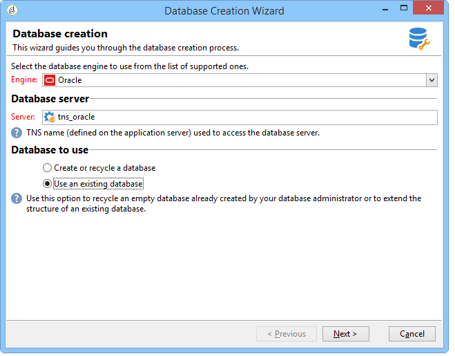

選択したデータベースエンジンによって、サーバー識別情報が異なる場合があります。

* **Oracle** エンジンの場合は、アプリケーションサーバーに定義されている&#x200B;**TNS名**&#x200B;を入力します。
* **PostgreSQL** エンジンの場合、データベースサーバーにアクセスするには、アプリケーションサーバーで定義されたDNS名（またはIP アドレス）を指定する必要があります。
* **Microsoft SQL Server** エンジンの場合は、次のように定義する必要があります。

   1. データベースサーバーにアクセスするためにアプリケーションサーバーで定義されたDNS名（またはIP アドレス）,
   1. Microsoft SQL Serverへのアクセスに使用されるセキュリティ方式：**[!UICONTROL SQL Server認証]**&#x200B;または&#x200B;**[!UICONTROL Windows NT認証]**。

      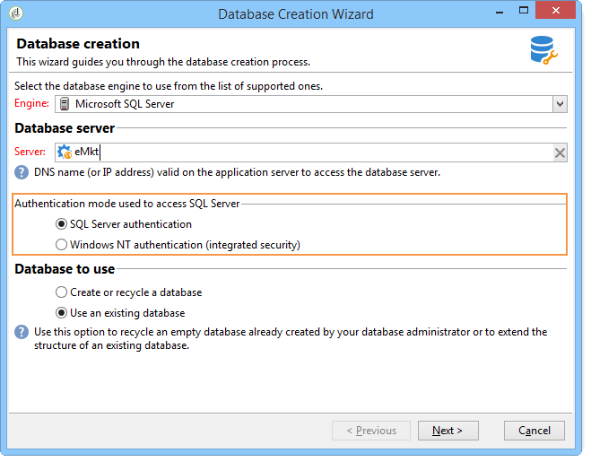

### 手順2 - データベース接続の設定 {#step-2---database-connection-settings}

**[!UICONTROL データベース]** ウィンドウで、データベース接続設定を定義します。

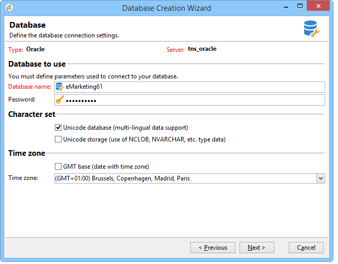

次の設定を定義する必要があります。

* 使用するデータベースの名前を入力します。
* このデータベースに関連付けられているアカウントの名前とパスワードを入力します。

  >[!NOTE]
  >
  >スキーマ名とユーザー名の両方が一致していることを確認します。 データベースを作成する場合は、キャンペーンコンソールクライアントを使用することをお勧めします。
  >Oracle データベースの場合は、アカウント名を入力する必要はありません。

* データベースをUnicodeにするかどうかを指定します。

### 手順3 - インストールするパッケージ {#step-3---packages-to-install}

インストールするパッケージを選択します。

ライセンス契約を参照して、「インタラクション」や「リード」など、インストールできるソリューションやオプションを確認してください。


### ステップ 4 – 作成ステップ {#step-4---creation-steps}

**[!UICONTROL 作成手順]** ウィンドウでは、テーブルの作成に使用したSQL スクリプトを表示および編集できます。


* Oracle、Microsoft SQL ServerまたはPostgreSQL データベースの場合、管理者は、データベースオブジェクトの作成時に使用する&#x200B;**ストレージパラメーター**&#x200B;を定義できます。
* Oracle データベースの場合、Adobe Campaign ユーザーは、通常、**oinstall** グループのメンバーとして、Oracle ライブラリにアクセスできる必要があります。
* 「**[!UICONTROL 管理者パスワードの設定または変更]**」オプションを使用すると、Adobe Campaign オペレーターにリンクされているパスワードを管理者権限で入力できます。

  セキュリティ目的でAdobe Campaign アカウント管理者パスワードを定義することをお勧めします。

### 手順5 - データベースの作成 {#step-5---creating-the-database}

アシスタントの最終段階では、データベースを作成できます。 「**[!UICONTROL 開始]**」をクリックして確定します。


データベースの作成が完了したら、再接続してインスタンス設定を確定できます。

これで、デプロイメントウィザードを起動して、インスタンスの設定を完了する必要があります。 [ デプロイメントウィザード ](../../installation/using/deploying-an-instance.md#deployment-assistant)を参照してください。

インスタンスにリンクされたデータベースの接続設定は、Adobe Campaign インストールディレクトリにあるファイル **`/conf/config-<instance>.xml`**&#x200B;に保存されます。

暗号化されたパスワードで「campaign」アカウントにリンクされたbase61 データベース上のMicrosoft SQL Server設定の例：

```
<dbcnx encrypted="1" login="campaign:myBase" password="myPassword" provider="DB" server="dbServer"/>
```
