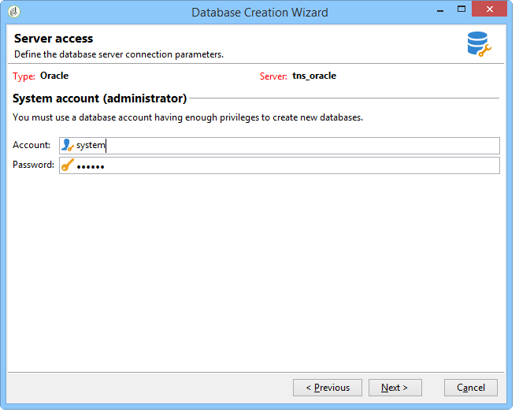
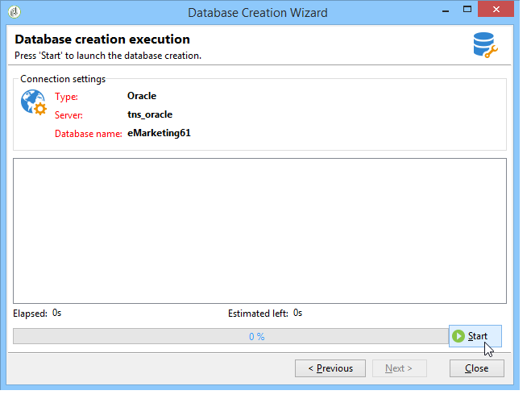

# データベースの作成と設定{#creating-and-configuring-the-database}

データベースを作成する場合、Adobe Campaignには次の2つの異なるオプションが用意されています。

1. データベースの作成またはリサイクル：新しいデータベースを作成する場合、または既存のデータベースを再使用する場合は、このオプションを選択します。 [ケース1を参照：データベース](#case-1--creating-recycling-a-database)を作成/リサイクルしています。
1. 既存のデータベースの使用：管理者が空のデータベースを既に作成済みで、それを使用する場合は、このオプションを選択します。または既存のデータベースの構造を拡張する場合。 [ケース2を参照：既存のデータベース](#case-2--using-an-existing-database)を使用しています。

設定手順の詳細は以下のとおりです。

>[!CAUTION]
>
>データベース、ユーザー、スキーマの名前に数字を開始したり、特殊文字を含めたりすることはできません。
>
>これらの操作を実行できるのは、**内部**&#x200B;識別子だけです。 詳しくは、[内部識別子](../../installation/using/campaign-server-configuration.md#internal-identifier)を参照してください。

## ケース1:データベース{#case-1--creating-recycling-a-database}の作成/リサイクル

データベースを作成する手順、または既存のベースを再利用する手順を以下に示します。 設定によっては、使用するデータベースエンジンに依存するものもあります。

次の手順が関係します。

* [手順1 — データベースエンジンの選択](#step-1---selecting-the-database-engine)、
* [手順2 — サーバーへの接続](#step-2---connecting-to-the-server)、
* [手順3 — データベースの接続と特性](#step-3---connection-and-characteristics-of-the-database)、
* [手順4 — インストールするパッケージ](#step-4---packages-to-install)、
* [手順5 — 作成手順](#step-5---creation-steps)、
* [手順6 — データベースの作成](#step-6---creating-the-database)。

### 手順1 — データベースエンジンの選択{#step-1---selecting-the-database-engine}

ドロップダウン・リストの中からデータベース・エンジンを選択します。


サポートされるデータベースは、キャンペーン[互換表](../../rn/using/compatibility-matrix.md)に一覧表示されます。

サーバーを識別し、実行する操作の種類を選択します。 この場合、**[!UICONTROL データベース]**&#x200B;を作成または再利用します。


選択したデータベースエンジンによって、サーバ識別情報が異なる場合があります。

* **Oracle**&#x200B;エンジンの場合は、アプリケーションサーバーに対して定義された&#x200B;**TNS名**&#x200B;を設定します。
* **PostgreSQL**&#x200B;または&#x200B;**DB2**&#x200B;エンジンの場合は、データベースサーバーにアクセスするために、アプリケーションサーバーで定義されたDNS名（またはIPアドレス）を指定する必要があります。
* **Microsoft SQL Server**&#x200B;エンジンの場合は、次を定義する必要があります。データベースサーバーにアクセスするためにアプリケーションサーバーで定義されているDNS名（またはIPアドレス）。**DNS**&#x200B;または&#x200B;**DNS`\<instance>`** （インスタンスモード）、

   >[!CAUTION]
   >
   > 20.3以降、Windows NT認証は廃止されます。 **[!UICONTROL Microsoft SQL Serverで使用できる認証モードは、SQL Server]** 認証のみになりました。[詳細を表示](../../rn/using/deprecated-features.md)

   

### 手順2 — サーバーへの接続{#step-2---connecting-to-the-server}

**[!UICONTROL サーバーアクセス]**&#x200B;ウィンドウで、データベースサーバーアクセスを定義します。



これを行うには、次のように、データベースにアクセスする権限を持つ&#x200B;**管理システムアカウント**&#x200B;の名前とパスワードを入力します。

* **oracleデータベースの** システム、
* **Microsoft SQL Serverデータベース** の場合、
* **PostgreSQLデータベースの** postgres、
* **db2inst1** を使用します。

### 手順3 — データベースの接続と特性{#step-3---connection-and-characteristics-of-the-database}

次の手順では、データベースにログオンするための設定を指定します。


次の設定を定義する必要があります。

* 作成するデータベースの名前を指定します。

   >[!NOTE]
   >
   >DB2データベースの場合、データベース名は8文字以下にする必要があります。

* このデータベースにリンクされているアカウントのパスワードを入力してください。
* データベースがUnicodeである必要があるかどうかを示します。

   **[!UICONTROL Unicodeデータベース]**&#x200B;オプションを使用すると、言語に関係なく、すべての文字タイプをUnicodeで保存できます。

   >[!NOTE]
   >
   >oracleのデータベースでは、**[!UICONTROL Unicodeストレージ]**&#x200B;オプションを使用すると、**NCLOB**&#x200B;および&#x200B;**NVARCHAR**&#x200B;型のフィールドを使用できます。
   > 
   >このオプションを選択しない場合、Oracleデータベースの文字セット(charset)は、すべての言語でデータストレージを有効にする必要があります（AL32UTF8を推奨）。

* データベースのタイムゾーンを選択し、UTC（可能な場合）にするかどうかを指定します。

   詳しくは、[タイムゾーン管理](../../installation/using/time-zone-management.md)を参照してください。

### 手順4 - {#step-4---packages-to-install}をインストールするパッケージ

インストールするパッケージを選択します。

使用許諾契約書を参照して、「インタラクション」や「ソーシャルマーケティング」など、インストールの権利があるソリューションとオプションを確認します。


### 手順5 — 作成手順{#step-5---creation-steps}

「**[!UICONTROL 作成手順]**」ウィンドウでは、テーブルの作成に使用するSQLスクリプトを表示および編集できます。


* oracle、Microsoft SQL Server、またはPostgreSQLデータベースの場合、管理者は、データベースオブジェクトの作成時に使用する&#x200B;**ストレージパラメータ**&#x200B;を定義することもできます。

   これらのパラメータは、正確な表領域名を受け取ります(警告：大文字と小文字が区別されます)。 それぞれ、次のオプションの&#x200B;**[!UICONTROL 管理/プラットフォーム/オプション]**&#x200B;ノードに保存されます（[このセクション](../../installation/using/configuring-campaign-options.md#database)を参照）。

   * **WdbcOptions_TableSpaceUser**:スキーマに基づくユーザーテーブル
   * **WdbcOptions_TableSpaceIndex**:スキーマに基づくユーザーテーブルのインデックス
   * **WdbcOptions_TableSpaceWork**:スキーマのない作業テーブル
   * **WdbcOptions_TableSpaceWorkIndex**:スキーマのない作業テーブルのインデックス

* oracle・データベースの場合、Adobe Campaign・ユーザーはOracle・ライブラリにアクセスできる必要があります。通常は&#x200B;**oinstall**&#x200B;グループのメンバーです。
* 「**[!UICONTROL 管理者パスワード]**&#x200B;を設定または変更」オプションを使用すると、Adobe Campaign演算子にリンクされたパスワードを管理者権限で入力できます。

   セキュリティを確保するために、Adobe Campaignアカウント管理者パスワードを定義することをお勧めします。

### 手順6 — データベースを作成する{#step-6---creating-the-database}

ウィザードの最後の段階では、データベースを作成できます。 **[!UICONTROL 開始]**&#x200B;をクリックして確認します。



データベースが作成されたら、再接続してインスタンス設定を終了できます。

次に、配置ウィザードを開始して、インスタンスの設定を完了する必要があります。 [展開ウィザード](../../installation/using/deploying-an-instance.md#deployment-wizard)を参照してください。

インスタンスにリンクされたデータベースの接続設定は、Adobe Campaignのインストールディレクトリにあるファイル&#x200B;**`/conf/config-<instance>.xml`**&#x200B;に保存されます。

base61データベース上のMicrosoft SQL Server設定の例で、暗号化されたパスワードを使用して&#39;キャンペーン&#39;アカウントにリンクされています。

```
<dbcnx encrypted="1" login="campaign:myBase" password="myPassword" provider="DB" server="dbServer"/>
```

## ケース2:既存のデータベース{#case-2--using-an-existing-database}を使用

データベースおよびユーザーは、データベース管理者が作成したデータベースであり、アクセス権が正しく設定されている必要があります。

たとえば、Oracle・データベースの場合、必要な最小限の権限は次のとおりです。CONNECT、リソース、および無制限の表領域を付与します。

既存のデータベースを使用する場合の設定手順は次のとおりです。

* [手順1 — データベースエンジンの選択](#step-1---choosing-the-database-engine)、
* [手順2 — データベース接続の設定](#step-2---database-connection-settings)、
* [手順3 — インストールするパッケージ](#step-3---packages-to-install)、
* [手順4 — 作成手順](#step-4---creation-steps)、
* [手順5 — データベースの作成](#step-5---creating-the-database)。

### ステップ1 — データベースエンジンの選択{#step-1---choosing-the-database-engine}

ドロップダウン・リストからデータベース・エンジンを選択します。


サーバーを特定し、実行する操作の種類を選択します。 この場合、**[!UICONTROL 既存のデータベース]**&#x200B;を使用します。


選択したデータベースエンジンによって、サーバ識別情報が異なる場合があります。

* **Oracle**&#x200B;エンジンの場合は、アプリケーションサーバーに対して定義された&#x200B;**TNS名**&#x200B;を設定します。
* **PostgreSQL**&#x200B;または&#x200B;**DB2**&#x200B;エンジンの場合は、データベースサーバーにアクセスするために、アプリケーションサーバーで定義されたDNS名（またはIPアドレス）を指定する必要があります。
* **Microsoft SQL Server**&#x200B;エンジンの場合は、次を定義する必要があります。

   1. データベースサーバーにアクセスするためにアプリケーションサーバー上で定義されているDNS名（またはIPアドレス）、
   1. microsoft SQL Serverにアクセスするためのセキュリティメソッド：**[!UICONTROL SQL Server認証]**&#x200B;または&#x200B;**[!UICONTROL Windows NT認証]**。

      

### 手順2 — データベース接続設定{#step-2---database-connection-settings}

**[!UICONTROL データベース]**&#x200B;ウィンドウで、データベース接続の設定を定義します。


次の設定を定義する必要があります。

* 使用するデータベースの名前を入力します。
* このデータベースに関連付けられたアカウントの名前とパスワードを入力します。

   >[!NOTE]
   >
   >スキーマ名とユーザー名の両方が一致していることを確認します。 データベースを作成する場合、キャンペーンコンソールクライアントを使用することをお勧めします。
   >oracleデータベースの場合は、アカウント名を入力する必要はありません。

* データベースをUnicodeにするかどうかを指定します。

### 手順3 - {#step-3---packages-to-install}をインストールするパッケージ

インストールするパッケージを選択します。

使用許諾契約書を参照して、「お問い合わせ」や「リード」など、インストールの権利があるソリューションとオプションを確認してください。


### 手順4 — 作成手順{#step-4---creation-steps}

「**[!UICONTROL 作成手順]**」ウィンドウでは、テーブルの作成に使用するSQLスクリプトを表示および編集できます。


* oracle、Microsoft SQL Server、またはPostgreSQLデータベースの場合、管理者は、データベースオブジェクトの作成時に使用する&#x200B;**ストレージパラメータ**&#x200B;を定義できます。
* oracle・データベースの場合、Adobe Campaign・ユーザーはOracle・ライブラリにアクセスできる必要があります。通常は&#x200B;**oinstall**&#x200B;グループのメンバーです。
* 「**[!UICONTROL 管理者パスワード]**&#x200B;を設定または変更」オプションを使用すると、Adobe Campaign演算子にリンクされたパスワードを管理者権限で入力できます。

   セキュリティを確保するために、Adobe Campaignアカウント管理者パスワードを定義することをお勧めします。

### 手順5 — データベースを作成する{#step-5---creating-the-database}

ウィザードの最後の段階では、データベースを作成できます。 **[!UICONTROL 開始]**&#x200B;をクリックして確認します。


データベースの作成が完了したら、再接続してインスタンス設定を確定できます。

次に、配置ウィザードを開始して、インスタンスの設定を完了する必要があります。 [展開ウィザード](../../installation/using/deploying-an-instance.md#deployment-wizard)を参照してください。

インスタンスにリンクされたデータベースの接続設定は、Adobe Campaignのインストールディレクトリにあるファイル&#x200B;**`/conf/config-<instance>.xml`**&#x200B;に保存されます。

base61データベース上のMicrosoft SQL Server設定の例で、暗号化されたパスワードを使用して&#39;キャンペーン&#39;アカウントにリンクされています。

```
<dbcnx encrypted="1" login="campaign:myBase" password="myPassword" provider="DB" server="dbServer"/>
```

